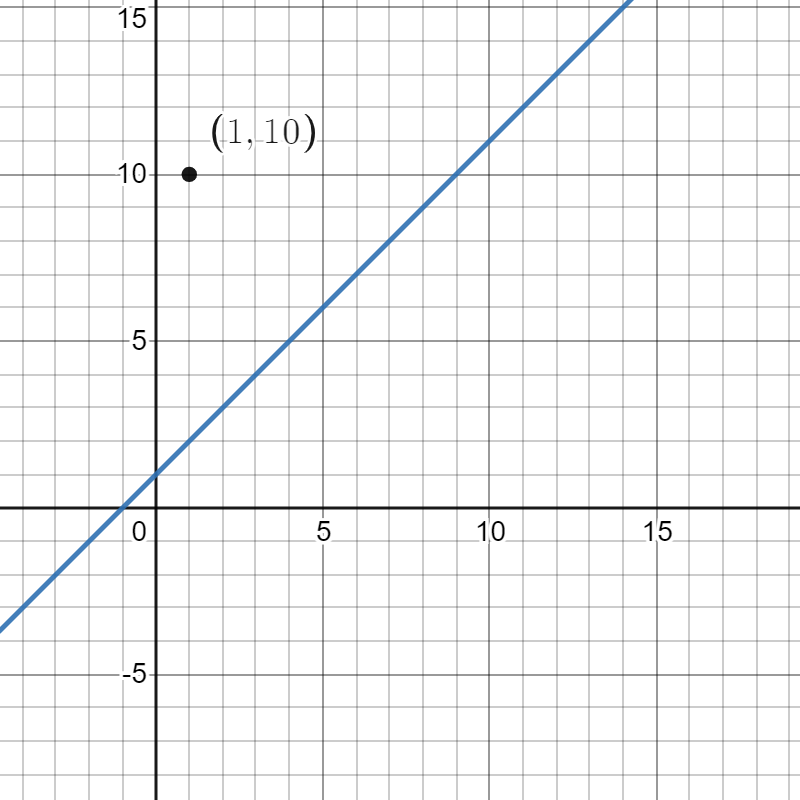
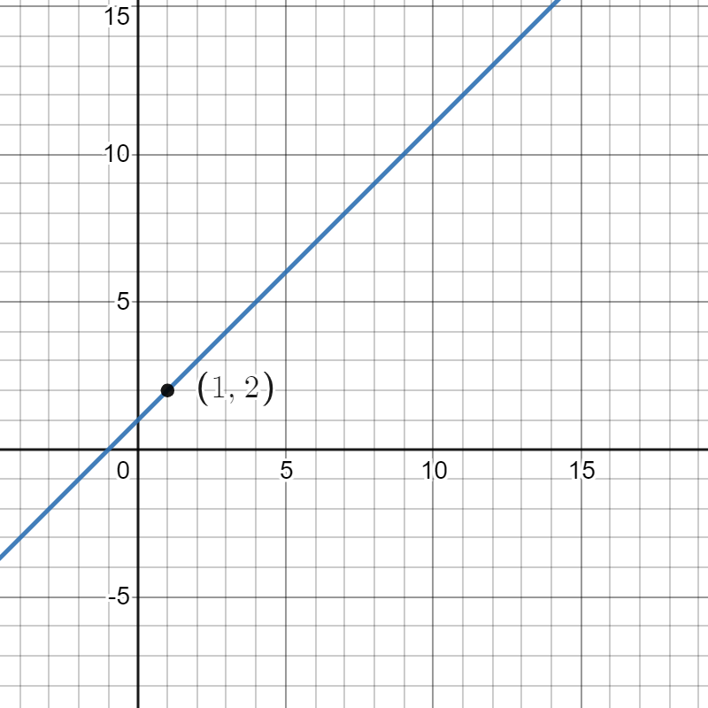
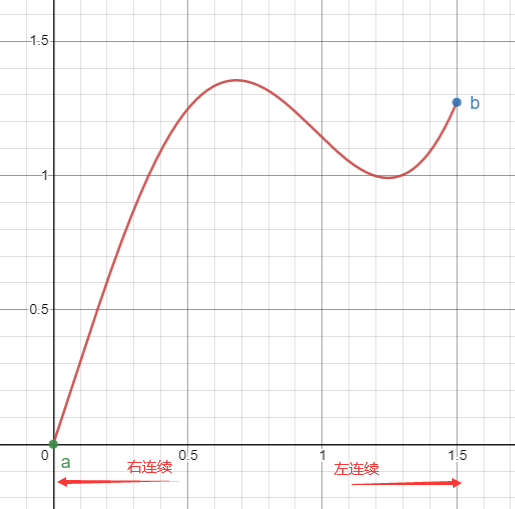
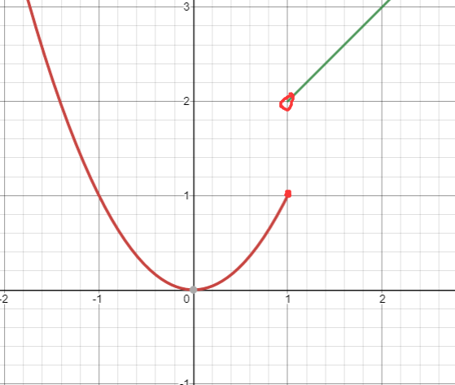

# $\S1.8$ 函数的连续性
## 一、连续与间断
* 定义1：函数在$\overset{\circ}{U}(x_0)$有定义，若$\lim_{x\to x_0}f(x)=f(x_0)$，则称$f(x)$在点$x_0$连续，$x_0$称为连续点。否则，称$f(x)$在点$x_0$不连续（间断），$x_0$称为连续点。
	> $\epsilon - \delta$定义：$f(x)$在点$x_0$连续$\Leftrightarrow$ $\forall \epsilon \gt 0 \quad \delta \gt 0 \quad |x-x_0|\lt \delta$时，$|f(x)-f(x_0)|$成立  
	> 自变量的改变量$\Delta x=x-x_0$，因变量的改变量$\Delta y=f(x)-f(x_0)=f(x_0+\Delta x)-f(x_0)$，$f(x)$在$x_0$连续$\Leftrightarrow \lim_{x \to 0}\Delta y = 0$
* 定义2：若$f(x)$在$(a,b)$内每一点均连续，则称$f(x)$在$(a,b)$上连续，是$(a,b)$上的连续函数。

> 例1. 
	$$
	   f(x)=\begin{cases}
	  \dfrac{x^2-1}{x-1}&, x\ne 1 \\
	  10&, x= 1
	   \end{cases}
	$$
> 
  $$
  f(x)=\begin{cases}
  \dfrac{x^2-1}{x-1}&, x\ne 1 \\
  2&, x= 1
  \end{cases}
  $$
> 

> 例2. 证明$y=\sin x$在$\mathbb{R}$上任意点均连续  
> 证：$\forall \epsilon \gt 0, \exists \delta = \epsilon, 当|x-x_0|\lt \delta$：
 $$
 \begin{align}
 |\sin x-\sin x_0| &= |2\cos \dfrac{x+x_0}{2}\sin \dfrac{x-x_0}{2}| \\
 &\le 2|\sin \dfrac{x-x_0}{2}| \\ &\le 2|\dfrac{x-x_0}{2}| \\ &\lt \delta \\ &= \epsilon
 \end{align}
 $$

* 定义3：左连续$\lim_{x\to x_0^-}f(x)=f(x_0)$，右连续$\lim_{x\to x_0^+}f(x)=f(x_0)$  
   
* 定义4：$f(x)$在$(a,b)$连续，且在$x=a$处右连续，在$x=b$处左连续，则$f(x)$在$[a,b]$上连续，是$[a,b]$上的连续函数
* 定理：$x_0\in (a,b) \quad \lim_{x\to x_0}f(x)=\lim_{x\to x_0^-}f(x)=\lim_{x\to x_0^+}f(x)=f(x_0)$，
	 $$
	 f(x)在x_0连续 \Leftrightarrow f(x)在x_0左、右连续
	 $$

> 例3.  判断
 $$
 f(x)=\begin{cases}
 x^2 &x\le 1\\
 x+1 & x\gt 1
 \end{cases}
 $$
> 在$x=1$处的连续性  
> 解：图象如下：
> 
> 函数在$x=1$不连续，左右极限存在  
> $\lim_{x\to 1^-}f(x)=\lim_{x\to 1^-}x^2=1=f(1)$，左连续  
> $\lim_{x\to 1^+}f(x)=\lim_{x\to 1^+}(x+1)=2\ne f(1)$，非右连续   

> 例4. $f(x)$在点$x_0$连续，$f(x_0)\gt 0$，证：$\exists U(x_0), f(x)\gt \dfrac{f(x_0)}{2}\gt 0$  
> 证：$\because f(x)$在$x_0$连续  
> $\therefore \lim_{x\to x_0}f(x)=f(x_0)\gt 0$  
> $\forall \epsilon \gt 0 \quad \exists \delta \gt 0$，当$|x-x_0|\lt \delta$时，$|f(x)-f(x_0)|\lt \epsilon$成立  
> $f(x_0)-\epsilon \lt f(x) \lt f(x_0)+\epsilon$  
> 取$\epsilon=\dfrac{f(x_0)}{2}$，则$0\lt \dfrac{f(x_0)}{2}\lt f(x)$，得证
> > 局部保号性
   $$
   \lim_{x\to x_0}f(x)=A\gt 0 \Rightarrow x\in \overset{\circ}{U}(x_0), f(x)\gt \dfrac{A}{2}\gt 0
   $$
## 二、间断点的分类
$$
\lim_{x\to x_0}f(x)\ne f(x_0)\Rightarrow 在x_0间断
$$
1. I类，左右极限都存在
	* 相等：可去间断点，如$y=\dfrac{\sin x}{x},x=0$
	* 不相等：跳跃间断点，如$y=\operatorname{sgn} x,x=0$
2. II类，不属于I类，**至少一个**极限不存在
	* 无穷大：无穷间断点，如$y=\dfrac{1}{x},x=0$
	* 振荡间断点，如$y=\sin \dfrac{1}{x},x=0$

> 例1. $f(x)=\dfrac{1}{1-e^\frac{x}{1-x}}$，讨论间断点类型  
> 解：$x=1$和$x=0$是间断点  
> $\lim_{x\to 1^-}f(x)=0$，$\lim_{x\to 1^+}f(x)=1$，$\lim_{x\to 0^-}f(x)=+\infty$，$x=1$是I类跳跃间断点，$x=0$是II类无穷间断点

> 例2. $f(x)$在点$x_0$连续 $?\Leftrightarrow |f(x)|$或$|f^2(x)|$在$x_0$连续
> $\Rightarrow$：$\lim_{x\to x_0}f(x)=f(x_0)$，$\lim_{x\to x_0}f^2(x)=f(x_0)\cdot f(x_0)=f^2(x_0)$  
> $\forall \epsilon \gt 0 \quad \exists \delta \gt 0 \quad |x-x_0|\lt \delta$  
> $||f(x)|-|f(x_0)||\lt |f(x)|-|f(x_0)| \lt \epsilon$

## 三、连续函数的性质
$f(x)\in C(-\infty, +\infty)$

* 定理1（四则运算）连续函数间作和、差、积、商运算，结果仍为连续函数
	> 结果在**公共定义域**上连续，如$f(x)=x \quad g(x)=\sqrt{x}$，则$f(x)\pm g(x)$在$(0,+\infty)$上连续
* 定理2：$y=f(u)$在点$u_0$上连续，$u=\phi(x)$在点$x_0$连续，$u_0=\phi (x_0) \Rightarrow y=f[\phi (x)]$在$x_0$上连续
	* $\lim_{x\to x_0}f[\phi (x)]=\lim_{u \to \infty}f(u)=f(u_0)=f[\phi(x_0)]=f[\lim_{x\to x_0}\phi(x)]$
	* 推论：若$\lim_{x\to x_0}f(x)=A\gt 0 \quad \lim_{x\to x_0}g(x)=B$，则$\lim_{x\to x_0}f(x)^{g(x)}=\lim_{x\to x_0}f(x)^{\lim_{x\to x_0}g(x)}=A^B$

> 例1.   
   $$
   \begin{align}
   &\lim_{x\to 0}\left(\dfrac{\cos^2x}{\cos2x}\right)^{\frac{a}{x^2}}  (a \ne 0)\\
   = &\lim_{x\to 0}\left(\dfrac{\cos^2x-\sin^2x}{\cos^2x}\right)^{-\frac{a}{x^2}} \\
   = &\lim_{x\to 0}(1-\tan^2x)^{-\frac{1}{tan^2x}\cdot \frac{\tan^2x}{x^2}\cdot a} \\
   = &e^a
   \end{align}
   $$

> 例2. $f(x),g(x)$连续，证明：$\phi(x)=\max\{f(x),g(x)\}$、$\psi(x)=\min\{f(x),g(x)\}$连续  
> 证：  
> * $f(x)\gt g(x)$，$\phi(x)=f(x)=\dfrac{f(x)+g(x)}{2}+\dfrac{f(x)-g(x)}{2}$  
> * $f(x)\lt g(x)$，$\phi(x)=g(x)=\dfrac{g(x)+f(x)}{2}+\dfrac{g(x)-f(x)}{2}$  
> $\therefore \phi(x)=\underset{连续函数}{\dfrac{f(x)+g(x)}{2}}+\underset{连续函数}{\dfrac{|f(x)-g(x)|}{2}}$，$\phi(x)$是连续函数  
> 同理，$\psi(x)=\underset{连续函数}{\dfrac{f(x)+g(x)}{2}}+\underset{连续函数}{\dfrac{|f(x)-g(x)|}{2}}$，$\psi(x)$是连续函数，得证

* 定理3. 基本初等函数在定义域上连续，初等函数在定义区间上连续

> 例3. $f(x)=\begin{cases}x^2 \quad &x\le 1\\ 2-x \quad &x\gt 1\end{cases}$，$g(x)=\begin{cases}x \quad &x\le 1\\ x+4 \quad &x\gt 1\end{cases}$，讨论$f[g(x)]$的连续性  
> 解：  
   $$
   \begin{align}
   f[g(x)]&=\begin{cases}[g(x)]^2 \quad &g(x)\le 1\\ 2-g(x) \quad &g(x)\gt 1\end{cases} \\
   &=\begin{cases}x^2 \quad &x\le 1\\ -x-2 \quad &x\gt 1\end{cases}
   \end{align}
   $$
> 在$(-\infty, 1)\cup (1,+\infty)$上连续，$x=1$I类跳跃间断
