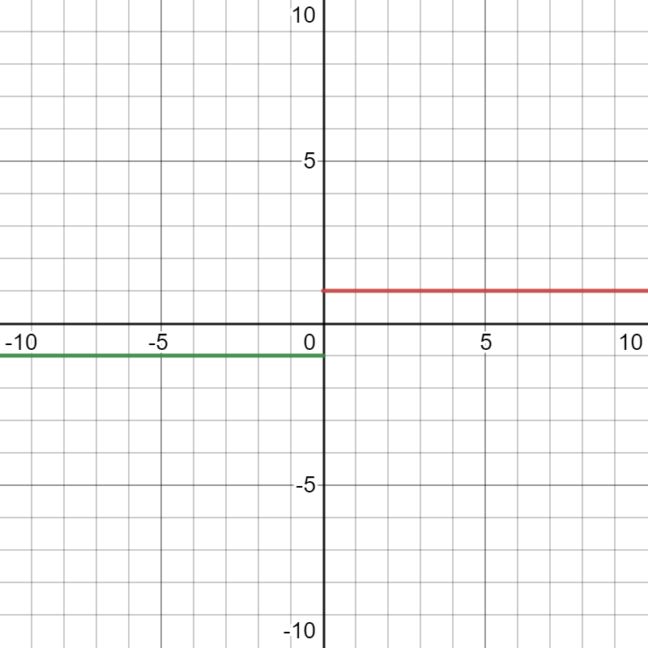
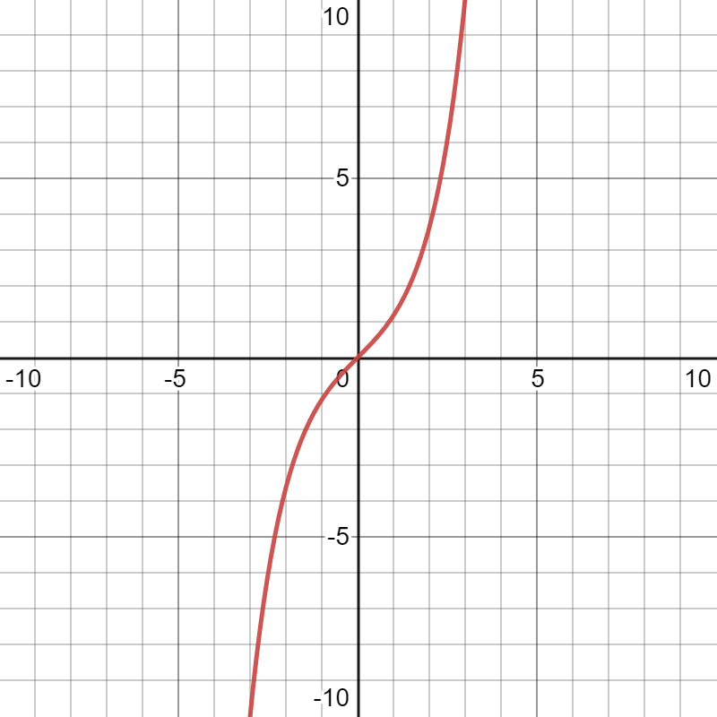
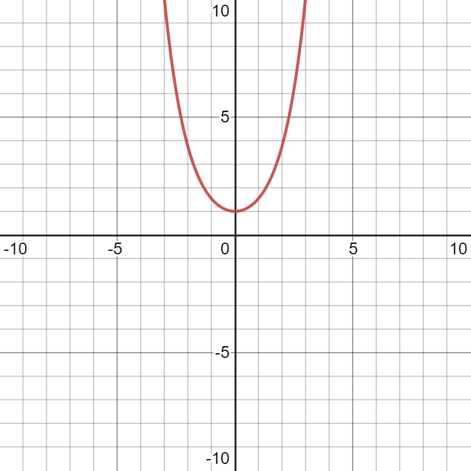
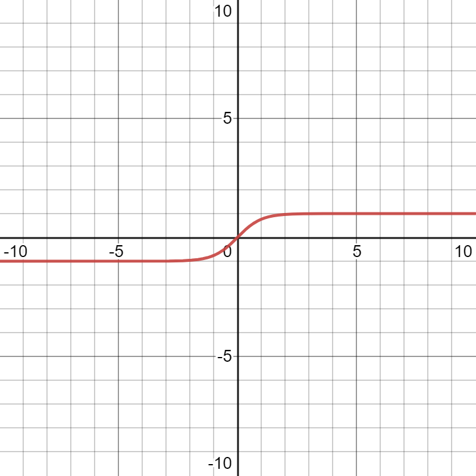

# $\S1.1$ 函数

## 一、定义

设 $D$ 是一个给定的数集，如果对于每个数 $x\in D$，按照一定法则 $f$ 总有确定的数值 $y$ 与之对应，则称 $y$ 是 $x$ 的函数，记作 $y=f(x)$ ，数集 $D$ 称为这个函数的定义域， $x$ 称为自变量， $y$ 称为因变量。

当 $x$ 取遍 $D$ 中每个数值时，对应的函数值全体组成的数集 $R=\{y|y=f(x),x\in D\}$ 称为函数的值域 (A)。

> 映射： $X\stackrel{f}\rightarrow Y$ ，是一种二元关系
>
> - 单射：$\forall x_1,x_2 \in D\quad x_1\neq x_2\Rightarrow f(x_1)\neq f(x_2)$
> - 满射：$\forall y \in A\quad \exists x\in D\Rightarrow f(x)=y$
> - 一一映射（双射）：单射+满射

函数的三种表示法

1. 解析法
2. 表格法
3. 图形法

> 例：
>
> 1. $y=\mathrm{sgn} x = \begin{cases}1 &,x\gt0\\ 0 &,x=0\\ -1 &,x\lt0\end{cases}$ 的图像如下
> 
>
> - 对于任意实数 $x$，均有 $x=\mathrm{sgn} x\cdot |x|$
>
> 2. Dirichlet 函数 $y=D(x) = \begin{cases}1 &,x是有理数 \\ 0 &,x是无理数\end{cases}$ 的性质
> - 是偶函数
> - 是周期函数，且周期为任意非零有理数

## 二、函数的初等性态（性质）

### 1. 奇偶性

设 $y=f(x)$ 的定义域 $D$ 关于原点对称，若

- $\forall x\in D, \quad f(-x)=f(x)$ ，则 $f(x)$ 为偶函数
- $\forall x\in D, \quad f(-x)=-f(x)$ ，则 $f(x)$ 为奇函数

> 设 $f(x_1)$、$f(x_2)$ 为奇函数，$g(x_1)$、$g(x_2)$ 为偶函数，则
>
> - $f(x_1)\pm g(x_1)$ 既非奇函数又非偶函数
> - $f(x_1)\cdot f(x_2)$ 为偶函数，$f(x_1)\pm f(x_2)$ 为奇函数
> - $g(x_1)\cdot g(x_2)$ 为偶函数，$g(x_1)\pm g(x_2)$ 为偶函数
> - $f(x_1)\cdot g(x_1)$ 为奇函数，$\dfrac{f(x_1)}{g(x_1)}$ 为偶函数

### 2. 周期性

设函数 $f(x)$ 在 $D=(-\infty,+\infty)$ 上有定义，若 $\exists T\gt 0$，使得对 $\forall x\in D$ 有 $f(x+T)=f(x)$ 成立，则称 $f(x)$ 是以 $T$ 为周期的周期函数

- 满足上述关系的最小正数 $T$ 称为 $f(x)$ 的最小正周期，通常说的周期为最小正周期（若存在）

> 最小正周期不存在的例子：
>
> 1. $y=a(a为常数)$，此时 $T\in R^+$
> 2. $y=D(x)$(Dirichlet 函数)此时 $T\in Q 且T\ne 0$

### 3. 单调性

$\forall x_1,x_2\in D \qquad x_1\lt x_2$

- $f(x_1)\le f(x_2)$ 单调递增，$f(x_1)\lt f(x_2)$ 严格单调递增
- $f(x_1)\ge f(x_2)$ 单调递减，$f(x_1)\gt f(x_2)$ 严格单调递减

### 4. 有界性

定义：$\exists M\gt 0,\forall x\in A \subseteq D, |f(x)| \le M\Rightarrow f(x)在A上有界，M为其界$

- 上界 $\exists M, \forall x\in A \subseteq D,f(x)\le M$，不唯一
- 下界 $\exists m, \forall x\in A \subseteq D,f(x)\ge m$，不唯一
- 有界的充要条件：
  1. 存在 $m,M$，$m\le f(x)\le M$
  2. (或)$\exists M\gt 0 \quad \forall x\in A \subseteq D \quad |f(x)|\le M$
- 无界的充要条件：$f(x)无界\Leftrightarrow \forall M\gt 0 \quad \exists x_0\in A \quad |f(x_0)|\gt M$

> 例 1：$D=(-l,l)$，$f(x)$ 为任意函数
> 证明：$f(x)=H(x)+g(x)$，其中 $H(x)$ 为奇函数，$g(x)$ 为偶函数
>
> > $f(x)=\dfrac{f(x)+A}{2}+\dfrac{f(x)-A}{2}$
> > 取 $A=f(-x)$
> > 令 $H(x)=\dfrac{f(x)-f(-x)}{2}$，$g(x)=\dfrac{f(x)+f(-x)}{2}$
> > $H(-x)=\dfrac{f(-x)-f(x)}{2}=-H(x)$，为奇函数
> > $g(-x)=\dfrac{f(-x)+f(x)}{2}=g(x)$，为偶函数，Q.E.D

> 例 2
>
> 1.  证明 $y=\sin x$ 在 $R$ 上有界
> > $\because \exists M=1,\forall x\in R, |\sin x|\le 1$

> > $\therefore f(x)在R上有界$
> 2.  $y=\dfrac{1}{x}$ 在 $(0,1]$ 上是否有界？
> > $\because \forall M\gt 0, \exists x_0=\dfrac{1}{M+1}\in (0,1] \quad |f(x_0)|=\dfrac{1}{x_0}=M_0+1\gt M$

> > $\therefore y=\dfrac{1}{x}在(0,1]$ 上无界

## 三、函数的运算

### 1. 四则运算
​设A，B是两个函数f: A→R，g: B→R，函数f与g的和f+g，差f-g，积f·g，商f/g可以定义为：

$$
\begin{align*}
(f+g)(x)&=f(x)+g(x) \quad x\in A\cap B\\
(f-g)(x)&=f(x)-g(x) \quad x\in A\cap B\\
(f\cdot g)(x)&=f(x)\cdot g(x) \quad x\in A\cap B\\
(\dfrac{f}{g})(x)&=\dfrac{f(x)}{g(x)}\quad x\in A\cap B-\{x|g(x)=0\}
\end{align*}
$$

### 2. 复合运算

设函数 $y=f(u)$ 的定义域为 $D_u$，值域为 $M_u$，函数 $u=g(x)$ 的定义域为 $D_x$，值域为 $M_x$，如果 $M_x\cap D_u≠\emptyset$，那么对于 $M_x\cap D_u$ 内的任意一个 x 经过 u；有唯一确定的 y 值与之对应，则变量 x 与 y 之间通过变量 u 形成的一种函数关系，这种函数称为复合函数(composite function)，记为：$y=f[g(x)]$，其中 x 称为自变量，u 为中间变量，y 为因变量（即函数）

> 例 1
> 设 $f(x)=\ln x$, $g(x)=-x^2$
>
> > **求 $f[g(x)]$**
> > 解：$D_f=(0,+\infty)$,$R_g=(-\infty,0)$,$D_f\cap R_g=\emptyset$,不存在
>
> > **求 $g[f(x)]$**
> > 解：$D_g=R$,$R_f=R$,$R_f\subseteq D_g$
> > $\therefore g[f(x)]=-(\ln x)^2$

> 例 2
> 设 $f(x)=\begin{cases} 1 &|x|\le 1 \\ 0 & |x|\gt 1 \end{cases}$ , $g(x)=\begin{cases} 2-x^2 &|x|\le 2 \\ 2 & |x|\gt 2 \end{cases}$ , 求 $f[g(x)]$
>
> > 解：$D_f=R$，$R_g=[-2,2]$，$R_g \subseteq D_f$
> > $|g(x)|=\begin{cases} |2-x^2| &|x|\le 2 \\ 2 & |x|\gt 2 \end{cases} \Rightarrow \begin{cases}|2-x^2|\le 1\\|x|\le 2\end{cases} \Rightarrow x\in [-\sqrt{3},-1]\cup [1,\sqrt{3}]$
> > $f[g(x)]=\begin{cases} 1 &,|g(x)|\le 1 \Rightarrow x\in [-\sqrt{3},-1]\cup [1,\sqrt{3}] \\ 0 &, |g(x)|\gt 1 \Rightarrow x\in(-1,1) \end{cases}$

### 3. 反函数运算

- $y=f(x)\quad [x\in D, y\in R_f]$ $x=f^{-1}(y)=\phi (y)\rightarrow y=f^{-1}(x)\quad [x\in R_f, y\in D]$
- 性质
  1. 原函数值域对应反函数定义域
  2. $y=f(x)$ 与 $y=f^{-1}(x)$ 具有相同单调性
  3. $y=f(x)$ 与 $y=f^{-1}(x)$ 图象关于 $y=x$ 对称
- 存在定理

  1. $y=f(x)$ 单调 $\rightarrow$ $x=f^{-1}(y)$ 存在
  2. $y=f(x)$ 分段单调且单射 $\rightarrow$ $x=f^{-1}(y)$ 存在

> 例
>
> > 求 $y=\begin{cases} x &,x\in (-\infty,1) \\x^2 &,x\in[1,4] \\ 2^x &,x\in(4,+\infty)\end{cases}$ 的反函数
> > 解：$y^{-1}=\begin{cases} x &,x\in (-\infty,1) \\\sqrt{x} &,x\in[1,16] \\ \log_2x &,x\in(16,+\infty)\end{cases}$

## 四、初等函数

### 1. 基本初等函数(D 为定义域)

1. 常函数：$y=C$, $D=R$
2. 幂函数：$y=x^a$, $a$ 为常数, $D=(0,+\infty)$（公共区域）
3. 指数函数：$y=a^x$, $a\gt 0$ 且 $a\ne 1$, $D=R$
4. 对数函数：$y=\log_ax$, $a\gt 0$ 且 $a\ne 1$, $D=(0,+\infty)$
5. 三角函数

- $y=\sin x$, $D=R$
- $y=\cos x$, $D=R$
- $y=\tan x$, $D=\{x|x\in R且x\ne n\pi +\frac{\pi}{2},n\in Z\}$
- $y=\cot x$, $D=\{x|x\in R且x\ne n\pi ,n\in Z\}$
- $y=\sec x$, $D=\{x|x\in R且x\ne n\pi +\frac{\pi}{2},n\in Z\}$
- $y=\csc x$, $D=\{x|x\in R且x\ne n\pi ,n\in Z\}$

6. 反三角函数

- $y=\arcsin x$, $D=[-1,1]$
- $y=\arccos x$, $D=[-1,1]$
- $y=\arctan x$, $D=R$
- $y=\operatorname{arccot}  x$, $D=R$

### 2. 初等函数

> 由六种基本初等函数经过四则运算或复合运算得到

> 补：双曲函数
>
> - $\sinh x=\dfrac{e^x-e^{-x}}{2}$
>   
> - $\cosh x=\dfrac{e^x+e^{-x}}{2}$
>    
> - $\tanh x=\dfrac{e^x-e^{-x}}{e^x+e^{-x}}$
>    
> - $\coth x=\dfrac{e^x+e^{-x}}{e^x-e^{-x}}$
>    
