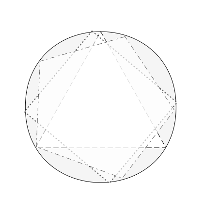
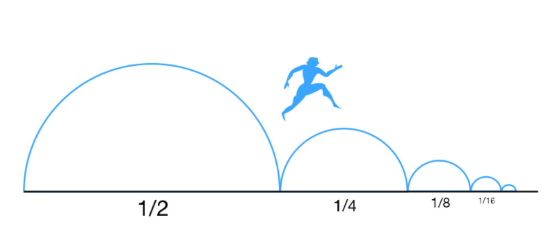
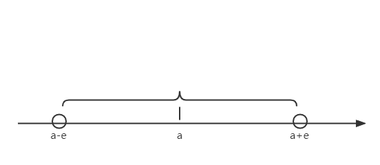

# $\S1.2$ 数列的极限

> 引入：
>
> 1. 割圆术
>    
>    $S_3=\frac{1}{2}\sin\frac{2\pi}{3}R^2\times 3$
>    $S_4=\frac{1}{2}\sin\frac{2\pi}{4}R^2\times 4$
>    ...
>    $S_n=\frac{1}{2}\sin\frac{2\pi}{n}R^2\times n \rightarrow \pi R^2$
> 2. 芝诺佯谬（两分法）
>    > 芝诺：“一个人从 A 点走到 B 点，要先走完路程的 1/2，再走完剩下总路程的 1/2，再走完剩下的 1/2……”如此循环下去，永远不能到终点。
>    > 庄子：“一尺之棰，日取其半，万世不竭。” ——《庄子·天下篇》
>    > 
> $\lim_{n\to +\infty}(1+\frac{1}{2}+\frac{1}{4}+\cdots +\frac{1}{2^n})=2$

## 一、定义

- 数列 $\{x_n\}： x_1,x_2,\cdots ,x_n, \cdots$，一般为无穷
- 极限（$\epsilon - N$ 定义）

> $\lim _{n\to \infty}x_n=a(const)$ $\Leftrightarrow$ $\forall \epsilon \gt 0$，$\exists N=N(\epsilon) \gt 0$，当 $n\gt N$ 时，$|x_n-a|\lt \epsilon$ $\Leftrightarrow$ $\forall \epsilon \gt 0$，$\exists N \gt 0$，当 $n\gt N$ 时，$x_n\in U(a,\epsilon)$ [落在 $U(a,\epsilon)$ 之外的点只有有限个]

- 此时也称数列**收敛**。去掉、改变、增加数列的有限项，不改变其极限

### 例题
证明 $\lim_{n \to \infty}\frac{1}{n}=0$

解：$\forall \epsilon\gt 0 \quad \exists N = [\frac{1}{\epsilon}]+1 \quad n \gt N = [\frac{1}{\epsilon}]+1$

$|\frac{1}{n}-0|=\frac{1}{n}\lt \epsilon$ 恒成立

$\therefore \lim_{n \to \infty}\frac{1}{n}=0$

## 二、数列极限的性质

### 定义1
$\{x_n\}$ 有界 $\Leftrightarrow \exists M\gt 0,\forall n,|x_n|\le M$

* 性质 1：$\{x_n\}收敛\Rightarrow \{x_n\}有界$

  > 证明：设 $\displaystyle \lim_{n\to \infty}x_n=a$，取 $\epsilon =1$
  > 则 $\exists N$，当 $n\gt N$ 时，有 $|x_n-a|\lt \epsilon=1$
  > $a-1=a-\epsilon \lt x_n \lt a+\epsilon = a+1$
  > 取 $M=\max\{|x_1|,|x_2|,\cdots,|x_N|,a-1,a+1\}$，则对任意 $n$，有 $|x_n|\le M$
  > $\therefore$ 数列 $\{x_n\}$ 有界

- $\{x_n\}$ 有界 $\not \Rightarrow$ $\{x_n\}$ 收敛，反例：$\{(-1)^n\}$

### 定义2
$\{x_n\}$ 的每一项中，$x_n\le x_{n+1}$，则称 $\{x_n\}$ 单调递增；$x_n\ge x_{n+1}$，则称 $\{x_n\}$ 单调递减

- $\{x_n\}$ 单调且有界 $\Rightarrow$ $\{x_n\}$ 收敛
- $\{x_n\}$ 非单调 $\not \Rightarrow$ $\{x_n\}$ 发散，反例：$\displaystyle \lim_{n\to \infty}\dfrac{(-1)^n}{n}=0$

* 性质 2：若数列存在极限（或数列收敛），则它的极限唯一

  > 证明（反证法）
  >
  > 假设 $\displaystyle \lim_{n\to \infty}x_n=a$，$\displaystyle \lim_{n\to \infty}x_n=b$，且 $a \not = b$，不妨设 $b\gt a$
  >
  > $\forall \epsilon \gt 0$，$\exists N_1\quad n\gt N_1 \quad a-\epsilon \lt x_n \lt a+\epsilon$
  >
  > $\forall \epsilon \gt 0$，$\exists N_2\quad n\gt N_2 \quad b-\epsilon \lt x_n \lt b+\epsilon$
  >
  > $\exists N\gt 0 \quad n\gt N \quad N=\max\{N_1,N_2\}$
  >
  > 取 $\epsilon=\dfrac{b-a}{2}\gt 0$
  >
  > 此时 $x_n\lt a+\epsilon = b-\epsilon \lt x_n$，矛盾，故 $a=b$

* 性质 3：保序性（保不等号性）

  $$
  \exists N\gt 0 \quad 当n\gt N 时，x_n\le y_n \Rightarrow \lim_{n\to \infty}x_n\le\lim_{n\to \infty}y_n
  $$

  > 证明（反证法）
  >
  > 设 $\displaystyle \lim_{n\to \infty}x_n=a$，$\displaystyle \lim_{n\to \infty}x_n=b$，假设 $a\gt b$
  >
  > $\forall \epsilon \gt 0$，$\exists N_1\quad n\gt N_1 \quad a-\epsilon \lt x_n \lt a+\epsilon$
  >
  > $\forall \epsilon \gt 0$，$\exists N_2\quad n\gt N_2 \quad b-\epsilon \lt y_n \lt b+\epsilon$
  >
  > $\exists N=\max\{N_1,N_2\}$
  >
  > 取 $\epsilon=\dfrac{a-b}{2}\gt 0$
  >
  > 此时 $y_n\lt b+\epsilon = a-\epsilon \lt x_n$，矛盾，Q.E.D

- $\displaystyle x_n\lt y_n \Rightarrow \lim_{n\to \infty}x_n \le \lim_{n\to \infty}y_n$
- $\displaystyle x_n\lt y_n \not \Rightarrow \lim_{n\to \infty}x_n \lt \lim_{n\to \infty}y_n$，反例：$\{\dfrac{1}{n+1}\}$，$\{\dfrac{1}{n}\}$
- 保号性
  - $\displaystyle x_n\ge 0 \Rightarrow \lim _{n\to \infty}x_n\ge 0$
  - $\displaystyle x_n\le 0 \Rightarrow \lim _{n\to \infty}x_n\le 0$
  - $\displaystyle \lim_{n\to \infty}x_n=a且a\gt 0 \Rightarrow \exists N\gt 0\quad 当n\gt N\quad x_n\gt 0$
  - $\displaystyle \lim_{n\to \infty}x_n=a且a\ge 0 \not \Rightarrow \exists N\gt 0\quad 当n\gt N\quad x_n\ge 0$，反例：$\{-\dfrac{1}{n}\}$

### 定义 3（子列）
从 $\{x_n\}$ 中任意取出 $k$ 项，保持原来顺序，排成新数列 $\{x_{n_k}\}:x_{n_1},x_{n_2},\cdots,x_{n_k},\cdots$，称 $\{x_{n_k}\}$ 为 $\{x_n\}$ 的子数列。显然，有 $n_k\ge k$，当取等号时，为 $\{x_n\}$ 本身

* 性质 4

  $$
  \lim_{n\to \infty}x_n=a \Leftrightarrow \forall \{x_{n_k}\} ,\lim_{k\to \infty}x_{n_k}=a
  $$

  > 证明
  >
  > "$\Leftarrow$": $\{x_n\}$ 为一子列，$\lim_{n\to \infty}x_n=a$
  >
  > "$\Rightarrow$": $\forall \epsilon \gt 0 \quad n_k\ge k\ge N$
  >
  > $\exists k=N \quad |x_{n_k}-a|\lt \epsilon$

- 推论：存在 $\{x_{n_k}\}$ 不收敛于 $a \Rightarrow \{x_n\}$ 发散
- $\displaystyle \lim_{n\to \infty}x_n=a \Leftrightarrow \lim_{n\to \infty}x_{2k}=\lim_{n\to \infty}x_{2k+1}=a$

  > 证明
  >
  > "$\Rightarrow$": 性质 4，$\{x_{2k}\}$ 与 $\{x_{2k+1}\}$ 均为 $\{x_n\}$ 子列
  >
  > "$\Leftarrow$": $\forall \epsilon \gt 0 \quad \exists N=\max\{2N_1+1,2N_2+1\} \quad n\gt N$ 时，$|x_n-a|\lt \epsilon$
  >
  > $\exists N_1 \quad k\gt N_1\quad |x_{2k}-a|\lt \epsilon$
  >
  > $\exists N_2 \quad k\gt N_2\quad |x_{2k+1}-a|\lt \epsilon$
