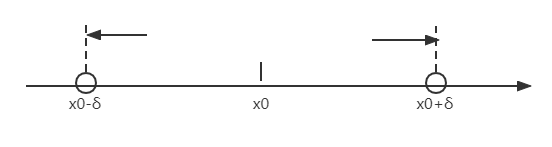

# $\S1.3$ 函数的极限
## 一、自变量趋于有限值时函数的极限（$x\rightarrow x_0$）
### 1. 定义（$\epsilon-\delta$定义）
$f(x)$ 在 $\overset{\circ}{U} (x_0,\delta')$ 处有定义，$\forall \epsilon \gt 0 \quad \exists \delta \le \delta' \quad 0\lt |x-x_0|\lt \epsilon$，有$A-\epsilon\lt f(x)\lt A+\epsilon$成立

* $\displaystyle \lim_{x\to x_0}f(x)=A \Leftrightarrow \forall \epsilon\gt 0,\exists \delta \gt 0, \forall x \in \overset{\circ}{U} (x_0,\delta') ，有|f(x)-A|\lt \epsilon 成立$
* $\displaystyle \lim_{x\to x_0}f(x)=A \Leftrightarrow f(x)=A+\alpha(x)，其中\displaystyle \lim_{x\to x_0}\alpha(x)=0(无穷小量)$

### 2. 函数极限的性质
> 与数列极限的性质相似

1. 唯一性
2. 局部有界性
  $$
  \lim_{x\to x_0}f(x)=A \Leftrightarrow \overset{\circ}{U} (x_0,\delta)内函数有界
  $$
3. 局部保序性
  $$
  \lim_{x\to x_0}f(x)=A \quad \lim_{x\to x_0}g(x)=B \\
  若存在 \delta \gt 0，当x\in \overset{\circ}{U} (x_0,\delta)时，恒有 f(x)\le g(x)，则有A\le B
  $$
4. 局部保号性
  $$
  设\lim_{x\to x_0}f(x)=A，若存在\delta \gt 0，当x\in \overset{\circ}{U} (x_0,\delta)时，恒有 f(x)\le/\ge 0，则有A\le/\ge 0
  $$
5. 归结原则
  $$
  设f(x)在\overset{\circ}{U} (x_0,\delta)上有定义，  \lim_{x\to x_0}f(x)=A \Leftrightarrow 任意收敛于x_0的数列\{x_n\}(x_n \ne x_0)恒有\lim_{x\to x_0}f(x_n)=A
  $$

#### 例
证明 $\lim_{x\to 0}\sin \frac{1}{x}$ 不存在

解：

取 $\{x_n\}=\dfrac{1}{2n\pi}(x_n\ne 0)\quad \lim_{n\to \infty}x_n=0 \quad \lim_{n\to \infty}f(x_n)=0$

取 $\{x_n'\}=\dfrac{1}{2n\pi+\frac{\pi}{2}}(x_n’\ne 0)\quad \lim_{n\to \infty}x_n'=0 \quad \lim_{n\to \infty}f(x_n')=1$

$\because \lim_{n\to \infty}f(x_n) \ne  \lim_{n\to \infty}f(x_n')$

$\therefore 极限不存在$

### 3. 单侧极限：左/右极限

* 对于 $\forall \epsilon \gt 0$，$\exists \epsilon \gt 0$，当 $x_0\lt x \lt x_0+\epsilon$ 时，$|f(x)-A|\lt \epsilon$ 成立，称 $A$ 为 $f(x)$ 当 $x$ 趋向 $x_0$ 时的右极限，记作 $\displaystyle \lim_{x\to x_0^+}f(x)=A$ 或 $f(x_0^+)=A$
* 若当 $x_0-\epsilon\lt x \lt x_0$ 时，$|f(x)-A|\lt \epsilon$ 成立，称$A$为 $f(x)$ 当 $x$ 趋向 $x_0$ 时的左极限，记作 $\displaystyle \lim_{x\to x_0^-}f(x)=A$ 或 $f(x_0^-)=A$

> 定理：$f(x)$ 在点 $x_0$ 存在极限 $\Leftrightarrow$ $f(x)$ 在 $x_0$ 的左右极限都存在且相等
## 二、自变量趋于无穷大时函数的极限（$x\rightarrow \infty$）
### 1. 定义
$$
  \lim_{x\to \infty} f(x)=A \Leftrightarrow \forall \epsilon \gt 0, \exists X\gt 0,当|x|\gt X时,恒有|f(x)-A|\le \epsilon
$$
### 2. 几何意义
对于任意 $\epsilon \gt 0$ 总存在 $X\gt 0$，$x\gt X$ 或 $x\lt -X$ 时，曲线 $y=f(x)$ 位于 $y=A+\epsilon$ 与 $y=A-\epsilon$ 之间
