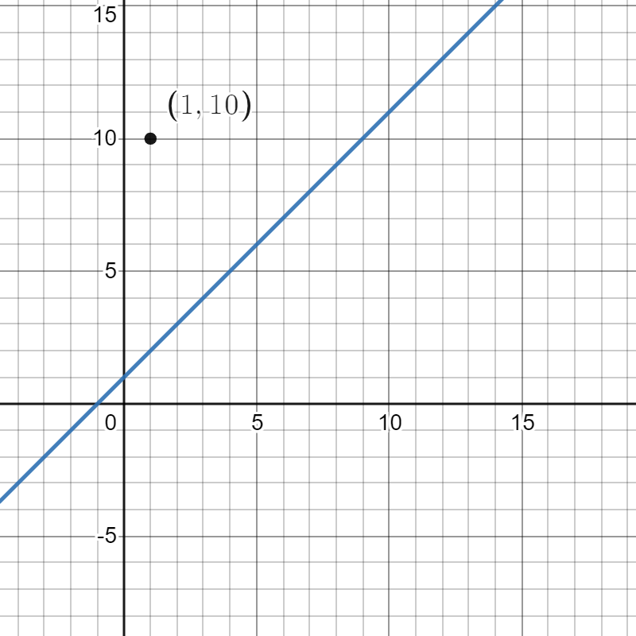
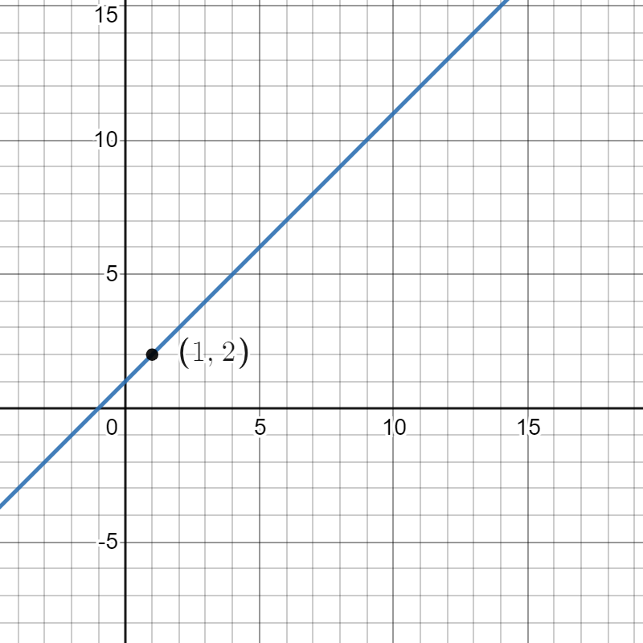
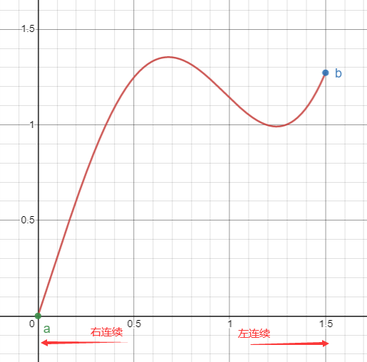
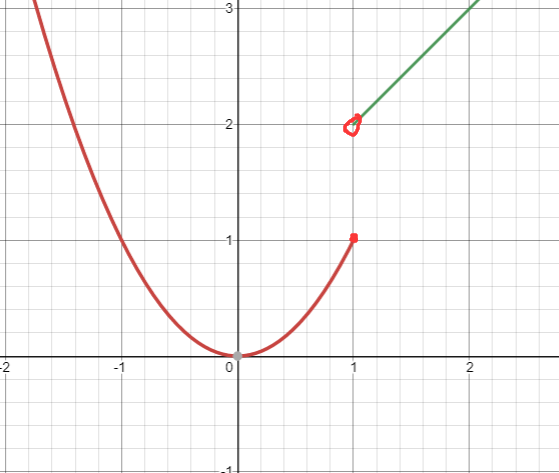

# $\S1.8$ 函数的连续性
## 一、连续与间断
* 定义1：函数在 $\overset{\circ}{U}(x_0)$ 有定义，若 $\displaystyle \lim_{x\to x_0}f(x)=f(x_0)$，则称 $f(x)$ 在点 $x_0$ 连续，$x_0$ 称为连续点。否则，称 $f(x)$ 在点 $x_0$ 不连续（间断），$x_0$ 称为间断点。
	> $\epsilon - \delta$定义：$f(x)$ 在点 $x_0$ 连续 $\Leftrightarrow \forall \epsilon \gt 0 \quad \delta \gt 0 \quad |x-x_0|\lt \delta$时，$|f(x)-f(x_0)|$ 成立
	>
	> 自变量的改变量 $\Delta x=x-x_0$，因变量的改变量 $\Delta y=f(x)-f(x_0)=f(x_0+\Delta x)-f(x_0)$，$f(x)$ 在 $x_0$ 连续 $\displaystyle \Leftrightarrow \lim_{x \to 0}\Delta y = 0$
* 定义2：若 $f(x)$ 在 $(a,b)$ 内每一点均连续，则称 $f(x)$ 在 $(a,b)$ 上连续，是 $(a,b)$ 上的连续函数。

### 例题
1. 生动理解连续性
    $$
    	f(x)=\begin{cases}
    	\dfrac{x^2-1}{x-1}&, x\ne 1\nonumber \\
    	10&, x= 1\nonumber
    	\end{cases}
    $$
    
    $$
      f(x)=\begin{cases}
      \dfrac{x^2-1}{x-1}&, x\ne 1 \\
      2&, x= 1
      \end{cases}
    $$
    

2. 证明$y=\sin x$在 $\mathbb{R}$ 上任意点均连续

    证：$\forall \epsilon \gt 0, \exists \delta = \epsilon, 当|x-x_0|\lt \delta$：
    $$
    \begin{align*}
     |\sin x-\sin x_0| &= |2\cos \dfrac{x+x_0}{2}\sin \dfrac{x-x_0}{2}|\\
     &\le 2|\sin \dfrac{x-x_0}{2}|\\
     &\le 2|\dfrac{x-x_0}{2}| \\
     &\lt \delta \\
     &= \epsilon
    \end{align*}
    $$

* 定义3：左连续 $\displaystyle \lim_{x\to x_0^-}f(x)=f(x_0)$，右连续 $\displaystyle \lim_{x\to x_0^+}f(x)=f(x_0)$
   
* 定义4：$f(x)$ 在 $(a,b)$ 连续，且在 $x=a$ 处右连续，在 $x=b$ 处左连续，则 $f(x)$ 在 $[a,b]$ 上连续，是 $[a,b]$ 上的连续函数
* 定理：$\displaystyle x_0\in (a,b) \quad \lim_{x\to x_0}f(x)=\lim_{x\to x_0^-}f(x)=\lim_{x\to x_0^+}f(x)=f(x_0)$，
$$
f(x)在x_0连续 \Leftrightarrow f(x)在x_0左、右连续
$$

3. 判断$f(x)=\begin{cases}x^2 &x\le 1\\x+1 & x\gt 1 \end{cases}$ 在$x=1$处的连续性

    解：图象如下：
    

    函数在 $x=1$ 不连续，左右极限存在
    > $\displaystyle \lim_{x\to 1^-}f(x)=\lim_{x\to 1^-}x^2=1=f(1)$，左连续
    > $\displaystyle \lim_{x\to 1^+}f(x)=\lim_{x\to 1^+}(x+1)=2\ne f(1)$，非右连续

4. $f(x)$ 在点 $x_0$ 连续，$f(x_0)\gt 0$，证：$\exists U(x_0), f(x)\gt \dfrac{f(x_0)}{2}\gt 0$

    $\because f(x)$ 在 $x_0$ 连续

    $\therefore \displaystyle \lim_{x\to x_0}f(x)=f(x_0)\gt 0$

    $\forall \epsilon \gt 0 \quad \exists \delta \gt 0$，当 $|x-x_0|\lt \delta$ 时，$|f(x)-f(x_0)|\lt \epsilon$ 成立

    $f(x_0)-\epsilon \lt f(x) \lt f(x_0)+\epsilon$

    取 $\epsilon=\dfrac{f(x_0)}{2}$，则 $0\lt \dfrac{f(x_0)}{2}\lt f(x)$，得证

> 局部保号性
> $$
   \lim_{x\to x_0}f(x)=A\gt 0 \Rightarrow x\in \overset{\circ}{U}(x_0), f(x)\gt \dfrac{A}{2}\gt 0
> $$
## 二、间断点的分类
$$
\lim_{x\to x_0}f(x)\ne f(x_0)\Rightarrow 在x_0间断
$$
1. I类，左右极限都存在
	* 相等：可去间断点，如$y=\dfrac{\sin x}{x},x=0$
	* 不相等：跳跃间断点，如$y=\operatorname{sgn} x,x=0$
2. II类，不属于I类，**至少一个**极限不存在
	* 无穷大：无穷间断点，如$y=\dfrac{1}{x},x=0$
	* 振荡间断点，如$y=\sin \dfrac{1}{x},x=0$

### 例题
1. $f(x)=\dfrac{1}{1-e^\frac{x}{1-x}}$，讨论间断点类型

    解：$x=1$ 和 $x=0$ 是间断点
    $\displaystyle \lim_{x\to 1^-}f(x)=0$，$\displaystyle \lim_{x\to 1^+}f(x)=1$，$\displaystyle \lim_{x\to 0^-}f(x)=+\infty$，$x=1$是I类跳跃间断点，$x=0$是II类无穷间断点

2. $f(x)$ 在点 $x_0$ 连续 $?\Leftrightarrow |f(x)|$ 或 $|f^2(x)|$ 在 $x_0$ 连续

    $\Rightarrow$：$\displaystyle \lim_{x\to x_0}f(x)=f(x_0)$，$\displaystyle \lim_{x\to x_0}f^2(x)=f(x_0)\cdot f(x_0)=f^2(x_0)$

    $\forall \epsilon \gt 0 \quad \exists \delta \gt 0 \quad |x-x_0|\lt \delta$

    $||f(x)|-|f(x_0)||\lt |f(x)|-|f(x_0)| \lt \epsilon$

## 三、连续函数的性质
$f(x)\in C(-\infty, +\infty)$

* 定理1（四则运算）连续函数间作和、差、积、商运算，结果仍为连续函数
	> 结果在**公共定义域**上连续，如$f(x)=x \quad g(x)=\sqrt{x}$，则 $f(x)\pm g(x)$ 在 $(0,+\infty)$ 上连续
* 定理2：$y=f(u)$ 在点 $u_0$ 上连续，$u=\phi(x)$ 在点 $x_0$ 连续，$u_0=\phi (x_0) \Rightarrow y=f[\phi (x)]$ 在 $x_0$ 上连续
	* $\displaystyle \lim_{x\to x_0}f[\phi (x)]=\lim_{u \to \infty}f(u)=f(u_0)=f[\phi(x_0)]=f[\lim_{x\to x_0}\phi(x)]$
	* 推论：若 $\displaystyle \lim_{x\to x_0}f(x)=A\gt 0 \quad \lim_{x\to x_0}g(x)=B$，则 $\displaystyle \lim_{x\to x_0}f(x)^{g(x)}=\lim_{x\to x_0}f(x)^{\lim_{x\to x_0}g(x)}=A^B$

### 例题
1. 计算极限
    $$
       \begin{align*}
       &\lim_{x\to 0}\left(\dfrac{\cos^2x}{\cos2x}\right)^{\frac{a}{x^2}}  (a \ne 0)\\
       = &\lim_{x\to 0}\left(\dfrac{\cos^2x-\sin^2x}{\cos^2x}\right)^{-\frac{a}{x^2}} \\
       = &\lim_{x\to 0}(1-\tan^2x)^{-\frac{1}{tan^2x}\cdot \frac{\tan^2x}{x^2}\cdot a} \\
       = &e^a
       \end{align*}
    $$

2. $f(x),g(x)$ 连续，证明：$\phi(x)=\max\{f(x),g(x)\}$、$\psi(x)=\min\{f(x),g(x)\}$ 连续

    证：
    * $f(x)\gt g(x)$，$\phi(x)=f(x)=\dfrac{f(x)+g(x)}{2}+\dfrac{f(x)-g(x)}{2}$
    * $f(x)\lt g(x)$，$\phi(x)=g(x)=\dfrac{g(x)+f(x)}{2}+\dfrac{g(x)-f(x)}{2}$

    $\therefore \phi(x)=\underset{连续函数}{\dfrac{f(x)+g(x)}{2}}+\underset{连续函数}{\dfrac{|f(x)-g(x)|}{2}}$，$\phi(x)$ 是连续函数

    同理，$\psi(x)=\underset{连续函数}{\dfrac{f(x)+g(x)}{2}}+\underset{连续函数}{\dfrac{|f(x)-g(x)|}{2}}$，$\psi(x)$ 是连续函数，得证

* 定理3. 基本初等函数在定义域上连续，初等函数在定义区间上连续

3. $f(x)=\begin{cases}x^2 \quad &x\le 1\\ 2-x \quad &x\gt 1\end{cases}$，$g(x)=\begin{cases}x \quad &x\le 1\\ x+4 \quad &x\gt 1\end{cases}$，讨论 $f[g(x)]$ 的连续性

    解：
    $$
       \begin{align*}
       f[g(x)]&=\begin{cases}[g(x)]^2 \quad &g(x)\le 1\\ 2-g(x) \quad &g(x)\gt 1\end{cases} \\
       &=\begin{cases}x^2 \quad &x\le 1\\ -x-2 \quad &x\gt 1\end{cases}
       \end{align*}
    $$
    在 $(-\infty, 1)\cup (1,+\infty)$ 上连续，$x=1$ I类跳跃间断
