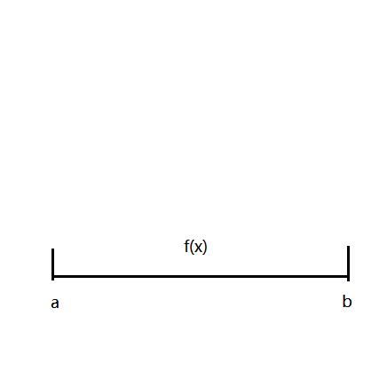
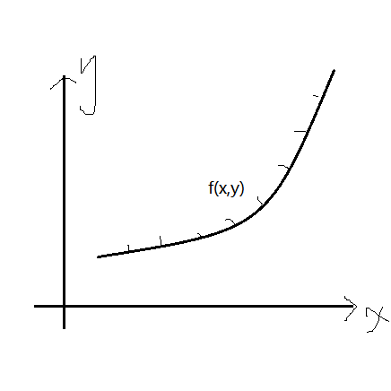
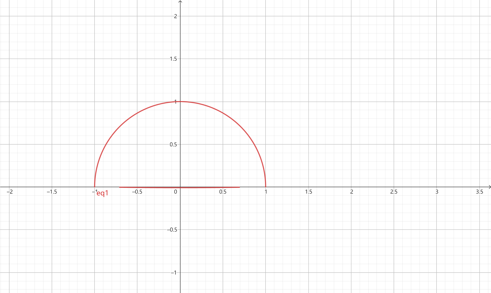
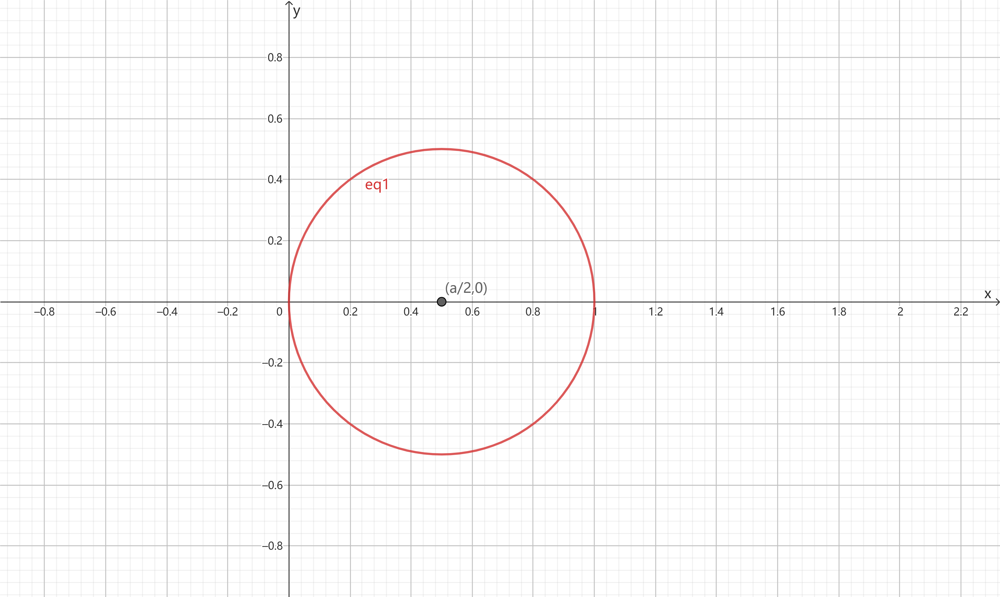
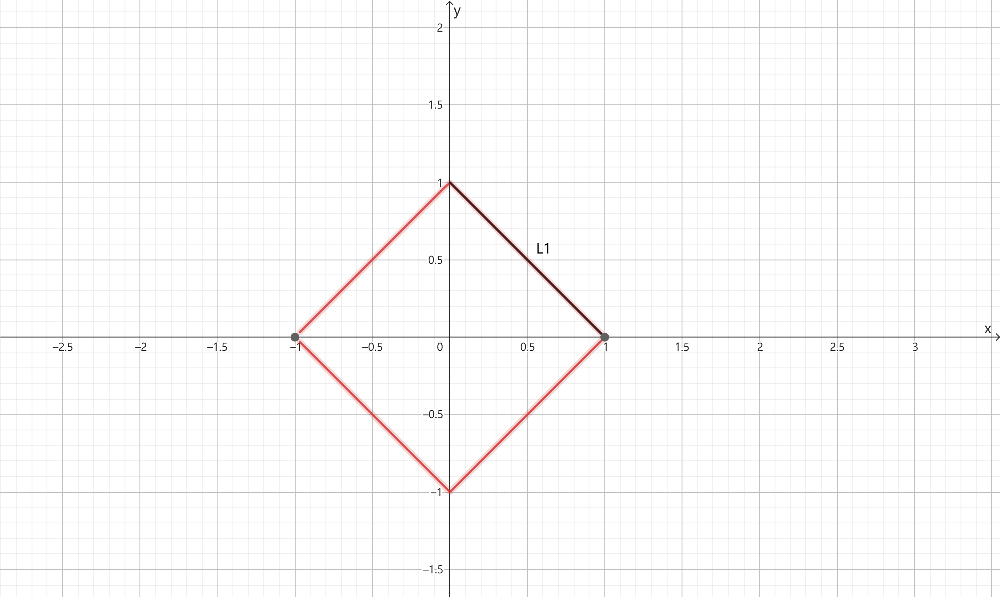
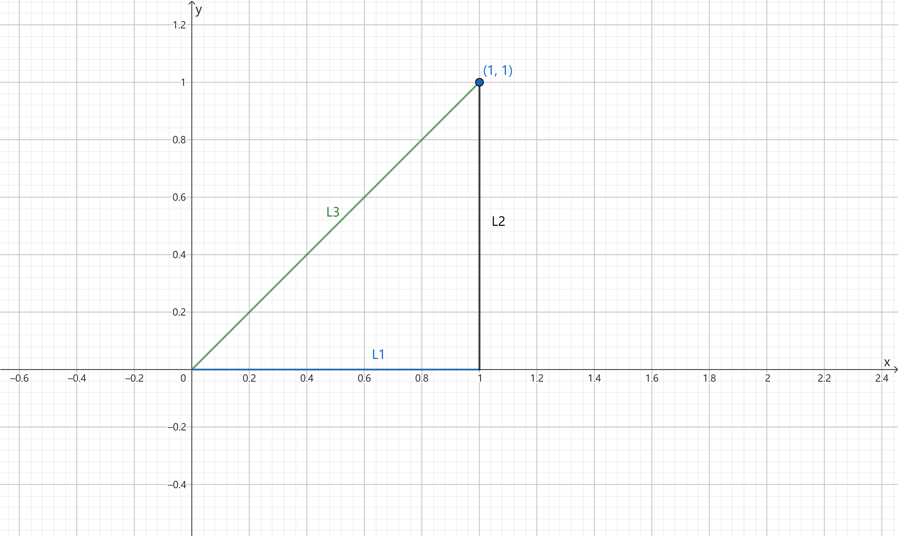
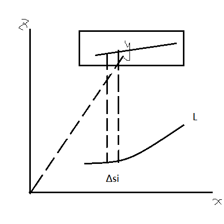
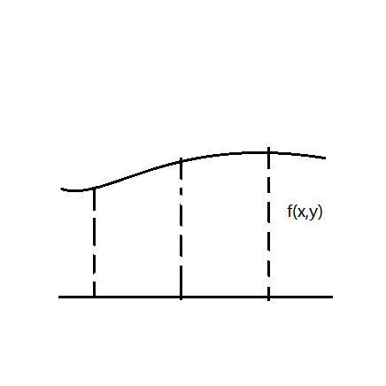
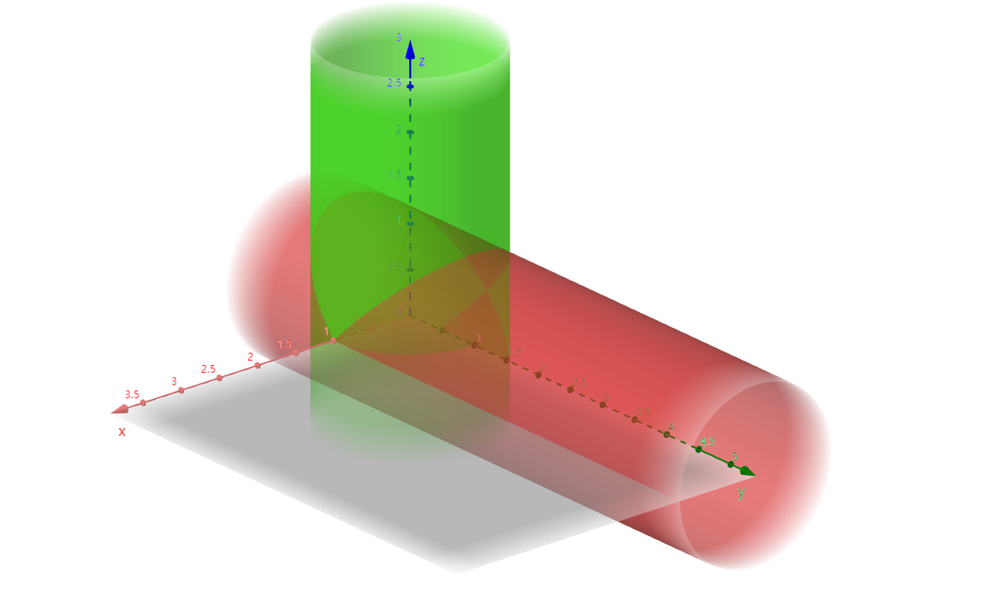

# $\S10.1$ 对弧长的曲线积分（I类曲线积分）

引例

| 一维 | 二维 |
|:--:|:--:|
|||
|$m=\int_a^bf(x)\mathrm dx$|$m_i\approx f(\xi_i,\eta_i)$，$\displaystyle M\approx \sum_{i=1}^nf(\xi_i,\eta_i)\Delta s_i\\=\displaystyle \lim_{\lambda\to 0}\sum_{i=1}^nf(\xi_i,\eta_i)\Delta s_i$|

## 一、定义

$f(x,y)$ 在曲线 $L$ 上有界（分段光滑）

* 任意分割 $\Delta s_i$
* 任意取点 $(\xi_i,\eta_i)\in \Delta s_i$

若 $\displaystyle \lim_{\lambda\to 0}\sum_{i=1}^nf(\xi_i,\eta_i)\Delta s_i$ 存在，则称该极限为I类曲线积分，记为

$$
\begin{align*}
\int_L f(x,y) \mathrm ds\quad s为弧长元素\\
\oint_L f(x,y) \mathrm ds\quad 封闭曲线\\
\oint_\Gamma f(x,y,z) \mathrm ds\quad 空间曲线
\end{align*}
$$

## 二、性质

* $\int_L (af+bg)\mathrm ds = a\int_L f \mathrm ds + b\int_L g \mathrm ds$
* 可加性 $L=L_1+L_2$，$\int_Lf \mathrm ds=\int_{L_1}f \mathrm ds+\int_{L_2} \mathrm ds$
* 对称性

    $$
    \begin{align*}
    \int_L f(x,y)\mathrm ds = \begin{cases}
    2\int_{L_1} f(x,y) \mathrm ds &\quad f(x,y)=f(-x,y)\\
    0&\quad f(x,y)=-f(-x,y)
    \end{cases}
    \end{align*}
    $$

    (L关于y轴对称)

## 三、计算

> 转化为定积分

**定理：** 设 $f(x,y)$ 在 $L$ 上连续，$L$ 的参数方程为 $\begin{cases}x=\phi(t)\\y=\psi(t)\end{cases}$ $(a\le t\le \beta)$，其中 $\phi(t)$ 和 $\psi(t)$ 在 $[\alpha,\beta]$ 上具有一阶导数，且 $\phi'^2(t)+\psi'^2(t)\ne0$，则 $\int_L f(x,y)\mathrm ds=\int_\alpha^\beta f[\phi(t),\psi(t)]\sqrt{\phi'^2(t)+\psi'^2(t)}\mathrm dt\quad(\alpha\lt \beta)$

* $\Gamma:\begin{cases}x=\phi(t)\\y=\psi(t)\\z=\omega(t)\end{cases}\quad(\alpha\le t\le \beta)$，$\int_\Gamma f(x,y,z)\mathrm ds=\int_\alpha^\beta f(\phi(t),\psi(t),\omega(t))\sqrt{\phi'(t)^2+\psi'(t)^2+\omega'(t)^2} \mathrm dt\quad(\alpha\lt\beta)$
* $L:y=\phi(x),a\le x\le b$，$\int_L f(x,y) \mathrm ds = \int_a^b f(x,\phi(x))\sqrt{1+\phi'(x)^2}\mathrm dx$
* $L:x=\psi(y),c\le y\le d$，$\int_L f(x,y)\mathrm ds=\int_c^d f(\psi(y),y)\sqrt{\phi'(y)^2+1}\mathrm dy$
* $L:\rho=\rho(\theta),\alpha\le \theta \le \beta$，$\int_Lf(x,y)\mathrm ds=\int_\alpha^\beta f[\rho(\theta)\cos\theta,\rho(\theta)\sin\theta]\sqrt{\rho^2(\theta)+\rho'^2(\theta)}\mathrm d\theta$

### 例题
1. $I=\int_L (x^2+y^2) \mathrm ds$，$L:x^2+y^2=a^2$ 且 $y\ge 0$（$a\gt 0$）

    解：

    * 法一：$L:\begin{cases}x=a\cos t\\y=a\sin t\end{cases}\quad t\in[0,\pi]$

        $$
        \begin{align*}
        I&=\int_0^\pi[(a\cos t)^2+(a\sin t)^2]\sqrt{(-a\sin t)^2+(a\cos t)^2}\mathrm dt\\
        &=\int_0^\pi a^2\cdot a \mathrm dt\\
        &=\pi a^3
        \end{align*}
        $$

    * 法二：$I=\int_La^2 \mathrm ds=a^2 \int_L \mathrm ds=a^2\cdot \pi a = \pi a^3$（积分曲线的弧长）

2. $I=\int_L \sqrt{x^2+y^2} \mathrm ds$，$L:x^2+y^2=ax(a\gt 0)$

    解：

    * 法一：$L=\begin{cases}x=\dfrac{a}{2}+\dfrac{a}{2}\cos t\\y=\dfrac{a}{2}\sin t\end{cases}\quad t\in [0,2\pi]$，$I=\int_0^{2\pi}\sqrt{a(\dfrac{a}{2}+\dfrac{a}{2}\cos t)}\sqrt{(-\dfrac{a}{2}\sin t)^2+(\dfrac{a}{2}\cos t)^2}\mathrm dt=2a^2$
    * 法二：$\rho(\theta)=2\theta,\theta \in [-\dfrac{\pi}{2},\dfrac{\pi}{2}]$，$\displaystyle I=\int_{-\frac{\pi}{2}}^\frac{\pi}{2}\sqrt{a\cdot a\cos\theta \cdot a\cos\theta}\sqrt{(-a\sin\theta)^2+(a\cos\theta)^2}\mathrm d\theta=2a^2$

3. $I=\int_L |x| \mathrm ds$，$L:|x|+|y|=1$

    解：

    * 法一，L关于y、x轴对称

        $$
        \begin{align*}
        I&=4\int_{L_1}|x|\mathrm ds\\
        &=4\int_{L_1}x \mathrm ds\\
        &=4\int_0^1 x\sqrt{1+(-1)^2} \mathrm dx\\
        &=4\sqrt{2}\int_0^1 x \mathrm dx\\
        &=2\sqrt{2}
        \end{align*}
        $$

    * 法二，L关于 $y=x$ 对称

        $$
        \begin{align*}
        I&=\int_L |x| \mathrm ds\\
        &=\dfrac{1}{2}\int_L (|x|+|y|) \mathrm ds \\
        &=\dfrac{1}{2}\int_L 1 \mathrm ds\\
        &=2\sqrt{2}
        \end{align*}
        $$

4. $I=\int_L y \mathrm ds$，$L:$ 以(0,0)、(1,0)、(1,1) 为顶点的三角形

    

    解：$L=L_1+L_2+L_3$

    * $L_1: y=0, 0\le x\le 1$，$\int_{L_1} y \mathrm ds=0$
    * $L_2: x=1, 0\le y\le 1$，$\int_{L_2} y \mathrm ds=\int_0^1 y \cdot \sqrt{0^2+1^2} \mathrm dy=\dfrac{1}{2}$
    * $L_3: y=x, 0\le x\le 1$，$\int_{L_3}y \mathrm ds =\int_0^1 x\cdot \sqrt{1^2+1^2}\mathrm dx=\dfrac{\sqrt{2}}{2}$

    $\therefore \int_L y \mathrm ds=\dfrac{1+\sqrt{2}}{2}$

5. $I=\int_\Gamma (x^2+y^2)\mathrm ds$，$\Gamma: \begin{cases}x=a\cos t\\y=a\sin t\\z=kt\end{cases}(0\le t\le 2\pi)$

    解：

    $$
    \begin{align*}
    I&=\int_0^{2\pi}a^2\sqrt{(-a\sin t)^2+(a\cos t)^2+k^2}\mathrm dt\\
    &=2\pi a^2 \sqrt{a^2+k^2}
    \end{align*}
    $$

6. $I=\int_\Gamma (2y^2+z^2) \mathrm ds$，$\Gamma:\begin{cases}x^2+y^2+z^2=a^2\\y=x\end{cases}$ 的交线

    解：

    * 法一：在 $\Gamma$ 上，$2y^2+z^2=a^2$，$I=\int_\Gamma a^2 \mathrm ds=a^2 \int_\Gamma \mathrm ds=a^2\cdot 2\pi a^2=2\pi a^3$
    * 法二：$2y^2+z^2=a^2$ 的参数方程是 $\begin{cases}x=\dfrac{a}{\sqrt{2}}\cos t\\y=\dfrac{a}{\sqrt{2}}\cos t\\z=a\sin t\end{cases}\quad 0\le t\le 2\pi$，$I=\int_0^{2\pi}[2\cdot (\dfrac{a}{\sqrt{2}}\cos t)^2+(a\sin t)^2]\sqrt{(-\dfrac{a}{\sqrt{2}}\sin t)^2+(-\dfrac{a}{\sqrt{2}}\sin t)^2+(a\cos t)^2}\mathrm dt=2\pi a^3$

7. $I=\int_\Gamma (x^2+y^2+z^2)\mathrm ds$，$\Gamma:\begin{cases}x^2+y^2+z^2=\dfrac{9}{2}\\x+z=1\end{cases}$

    解：
    * 法一：消去z，$x^2+y^2+(1-x)^2=\dfrac{9}{2}$，$\dfrac{(x-\frac{1}{2})^2}{2}+\dfrac{y^2}{4}=1$，$\begin{cases}x=\dfrac{1}{2}+\sqrt{2}\cos t\\y=2\sin t\\z=\dfrac{1}{2}-\sqrt{2}\cos t\end{cases}$，代入得 $I=18\pi$
    * 法二：$I=\dfrac{a}{2}\int_\Gamma \mathrm ds=\dfrac{9}{2}\cdot 2\pi \cdot 2=18\pi$

## I类曲线积分的几何意义

$$
\begin{align*}
I&=\int_L f(x,y)\mathrm ds\\
&=\lim_{\lambda \to 0}\sum_{i=1}^n f(\xi_i,\eta_i)\Delta s_i
\end{align*}
$$

以 L 为底边，$f(x,y)$ 为高的柱面面积

若 L 为直线，$f(x,y)=C$，$A=SC$

> 求柱面面积 $\int_Lf(x,y)\mathrm ds$：
> * $L$
> * $f(x,y)$

### 例题
1. 求 $x^2+y^2=a^2$ 被 $x^2+z^2=a^2$ 所截部分面积（第一卦限）

    

    解：$L_1(x^2+y^2=a^2):\begin{cases}x=a\cos t\\y=a\sin t\end{cases}\quad 0\le t \le \dfrac{\pi}{2}$，$f(x,y)=\sqrt{a^2-x^2}$

    $$
    \begin{align*}
    I&=\int_L\sqrt{a^2-x^2}\mathrm dx\\
    &=\int_0^{\frac{\pi}{2}}a\sin t\sqrt{(-a\sin t)^2+(a\cos t)^2}\mathrm dt\\
    &=a^2
    \end{align*}
    $$

2. 求 $x^{\frac{2}{3}}+y^{\frac{2}{3}}=1$ 在 $x^2+y^2+z^2=1$ 内的面积（第一卦限）

解：$L:x^{\frac{2}{3}}+y^{\frac{2}{3}}=1 \rightarrow \begin{cases}x=(\cos t)^3\\y=(\sin t)^3\end{cases}\quad 0\le t\le \dfrac{\pi}{2}$，$f(x,y)=\sqrt{1-x^2-y^2}$

$$
\begin{align*}
I&=\int_L \sqrt{1-x^2-y^2}\mathrm ds\\
&=\int_0^{\frac{\pi}{2}}\sqrt{1-\cos^6 t-\sin^6 t}+\sqrt{[3\cos t(-\sin t)]^2+(3\sin^2t \cos t)^2}\mathrm dt\\
&=\dfrac{3\sqrt{3}}{32}\pi
\end{align*}
$$
