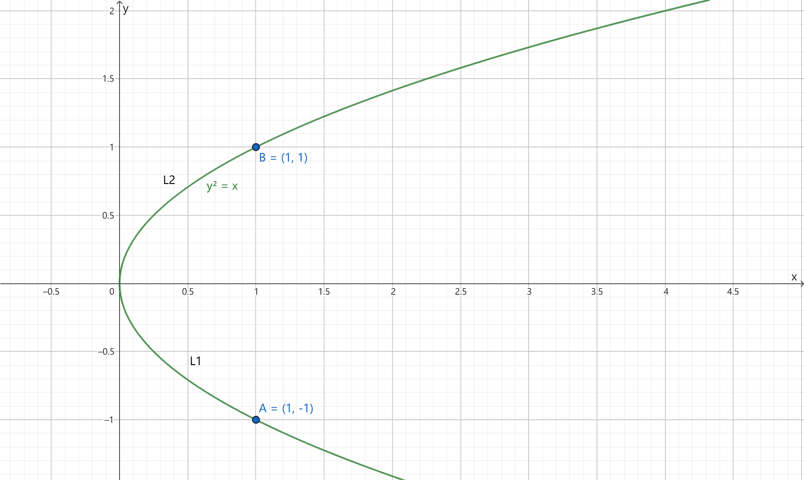
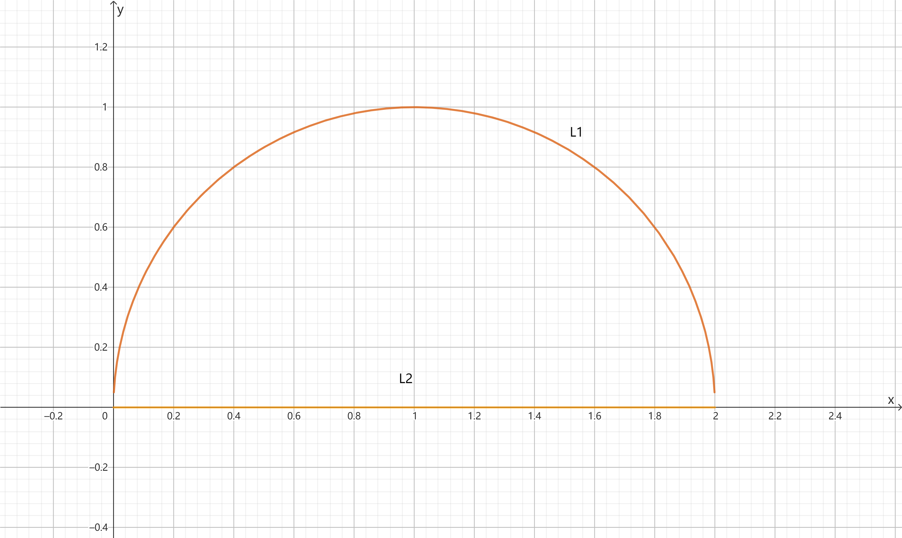
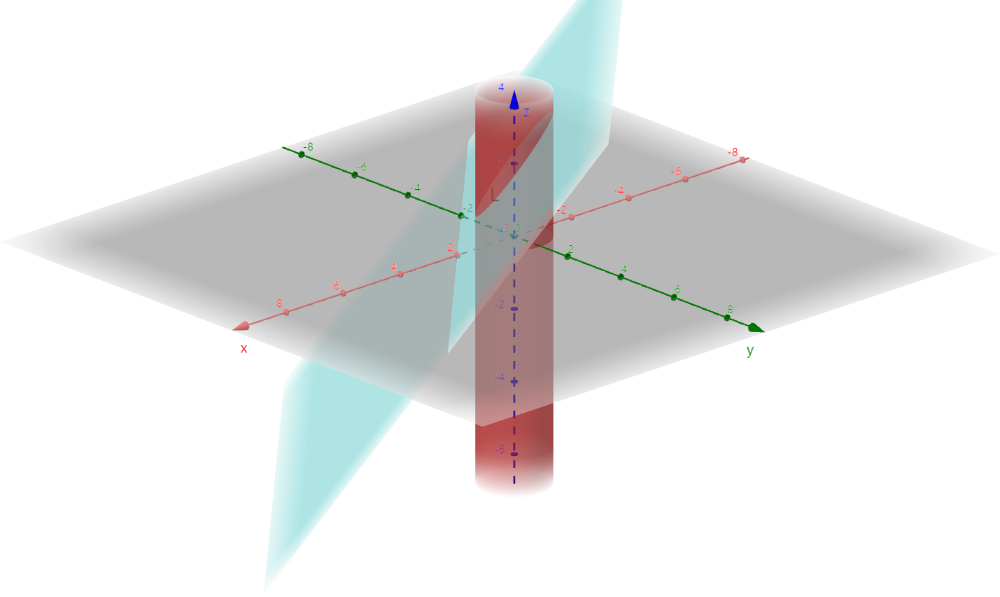
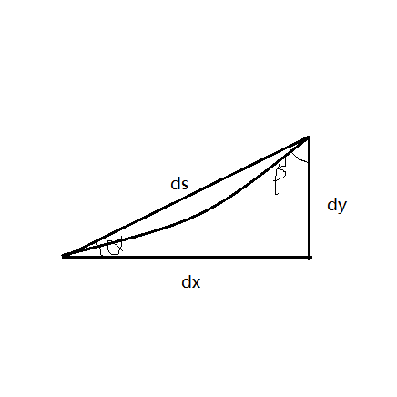

# $\S10.2$ 对坐标的曲线积分（II类曲线*有向*积分）

引例：变力沿曲线做功

$L:A\to B$

$$
\begin{align*}
\vec{F}(x,y)&=P(x,y)\vec{i}+Q(x,y)\vec{j}\\
&=(P(\xi_i,\eta_i),Q(\xi_i, \eta_i))
\end{align*}
$$

$$
\begin{align*}
W_i&\approx \vec{F_i}\cdot \vec{M_{i-1}M_i}\\
&=(P_i,Q_i)\cdot (\Delta x_i,\Delta y_i)\\
&=P_i\Delta x_i + Q_i\Delta y_i
\end{align*}
$$

$W=\displaystyle \lim_{\lambda \to 0}\sum_{n=1}^\infty (P_i\Delta x_i + Q_i\Delta y_i)$

## 定义

设 L 为 xoy 平面内从 A 到 B 的一条有向光滑曲线，P(x,y)为定义在L上的有界函数，若对L任意分割和取点 $(\xi_i,\eta_i)$，极限 $\displaystyle \lim_{\lambda \to 0}\sum_{k=1}^nP(\xi_i,\eta_i)\Delta x_i$ 都存在，则称此极限为 $P(x,y)$ 在有向曲线弧 L 上对坐标 x 的曲线积分，记作 $\displaystyle \int_L P(x,y) \mathrm dx$。类似地，定义 $\displaystyle \int_L Q(x,y) \mathrm dy=\lim_{\lambda \to 0}\sum_{k=1}^nQ(\xi_i,\eta_i)\Delta y_i$。

$$
\begin{align*}
\int_L P(x,y)\mathrm dx + Q(x,y) \mathrm dy &= \int_L P(x,y)\mathrm dx + \int_L Q(x,y) \mathrm dy\\
&=\int_L \vec{F}\cdot \mathrm d\vec{l}
\end{align*}
$$

若 $\Gamma$ 为空间有向曲线弧，则有

$$
\begin{align*}
\int_\Gamma P(x,y,z)\mathrm dx + \int_\Gamma Q(x,y,z) \mathrm dy + \int_\Gamma R(x,y,z)\mathrm dz = \int_\Gamma \vec{F}\cdot \mathrm d\vec{l}
\end{align*}
$$

## 性质

* 若 L 可分成 k 条有向光滑曲线弧 $L_i(i=1,2,\cdots,k)$，则 $\int_L P(x,y)\mathrm dx + Q(x,y) \mathrm dy = \sum_{i=1}^k \int_{L_i} P(x,y) \mathrm dx + Q(x,y) \mathrm dy$
* $\int_L(a_1p_1+a_2p_2)\mathrm dx = a_1\int_L p_1 \mathrm dx + a_2\int_L p_2 \mathrm dx$
* $L:A\to B \Rightarrow L^-:B\to A$，$\int_{L^-}P(x,y)\mathrm dx + Q(x,y) \mathrm dy = -\int_L P(x,y)\mathrm dx + Q(x,y)\mathrm dy$
    * II 类曲线积分必须注意积分弧段的方向

## 计算

定理：$P(x,y)$、$Q(x,y)$ 在 $L:\begin{cases}x=\phi(t)\\y=\psi(t)\end{cases},t:\alpha\to\beta$ 上连续，且 $\phi'^2(t)+\psi'^2(t)\ne 0$，则 $\int_LP \mathrm dx+Q \mathrm dy=\int_\alpha^\beta[P(\phi,\psi)\phi'+Q(\phi,\psi)\psi']\mathrm dt$

* $\Gamma:\begin{cases}x=\phi(t)\\y=\psi(t)\\z=\omega(t)\end{cases}$，$\int_\Gamma P \mathrm dx + Q \mathrm dy + R \mathrm dz =\int_\alpha^\beta [P(\phi,\psi,\omega)\phi'+Q(\phi,\psi,\omega)\psi'+R(\phi,\psi,\omega)\omega']\mathrm dt$
* $L:y=\phi(x), x:a\to b$，$\int_L P \mathrm dx + Q \mathrm dy = \int_a^b[P(x,\phi(x))\cdot 1+Q(x,\phi(x))\phi'(x)]\mathrm dx$
    - $L_1:y=a, x:b\to c$，$\int_{L_1}P \mathrm dx + Q \mathrm dy = \int_b^cP(x,a)\cdot 1+Q(x,a)\cdot 0 \mathrm dx = \int_b^cP(x,a)\mathrm dx$
* $L:x=\psi(y), y:c\to d$，$\int_L P \mathrm dx + Q \mathrm dy=\int_c^d[P(\psi(y),y)\mathrm d\psi'(y)+Q(\psi(y),y)\cdot 1] \mathrm dy$
    - $L_2:x=d, y:m\to n$，$\int_{L_2}P \mathrm dx + Q \mathrm dy = \int_m^n Q(d,y)\mathrm dy$

## 例题

1. $I=\int_L xy \mathrm dx$，$L:y^2=x\quad[(1,-1)\to(1,1)]$

    

    解：

    法1：$l_1:y=-\sqrt{x}\quad x:1\to 0$，$l_2:y=\sqrt{x}\quad x:0\to 1$
    $$
    \begin{align*}
    I&=\int_{L_1}xy \mathrm dx + \int_{L_2}xy \mathrm dx\\
    &=\int_1^0x(-\sqrt{x})\cdot 1 \mathrm dx + \int_0^1 x\sqrt{x}\cdot 1 \mathrm dx\\
    &=\dfrac{4}{5}
    \end{align*}
    $$

    法2：$L:x=y^2\quad y:-1\to 1$
    $$
    \begin{align*}
    I&=\int_{-1}^1y^2\cdot y\cdot 2y \mathrm dy\\
    &=\int_{-1}^1y^4 \mathrm dy\\
    &=\dfrac{4}{5}
    \end{align*}
    $$

2. $I=\oint xy \mathrm dx$，$L:(x-a)^2+y^2=a^2$（$a\gt 0$ 且 $y\gt 0$，逆时针）

    

    解：$L_1:\begin{cases}x=a+a\cos t\\y=a\sin t\end{cases}\quad t:0\to \pi$，$L_2:y=0,x:0\to 2a$

    $$
    \begin{align*}
    I&=\int_{L_1}xy \mathrm dx + \int_{L_2}xy \mathrm dx\\
    &=\int_0^\pi(a+a\cos t)a\sin t(-a\sin t)\mathrm dt + \int_0^{2a}x\cdot 0 \mathrm dx\\
    &=-\dfrac{\pi a^3}{2}
    \end{align*}
    $$

3. $\int_L 2xy \mathrm dx - (3x+y) \mathrm dy$，$L:(0,0)\to (1,1)$
    * $y=x^2$
        - $x:0\to 1, \mathrm dy = 2x \mathrm dx$，$I=\int_0^1[2x\cdot x^2 \cdot 1-(3x+x^2)\cdot 2x]\mathrm dx=-2$
    * $x=y^2$
        - $y:0\to 1, \mathrm dx = 2y \mathrm dy$，$I=\int_0^1[2y^2\cdot y \cdot 2y-(3y^2+y)\cdot 1]\mathrm dy=-\dfrac{7}{10}$
    * $(0,0)\to (0,1)\to (1,1)$
        - $L_1:x=0,y:0\to 1$，$L_2:y=1,x:0\to 1$，$I=I_{L_1}+I_{L_2}=\int_0^1[2\cdot 0 \cdot y \cdot 0-(3\cdot 0+y)]\mathrm dy + \int_0^1[2x\cdot 1-(3x+1)\cdot 0]\mathrm dx=-\dfrac{1}{2}+1=\dfrac{1}{2}$
4. $\int_\Gamma xy \mathrm dx + yz \mathrm dy + zx \mathrm dz$，$\Gamma: A(3,2,1)\to B(0,0,0)$

    解：$\vec{AB}$ 所在直线的方程为

    $$
    \begin{align*}
    \dfrac{x-0}{3-0}=\dfrac{y-0}{2-0}=\dfrac{z-0}{1-0}=t
    \end{align*}
    $$

    即

    $$
    \begin{align*}
    \begin{cases}
    x=3t\\
    y=2t\\
    z=t
    \end{cases}\quad t=1\to 0
    \end{align*}
    $$

    $$
    \begin{align*}
    I&=\int_1^0[3t\cdot 2t\cdot 3+2t\cdot t\cdot 2+t\cdot 3t\cdot 1]\mathrm dt\\
    &=-\dfrac{25}{3}
    \end{align*}
    $$

5. $\int_\Gamma (z-y)\mathrm dx + (x-z)\mathrm dy + (x-y)\mathrm dz$，$\Gamma: \begin{cases}x^2+y^2=1\\x-y+z=2\end{cases}$（方向：从z轴正向看为顺时针）

    

    解：$\Gamma: \begin{cases}x=\cos t\\y=\sin t\\z=2-\cos t+\sin t\end{cases}\quad t:2\pi \to 0$

    $$
    \begin{align*}
    I&=\int_{2\pi}^0\{(2-\cos t+\sin t-\sin t)(-\sin t)+[\cos t-(2-\cos t+\sin t)]\cos t+(\cos t-\sin t)(\sin t+\cos t)\}\mathrm dt\\
    &=-2\pi
    \end{align*}
    $$

6. $\int_L(-y)\mathrm dx _ x \mathrm dy$，$L:x^2+y^2=a^2(a\gt 0)$ 且 $y\ge 0$，顺时针

    解：

    * 法1：$\begin{cases}x=a\cos t\\y=a\sin t\end{cases}\quad t:\pi\to 0$，$I=\int_\pi^0[(-a\sin t)\cdot (-a\sin t)+a\cos t\cdot a\cos t]\mathrm dt=a^2\int_\pi^0 \mathrm dt = -\pi a^2$
    * 法2：$I=\int_L(-y\cos \alpha+x\cos\beta)\mathrm ds$，其中
        * $\cos\alpha=\dfrac{-a\sin t}{\sqrt{a^2\sin^2t+a^2\cos^2t}}=\sin t=\dfrac{y}{a}$
        * $\cos\beta=-\dfrac{a\cos t}{a}=-\cos t=-\dfrac{x}{a}$
        * 故原式 $=-\dfrac{1}{a}\int_L(x^2+y^2)\mathrm ds=-a\int_L \mathrm ds = -\pi a^2$

> 两类曲线积分的关系
>
> 
>
> $[有向L]\int_LP \mathrm dx+Q \mathrm dy=[无向L]\int_L(P\cos \alpha+Q\cos \beta)\mathrm ds$
>
> * $\mathrm dx = \cos\alpha \mathrm ds$，$\cos\alpha=\dfrac{\mathrm dx}{\mathrm ds}=\pm \dfrac{\phi'}{\sqrt{\phi'^2+\psi'^2}}$
> * $\mathrm dy=\cos\beta \mathrm ds$，$\cos\beta=\dfrac{\mathrm dy}{\mathrm ds}=\pm \dfrac{\psi'}{\sqrt{\phi'^2+\psi'^2}}$
> * $\mathrm ds=\sqrt{\phi'^2+\psi'^2}|\mathrm dt|$
>
> $t:\alpha\to\beta\quad \begin{cases}\alpha\le\beta\quad 取“+”\\\alpha\ge\beta\quad取“-”\end{cases}$
