# $\S10.3$ 格林公式及其应用

## 定义

* 单连通区域（“无洞”区域）
* L的方向
    | L的正向 | L的负向 | L1和L2正向如图 |
    | :--: | :--: | :--: |
    |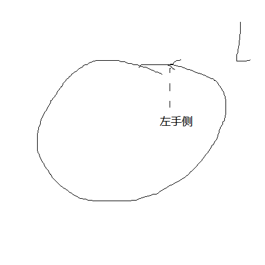|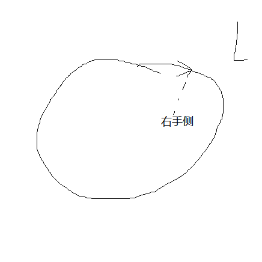|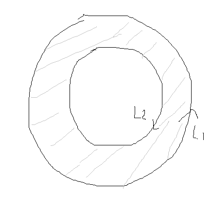|

## 定理（格林公式）
* D单连通
* L正向
* P、Q一阶偏导连续
* 则有 $\oint P \mathrm dx+ Q \mathrm dy = \iint_D \left |\begin{matrix}\dfrac{\partial}{\partial x} & \dfrac{\partial }{\partial y} \\ P & Q \\ \end{matrix} \right | \mathrm dx \mathrm dy=\iint_D(\dfrac{\partial Q}{\partial x}-\dfrac{\partial P}{\partial y})\mathrm dx \mathrm dy$

### 推广
1. $\sigma = \iint_D 1 \mathrm d\sigma = \oint_L P \mathrm dx+Q \mathrm dy=\oint_L x \mathrm dy(Q=x,P=0)$
    * $Q=\dfrac{x}{2}$，$P=-\dfrac{y}{2}$，$\sigma=\dfrac{1}{2}\oint_L x \mathrm dy-y \mathrm dx$
2. D复联通，L正向，P、Q一阶偏导连续，则 $\oint_L P \mathrm dx + Q \mathrm dy = \iint_D (\dfrac{\partial Q}{\partial x}-\dfrac{\partial P}{\partial y})\mathrm dx \mathrm dy$
3. 平面曲线积分（II类）与路径无关的条件

    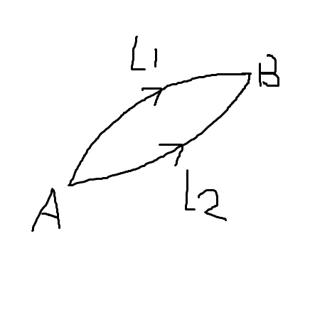

    * 定理1：D单连通，P、Q一阶偏导连续：
        $$
        \begin{align*}
        &\dfrac{\partial Q}{\partial x}=\dfrac{\partial P}{\partial y} 在 D 内处处成立 \\
        &\Leftrightarrow \int_LP \mathrm dx + Q \mathrm dy 在 D 内与路径无关 \\
        &\Leftrightarrow \oint_L P \mathrm dx + Q \mathrm dy = 0\\
        &\Leftrightarrow P \mathrm dx + Q\mathrm dy 是 u(x,y) 的全微分（即 \mathrm du = P\mathrm dx+Q \mathrm dy，\dfrac{\partial u}{\partial y}=Q，\dfrac{\partial u}{\partial x}=P）
        \end{align*}
        $$
    * 定理2：P、Q连续，$\int_{(x_1,y_1)}^{(x_2,y_2)}P \mathrm dx + Q\mathrm dy=u(x_2,y_2)-u(x_1,y_1)$，其中 $u(x,y)$ 是原函数
    * 定理3：D是一个具有n个“洞”的复连通区域，外部L，内部 $l_1,\cdots,l_n$，P、Q一阶偏导连续且 $\dfrac{\partial Q}{\partial x}=\dfrac{\partial P}{\partial y}$，则

        $$
        \begin{align*}
        \oint_LP \mathrm dx+Q \mathrm dy &= \sum_{i=1}^n \oint{l_i}P \mathrm dx + Q \mathrm dy\\
        \oint_{L+L^-}P\mathrm dx+Q \mathrm dy &= \iint_D(\dfrac{\partial Q}{\partial x}-\dfrac{\partial P}{\partial y})\mathrm dx \mathrm dy=0\\
        \Rightarrow \oint_L P\mathrm dx+Q \mathrm dy &= \oint_l P\mathrm dx+Q \mathrm dy
        \end{align*}
        $$

## 例题
1. $I=\oint_L 4xy \mathrm dx + 3x^2 \mathrm dy$，$L:0\le y \le 2$ 且 $-1\le x \le 3$ 的正向边界

    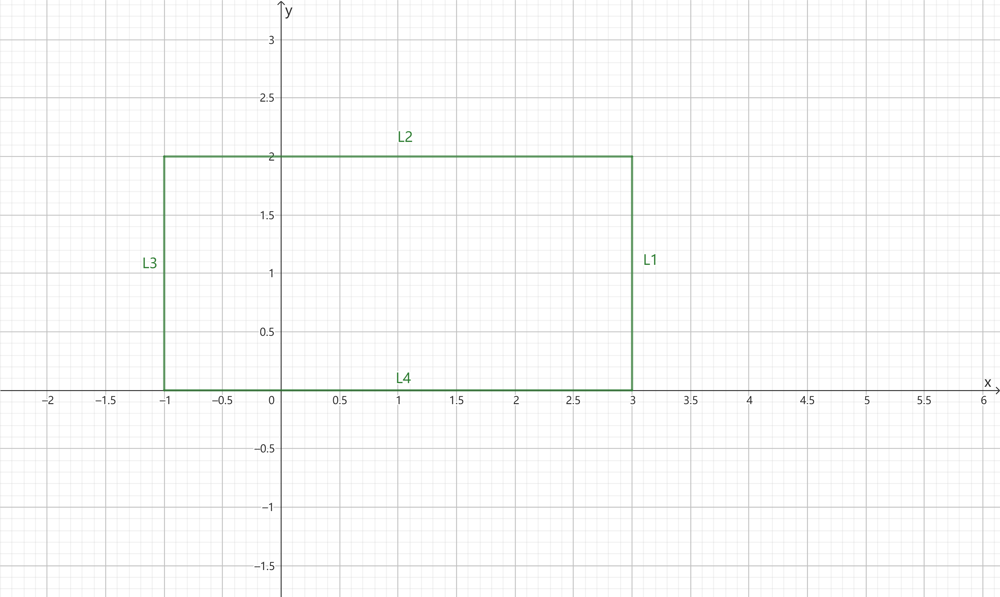

    解：
    $$
    \begin{align*}
    I&=\iint_D (6x-4x)\mathrm dx \mathrm dy\\
    &=2\iint_D x \mathrm dx \mathrm dy\\
    &=2\int_{-1}^3 \mathrm dx\int_0^2 x \mathrm dy\\
    &=2(\int_{-1}^3 x \mathrm dx)(\int_0^2 \mathrm dy)\\
    &=16
    \end{align*}
    $$

2. $I=\int_L (x^3-e^x\cos y)\mathrm dx + (e^x \sin y+4x)\mathrm dy$，$L:x^2+(y-1)^2=1$，右半圆顺时针

    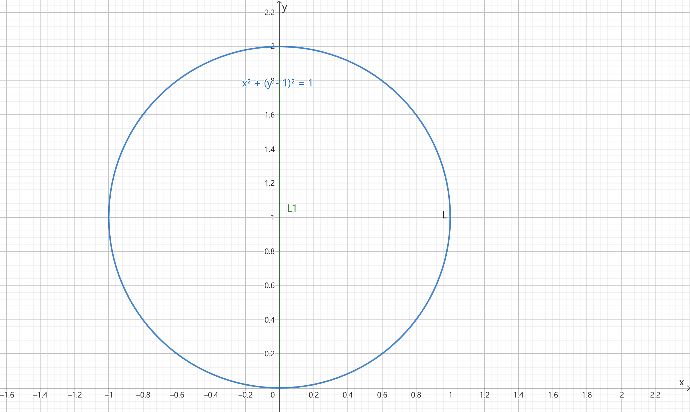

    解：$L'=L+l$

    $$
    \begin{align*}
    &\int_{L'}(x^3-e^x\cos y)\mathrm dx + (e^x\sin y+4x)\mathrm dy\\
    &=-\iint_D [e^x\sin y+4+e^x-\sin y)]\mathrm dx \mathrm dy\\
    &=-4\iint_D \mathrm dx \mathrm dy \\
    &=-4\cdot \dfrac{1}{2}\cdot \pi \cdot 1^2\\
    &=-2\pi
    \end{align*}
    $$

    $l:x=0, y:0\to 2$

    $\int_l = \int_0^2 \sin y \mathrm dy = 1-\cos 2$

    $I=-2\pi -(1-\cos 2)=-2\pi + \cos 2 - 1$

3. $I=\int_L x \mathrm dy$，$L:x^2+y^2=1$ 且 $x\ge 0,y\ge 0$，顺时针

    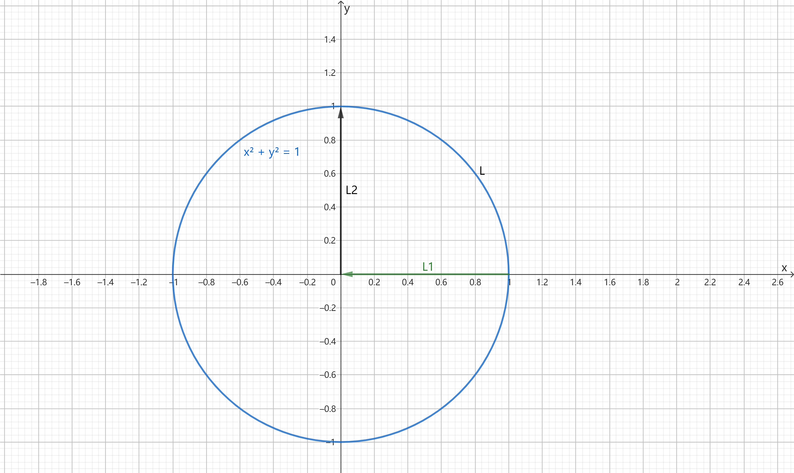

    解：添加 $l_1$、$l_2$，构成封闭 $L'=L+l_1+l_2$，反向

    $\int_{L'}x \mathrm dy = -\iint_D(1-0)\mathrm dx \mathrm dy=-\dfrac{1}{4}\pi$

    $\int_{l_2} x \mathrm dy = \int_0^1 0 \mathrm dy=0$

    $\int_{l_1} x \mathrm dy = \int_0^1 x\cdot 0 \mathrm dx = 0$

    $\therefore I=-\dfrac{1}{4}\pi$

4. $I=\int_L(2x\cos y-y^2\sin x)\mathrm dx + (2y\cos x-x^2\sin y)\mathrm dy$，$L:y=x^2 (0,0)\to (1,1)$

    解：
    * 【法一】$I=\int_0^1 [(2x\cos x^2 - x^4\sin x)\cdot 1+(2x^2\cos x-x^2 \sin x^2)\cdot 2x]\mathrm dx = 2\cos 1$
    * 【法二】

        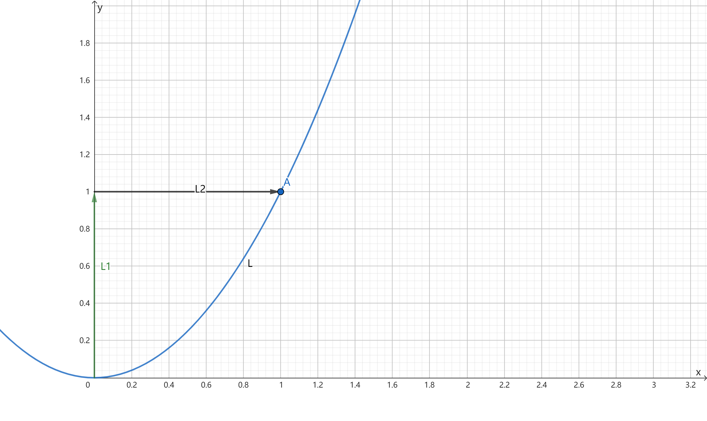

        $\because \dfrac{\partial P}{\partial y}=-2x\sin y-2y\sin x=\dfrac{\partial Q}{\partial x}$

        $\therefore I$ 与路径无关

        $$
        \begin{align*}
        I&=I_{l_1}+I_{l_2}\\
        &=\int_0^1 (2y\cos 0-0^2\sin y)\mathrm dy + \int_0^1 (2x\cos 1-1^2\sin x)\mathrm dx\\
        &=1+2\cos 1-1\\
        &=2\cos 1
        \end{align*}
        $$

        （其中 $l_1:x=0,y:0\to 1$，$l_2:y=1,x:0\to 1$）

    * 【法三】

        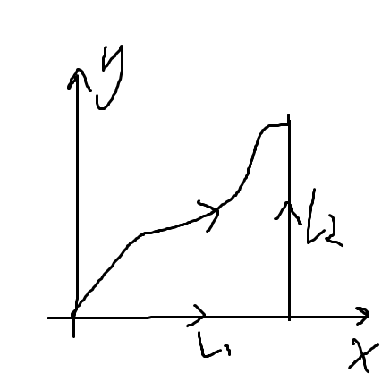

        $P=2x\cos y -y^2\sin x=\dfrac{\partial u}{\partial x}$

        $u=\int(2x\cos y-y^2\sin x)\mathrm dx=x^2\cos y +y^2\cos x+\phi(y)$

        $\dfrac{\partial u}{\partial y}=2y\cos x-x^2\sin y\Rightarrow \phi(y)=C$

        $\therefore u(x,y)=x^2\cos y+y^2\cos x+C$

        $I=u(1,1)-u(0,0)=\cos 1+\cos 1=2\cos 1$

5. $I=\int_L \dfrac{y \mathrm dx - x\mathrm dy}{x^2+y^2}$，$L:x^2+y^2=1$ 且 $y\ge 0$，$(-1,0)\to (1,0)$

    解：
    * 【法一】

        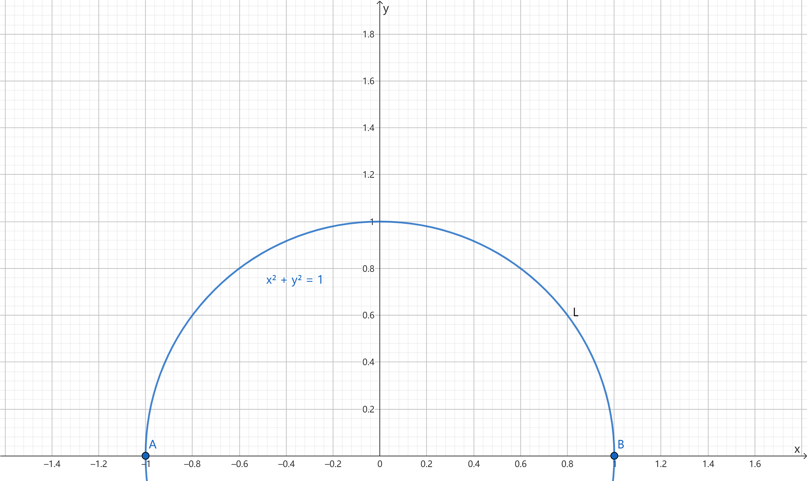

        $L:\begin{cases}x=\cos t\\y=\sin t\end{cases}, t:\pi\to 0$

        $\displaystyle I=\int_\pi^0[\sin t(-\sin t)-\cos t\cdot \cos t]\mathrm dt=-1\int_\pi^0 \mathrm dt = \pi$

    * 【法二】

        $P=\dfrac{y}{x^2+y^2}$，$Q=-\dfrac{x}{x^2+y^2}$，$\dfrac{\partial Q}{\partial x}=\dfrac{x^2-y^2}{(x^2+y^2)^2}=\dfrac{\partial P}{\partial y}$

        $\therefore$ 积分与路径无关

        选择$L:(-1,0)\to(-1,1)\to(1,1)\to(1,0)$【不能包含 $(0,0)$—— $(0,0)$ 处无定义】

        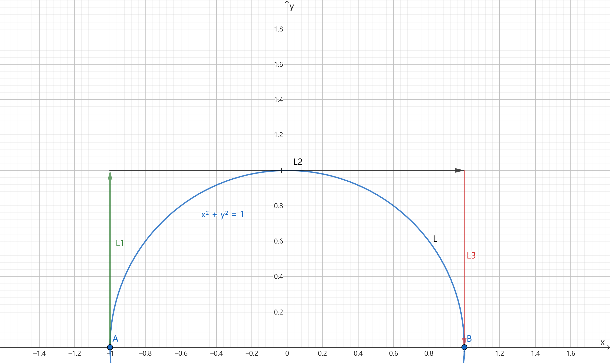

        $l_1: y:0\to 1, x=-1$，$I_{l_1}=\int_0^1\dfrac{1}{1+y^2}\cdot 1 \mathrm dy = \arctan y|_0^1=\dfrac{\pi}{2}$

        $l_2:x:-1\to 1, y=1$，$I_{l_2}=\int_{-1}^1\dfrac{1}{1+x^2}\cdot 1 \mathrm dx=\arctan x|_{-1}^1=0$

        $l_3:y:1\to 0, x=1$，$I_{l_3}=\int_1^0 \dfrac{-1}{1+y^2}\cdot 1 \mathrm dy=\dfrac{\pi}{2}$

        $I=\dfrac{\pi}{2}+\dfrac{\pi}{2}=\pi$

    * 【法三】

        $I=\int_L y \mathrm dx-x \mathrm dy$，添加 $y=0, x:1\to -1$

        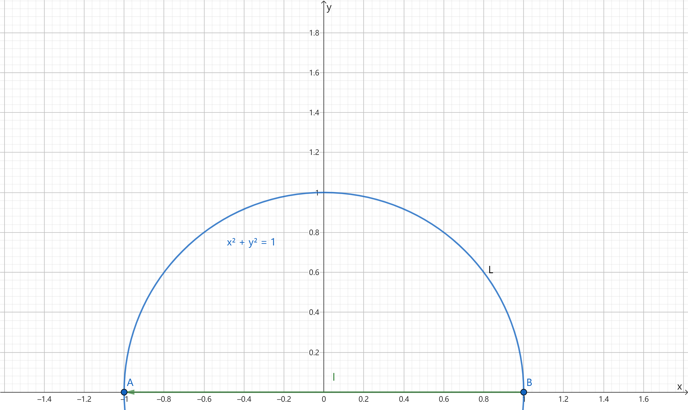

        封闭 $L'=L+l$，负向

        $\oint_L' y \mathrm dx - x \mathrm dy=-\iint_D[(-1)-1]\mathrm dx \mathrm dy=2\iint_D \mathrm dx \mathrm dy=\pi$

        $\displaystyle I=\pi-\int_L (y \mathrm dx-x \mathrm dy)=\pi - \int_{1}^{-1}0 \mathrm dx = \pi$

6. $I=\oint_L \dfrac{y \mathrm dx - x\mathrm dy}{x^2+y^2}$，L正向且不包含 $(0,0)$

    解：

    $P=\dfrac{y}{x^2+y^2}$，$Q=-\dfrac{x}{x^2+y^2}$ 在 $(0,0)$ 处无定义，$\dfrac{\partial Q}{\partial x}=\dfrac{\partial P}{\partial y}\quad (x,y)\ne(0,0)$

    * L 包含原点：$I=0$
    * L 不包含原点：设 $l$ 为正向足够小的圆（$x^2+y^2=\epsilon^2$）$I=\oint_L \dfrac{y \mathrm dx-x \mathrm dy}{x^2+y^2}=\dfrac{1}{\epsilon^2}\oint_L y \mathrm dx - x \mathrm dy=\dfrac{1}{\epsilon^2}\cdot (-2)\pi\epsilon^2=-2\pi$

7. $I=\int_L \dfrac{-y \mathrm dx + (x-1)\mathrm dy}{(x-1)^2+y^2}$，$L:y=x^2-2x$，$(0,0)\to (4,8)$

解：

* 【折线法】

    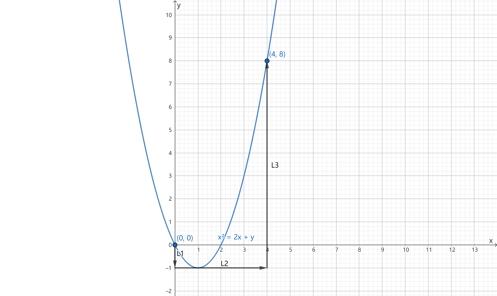

    $P=-\dfrac{y}{(x-1)^2+y^2}$，$Q=\dfrac{x-1}{(x-1)^2+y^2}$

    $\dfrac{\partial P}{\partial y}=\dfrac{\partial Q}{\partial x}=-\dfrac{1}{(x-1)^2+y^2}\quad(x,y)\ne(1,0)$

    选择 $(0,0)\to(0,-1)\to(4,-1)\to(4,8)$

    $l_1:(0,0)\to(0,-1)\quad x=0\quad y:0\to-1$，$I_{l_1}=\int_0^{-1}\dfrac{-1}{y^2+1}\mathrm dy=\dfrac{\pi}{4}$

    $l_2:y=-1\quad x:0\to 4$，$I_{l_2}=\int_0^4\dfrac{1}{1+(x-1)^2}\mathrm dx=\arctan 3+\dfrac{\pi}{4}$

    $l_3:x=4\quad y:-1\to 8$，$I_{l_3}=\int_{-1}^3\dfrac{3}{3^2+y^2}\mathrm dy=\dfrac{1}{3}\int_{-1}^8\dfrac{1}{1+(\frac{y}{3})^2}\mathrm dy=\dfrac{1}{3}\times 3\int_{-1}^8\dfrac{1}{1+(\frac{y}{3})^2}\mathrm d(\dfrac{y}{3})=\arctan\dfrac{8}{3}+\arctan\dfrac{1}{3}$

    $I=I_{l_1}+I_{l_2}+I_{l_3}=\dfrac{\pi}{2}+\arctan 3+\arctan\dfrac{8}{3}+\arctan\dfrac{1}{3}$

* $L'=l_1+l_2+L$，$l_3:(x-1)^2+y^2=\epsilon^2$（逆时针，$\epsilon$ 足够小）

    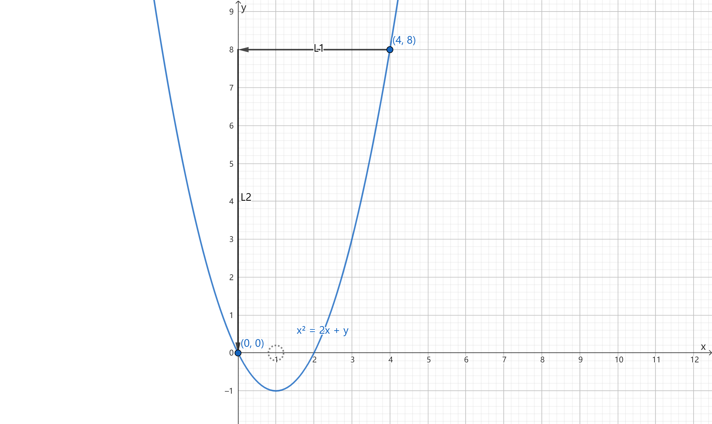

    $$
    \begin{align*}
    \oint_{L'}P \mathrm dx+Q \mathrm dy&=\oint_{l_3}P \mathrm dx+Q \mathrm dy\\
    &=\dfrac{1}{\epsilon ^2}\oint_{l_3}-y \mathrm dx + (x-1)\mathrm dy\\
    &=\dfrac{1}{\epsilon ^2}\iint_D[1-(-1)]\mathrm dx \mathrm dy\\
    &=2\pi
    \end{align*}
    $$

    $$
    \begin{align*}
    &\oint_{l_1}P \mathrm dx+Q \mathrm dy\\
    &=\int_4^0\dfrac{-8}{(x-1)^2+8^2}\mathrm dx\\
    &=\arctan \dfrac{x-1}{8}|_0^4\\
    &=\arctan\dfrac{3}{8}+\arctan\dfrac{1}{8}
    \end{align*}
    $$

    $$
    \begin{align*}
    &\oint_{l_2}P \mathrm dx+Q \mathrm dy\\
    &=\int_8^0\dfrac{1}{1+y^2}\mathrm dy\\
    &=\arctan y|_0^8\\
    &=\arctan 8
    \end{align*}
    $$

    $I=2\pi-\arctan\dfrac{3}{8}-\arctan\dfrac{1}{8}-\arctan 8$
