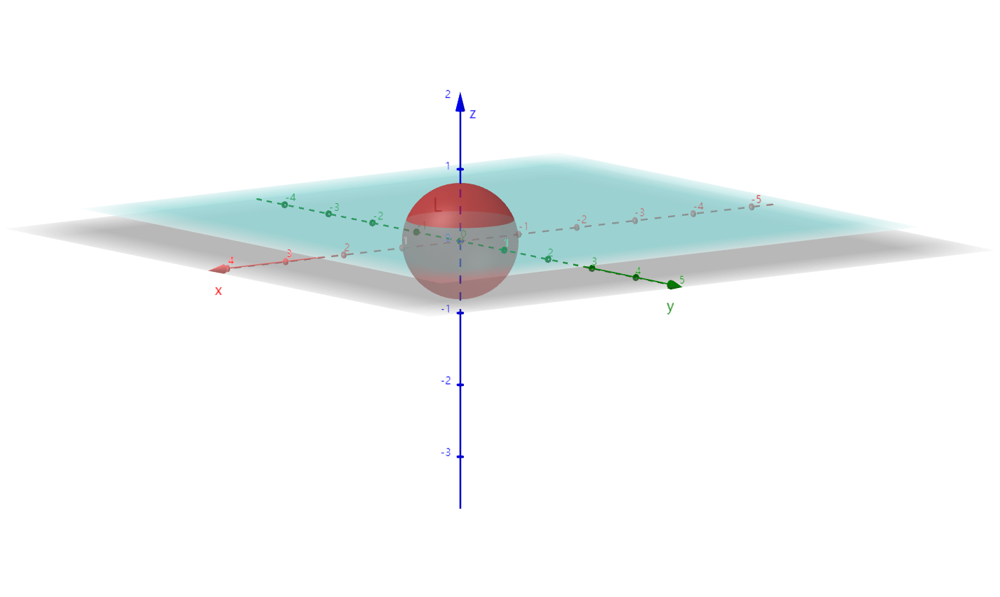

# $\S10.4$ 对面积的曲面积分（I类）

引例：曲面形状物体的质量：$M=\mu \cdot S$

$$
\begin{align*}
f(x,y,z)=\lim_{\lambda \to 0}f(\xi_i,\eta_i,\zeta_i)\Delta S_i=M
\end{align*}
$$

## 一、定义

$\Sigma$ 是分段光滑的空间曲面，$f(x,y,z)$ 在 $\Sigma$ 上有界。

* 任意分割 $\Delta S_i$
* 任意取点 $(\xi_i,\eta_i,\zeta_i)$

若 $\lim_{\lambda \to 0}\sum_{i=1}^nf(\xi_i,\eta_i,\zeta_i)\Delta S_i$ 存在，则称此式为 $f(x,y,z)$ 在 $\Sigma$ 上的曲面积分（I类曲面积分）

记为 $\iint_\Sigma f(x,y,z)\mathrm dS$

$f(x,y,z)=1$ 时，$\iint_\Sigma 1\cdot \mathrm dS=S$（空间曲面 $\Sigma$ 的面积）

## 二、性质

* 线性
    $$
    \begin{align*}
    \iint_\Sigma af(x,y,z)+bg(x,y,z)\mathrm dS=a\iint_\Sigma f(x,y,z)\mathrm dS+b\iint_\Sigma g(x,y,z)\mathrm dS
    \end{align*}
    $$
* 可加性

    $$
    \begin{align*}
    \because \Sigma &= \Sigma_1+\Sigma_2\\
    \therefore \iint_\Sigma f(x,y,z)\mathrm dS&=\iint_{\Sigma_1}f(x,y,z)\mathrm dS+\iint_{\Sigma_2}f(x,y,z)\mathrm dS
    \end{align*}
    $$

* 对称性

    - $\Sigma$ 关于 $xOy$ 面对称，$\Sigma_上$、$\Sigma_下$
        $$
        \begin{align*}
        \iint_\Sigma f \mathrm dS=\begin{cases}2\iint_{\Sigma_上}\mathrm dS\quad &f(x,y,z)=f(x,y,-z)\\
        0\quad &f(x,y,z)=-f(x,y,-z)\end{cases}
        \end{align*}
        $$
    - $\Sigma$ 关于 $yOz$ 面对称，$\Sigma_前$、$\Sigma_后$
        $$
        \begin{align*}
        \iint_\Sigma f \mathrm dS=\begin{cases}2\iint_{\Sigma_前}\mathrm dS\quad &f(x,y,z)=f(-x,y,z)\\
        0\quad &f(x,y,z)=-f(-x,y,z)\end{cases}
        \end{align*}
        $$
    - $\Sigma$ 关于 $xOz$ 面对称，$\Sigma_左$、$\Sigma_右$
        $$
        \begin{align*}
        \iint_\Sigma f \mathrm dS=\begin{cases}2\iint_{\Sigma_右}\mathrm dS\quad &f(x,y,z)=f(x,-y,z)\\
        0\quad &f(x,y,z)=-f(x,-y,z)\end{cases}
        \end{align*}
        $$

> 轮换对称性
>
> $\Sigma:x^2+y^2+z^2=R^2$（球面）
> $\iint_\Sigma x^2 \mathrm dS=\iint_\Sigma y^2 \mathrm dS=\iint_\Sigma z^2 \mathrm dS=\dfrac{1}{3}\iint_\Sigma(x^2+y^2+z^2)\mathrm dS=\dfrac{R^2}{3}\iint_\Sigma \mathrm dS=\dfrac{R^2}{3}4\pi R^2$

## 三、计算

> 转化为二重积分

定理：$\Sigma$ 分段光滑，$z=z(x,y)\quad (x,y)\in D_{xy}$，$D_{xy}$ 是 $\Sigma$ 在 $xOy$ 面上的投影，$f(x,y,z)$ 在 $\Sigma$ 上连续。

$$
\begin{align*}
\iint_\Sigma f(x,y,z)\mathrm dS=\iint_{D_{xy}}f(x,y,z(x,y))\sqrt{1+z_x^2+z_y^2}\mathrm dx \mathrm dy
\end{align*}
$$

$\Sigma: x=x(y,z)\quad (y,z)\in D_{yz}$：

$$
\begin{align*}
\iint_\Sigma f(x,y,z)\mathrm dS=\iint_{D_{yz}}f(x(y,z),y,z)\sqrt{1+x_y^2+x_z^2}\mathrm dy \mathrm dz
\end{align*}
$$

$\Sigma: y=y(z,x)\quad (z,x)\in D_{zx}$：

$$
\begin{align*}
\iint_\Sigma f(x,y,z)\mathrm dS=\iint_{D_{xy}}f(x,y(z,x),z)\sqrt{1+y_x^2+y_z^2}\mathrm dz \mathrm dx
\end{align*}
$$

### 空间曲面的形心

$(x,y,z)$ 落在对称面上（若存在）

* $\bar{x}=\dfrac{\iint_\Sigma x \mathrm dS}{S}$，$\iint_\Sigma x \mathrm dS=\bar{x}S$
* $\bar{y}=\dfrac{\iint_\Sigma y \mathrm dS}{S}$，$\iint_\Sigma y \mathrm dS=\bar{y}S$
* $\bar{z}=\dfrac{\iint_\Sigma z \mathrm dS}{S}$，$\iint_\Sigma z \mathrm dS=\bar{z}S$

## 例题

1. $I=\iint_\Sigma (x+z)\mathrm dS$，$\Sigma: x^2+y^2+z^2=R^2(R\gt 0)$ 位于 $z=a(a\gt 0)$ 以上的部分

    

    解：$z=\sqrt{R^2-x^2-y^2}\quad(x,y)\in D_{xy}$，$D_{xy}:x^2+y^2\le R^2-a^2$

    $z_x=\dfrac{x}{\sqrt{R^2-x^2-y^2}}$

    $z_y=-\dfrac{y}{\sqrt{R^2-x^2-y^2}}$

    $$
    \begin{align*}
    I&=\iint_{D_{xy}}(x+\sqrt{R^2-x^2-y^2})\dfrac{R}{\sqrt{R^2-x^2-y^2}}\mathrm dx \mathrm dy\\
    &=\iint_{D_{xy}}\dfrac{R_x}{\sqrt{R^2-x^2-y^2}}+R\iint_{D_{xy}}\mathrm dx \mathrm dy\\
    &=R\cdot \pi(R^2-a^2)
    \end{align*}
    $$

2. $I=\iint_\Sigma (x^2+y^2)\mathrm dS$，$\Sigma: x^2+y^2+z^2=2(x+y+z)$

    解：$\Sigma$ 具有轮换对称性，$(x-1)^2+(y-1)^2+(z-1)^2=3$

    $$
    \begin{align*}
    I&=\dfrac{2}{3}\iint_\Sigma (x^2+y^2+z^2)\mathrm dS\\
    &=\dfrac{4}{3}\iint_\Sigma (x+y+z)\mathrm dS\\
    &=\dfrac{4}{3}(\bar{x}+\bar{y}+\bar{z})\cdot 4\pi r^2\\
    &=\dfrac{4}{3}\times (1+1+1)\times 4\pi \times 3\\
    &=48\pi
    \end{align*}
    $$
