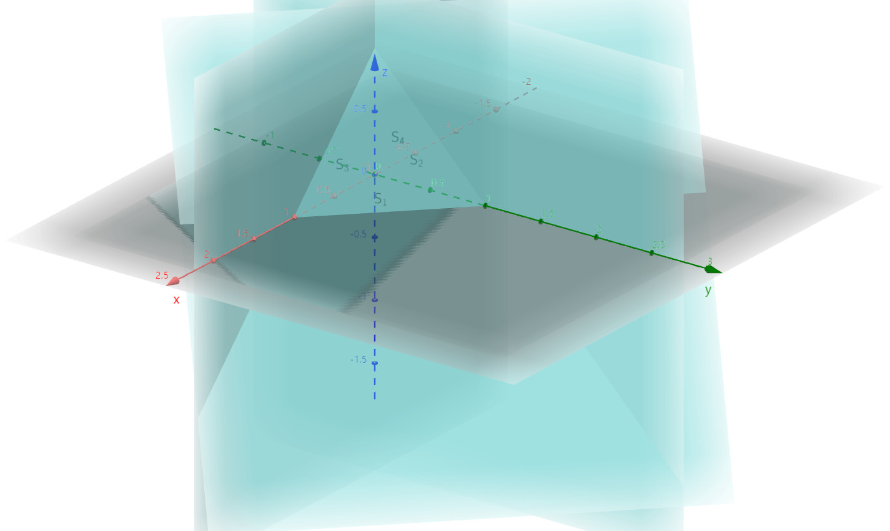
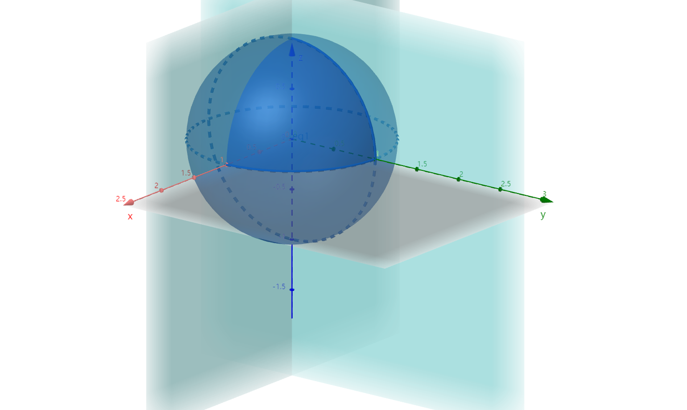

# $\S10.5$ 对坐标的曲面积分（II类）

$F(x,y,z)=0$，$\vec{n}=(F_x,F_y,F_z)$，$\vec{n}^0=\dfrac{1}{\sqrt{F_x^2+F_y^2+F_z^2}}(F_x,F_y,F_z)=(\cos\alpha,\cos\beta,\cos\gamma)$

* 上侧：$\cos\gamma \ge 0$，下侧：$\cos\gamma \le 0$
* 前侧：$\cos\alpha \ge 0$，后侧：$\cos\alpha \le 0$
* 左侧：$\cos\beta \le 0$，右侧：$\cos\beta \ge 0$

定义：有向曲面的投影

有效 $\Sigma$：$z=z(x,y)$ 上任取 $\Delta S$ 在 $xOy$ 面上的投影 $(\Delta S)xy$

$$
\begin{align*}
(\Delta S)_{xy}=\begin{cases}
\Delta \delta\quad \cos \gamma \gt 0\\
0 \quad \cos \gamma =0\\
-\Delta \delta \quad \cos \gamma \lt 0\\
\end{cases}
\end{align*}
$$

引例：$\rho=1$，$\vec{v}=(P,Q,R)$，计算在单位时间内通过有向 $\Sigma$ 的流体质量

$$
\begin{align*}
\vec{v}&=P\vec{i}+Q\vec{j}+R\vec{k}\\
\vec{n}^0&=\cos\alpha_i\vec{i}+\cos\beta_i\vec{j}+\cos\gamma_i\vec{k}
\end{align*}
$$

$$
\begin{align*}
m&=\rho\cdot v=\rho S|\vec{v}|=S\cdot \vec{v}\cdot \vec{n}^0\\
&\approx \sum_{i=1}^nv_i\cdot n_i\Delta s_i\\
&=\sum_{i=1}^n(P\cos \alpha_i+Q\cos\beta_i+R\cos\gamma_i)\Delta s_i\\
&=\sum_{i=1}^n[P(\xi_i,\eta_i,\zeta_i)(\Delta S_i)_{yz}+Q(\xi_i,\eta_i,\zeta_i)(\Delta S_i)_{zx}+R(\xi_i,\eta_i,\zeta_i)(\Delta S_i)_{xy}]
\end{align*}
$$

## 一、定义

$\Sigma$ 有向，P、Q、R在 $\Sigma$ 上有界
* 对 $\Sigma$ 进行任意分割 $\Delta S_i$
* 任意取点 $(\xi_i,\eta_i,\zeta_i)$

若 $\lim_{\lambda \to 0}\sum_{i=1}^n (P_i\cos\alpha_i +Q_i\cos\beta_i+R_i\cos\gamma_i)\Delta S_i$ 存在，则称之为 $\vec{A}=(P,Q,R)$ 在有向 $\Sigma$ 上对坐标的曲面积分（II类），记作

$$
\begin{align*}
\iint_\Sigma P(x,y,z)\mathrm dy \mathrm dz+Q(x,y,z)\mathrm dz \mathrm dx+R(x,y,z)\mathrm dx \mathrm dy
\end{align*}
$$

## 二、性质
* 线性

    $$
    \begin{align*}
    \iint_\Sigma a_1 P_1(x,y,z)+a_2P_2(x,y,z) \mathrm dy \mathrm dz = a_1\iint_\Sigma P_1(x,y,z)\mathrm dy \mathrm dz + a_2\iint_\Sigma P_2(x,y,z) \mathrm dy \mathrm dz
    \end{align*}
    $$

* 可加性

    $$
    \begin{align*}
    \because \Sigma &= \Sigma_1+\Sigma_2\\
    \therefore \iint_\Sigma P \mathrm dy \mathrm dz &= \iint_{\Sigma_1}P \mathrm dy \mathrm dz + \iint_{\Sigma_2}P \mathrm dy \mathrm dz
    \end{align*}
    $$

* 有向性 $\iint_{\Sigma^-}P \mathrm dy \mathrm dz = -\iint_\Sigma P \mathrm dy \mathrm dz$

## 三、计算

> 转化为二重积分

* $\iint_\Sigma R(x,y,z)\mathrm dx \mathrm dy=\pm\iint_{D_{xy}}R(x,y,z(x,y))\mathrm dx \mathrm dy$，上侧取+，下侧取-。
* $\iint_\Sigma R(x,y,z)\mathrm dy \mathrm dz=\pm\iint_{D_{yz}}R(x(y,z),y,z\mathrm dy \mathrm dz$，前侧取+，后侧取-。
* $\iint_\Sigma R(x,y,z)\mathrm dz \mathrm dx=\pm\iint_{D_{zx}}R(x,y(y,z),z\mathrm dz \mathrm dx$，左侧取+，右侧取-。

## 例题
1. $I=\iint_\Sigma (x+1)\mathrm dy \mathrm dz+y \mathrm dz \mathrm dx+1 \mathrm dx \mathrm dy$，$\Sigma:x+y+z=1$ 与三个坐标面所围成的外侧

    

    解：$\Sigma = \Sigma_1(z=0, (x,y)\in D_{xy})+\Sigma_2(x=0, (y,z) \in D_{yz})+\Sigma_3(y=0, (x,z)\in D_{zx})+\Sigma_4(x+y+z=1)$

    $I_1=0+0+\iint_{\Sigma_1}1 \mathrm dx \mathrm dy=-\iint_{D_{xy}}\mathrm dx \mathrm dy=-\dfrac{1}{2}$

    $I_2=\iint_{\Sigma_2}(x+1)\mathrm dy \mathrm dz=-\iint_{D_{yz}}(0+1)\mathrm dy \mathrm dz=-\dfrac{1}{2}$

    $I_3=\iint_{\Sigma_3}y \mathrm dz \mathrm dx=-\iint_{D_{zx}}0 \mathrm dz \mathrm dx =0$

    $I_4=\iint_{\Sigma_4}(x+1)\mathrm dy \mathrm dz+\iint_{\Sigma_4}y \mathrm dz \mathrm dx+\iint_{\Sigma_4}\mathrm dx \mathrm dy=\iint_{D_{yz}}(2-y-z)\mathrm dy \mathrm dz+\iint_{D_{zx}}(1-x-z)\mathrm dz \mathrm dx+\iint_{D_{xy}}1 \mathrm dx \mathrm dy=\dfrac{2}{3}+\dfrac{1}{6}+\dfrac{1}{2}=\dfrac{4}{3}$

    $I=-\dfrac{1}{2}-\dfrac{1}{2}+0+\dfrac{4}{3}=\dfrac{1}{3}$

2. $I=\iint_\Sigma xyz \mathrm dx \mathrm dy$，$\Sigma:x^2+y^2+z^2=1$ 的外侧（$x\ge 0$ 且 $y\ge 0$

    

    解：$z=\pm\sqrt{1-x^2-y^2}$，$D_{xy}:x^2+y^2\le 1$（$x\ge 0$ 且 $y\ge 0$）

    $$
    \begin{align*}
    I&=\iint_{\Sigma_上} xyz \mathrm dx \mathrm dy+\iint_{\Sigma_下} xyz \mathrm dx \mathrm dy\\
    &=+\iint_{D_{xy}}xy\sqrt{1-x^2-y^2}\mathrm dx \mathrm dy+[-\iint_{D_{xy}}xy\sqrt{1-x^2-y^2}\mathrm dx \mathrm dy]\\
    &=2\iint_{D_{xy}}xy\sqrt{1-x^2-y^2}\mathrm dx \mathrm dy=\dfrac{2}{15}
    \end{align*}
    $$

## 两类曲面积分的联系

$\iint_\Sigma P \mathrm dy \mathrm dz+Q \mathrm dz \mathrm dx+R \mathrm dx \mathrm dy = \pm \iint_{D_{xy}}[P(-f_x)+Q(-f_y)+R] \mathrm dx \mathrm dy$（上侧+，下侧-）

* $\Sigma: z=f(x,y)$，$\vec{n}=(-f_x,-f_y,1)$（上）或 $(f_x,f_y,-1)$（下）

$\Sigma: y=g(z,x)$
* $\vec{n}=(-g_x,1,-g_z)$
* $\iint_\Sigma P \mathrm dy \mathrm dz+Q \mathrm dz \mathrm dx+R \mathrm dx \mathrm dy = \pm \iint_{D_{zx}}[P(-g_x)+Q+R(-g_z)] \mathrm dz \mathrm dx$（左侧-，右侧+）

$\Sigma: x=h(y,z)$
* $\vec{n}=(1,-h_y,-h_z)$
* $\iint_\Sigma P \mathrm dy \mathrm dz+Q \mathrm dz \mathrm dx+R \mathrm dx \mathrm dy = \pm \iint_{D_{yz}}[P+Q(-h_y)+R(-h_z)] \mathrm dy \mathrm dz$（左侧-，右侧+）

### 例题

求 $I=\iint_\Sigma(f+x)\mathrm dy \mathrm dz+(2f+y)\mathrm dz \mathrm dx+(f+z)\mathrm dx \mathrm dy$，$\Sigma: x-y+z=1$ 在第四卦限的上侧，f为与x、y、z有关的函数。

解：原式=$+\iint_{D_{xy}}(f+x)\cdot 1-(2f+y)+(f+z)\mathrm dx \mathrm dy=\iint_{D_{xy}}(x-y+1-x+y)\mathrm dx \mathrm dy=\iint_{D_{xy}}1 \mathrm dx \mathrm dy=\dfrac{1}{2}$
