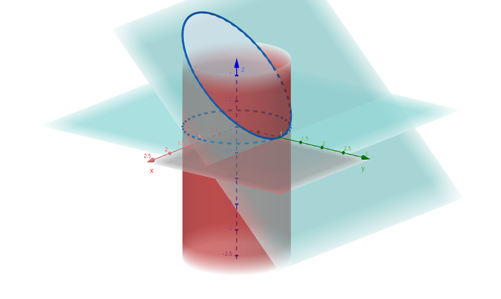

# $\S10.6$ 高斯公式

> 第 II 类曲面积分 → 三重积分

## 定理

* $\Omega$ 单连通
* $\Sigma$ 封闭
* P、Q、R一阶偏导连续

则 $\oint_\Sigma P \mathrm dy \mathrm dz + Q \mathrm dz \mathrm dx+R \mathrm dx \mathrm dy=\pm \iiint_\Omega(\dfrac{\partial P}{\partial x}+\dfrac{\partial Q}{\partial y}+\dfrac{\partial R}{\partial z})\mathrm dv$（外+内-）

### 推广

* $\Omega$ 复联通
* $\Sigma_外$：方向指向外侧；$\Sigma_内$：方向指向内侧
* P、Q、R偏导连续

则 $\oint_{\Sigma_内+\Sigma_外}P \mathrm dy \mathrm dz + Q \mathrm dz \mathrm dx+R \mathrm dx \mathrm dy=\iiint_\Omega(\dfrac{\partial P}{\partial x}+\dfrac{\partial Q}{\partial y}+\dfrac{\partial R}{\partial z})\mathrm dv$

* $\Sigma \perp xOy\Rightarrow \iint_\Sigma R \mathrm dx \mathrm dy=0$
* $\Sigma \perp yOz\Rightarrow \iint_\Sigma P \mathrm dy \mathrm dz=0$
* $\Sigma \perp zOx\Rightarrow \iint_\Sigma Q \mathrm dz \mathrm dx=0$

## 例题

1. $I=\iint_\Sigma x \mathrm dy \mathrm dz+y \mathrm dz \mathrm dx + z \mathrm dx \mathrm dy$

    * $\Sigma: x^2+y^2=1,z=0,z=3$ 所围外侧

        解：$I=\iint_\Omega(1+1+1) \mathrm dv=3\iiint\Omega \mathrm dv=3\times \pi \times 1^2 \times 3=9\pi$

    * $\Sigma: x^2+y^2=1$ 被 $z=0$ 和 $z=3$ 所截外侧

        解：添加 $\Sigma_上:z=e, 0\le x^2+y^2\le 1$ 上侧，$\Sigma_下:z=0, 0\le x^2+y^2\le 1$ 下侧

        $\Sigma'=\Sigma_上+\Sigma_下+\Sigma$，$I_\Sigma'=9\pi$

        $I_{\Sigma_1}=\iint_{\Sigma_1}z \mathrm dx \mathrm dy=3\iint_{\Sigma_1}\mathrm dx \mathrm dy=3\iint_{D_{xy}}\mathrm dx \mathrm dy=3\pi$

        $I_{\Sigma_2}=\iint_{\Sigma_2}z \mathrm dx \mathrm dy=0$

        $I=9\pi-3\pi=6\pi$

2. $I=\iint_\Sigma(2z^2+xy)\mathrm dy \mathrm dz+(x^2-yz)\mathrm dx \mathrm dy$，$\Sigma: x^2+y^2=1$ 被 $z=0$ 和 $y+z=1$ 所截

    

    解：添加 $\Sigma_上:y+z=1$ 上侧，$\Sigma_下:z=0$

    $\Sigma'=\Sigma+\Sigma_上+\Sigma_下$

    $I_{\Sigma'}=\iiint_\Omega[y+(-y)]\mathrm dv=0$

    $$
    \begin{align*}
    I_{\Sigma_上}&=+\iint_{D_{xy}}(P\cdot 0+Q\cdot 1+R\cdot 1)\mathrm dx \mathrm dy\\
    &=\iint_{D_{xy}}[x^2-y(1-y)]\mathrm dx \mathrm dy\\
    &=\iint_{D_{xy}}(x^2+y^2-y)\mathrm dx \mathrm dy\\
    &=\iint_{D_{xy}}(x^2+y^2) \mathrm dx \mathrm dy + 0\\
    &=(\int_0^{2\pi}\mathrm d\theta)(\int_0^1 \rho^2 \cdot \rho \mathrm d\rho)\\
    &=\dfrac{\pi}{2}\\
    (&D_{xy}: x^2+y^2\le 1)
    \end{align*}
    $$

    $$
    \begin{align*}
    I_{\Sigma_下}&=\iint_{\Sigma_下}(x^2-yz)\mathrm dx \mathrm dy\\
    &=\iint_{\Sigma_下}x^2 \mathrm dx \mathrm dy\\
    &=-\iint_{D_{xy}}x^2 \mathrm dx \mathrm dy\\
    &=-\dfrac{\pi}{4}
    \end{align*}
    $$

    $I=0-\dfrac{\pi}{2}-(-\dfrac{\pi}{4})=-\dfrac{\pi}{4}$

3. 计算 $I=\iint_\Sigma y\ln r \mathrm dy \mathrm dz-x\ln r \mathrm dz \mathrm dx + z \mathrm dx \mathrm dy$，$r=\sqrt{x^2+y^2+z^2}$，$\Sigma: \dfrac{x^2}{a^2}+\dfrac{y^2}{b^2}+\dfrac{z^2}{c^2}=1\quad(a,b,c\gt 0)$ 外侧

    解：添加 $\Sigma_内: x^2+y^2+z^2=\epsilon^2$（$\epsilon$ 足够小）内侧

    $$
    \begin{align*}
    &\iint_{\Sigma+\Sigma_内}y\ln r \mathrm dy \mathrm dz-x\ln r \mathrm dz \mathrm dx + z \mathrm dx \mathrm dy\\
    &=\iiint_\Omega (\dfrac{\partial P}{\partial x}+\dfrac{\partial Q}{\partial y}+\dfrac{\partial R}{\partial z})\mathrm dv\\
    &=\iiint_\Omega[y\cdot \dfrac{1}{r}\cdot \dfrac{x}{r}+(-x)\cdot \dfrac{1}{r}\cdot \dfrac{y}{r}+1] \mathrm dx \mathrm dy \mathrm dz\\
    &=\iiint_\Omega \mathrm dx \mathrm dy \mathrm dz\\
    &=\dfrac{4}{3}\pi abc - \dfrac{4}{3}\pi \epsilon^3
    \end{align*}
    $$

    $$
    \begin{align*}
    I_{\Sigma_内}&=\iint_{\Sigma_内}y \ln \epsilon \mathrm dy \mathrm dz-x\ln \epsilon \mathrm dz \mathrm dx+z \mathrm dx \mathrm dy\\
    &=-\iiint_\Omega (0+0+1) \mathrm dx \mathrm dy \mathrm dz\\
    &=-\dfrac{4}{3}\pi \epsilon ^3
    \end{align*}
    $$

    $\therefore I=\dfrac{4}{3}\pi abc$

> 散度（标量）$\vec{A}=(P,Q,R)$，$\mathrm {div} \vec{A}=\dfrac{\partial P}{\partial x}+\dfrac{\partial Q}{\partial y}+\dfrac{\partial R}{\partial z}$
>
> 如 $u=x^2+y^z+z^2$，求 $\mathrm {div} (\mathrm {grad} u)$
>
> 解：
>
> $\mathrm {grad} u=(2x, 2y, 2z)$，原式 $=2+2+2=6$
