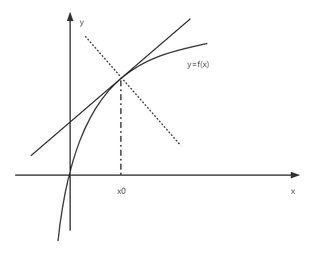

# $\S 2.1$ 导数的概念

> 引例：曲线的切线在 $xOy$ 平面上，$y=f(x)$ 在 $P(x_0,y_0)$ 的切线
> 
> $P'(x_1,y_1)$，$PP'$ 割线，$P'$ 尽量接近于$P$
> $k'=\dfrac{y_1-y_0}{x_1-x_0}=\dfrac{\Delta y}{\Delta x}$
>
> $k=\displaystyle \lim_{\Delta x\to 0}\dfrac{\Delta y}{\Delta x}$（0/0型）

## 一、导数的定义

* $f(x)$ 在 $U(x_0)$ 有定义，若满足 $\displaystyle \lim_{\Delta x\to 0}\dfrac{\Delta y}{\Delta x}=\lim_{\Delta x \to 0}\dfrac{f(x_0+\Delta x)-f(x_0)}{\Delta x}$ 存在，则称 $y=f(x)$ 在点 $x_0$ 可导，记作 $f'(x_0)$，否则，称$f(x)$ 在 $x_0$ 不可导

$$
\begin{align*}
f'(x_0)&=\lim_{\Delta x\to 0}\dfrac{f(x_0+\Delta x)-f(x_0)}{\Delta x}\\
&=\lim_{h \to 0}\dfrac{f(x_0+h)-f(x_0)}{h}\\
&=\lim_{x \to x_0}\dfrac{f(x)-f(x_0)}{x-x_0}
\end{align*}
$$

* 也常记为 $\dfrac{\mathrm{d} y}{\mathrm{d} x} |_{x=x_0}$ 或 $\dfrac{\mathrm{d} f}{\mathrm{d} x} |_{x=x_0}$（导数/微商）

> 例：假设 $f'(x_0)$ 存在，计算
>
> 1. $\displaystyle \lim_{h\to 0}\dfrac{f(x_0-h)-f(x_0)}{h}=-\lim_{h\to 0}\dfrac{f[x_0+(-h)]-f(x_0)}{-h}=-f'(x_0)$
> 2. $\displaystyle \lim_{h\to 0}\dfrac{f(x_0-h)+f(x_0+2h)}{h}=\lim_{h\to 0}\left[\dfrac{f(x_0-h)-f(x_0)}{h}-2\dfrac{f(x_0+2h)-f(x_0)}{2h}\right]=-f'(x_0)-2f'(x_0)=-3f'(x_0)$
> 3. $\displaystyle f(0)=0\quad f'(0)=k_0\quad \lim_{x\to 0}\dfrac{f(x)}{x}=k_0$

* 若 $f(x)$ 在 $(a,b)$ 内每一点都可导，则称 $f(x)$ 在 $(a,b)$ 内可导，记为 $y'$ 或 $f'(x)$ 或 $\dfrac{\mathrm{d} y}{\mathrm{d} x}$ 或 $\dfrac{\mathrm{d} f}{\mathrm{d} x}$

$$
  f'(x_0)=f'(x)|_{x=x0}\\
f'(x)=\lim_{h\to 0}\dfrac{f(x+h)-f(x)}{h}
$$

* 定义2：$f(x)$ 在 $(a,b)$ 内可导，则有

  * 左导数：$\displaystyle f'_-(x_0)=\lim_{\Delta x\to 0^-}\dfrac{\Delta y}{\Delta x}$
  * 右导数：$\displaystyle f'_+(x_0)=\lim_{\Delta x\to 0^+}\dfrac{\Delta y}{\Delta x}$
  * $f'(x_0)$ 存在，$x\in (a,b) \Leftrightarrow f'_-(x_0)=f'_+(x_0)=f'(x_0)$
  * $f(x)$ 在 $(a,b)$ 可导，$x=a$ 的右导数存在，$x=b$ 的左导数存在 $\Leftrightarrow f(x)$ 在 $[a,b]$ 可导

例：

1. $y=C$（常数），$y'=0$

   > 证：$\displaystyle y'=\lim_{h\to 0}\dfrac{f(x+h)-f(x)}{h}=\lim_{h\to 0}\dfrac{C-C}{h}=0$

2. $y=x^\alpha$（指数函数），$y'=\alpha x^{\alpha -1}$（$x\ne 0$）

   > 证：$\displaystyle y'=\lim_{h\to 0}\dfrac{(x+h)^\alpha -x^\alpha}{h}=\lim_{h\to 0}x^\alpha \dfrac{[(1+\frac{h}{x})^\alpha -1]}{h}=\alpha x^{\alpha -1}$

3. $y=\alpha^x$（幂函数，$\alpha \gt 0$且$a\ne 1$），$y'=\alpha^x\ln \alpha$

   > 证：$\displaystyle y'=\lim_{h\to 0}\dfrac{\alpha^{x+h}-\alpha^x}{h}=\lim_{h\to 0}\dfrac{\alpha^x(\alpha^h-1)}{h}=\alpha^x\ln \alpha$
   > 特别地，$(e^x)'=e^x$

4. $y=\log_a{x}$（对数函数，$\alpha \gt 0$且$a\ne 1$），$y'=\dfrac{1}{x\ln \alpha}$

   > 证：$\displaystyle y'=\lim_{h\to 0}\dfrac{\log_a{(x-h)}-\log_a{x}}{h}=\lim_{h\to 0}\dfrac{\log_a(1+\frac{h}{x})}{x\cdot \frac{h}{x}}=\dfrac{1}{x\ln a}$
   > 特别地，$(\ln x)'=\dfrac{1}{x}$

5. $y=\cos x$，$y'=-\sin x$

   > 证：$\displaystyle \lim_{h\to 0}\dfrac{\cos(x+h)-\cos h}{h}=\lim_{h\to 0}\dfrac{-2\sin \frac{x+h+x}{2}\sin \frac{h}{2}}{h}=-\sin x$
   > 同理可得 $(\sin x)'=\cos x$

## 二、导数的几何意义

$y=f(x) \quad f'(x_0)=k$

* 切线方程 $y-f(x_0)=f'(x_0)(x-x_0)$
* 法线方程 $y-f(x_0)=-\dfrac{1}{f'(x_0)}(x-x_0)$

### 例题
求 $y=x^3$ 与 $y=\dfrac{1}{3}x+1$ 平行的切线方程

解：$y'=3x^2$，设切点坐标 $(x_0,y_0)$

则有$3x_0^2=\frac{1}{3}$，$x_0=\pm \frac{1}{3}$

切点 $(\frac{1}{3},\frac{1}{27})$ 或 $(-\frac{1}{3},-\frac{1}{27})$ ，相对应的切线方程为 $y-\frac{1}{27}=\frac{1}{3}(x-\frac{1}{3})$ 或 $y+\frac{1}{27}=\frac{1}{3}(x+\frac{1}{3})$

## 三、函数的可导和连续

* 定理：可导 $\Rightarrow$ 连续，连续 $\not \Rightarrow$ 可导

  > 证：在 $x=x_0$ 可导 $\Rightarrow$ 在$x=x_0$连续
  > $\displaystyle \lim_{x\to x_0}f(x)=f(x_0)\Leftrightarrow \lim_{x\to x_0}[f(x)-f(x_0)]=0\Leftrightarrow \lim_{\Delta x\to 0}\Delta y=0$
  > 证 $\displaystyle \lim_{\Delta x\to 0}\dfrac{\Delta y}{\Delta x}=f'(x_0)\Rightarrow \lim_{\Delta x\to 0}\Delta y=0$
  > $\displaystyle \lim_{\Delta x\to 0}\dfrac{\Delta y}{\Delta x}\cdot \Delta x=(\lim_{\Delta x\to 0}\dfrac{\Delta y}{\Delta x})(\lim_{\Delta x\to 0}\Delta x)=f'(x_0)\cdot 0=0$

### 例题
证明 $y=|x|$ 在$x=0$连续，但不可导

1. $y=x$ 在$x=0$连续 $\Rightarrow y=|x|$ 在 $x=0$连续
2. $\displaystyle \lim_{\Delta x\to 0^+}\dfrac{|0+\Delta x|-|0|}{\Delta x}=\lim_{\Delta x\to 0^+}\dfrac{\Delta x}{\Delta x}=1$

$\displaystyle \lim_{\Delta  x\to 0^-}\dfrac{|0+\Delta x|-|0|}{\Delta x}=\lim_{\Delta x\to 0^-}\dfrac{-\Delta x}{\Delta x}=-1$

$\therefore f'_-(0)\ne f'_+(0)$，$f'(0)$ 不存在
