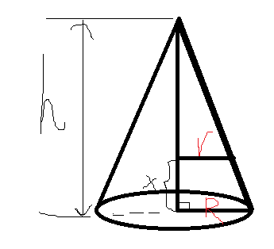

# $\S 2.4$ 隐函数与参数方程求导
## 一、隐函数求导
引入：
* $y=e^x,y=2x^2+1,y=\sin x$ （显函数）
* $\sin y+e^y-x=0$（隐函数）

定义：$\underset{隐函数}{F(x,y)}=0 \rightarrow \underset{显函数}{y=f(x)}$
### 例题
1. $\sin y+e^y-x=0$，求 $y',y''$

解：两边关于 $x$ 求导（复合导数）
$$
\begin{align*}
\cos y \cdot y'+e^y\cdot y'-1&=0 \\
y'&=\dfrac{1}{\cos y+e^y} \\
y''&=\dfrac{\mathrm{d}}{\mathrm{d}x}\left(\dfrac{1}{\cos y+e^y}\right)\\
&=-\dfrac{-\sin y\cdot y'+e^y\cdot y'}{(\cos y+e^y)^2}\\
&=-\dfrac{-\sin y+e^y}{(\cos y+e^y)^3}\\
&=\dfrac{\sin y- e^y}{(\cos y+e^y)^3}
\end{align*}
$$

2. 求 $\dfrac{x^2}{16}+\dfrac{y^2}{9}=1$ 在 $(2,\dfrac{3\sqrt{3}}{2})$ 的切线方程

解：两边关于 $x$ 求导

$$
\begin{align*}
\dfrac{2x}{16}+\dfrac{2}{9}y\cdot y'&=0\\
\dfrac{2}{16}\times 2+\dfrac{2}{9}\times \dfrac{3\sqrt{3}}{2}y'|_{x=2}&=0\\
k=y'|_{x=2}&=-\dfrac{\sqrt{3}}{4}\\
\therefore l:y-\dfrac{3\sqrt{3}}{2}&=-\dfrac{\sqrt{3}}{4}(x-2)
\end{align*}
$$

3. $y=\left(\dfrac{a}{b}\right)^x\left(\dfrac{b}{x}\right)^a\left(\dfrac{x}{a}\right)^b,a\gt 0,b\gt 0,\dfrac{a}{b}=1$，求 $y'$

解

法一：
$$
\begin{align*}
y'&=\left(\dfrac{a}{b}\right)^x\ln \left(\dfrac{a}{b}\right)\left(\dfrac{b}{x}\right)^a\left(\dfrac{x}{a}\right)^b+\left(\dfrac{a}{b}\right)^xa\left(\dfrac{b}{x}\right)^{a-1}\left(-\dfrac{b}{x^2}\right)\left(\dfrac{x}{a}\right)^b+\left(\dfrac{a}{b}\right)^x\left(\dfrac{b}{x}\right)^ab\left(\dfrac{x}{a}\right)^{b-1}\dfrac{1}{a}\\
&=a^{x-b}b^{a-x}x^{b-a}\ln\left(\dfrac{a}{b}\right)+a^{x+1-b}b^{a-x}x^{b-a-1}+a^{x-b}b^{a+1-x}x^{b-a-1}
\end{align*}
$$

法二（对数求导法）：
$$
\begin{align*}
\ln y&=x\ln(\dfrac{a}{b})+a\ln(\dfrac{b}{x})+b\ln(\dfrac{x}{a})\\
&=x\ln(\dfrac{a}{b})+a(\ln b-\ln x)+b(\ln x-\ln a)
\end{align*}
$$

$\dfrac{1}{y}\cdot y'=\ln \dfrac{a}{b}-\dfrac{a}{x}+\dfrac{b}{x}$

$y'=y\cdot (\ln\dfrac{a}{b}+\dfrac{b-a}{x})=a^{x-b}b^{a-x}x^{b-a}(\ln \dfrac{a}{b}+\dfrac{b-a}{x})$

## 二、参数函数求导
$y=f(x)\quad F(x,y)=0$

* 定理：$\begin{cases}x=\phi(t)\\y=\psi(t)\end{cases}$ ，$t$ 是参数，$\phi(t)$ 、$\psi(t)$ 可导，$x=\phi(t)$ 可确定反函数 $t=\phi^{-1}(x)$，则 $\dfrac{\mathrm{d}y}{\mathrm{d}x}=\dfrac{\frac{\mathrm dy}{\mathrm dt}}{\frac{\mathrm dx}{\mathrm dt}}=\dfrac{\psi'(t)}{\phi'(t)}$
> $\dfrac{\mathrm{d}^2y}{\mathrm{d}x^2}=\dfrac{\psi''(t)\phi'(t)-\phi''(t)\psi'(t)}{[\phi'(t)]^3}$

### 例题
1. $\begin{cases}x=3e^{-t}\\y=2e^t\end{cases}$ ，求 $\dfrac{\mathrm{d}^2y}{\mathrm{d}x^2}$

解：
$\dfrac{\mathrm dy}{\mathrm dx}=\dfrac{2e^t}{-3e^{-t}}=-\dfrac{2}{3}e^{2t}$

$\dfrac{\mathrm{d}^2y}{\mathrm{d}x^2}=\dfrac{\mathrm d}{\mathrm dx}(-\dfrac{2}{3}e^{2t})=-\dfrac{4}{3}e^{2t}\cdot \dfrac{1}{-3e^{-t}}=\dfrac{4}{9}e^{3t}$

2. $\begin{cases}x=f'(t)\\y=tf'(t)-f(t)\end{cases}$ ，且 $f^{(2)}(x)\ne 0$ ，求 $\dfrac{\mathrm{d}^2y}{\mathrm{d}x^2}$

解：
$\dfrac{\mathrm dy}{\mathrm dx}=\dfrac{f'(t)+tf''(t)-f'(t)}{f''(t)}=t$

$\dfrac{\mathrm{d}^2y}{\mathrm{d}x^2}=\dfrac{\dfrac{\mathrm d(\dfrac{\mathrm dy}{\mathrm dx})}{{\mathrm dt}}}{\dfrac{\mathrm dx}{\mathrm dt}}=\dfrac{1}{f^{(2)}(t)}$

3. 求 $r=e^{a\theta}$ 在 $\theta=\dfrac{\pi}{2}$ 处的切线方程

解：

$$
\begin{cases}
x=\rho \cos \theta = e^{a\theta}\cos \theta\\
y=\rho \sin \theta = e^{a\theta}\sin \theta
\end{cases}
$$

$k=\dfrac{\mathrm dy}{\mathrm dx}|_{\theta = \frac{\pi}{2}}=-a$

$l:y-e^{\frac{\pi a}{2}}=-ax$ 即 $y+ax=e^{\frac{\pi a}{2}}$

4. $\begin{cases}x=t^2+2t\\t^2-y+\varepsilon \sin y=1\end{cases}(0\lt \varepsilon \lt 1)$，求 $y$ 对 $x$ 的导数

解：

$\dfrac{\mathrm dy}{\mathrm dx}=\dfrac{\frac{\mathrm dy}{\mathrm dt}}{\frac{\mathrm dx}{\mathrm dt}}=\dfrac{\frac{2t}{1-\varepsilon \cos y}}{2t+2}=\dfrac{t}{(1+t)(1-\varepsilon \cos y)}$

## 三、相关变化率
设 $x=x(t)$ 及 $y=y(t)$ 都是可导函数，而变量 $x$ 与 $y$ 之间存在某种关系，从而变化率 $\dfrac{\mathrm dx}{\mathrm dt}$ 与 $\dfrac{\mathrm dy}{\mathrm dt}$ 间也存在一定关系。这两个相互依赖的变化率称为相关变化率。
### 例题
1. 圆的半径 $r$ 以 $2cm/s$ 速度匀速增加，求圆面积 $S$ 在 $r=10cm$ 时的增加速度。

解：

$\dfrac{\frac{\mathrm dS}{\mathrm dt}}{\frac{\mathrm dr}{\mathrm dt}}=\dfrac{\mathrm dS}{\mathrm dr}=2\pi r$

$\dfrac{\mathrm dS}{\mathrm dt}|_{r=10}=2\pi \times 10 \times 2=40\pi (cm/s^2)$

2. 圆锥形容器以 $25cm^3/s$ 速度注水，当容器中的水位位于 $\dfrac{h}{2}$ 时，求此时水位的上升速度。

解：

由相似关系得 $\dfrac{r}{R}=\dfrac{h-x}{h}$

$$
\begin{align*}
V&=\dfrac{1}{3}\pi R^2h-\dfrac{1}{3}\pi r^2(h-x)\\
&=\dfrac{1}{3}\pi R^2h-\dfrac{1}{3}\pi \left(\dfrac{R}{h}\right)^2(h-x)^3
\end{align*}
$$

两边关于 $t$ 求导得

$\dfrac{\mathrm dV}{\mathrm dt}=0-\dfrac{1}{3}\pi \left(\dfrac{R}{h}\right)^2\cdot 3(h-x)^2\cdot (-1)\cdot \dfrac{\mathrm dx}{\mathrm dt}$

$\therefore \dfrac{\mathrm dx}{\mathrm dt}|_{x=\frac{h}{2}}=\dfrac{100}{\pi h^2}(cm/s^2)$
