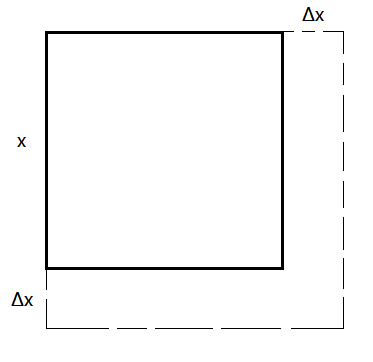
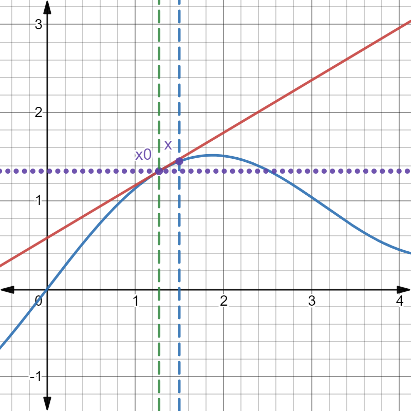

# $\S 2.5$ 函数的微分
> 引例
> 
>
> $S(x)=x^2$
>
> $S(x+\Delta x)=(x+\Delta x)^2=x^2+2x\cdot \Delta x+(\Delta x)^2$
> $$
\begin{align*}
\Delta S=S(x+\Delta x)-S(x)&=\underset{线性（函数）部分}{2x\cdot \Delta x}+\underset{高阶无穷小量(\Delta x\to 0)}{(\Delta x)^2}\\
&\sim 2x\cdot \Delta x \to 0
\end{align*}
> $$
> $y=x^3$
> $$
\begin{align*}
\Delta y=y(x+\Delta x)-y(x)&=(x+\Delta x)^3-x^3\\
&=\underset{线性部分}{3x^2\cdot \Delta x}+\underset{o(\Delta x)(\Delta x\to 0)}{3x(\Delta x)^2+(\Delta x)^3}
\end{align*}
> $$

## 一、函数的微分
* 定义：$y=f(x)$ 在 $U(x)$ 有定义，若 $\Delta y=f(x+\Delta x)-f(x)=A\cdot \Delta x+o(\Delta x)$（$A$ 与 $\Delta x$ 无关），则 $y=f(x)$ 在 $x$ 处可微，称 $A\cdot \Delta x$ 为 $y=f(x)$ 的微分，记作 $\mathrm dy=A\cdot \Delta x=A\cdot \mathrm dx$
> 如 $S=x^2$，$\mathrm dS=2x\cdot \Delta x=2x\mathrm dx$
>
> 如 $y=x^3$，$\mathrm dy=3x^2\cdot \Delta x=3x^2\mathrm dx$

* 定理：函数在一点可微 $\Leftrightarrow$ 函数在一点可导，且 $\mathrm dy=f'(x)\mathrm dx$
> 证明：
>
> $\Rightarrow$：$\Delta y=A\cdot \Delta x+o(\Delta x)$
>
> $\dfrac{\Delta y}{\Delta x}=A+\dfrac{o(\Delta x)}{\Delta x}$
>
> $\displaystyle f'(x)=\lim_{\Delta x\to 0}\dfrac{\Delta y}{\Delta x}=A+0=A \quad \mathrm dy=A\mathrm dx=f'(x)\mathrm dx$
>
> $\Leftarrow$：$f'(x)=\displaystyle \lim_{\Delta x\to 0}\dfrac{\Delta y}{\Delta x}\quad \dfrac{\Delta y}{\Delta x}=f'(x)+\alpha$
>
> $$
\begin{align*}
\Delta y&=f'(x)\Delta x+\alpha \Delta x\\
&=\underset{线性部分}{f'(x)\Delta x}+\underset{高阶无穷小}{o(\Delta x)}
\end{align*}
> $$

### 例题
* $y=\arctan x$，$\mathrm dy=\dfrac{1}{1+x^2}\mathrm dx$，$\mathrm dy|_{x=0}=1 \mathrm dx$
* $y=x^2e^x$，$\mathrm dy=(2xe^x+x^2e^x)\mathrm dx$

## 二、微分的运算法则
> 与导数运算法则类似
* $u,v$ 均可微：
  1. $\mathrm d(u\pm v)=\mathrm du\pm \mathrm dv$
  2. $\mathrm d(uv)=v\cdot \mathrm du+u\cdot \mathrm dv$
  3. $\mathrm d\left(\dfrac{u}{v}\right)=\dfrac{v\cdot \mathrm du-u\cdot \mathrm dv}{v^2}$
  4. 一阶微分的形式不变性（设 $y=f(u),u=\phi(x)$ 均可导）
  $$
     \begin{align*}
     \mathrm d\{f[\phi(x)]\}&=\dfrac{\mathrm d}{\mathrm dx}f[\phi(x)]\cdot \mathrm dx\\
     &=f'(u)\phi'\mathrm dx\\
     &=f'(u)\mathrm du
     \end{align*}
  $$

### 高阶微分
$$
\mathrm dy=f'(x)\mathrm dx \Rightarrow \mathrm d^ny=f^{(n)}x\mathrm dx^n
$$

* 高阶导数不具有形式不变性
### 例题
1. $y=\sin(x^2\cdot e^x)$，求 $\mathrm dy$
$$
\begin{align*}
\mathrm dy&=\cos (x^2e^x)\mathrm d(x^2e^x)\\
&=\cos (x^2e^x)[\mathrm d(x^2)\cdot e^x+x^2\mathrm d(e^x)]\\
&=[\cos (x^2e^x)\cdot (2xe^x+x^2e^x)]\mathrm dx
\end{align*}
$$

2. $y=\ln (1+e^{x^2})$，求 $\mathrm dy$

$$
\begin{align*}
\mathrm dy&=\dfrac{1}{1+e^{x^2}}\cdot e^{x^2}\cdot 2x\mathrm dx\\
&=\dfrac{2xe^{x^2}}{1+e^{x^2}}\mathrm dx
\end{align*}
$$
或
$$
\begin{align*}
\mathrm dy&=\dfrac{1}{1+e^{x^2}}\mathrm d(1+e^{x^2})\\
&=\dfrac{2xe^{x^2}}{1+e^{x^2}}\mathrm dx
\end{align*}
$$

3. $e^y+xy-e=0$，求 $\mathrm dy$

求导法
$$
e^y\cdot y'+y+xy'-0=0 \Rightarrow y'=-\dfrac{y}{x+e^y}\\
\mathrm dy=-\dfrac{y}{x+e^y}\mathrm dx
$$

微分法：两边微分得
$$
\begin{align*}
e^y\mathrm dy+\underset{y\mathrm dx+x\mathrm dy}{\mathrm d(xy)}-0&=0\\
\mathrm dy&=-\dfrac{y}{x+e^y}\mathrm dx
\end{align*}
$$

4. $\dfrac{\mathrm d(\tan x)}{\mathrm d(\sin x)}=\dfrac{\frac{1}{\cos^2x}\mathrm dx}{\cos x\mathrm dx}=\dfrac{1}{\cos ^3x}$

## 三、微分的几何意义
$$
\Delta y=\underset{f(x)}{f(x_0+\Delta x)}-f(x_0)\approx f'(x_0)\cdot \Delta x\\
f'(x_0)(x-x_0)=\mathrm dy|_{x=x_0}
$$
* $y=f(x)$ 在 $x_0$ 处切线方程 $y-f(x_0)=f'(x_0)(x-x_0)$

> 以直代曲要求
> 1. $x-x_0\to 0$
> 2. $f(x_0),f'(x_0)$ 可计算且相对容易

### 例题
1. 求 $\sin 31^\circ$ 的近似值

解：$y=\sin x \quad x\in R$

$f(x)\approx f(x_0)+f'(x_0)(x-x_0)=\sin x_0+\cos x_0(x-x_0)$

$\sin 31^\circ \approx \sin 30^\circ+\cos 30^\circ \cdot \dfrac{\pi}{180}\approx 0.5+\dfrac{1.732}{2}\cdot \dfrac{\pi}{180}$

2. 求 $(34)^{\frac{1}{5}}$ 的近似值

解：$y=x^{\frac{1}{5}}$

$$
\begin{align*}
34^{\frac{1}{5}}&\approx 32^{\frac{1}{5}}+\dfrac{1}{5}\times 32^{-\frac{4}{5}}(34-32)\\
&=2+\dfrac{1}{5}\times \dfrac{1}{16}\times 2\\
&=2+\dfrac{1}{40}=2.025
\end{align*}
$$
