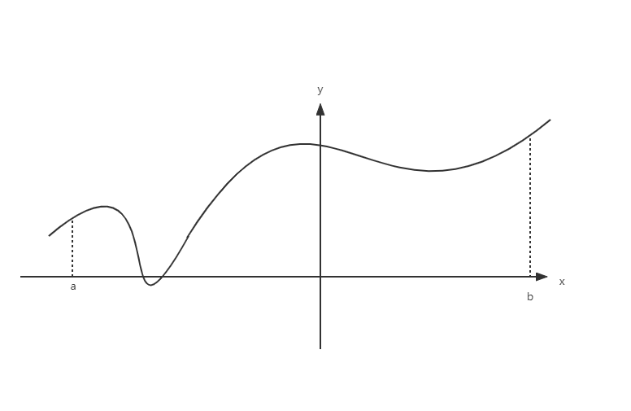
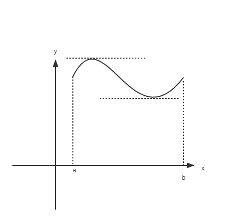
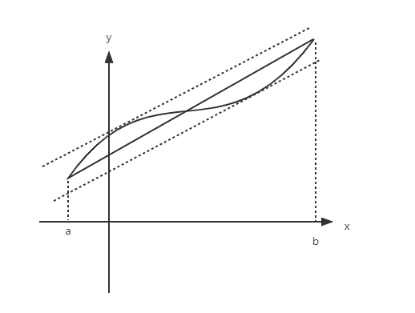

# $\S 3.1$ 微分中值定理
## 一、罗尔定理
* 若 $f(x)$ 在 $U(x_0)$ 有定义，$\forall x\in U(x_0) \quad f(x)\ge f(x_0)(f(x)\le f(x_0))$，则称 $f(x_0)$ 为极小值（极大值），$x_0$ 为极小值点（极大值点）
> 极值和最值
>
> 
> $[a,b]$ 中存在唯一最大、最小值，存在4个极值

* 若 $f'(x_0)=0$，则称 $x_0$ 为驻点（稳定点）

* [Fermat（费马）引理]**可导极值点一定是驻点**
> 证明：
> $f'(x_0)=f'_-(x_0)=f'_+(x_0)$
>
> $\displaystyle f'_-(x_0)=\lim_{x\to x_0^-}\dfrac{f(x)-f(x_0)}{x-x_0}\le 0 \quad f'_+(x_0)=\lim_{x\to x_0^+}\dfrac{f(x)-(x_0)}{x-x_0}\ge 0$
> 得证

* **罗尔定理**：若 $f(x)$ 满足：
  1. 在 $[a,b]$ 上连续
  2. 在 $(a,b)$ 上可导
  3. $f(a)=f(b)$
  * 则存在 $\xi \in (a,b)$ 有 $f'(\xi )=0$

> 证明：
> * 若最值在端点取得，$f(a)=M\quad f(b)=m$
> $M=m\Rightarrow f(x)=C\Rightarrow f'(x)=0$
> * 若至少有一个最值在 $(a,b)$ 内取得
>
> $f(\xi )=M$，其中 $\xi$ 为极大值点
>
> $\because \xi$ 是可导点
>
> $\therefore f'(\xi) =0$

* 缺少条件1，取 $f(x)=\begin{cases}x\quad0\le x\lt 1\\0\quad x=1\end{cases}$
* 缺少条件2，取 $f(x)=|x|$
* 缺少条件3，取 $f(x)=x\quad 0\le x\le 1$
> 均不存在满足条件的 $\xi$

### 例题
1. $y=f(x)$ 在 $(a,b)$ 内可导，且 $\displaystyle \lim_{x\to a^+}f(x)=\lim_{x\to b^-}f(x)$ ，证明：存在 $\xi$ 使得 $f'(\xi )=0$

解：
设
$$
\begin{align*}
F(x)=\begin{cases}
\displaystyle \lim_{x\to a^+}f(a^+)\quad &x=a\\
f(x)\quad &a\lt x\lt b\\
\displaystyle \lim_{x\to b^-}f(b^-)\quad &x=b
\end{cases}
\end{align*}
$$

此时 $F(a)=F(b)$，满足罗尔定理

$\therefore$ 存在 $\xi$ 使得 $f'(\xi )=0=F'(\xi )$

2. 证明 $x^5-5x+1=0$ 有且仅有一个小于1的正实数根

证：
* 存在性：$f(x)=x^5-5x+1\quad f(0)=1\quad f(1)=-3\lt 0$，由零点定理，存在 $\xi \in (0,1)$，$f(\xi )=0$
* 唯一性：假设存在 $\xi_1 \ne \xi_2 \in (0,1)$ 有 $f(\xi_1)=f(\xi_2)=0$，$f(x)$ 在 $[\xi_1,\xi_2]$ 连续，$(\xi_1,\xi_2)$ 可导，$f(\xi_1)=f(\xi_2)$

$\Rightarrow \exists \eta \in (\xi_1,\xi_2)$ 有 $f'(\eta )=5\eta^4 -5=0$ ，与 $\eta \in (0,1)$ 矛盾

$\therefore$ 只存在唯一实根

3. 若 $f(x)$ 在 $(-\infty ,+\infty)$ 可导，且 $f'(x)=0$ 无实根，证明 $f(x)=0$ 至多只有一个实根

证：设有 $\xi_1 \ne \xi_2$ 两实根，$f(\xi_1)=f(\xi_2)=0$

$f(x)$ 在 $[\xi_1,\xi_2]$ 连续，$(\xi_1,\xi_2)$ 可导 $\Rightarrow \exists \xi \in (\xi_1,\xi_2)$，$f'(\xi)=0$，与已知矛盾

$\therefore f(x)=0$ 至多有一个实根

## 二、拉格朗日中值定理

若 $f(x)$ 满足：在 $[a,b]$ 内连续且在 $(a,b)$ 内可导，则存在 $\xi \in(a,b)$ 使得 $f'(\xi )= \dfrac{f(b)-f(a)}{b-a}$

证明
$$
\begin{align*}
f'(\xi)-\dfrac{f(b)-f(a)}{b-a}&=0\\
\Leftrightarrow f'(\xi)-\left[\dfrac{f(b)-f(a)}{b-a}x\right]'|_{x=\xi}&=0\\
\Leftrightarrow \left[\underset{F(x)}{f(x)-\dfrac{f(b)-f(a)}{b-a}x}\right]'|_{x=\xi}&=0
\end{align*}
$$

$$
\left.
\begin{matrix}
F(a)=\dfrac{bf(a)-af(b)}{b-a}=F(b)\\
F(x)在[a,b]连续 \\
F(x)在(a,b)可导
\end{matrix}
\right\}
\exists \xi \in(a,b), F'(\xi)=0
$$

### 推论
1. $f(x)$ 在区间 $I$ 可导，且 $f'(x)=0 \Rightarrow f(x)=C$

证：$\forall x_1,x_2$，

$$
\begin{align*}
f(x_1)-f(x_2)&=f'(\xi )(x_1-x_2)\\
&=0(x_1-x_2)=0
\end{align*}
$$

$f(x_1)=f(x_2) \Rightarrow f(x)=C$

> $f(x)=\arcsin x+\arccos x=\dfrac{\pi}{2}(x\in [0,\dfrac{\pi}{2}])$
> $f(x)=\text{arccot} x+\arctan x=\dfrac{\pi}{2}(x\in [0,\dfrac{\pi}{2}])$

2. $f(x),g(x)$ 在 $I$ 上可导，且 $f'(x)=g'(x) \Rightarrow f(x)-g(x)=C$
### 例题
1. $f(x)$ 在 $[a,b]$ 连续，$(a,b)$ 内可导，证明：$\exists \xi \in(a,b)$ 使 $\dfrac{bf(b)-af(a)}{b-a}=f(\xi)+\xi f'(\xi)$

证：设 $F(x)=xf(x)$

$F'(\xi)=|f(x)+xf'(x)|_{x=\xi}=f(\xi)+\xi f'(\xi)=\dfrac{bf(b)-af(a)}{b-a}$

2. 证明 $\dfrac{h}{1+h}\lt \ln(1+h) \lt h$，$h\gt -1$ 且 $h\ne 0$

证：$h\gt 0\quad \dfrac{1}{1+h}\lt \dfrac{\ln(1+h)}{h}\lt 1$

$\dfrac{\ln(1+h)-\ln(1+0)}{h-0}=\dfrac{1}{1+\xi}\lt 1\quad 0\lt \xi\lt h$

$-1\lt h\lt 0\quad \ln (1+h)=\ln(1+h)-\ln 1=\dfrac{1}{1+\theta h}\cdot h(0\lt \theta \lt 1)$

$\theta \lt \theta h\lt 0 \quad 1+h\lt 1+\theta h\lt 1$

$h\gt \dfrac{h}{1+\theta h}\gt \dfrac{h}{1+h}$，即得证

## 三、柯西中值定理
若 $f(x),g(x)$ 满足：在 $[a,b]$ 内连续，在 $(a,b)$ 内可导，且对于任意 $x\in(a,b)$ 都有 $g'(x)\ne 0$ ，则存在 $\xi \in(a,b)$ 使得 $\dfrac{f(b)-f(a)}{g(b)-g(a)}=\dfrac{f'(\xi)}{g'(\xi)}$

证明

考虑 $\begin{cases}u=f(x)\\v=g(x)\end{cases}$，$\exists \xi \in(a,b)$

$\dfrac{\mathrm du}{\mathrm dv}|_{x=\xi}=\dfrac{f'(x)}{g'(x)}|_{x=\xi}=\dfrac{f'(\xi)}{g'(\xi)}=\dfrac{f(b)-f(a)}{g(b)-g(a)}$，得证

### 例题
1. $f(x)$ 在 $[a,b]$ 连续，$(a,b)$ 可导（$a\gt 0$）。证明：$\exists \xi \in(a,b)$ 使得 $f(b)-f(a)=\xi f'(\xi)\ln \dfrac{b}{a}$

证：令 $g(x)=\ln x$，$f(x),g(x)$ 满足柯西定理的条件

$\therefore \exists \xi \in(a,b)$ 使得 $\dfrac{f'(\xi)}{g'(\xi)}=\dfrac{f(b)-f(a)}{\ln b-\ln a}$ 即 $\dfrac{f'(\xi)}{\frac{1}{\xi}}=\dfrac{f(b)-f(a)}{\ln \frac{b}{a}}$，得证

2. 求证 $\exists \xi \in(1,e)$ 使得 $\sin 1=\cos (\ln \xi)$

证：设 $f(x)=\sin(\ln x),g(x)=\ln x$ 在 $(1,e)$ 上满足柯西定理的条件

$\therefore \exists \xi \in (1,e)\quad \dfrac{f'(\xi)}{g'(\xi)}=\dfrac{\sin(\ln e)-\sin(\ln 1)}{\ln e-\ln 1}=\sin 1$

$g'(x)=\dfrac{1}{x} \quad f'(x)=\cos (\ln x)\cdot \dfrac{1}{x} \quad 左侧=\cos (\ln \xi)$
