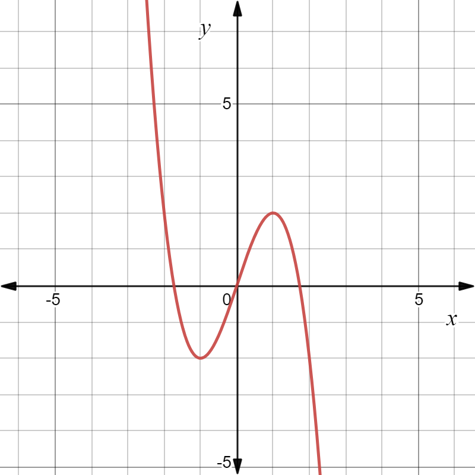
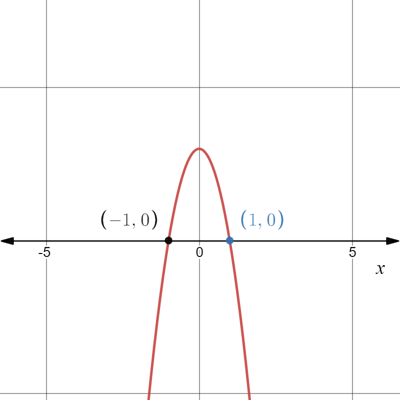
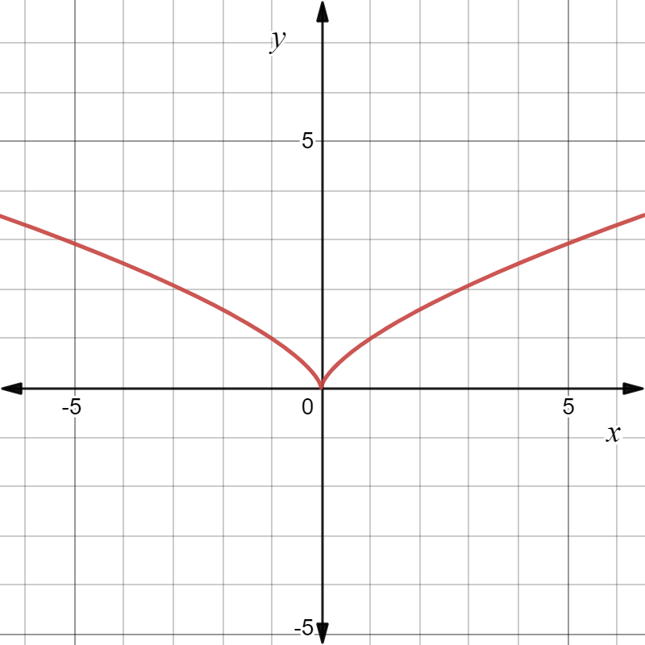
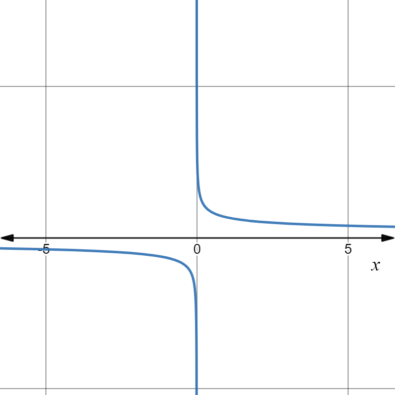
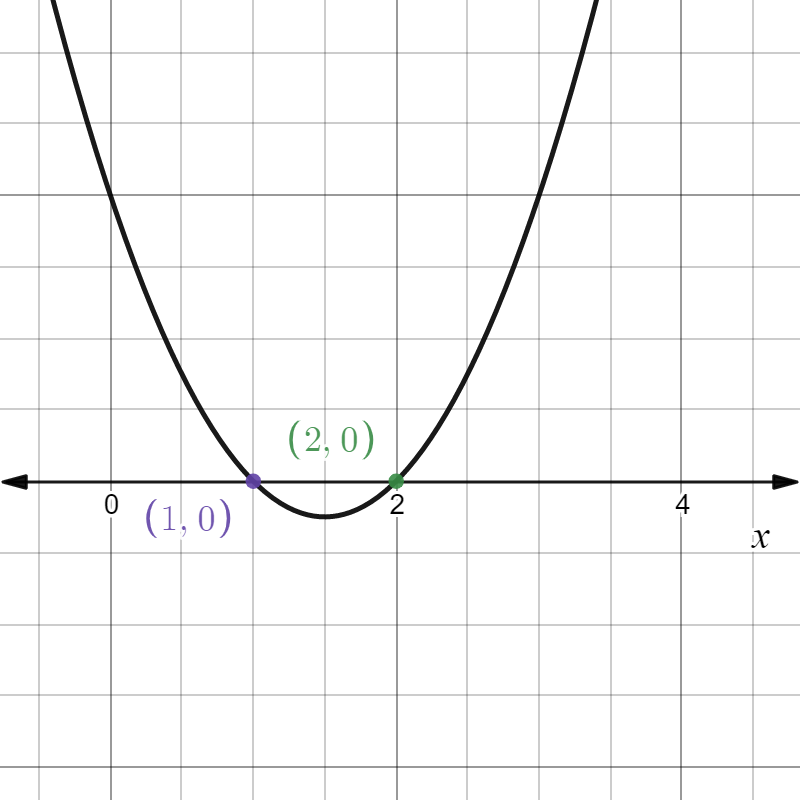
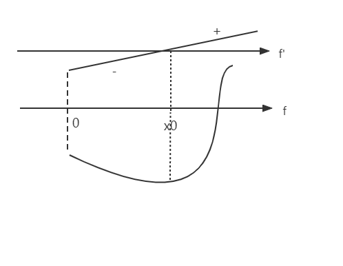

# $\S 3.4$ 函数的单调性与极值
## 一、单调性
定理1：$f$ 在区间 $I$ 上可导，$f$ 单调递增（递减）$\Leftrightarrow f'\ge 0(f'\le 0)$

**证**
* $\Rightarrow$：$x_1\lt x_2\in I\quad f(x_1)\le f(x_2)$

$\displaystyle f'(x)=\lim_{\Delta x\to 0}\dfrac{f(x+\Delta x)-f(x)}{\Delta x}\ge 0$

$\Delta x\gt 0$ 时，$f(x+\Delta x)\ge f(x)$

$\Delta x\lt 0$ 时，$f(x+\Delta x)\le f(x)$
* $\Leftarrow$：$f'\ge 0$ 时，对于 $x_1\lt x_2\in I$，根据拉格朗日中值定理，有 $\dfrac{f(x_2)-f(x_1))}{x_2-x_1}=f'(\xi)\ge 0,\xi \in (x_1,x_2)$

从而 $f(x_1)\le f(x_2)$，$f(x)$ 在 $I$ 上为增函数。$f'\le 0$ 同理可证

推论：
* $f'(x)\gt 0 \Rightarrow f(x)$ 在区间 $I$ 上严格单调递增
* $f'(x)\lt 0 \Rightarrow f(x)$ 在区间 $I$ 上严格单调递减

**证**

$x_1\lt x_2\Rightarrow f(x_1)\lt f(x_2)$

若$x_1\lt x_2\quad f(x_1)=f(x_2)$，由罗尔定理得 $\exists \xi \in(x_1,x_2)\quad f'(\xi)=0$ 矛盾，另外情况同理

定理2：$f(x)$ 在 $(a,b)$ 上可导，$f(x)$ 严格单调递增 $\Leftrightarrow$
1. $\forall x\in (a,b) \quad f'(x)\gt 0$
2. 在 $(a,b)$ 任何子区间上，$f'(x)\ne 0$

### 例题
1. 求 $f(x)=3x-x^3$ 的单调区间
* $f(x)$ 图像如下

* $f'(x)=3-3x^2$ 图像如下

令 $f'(x)=0$ 得到 $x=\pm 1$

| |$(-\infty,-1)$|$-1$|$(-1,1)$|$1$|$(1,+\infty)$
|:--:|:--:|:--:|:--:|:--:|:--:
|一阶导正负|-|0|+|0|-
|函数增减性|↓||↑||↓

$\therefore$ 增区间 $[-1,1]$，减区间 $(-\infty,-1]\cup [1,+\infty)$

2. 求 $f(x)=x^\frac{2}{3}$ 的单调区间
* $f(x)$ 图像如下

* $f'(x)=\dfrac{2}{3}x^{-\frac{1}{3}}$ 图像如下

| |$(-\infty,0)$|$0$|$(0,+\infty)$
|:--:|:--:|:--:|:--:
|一阶导正负|-|不可导|+
|函数增减性|↓|/|↑

$\therefore$ 增区间 $[0,+\infty)$，减区间 $(-\infty,0]$

> 一般分界点为驻点、不可导点

3. 证明 $\sin x \gt x-\dfrac{x^3}{3!}(x\gt 0)$

证：令 $f(x)=\sin x-x+\dfrac{x^3}{6}$

$f'(x)=\cos x-1+\dfrac{1}{2}x^2$

$\because f''(x)=-\sin x+x\gt 0$

$\therefore f'(x)\gt f'(0)=0$

$\therefore f(x)\gt f(0)=0$ 即 $\sin x\gt x-\dfrac{x^3}{3!}$

## 二、极值和最值
定义：$\forall x\in U(x_0)$ 若 $f(x)\ge f(x_0)$，则 $f(x_0)$ 称为**极小值**（先减后增），若 $f(x)\le f(x_0)$，则 $f(x_0)$ 称为**极大值**（先增后减）

定理1[极值第一充分条件]：$f(x)$ 在 $x_0$ 连续，$\overset{\circ}{U}(x_0)$ 可导
1. 当 $x\in (x_0-\delta ,x_0)$ 时，$f'(x)\le 0$；$x\in (x_0, x_0+\delta)$ 时，$f'(x)\ge 0$；$f(x)$ 在 $x_0$ 处取得极小值
2. 当 $x\in (x_0-\delta ,x_0)$ 时，$f'(x)\ge 0$；$x\in (x_0, x_0+\delta)$ 时，$f'(x)\le 0$；$f(x)$ 在 $x_0$ 处取得极大值
3. 在 $(x_0-\delta ,x_0)$ 和 $(x_0, x_0+\delta)$ 中均有 $f'(x)\ge 0/f'(x)\le 0$，则 $f(x)$ 在 $x_0$ 处不取得极值

定理2[极值第二充分条件]：$f(x)$ 在 $U(x_0)$ 可导，且在 $x_0$ 处二阶可导，$f'(x_0)=0\quad f''(x_0)\ne 0$
1. 若 $f''(x_0)\lt 0$，则 $f(x)$ 在 $x_0$ 处取得极大值
2. 若 $f''(x_0)\gt 0$，则 $f(x)$ 在 $x_0$ 处取得极小值

> 注：若 $f'(x_0)=0\quad f''(x_0)=0$，则 $x_0$ 处极值情况无法判断

* 推广：$f(x)$ 在 $U(x_0)$ 存在 $n-1$ 阶导数，且 $x_0$ $n$阶可导，$f'(x_0)=f''(x_0)=\cdots=f^{(n-1)}(x_0)=0$，$f^{(n)}(x_0)\ne 0$，则：
1. $n$ 是偶数，$f^{(n)}(x_0)\gt 0$ 取极小值，$f^{(n)}(x_0)\lt 0$ 取极大值
2. $n$ 是奇数，$x_0$ 不取得极值

> 最值点可能是端点、驻点、不可导点，求最值需要比较三点的函数值

### 例题
1. 求 $f(x)=2x^3-9x^2+12x+3$ 的极值

解：$f'(x)=6x^2-18x+12=6(x-2)(x-1)$

$f''(x)=6(2x-3)$

$f''(1)\lt 0$，取极小值；$f''(2)\gt 0$，取极大值

|x|$(-\infty,1)$|1|$(1,2)$|2|$(2,+\infty)$
|:--:|:--:|:--:|:--:|:--:|:--:|
|f'(x)|+|0|-|0|+
|f(x)|↑|极大|↓|极小|↑

极大值 $f(1)=8$，极小值 $f(2)=7$

2. 求 $f(x)=(x^2-1)^3+1$ 的极值

解：$f'(x)=2x(x^2-1)^2$，驻点：$x_1=0 \quad x_2=-1 \quad x_3=1$

|x|$(-\infty,-1)$|-1|$(-1,0)$|0|$(0,1)$|1|$(1,+\infty)$
|:--:|:--:|:--:|:--:|:--:|:--:|:--:|:--:|
|f'(x)|-|0|-|0|+|0|+
|f(x)|↓|非极值|↓|极小值|↑|非极值|↑

极小值 $f(0)=0$

3. 求 $y=|2x^3-9x^2+12x|$ 在 $[-\dfrac{1}{4},\dfrac{5}{2}]$ 上的最值

解：令 $y^2=(2x^3-9x^2+12x)^2\Rightarrow g(x)$

$g'(x)=2(2x^3-9x^2+12x)(6x^2-18x+12)$，驻点 $x_1=0\quad x_2=1\quad x_3=2$

* $g(0)=0\quad g(1)=25\quad g(2)=16\quad g(-\dfrac{1}{4})=\dfrac{13225}{1024}\quad g(\dfrac{5}{2})=25$

* $f(x)_\min=0$，$f(x)_\max=5$

4. 证明对于任意自然数 $n$，$x^{n+2}-2x^n-1=0$ 只有唯一正根

证：

* 存在正根 令$f(x)=x^{n+2}-2x^n-1$，$f(0)=-1$

存在 $a$，使得 $f(a)\gt 0$

$x=2$ 时，存在n使得 $f(x)=x^{n+2}-x^{n+1}-1\gt 0$

$\therefore \exists \xi \in(0,2) \quad s.t. f(\xi)=0$

* 唯一性 $f'(x)=(n+2)x^{n-1}(x+\sqrt{\dfrac{2n}{n+2}})(x-\sqrt{\dfrac{2n}{n+2}})$，$x_0=\sqrt{\dfrac{2n}{n+2}}$

x|$(0,x_0)$|$x_0$|$(x_0,2)$
:--:|:--:|:--:|:--:
f'|-|0|+
f|↓|极小值|↑

得证

5. 做一个有盖圆柱形水池，在体积 $V$ 固定的情况下，怎样用料最省？

解：$V=\pi r^2h \Rightarrow h=\dfrac{V}{\pi r^2}$，问题转化为求 $S$ 的最小值

$S(r)=2\pi r^2+2\pi rh=2\pi r^2+\dfrac{2V}{r}(r\gt 0)$

$S'=4\pi r-\dfrac{2V}{r^2}\Rightarrow$ 驻点 $r=\left(\dfrac{V}{2\pi}\right)^\frac{1}{3}$

当 $r=\left(\dfrac{V}{2\pi}\right)^\frac{1}{3}$ 时，$S_\min=2\pi \left(\dfrac{V}{2\pi}\right)^\frac{2}{3}+\sqrt[3]{16\pi V}$
