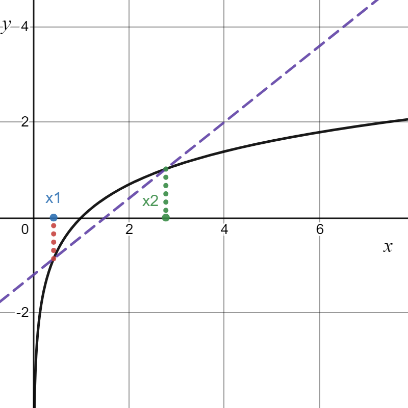
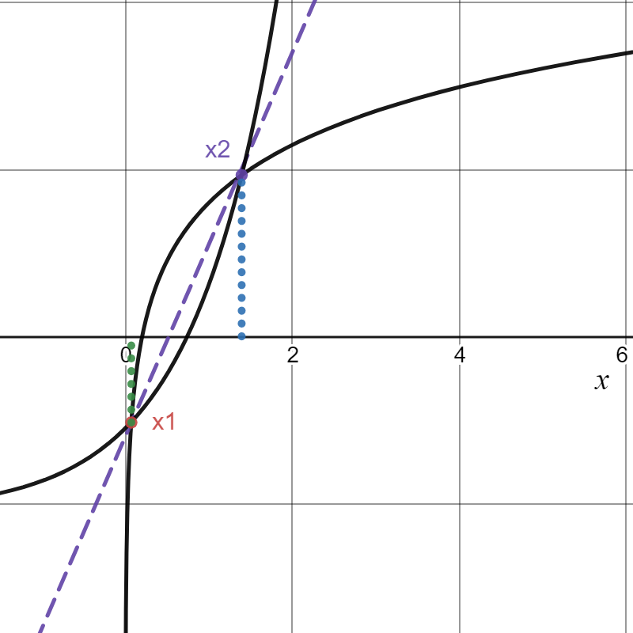
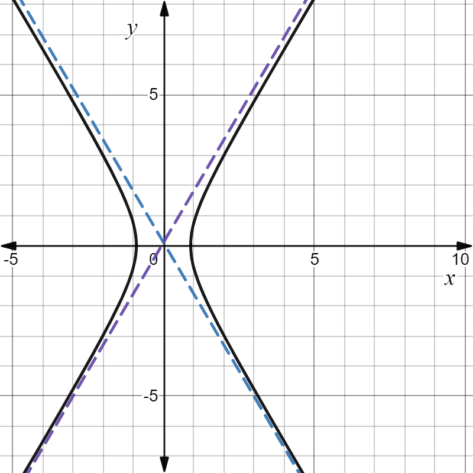
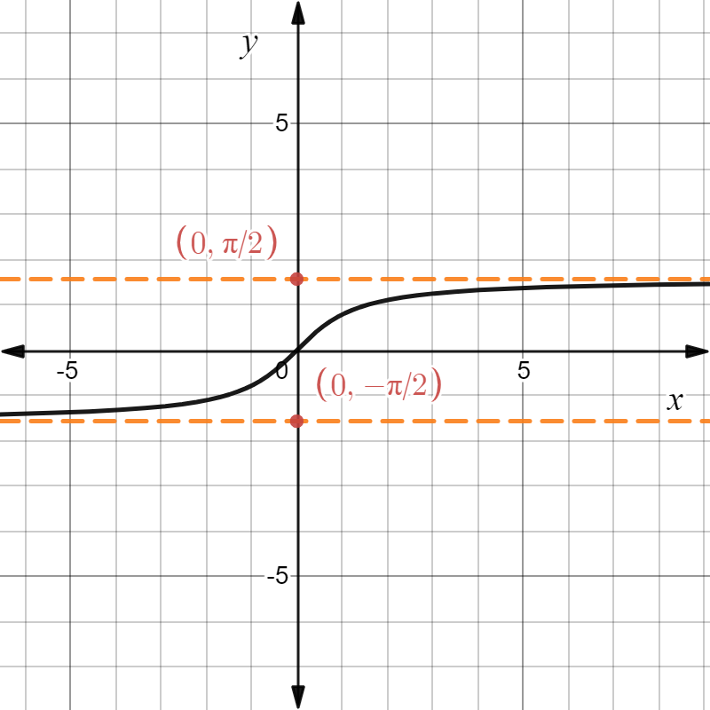

# $\S 3.5$ 函数的凹凸型和图像描绘
> 引例：
> * (上)凹函数 $y=x^2(x\gt 0)$
> 
> * (上)凸函数 $y=\ln x(x\gt 0)$
> 
## 一、函数的凹凸性和拐点
* 定义：$f(x)$ 是 $I$ 上的函数，$\forall x_1,x_2 \in I$，当 $f(\lambda x_1+(1-\lambda)x_2)\le \lambda f(x_1)+(1-\lambda)f(x_2)$ 时，称为上凹函数；当 $f(\lambda x_1+(1-\lambda)x_2)\ge \lambda f(x_1)+(1-\lambda)f(x_2)$ 时，称为上凸函数（$\lambda \in(0,1)$）

* 定理：$\forall x_1\lt x_2\lt x_3\in I$

1. $f(x)$ 是上凹函数 $\Leftrightarrow \dfrac{f(x_2)-f(x_1)}{x_2-x_1}\lt \dfrac{f(x_3)-f(x_2)}{x_3-x_2} \Leftrightarrow f'(x)$ 单调递增
2. $f(x)$ 是上凸函数 $\Leftrightarrow \dfrac{f(x_2)-f(x_1)}{x_2-x_1}\gt \dfrac{f(x_3)-f(x_2)}{x_3-x_2} \Leftrightarrow f'(x)$ 单调递减

* 推论：$f(x)$ 在 $I$ 上二阶可导，$f(x)$ 是上凹函数 $\Leftrightarrow f''(x)\ge 0$；$f(x)$ 是上凸函数 $\Leftrightarrow f''(x)\le 0$

* 拐点：曲线经过 $(x_0,f(x_0))$ 后凹凸性改变，称 $(x_0,f(x_0))$ 为拐点

### 例题
1. 求 $f(x)=(x-1)x^{\frac{2}{3}}$ 的凹凸区间和拐点

解：$f'(x)=x^{\frac{2}{3}}+\dfrac{2}{3}x^{-\frac{1}{3}}(x-1)=\dfrac{5x-2}{3x^{\frac{1}{3}}}$

$f''(x)=\dfrac{2(5x+1)}{9x^{\frac{4}{3}}}$

* $x=-\dfrac{1}{5}$，$f''(x)=0$
* $x=0$，$f''(x)$ 不存在

x|$(-\infty,-\dfrac{1}{5})$|$-\dfrac{1}{5}$|$(-\dfrac{1}{5},0)$|$0$|$(0,+\infty)$
:--:|:--:|:--:|:--:|:--:|:--:|
$f''(x)$|-|0|+|不存在|+
$f'(x)$|上凸|拐点|上凹|非拐点|上凹

* 上凹区间 $(-\dfrac{1}{5},+\infty)$，上凸区间 $(-\infty,-\dfrac{1}{5})$，拐点 $(-\dfrac{1}{5},-\dfrac{6}{5\sqrt[3]{25}})$

2. 证明 $\sin x\gt \dfrac{2}{\pi}x, x\in (0,\dfrac{\pi}{2})$

证：$y=\sin x$ 在 $(0,\dfrac{\pi}{2})$ 上为上凸函数，过 $(0,0),(\dfrac{\pi}{2},1)$ 两点的直线方程为 $y-0=\dfrac{2}{\pi}x$

$\therefore$由凸函数定义得 $\sin x \gt \dfrac{2}{\pi}x,x\in (0,\dfrac{\pi}{2})$，证毕

3. 证明 $(\dfrac{a+b}{2})^2\le \dfrac{a^2+b^2}{2}$

证：
$$
(\underset{\lambda_1}{\dfrac{1}{2}}a+\underset{\lambda_2}{\dfrac{1}{2}}b)^2\le \dfrac{1}{2}(a^2+b^2)
$$

$f(\lambda_1x_1+\lambda_2x_2)\le \lambda_1f(x_1)+\lambda_2f(x_2)$ 且 $\lambda_1+\lambda_2=1$

$y=x^2$ 为上凹函数
> 詹森不等式[Jensen's inequality]
>
> $\lambda_1+\lambda_2+\cdots+\lambda_n=1$
>
> $f(x)$ 为下凸（上凹）函数：$f(\lambda_1x_1+\lambda_2x_2+\cdots+\lambda_nx_n)\le \lambda_1f(x_1)+\lambda_2f(x_2)+\cdots+\lambda_nf(x_n)$
>
> $f(x)$ 为下凹（上凸）函数：$f(\lambda_1x_1+\lambda_2x_2+\cdots+\lambda_nx_n)\ge \lambda_1f(x_1)+\lambda_2f(x_2)+\cdots+\lambda_nf(x_n)$

4. 证明 $\sqrt[n]{a_1a_2\cdots a_n}\le \dfrac{a_1+a_2+\cdots +a_n}{n}$

证：右边= $\dfrac{1}{n}a_1+\dfrac{1}{n}a_2+\cdots+\dfrac{1}{n}a_n$

此时有 $\lambda_i=\dfrac{1}{n}(i=1,2,\cdots,n)$

两边取对数
$$
\dfrac{1}{n}(\ln a_1+\ln a_2+\cdots+\ln a_n)\le \ln(\dfrac{1}{n}a_1+\dfrac{1}{n}a_2+\cdots+\dfrac{1}{n}a_n)
$$

其中 $y=\ln x$，$y''=-\dfrac{1}{x^2}\lt 0$，为上凸函数
## 二、曲线的渐近线

* $\displaystyle \lim_{x\to \infty(+\infty或-\infty)}f(x)=A$，把 $y=A$ 称为水平渐近线
* $\displaystyle \lim_{x\to x_0}f(x)=\infty$，把 $x=x_0$ 称为垂直渐近线
* 斜渐近线 $y=kx+b$，其中 $\displaystyle k=\lim_{x\to \infty}\dfrac{f(x)}{x}$，$\displaystyle b=\lim_{x\to \infty}[f(x)-kx]$
### 例题
求 $y=\dfrac{x^3}{x^2+2x-3}$ 的渐近线

解：$\displaystyle \lim_{x\to \infty}\dfrac{x^3}{x^2+2x-3}=\infty$，无水平渐近线

$\displaystyle \lim_{x\to 1}\dfrac{x^3}{x^2+2x-3}=\lim_{x\to -3}\dfrac{x^3}{x^2+2x-3}=\infty$，垂直渐近线 $x=1$ 和 $x=-3$

$\displaystyle k=\lim_{x\to \infty}\dfrac{\frac{x^3}{x^2+2x-3}}{x}=1$

$\displaystyle b=\lim_{x\to \infty}(\dfrac{x^3}{x^2+2x-3}-x)=-2$

$\therefore$斜渐近线 $y=x-2$
## 三、函数作图
引例 $y=\arctan x$
1. 定义域：$D=(-\infty,+\infty)$
2. 单调性：$f'(x)=\dfrac{1}{1+x^2}\gt 0$，单调递增
3. 凹凸性：$f''(x)=-\dfrac{2x}{(1+x^2)^2}$，$x\gt 0$上凸，$x\lt 0$上凹
4. 渐近线：$y=\pm \dfrac{\pi}{2}$

