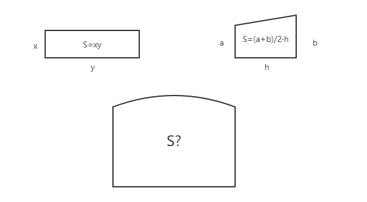
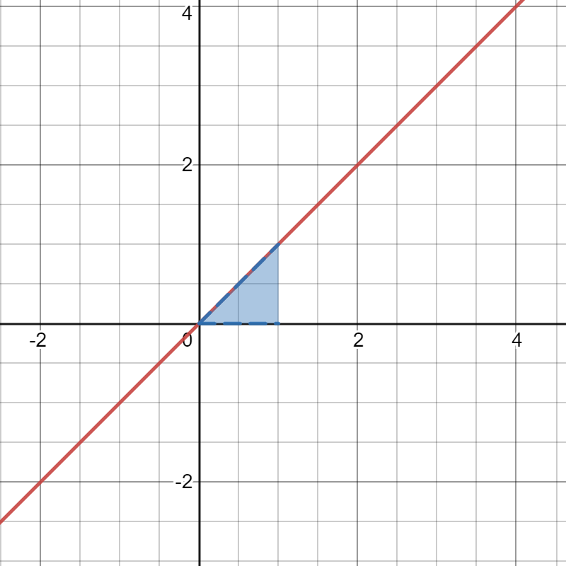
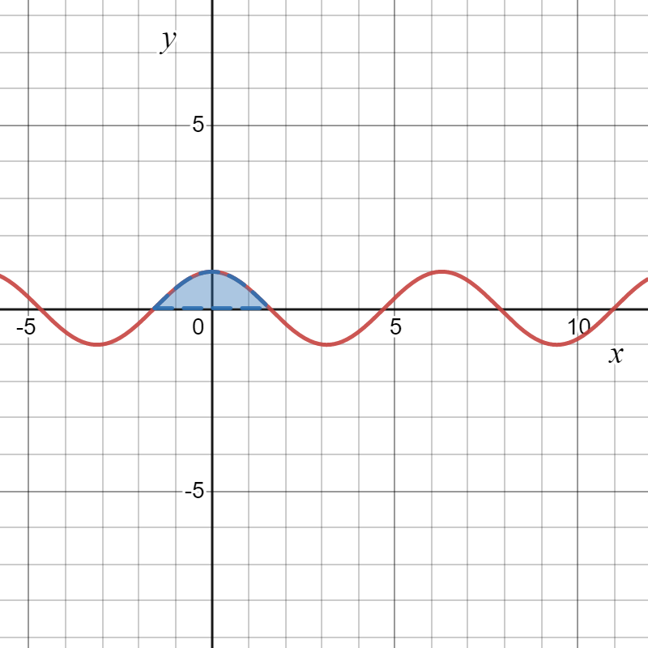
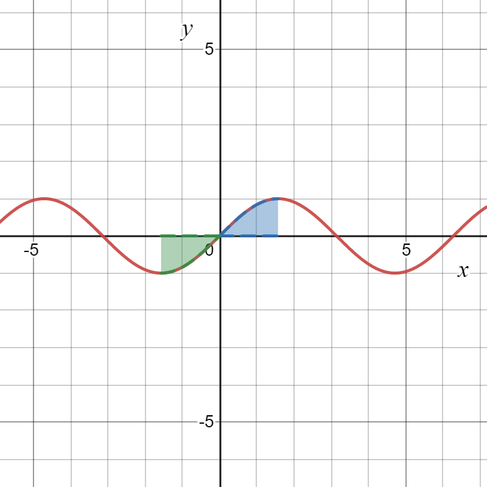
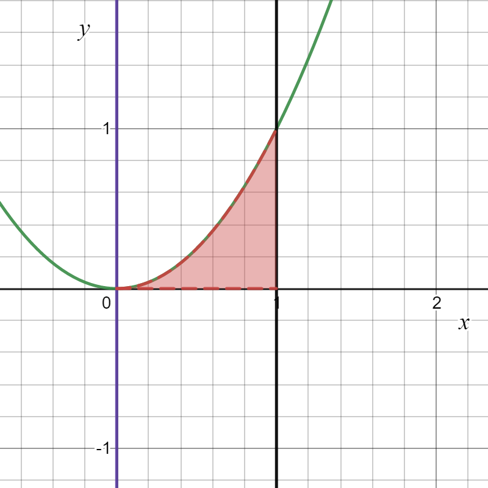

# $\S$ 5.1 定积分的概念和性质
## 一、概念

引例：图形面积求法
1. 分割：$a=x_0\lt x_1\lt x_2\lt \cdots \lt x_{n-1}\lt x_n=b$
2. 替代：$S_{小曲}\approx S_{矩}=f(\xi_i)\Delta x_i$
3. 求和：$\displaystyle S_{小曲}=\sum_{i=1}^nS_{小曲}\approx \sum_{i=1}^nf(\xi_i)\Delta x_i$
4. 取极限：$\displaystyle \lim_{\lambda \to 0}\sum_{i=1}^nf(\xi_i)\Delta x_i=S_曲$，其中 $\lambda$ 为最大区间长度

定义：$f(x)$ 在 $[a,b]$ 上有定义
1. 任意分割( $\lambda$ 为分割细度)

$$
a=x_0\lt x_1\lt x_2\lt \cdots \lt x_{n-1}\lt x_n=b\\
\lambda = \max{\{\Delta x_1,\Delta x_2,\cdots,\Delta x_n\}}
$$
2. 任意取点 $\xi_i\in [x_{i-1},x_i]$ （$\{\xi_i\}$ 介点集），求和式 $\displaystyle \sum_{i=1}^nf(\xi_i)\Delta x_i$

若 $\displaystyle \lim_{\lambda \to 0}\sum_{i=1}^nf(\xi_i)\Delta x_i$ 存在，则称该极限为 $f(x)$ 在 $[a,b]$ 上的定积分，$f(x)$ 在 $[a,b]$ 上可积，记作
$$
\int_a^bf(x)\mathrm dx=\lim_{\lambda \to 0}\sum_{i=1}^nf(\xi_i)\Delta x_i
$$

* 规定 $\displaystyle \int_a^bf(x)\mathrm dx=-\int_b^af(x)\mathrm dx$，$\displaystyle \int_a^af(x)\mathrm dx=0$

* $\displaystyle \int_a^bf(x)\mathrm dx$ 几何意义
    * $f(x)\ge 0$，$y=f(x),x=a,x=b,x$轴所围面积
    * $f(x)\le 0$，$y=f(x),x=a,x=b,x$轴所围面积的相反数
    * $f(x)$ 可正可负，$y=f(x),x=a,x=b,x$轴所围面积的代数和（$S_上-S_下$）
### 例题
1.

$$
\begin{align*}
\int_0^1x \mathrm dx = \dfrac{1}{2}\times 1 \times 1 = \dfrac{1}{2}
\end{align*}
$$

$$
\begin{align*}
\int_0^1 \sqrt{1-x^2}\mathrm dx = \dfrac{\pi}{4}
\end{align*}
$$

$$
\begin{align*}
\int_{-\frac{\pi}{2}}^{\frac{\pi}{2}}\cos x \mathrm dx=2\int_0^{\frac{\pi}{2}}\cos x \mathrm dx
\end{align*}
$$

$$
\begin{align*}
\int_{-\frac{\pi}{2}}^{\frac{\pi}{2}}\sin x \mathrm dx=0
\end{align*}
$$
2. 求 $y=x^2,x=0,x=1$ 与 $x$ 轴围成的面积

解：$\displaystyle \int_0^1x^2 \mathrm dx=\lim_{\lambda \to 0}\sum_{i=1}^nf(\xi_i)\Delta x_i$

取特殊分割 $[0,1]$ n等分，$\Delta x_i=\dfrac{1}{n},\lambda=\dfrac{1}{n}(n\to \infty)$

取特殊介点，令 $\xi_i$ 为区间左端点，即 $\xi_i=\dfrac{i-1}{n}$

$$
\begin{align*}
原式&=\lim_{n\to \infty}\sum_{i=1}^n(\dfrac{i-1}{n})^2\cdot \dfrac{1}{n}\\
&=\lim_{n\to \infty}\dfrac{0^2+1^2+\cdots+(n-1)^2}{n^3}=\dfrac{1}{3}
\end{align*}
$$
### 定理
* [必要条件]：$f(x)$ 在 $[a,b]$ 上可积 $\Rightarrow f(x)$ 在 $[a,b]$ 上有界

推论：$f(x)$ 在 $[a,b]$ 上无界 $\Rightarrow f(x)$ 在 $[a,b]$ 上不可积
> 有界但不可积：$D(x)=\begin{cases}1\quad x\in Q\\0\quad x\not \in Q\end{cases}$ 在 $[0,1]$ 上不可积

* [充分条件]
    1. $f(x)$ 在 $[a,b]$ 上连续 $\Rightarrow$ 可积
    2. $f(x)$ 在 $[a,b]$ 上有有限个间断点且有界 $\Rightarrow$ 可积
    3. $f(x)$ 在 $[a,b]$ 上单调 $\Rightarrow$ 可积

## 二、性质
1. 线性性质
$$
\int_a^b [kf(x)+lg(x)]\mathrm dx=k\int_a^bf(x)\mathrm dx+l\int_a^bg(x)\mathrm dx
$$

2. 可加性（$a\le c\le b$）
$$
\int_a^bf(x)\mathrm dx=\int_a^cf(x)\mathrm dx+\int_c^bf(x)\mathrm dx
$$

3. 在 $[a,b]$ 上，$f(x)=1 \Rightarrow \int_a^bf(x)\mathrm dx=b-a$，$f(x)=C \Rightarrow \int_a^bf(x)\mathrm dx=(b-a)C$

4. 在 $[a,b]$ 上，$f(x)\ge 0\Rightarrow \int_a^bf(x)\mathrm dx\ge 0$
    * 推论1：在 $[a,b]$ 上，$f(x)\le g(x) \Rightarrow \int_a^bf(x)\mathrm dx\le \int_a^bg(x)\mathrm dx$
    * 推论2：$-|f(x)|\le f(x)\le |f(x)|$，$-\int_a^b|f(x)|\mathrm dx\le \int_a^bf(x)\mathrm dx\le \int_a^b|f(x)|\mathrm dx$，$|\int_a^bf(x)\mathrm dx|\le \int_a^b|f(x)|\mathrm dx$
5. [估值定理]M,m分别是$f(x)$ 在 $[a,b]$ 上的最大值、最小值
$$
m(b-a)\le \int_a^b m\mathrm dx\le \int_a^bf(x)\mathrm dx\le \int_a^b M \mathrm dx=M(b-a)
$$
6. [积分中值定理] $f(x)$ 在 $[a,b]$ 连续，存在 $\xi \in[a,b]$，$\int_a^bf(x)\mathrm dx=f(\xi)(b-a)$
7. [积分第一中值定理] $f(x)$ 在 $[a,b]$ 连续，$g(x)$ 在 $[a,b]$ 上可积且不变号，则存在 $\xi \in [a,b]$ 满足 $\int_a^bf(x)g(x)\mathrm dx=f(\xi)\int_a^bf(x)\mathrm dx$

证：设 $g(x)$ 非负，$M,m$ 是 $f(x)$ 在 $[a,b]$ 上的最大值、最小值，有 $mg(x)\le f(x)g(x) \le Mg(x)\quad x\in [a,b]$

两端积分有 $m\int_a^bg(x)\mathrm dx\le \int_a^bg(x)f(x)\mathrm dx\le M\int_a^bg(x)\mathrm dx$

若 $\int_a^bg(x)\mathrm dx=0$，则 $\int_a^bf(x)g(x)\mathrm dx=0$，$\xi$ 取 $[a,b]$ 中的任何值均成立

若 $\int_a^bg(x)\mathrm dx\gt 0$，两边同时除以 $\int_a^bg(x)\mathrm dx$

$$
m\le \dfrac{\int_a^bf(x)g(x)\mathrm dx}{\int_a^bg(x)\mathrm dx}\le M
$$

由介值定理，$\exists \xi \in[a,b]$，$f(\xi)=\dfrac{\int_a^bf(x)g(x)\mathrm dx}{\int_a^bg(x)\mathrm dx}$

### 例题
1. $f(x)$ 在 $[a,b]$ 上连续且单调递增，证明 $\int_a^bxf(x)\mathrm dx\ge \dfrac{a+b}{2}\int_a^bf(x)\mathrm dx$

证：
$$
\begin{align*}
\int_a^bxf(x)\mathrm dx-\dfrac{a+b}{2}\int_a^bf(x)\mathrm dx&=\int_a^b(x-\dfrac{a+b}{2})f(x)\mathrm dx\\
&=\int_a^{\frac{a+b}{2}}(x-\dfrac{a+b}{2})f(x)\mathrm dx+\int_{\frac{a+b}{2}}^b(x-\dfrac{a+b}{2})f(x)\mathrm dx\\
&=f(\xi_1)\int_a^{\frac{a+b}{2}}(x-\dfrac{a+b}{2})f(x)\mathrm dx+f(\xi_2)\int_{\frac{a+b}{2}}^b(x-\dfrac{a+b}{2})\mathrm dx\\
&=\dfrac{(b-a)^2}{8}[f(\xi_2)-f(\xi_1)]\ge 0
\end{align*}
$$

(其中 $f(\xi_1)\in [a,\dfrac{a+b}{2}]$，$f(\xi_2)\in [\dfrac{a+b}{2},b]$)

证毕

2. $f(x)$ 在 $[a,b]$ 上连续且单调递减，证明当 $0\lt \lambda \lt 1$时，$\int_0^\lambda f(x)\mathrm dx\ge \lambda \int_0^1f(x)\mathrm dx$

证：
$$
\begin{align*}
\int_0^\lambda f(x)\mathrm dx-\lambda \int_0^1f(x)\mathrm dx&=\int_0^\lambda f(x)\mathrm dx-\lambda \int_0^\lambda f(x)\mathrm dx - \lambda \int_\lambda ^1f(x)\mathrm dx\\
&=(1-\lambda)\int_0^\lambda f(x)\mathrm dx-\lambda \int_1^\lambda f(x)\mathrm dx\\
&=(1-\lambda) f(\xi_1)\lambda - \lambda f(\xi_2)(1-\lambda)\quad (f(\xi_1) \in [0,\lambda],f(\xi_2) \in [\lambda ,1])\\
&=(1-\lambda)\lambda [f(\xi_1)-f(\xi_2)]\ge 0
\end{align*}
$$

证毕

3. 证明 $3\sqrt{e}\le \int_e^{4e}\dfrac{\ln x}{\sqrt{x}}\mathrm dx\le 6$

证：设 $f(x)=\dfrac{\ln x}{\sqrt{x}}$，下面求 $f(x)$ 的最值

$f'(x)=\dfrac{2-\ln x}{2x\sqrt{x}}$，驻点 $x=e^2$

||$(e,e^2)$|$e^2$|$(e^2,4e)$|
|:--:|:--:|:--:|:--:|
|$f'(x)$|+|0|-|
|$f(x)$|↑|极大|↓|

最大值 $f(e^2)=\dfrac{2}{e}$，最小值 $f(e)=\dfrac{1}{\sqrt{e}}$

$f(4e)=\dfrac{\ln(4e)}{2\sqrt{e}}\gt \dfrac{1}{\sqrt{e}}=f
(e)$

$\therefore x\in [e,4e]$ 时，$\dfrac{1}{\sqrt{e}}\le \dfrac{\ln x}{\sqrt{x}}\le \dfrac{2}{e}$

$3\sqrt{e}=\int_e^{4e}\dfrac{1}{\sqrt{e}}\mathrm dx\le \int_e^{4e}\dfrac{\ln x}{\sqrt{x}}\mathrm dx\le \int_e^{4e}\dfrac{2}{e}\mathrm dx=6$，证毕
