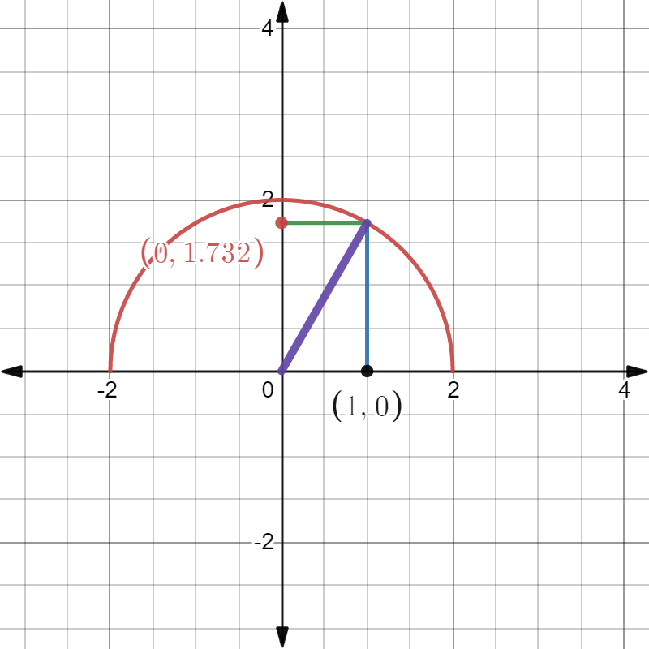

# $\S$5.2 基本共识、定理及其计算
> 可积函数未必有原函数，有原函数的函数未必可积。
## 一、微积分基本定理
定义1（变限积分）：设 $f(x)$ 在 $[a,b]$ 连续，$\forall x\in [a,b]$，$f(x)$ 在 $[a,x]$ 上可积

称 $\phi (x)=\int_a^x f(t)\mathrm dt \quad x\in[a,b]$ 为变上限积分，$\psi (x)=\int_x^bf(t)\mathrm dt \quad x\in[a,b]$ 为变下限积分；统称为变限积分。

定理1：设 $f(x)$ 在 $[a,b]$ 上连续，则 $\phi (x)=\int_a^xf(t)\mathrm dt$ 在 $[a,b]$ 上处处可导，且 $\phi'(x)=\dfrac{\mathrm d}{\mathrm dx}\int_a^xf(t)\mathrm dt = f(x)\quad x\in [a,b]$

定理2：若 $F(x)$ 为连续函数 $f(x)$ 在 $[a,b]$ 的一个原函数，有
$$
\int_a^bf(x)\mathrm dx=F(b)-F(a)=F(x)|_a^b
$$
[牛顿-莱布尼兹公式]

### 例题
1. $[\int_a^{x^2}f(t)\mathrm dt]'=f(x^2)\cdot 2x$

$[\int_a^{x^2}xf(t)\mathrm dt]'=[x \int_a^{x^2}f(t)\mathrm dt]'=\int_a^{x^2}f(t)\mathrm dt+x\cdot f(x^2)\cdot 2x=f(x^2)\cdot 2x+2x^2f(x^2)=2x(x+1)f(x^2)$

2.
$$
\begin{align*}
\int_e^{e^2}\dfrac{1}{x\ln x}&\mathrm dx=\ln |\ln x||_e^{e^2}=\ln 2 \\
\int \dfrac{1}{x\ln x}\mathrm dx&=\int \dfrac{1}{\ln x}\mathrm d\ln x=\ln |\ln x|+C
\end{align*}
$$

---

$$
\begin{align*}
f(x)&=\begin{cases}3x^2-1,-1\le x\le 0\\e^{2x},0\le x\le 1\end{cases}\\
\int_{-1}^1f(x)\mathrm dx&=\int_{-1}^0f(x)\mathrm dx+\int_0^1f(x)\mathrm dx\\
&=\int_{-1}^0(3x^2-1)\mathrm dx+\int_0^1e^{2x}\mathrm dx\\
&=(x^3-x)|_{-1}^0+\dfrac{1}{2}e^{2x}|_0^1\\
&=\dfrac{1}{2}(e^2-1)
\end{align*}
$$

---

$$
\begin{align*}
\int_{-2}^2\max\{x,x^2\}\mathrm dx&=\int_{-2}^0x^2 \mathrm dx+\int_0^1x \mathrm dx+\int_1^2 x^2 \mathrm dx\\
&=\dfrac{1}{3}x^3|_{-2}^0+\dfrac{1}{2}x^2|_0^1+\dfrac{1}{3}x^3|_1^2\\
&=\dfrac{8}{3}+\dfrac{1}{2}+\dfrac{7}{3}\\
&=\dfrac{11}{2}
\end{align*}
$$

---

$\int_0^ye^t \mathrm dt+\int_0^x\cos t \mathrm dt=0$，求 $\dfrac{\mathrm dy}{\mathrm dx}$

法一：$e^y-1+\sin x=0$

两边对x求导
$e^y\cdot y'-0+\cos x=0 \Rightarrow y'=-\dfrac{\cos x}{e^y}=\dfrac{\cos x}{\sin x-1}$

法二：两边对x求导

$e^y\cdot y'+\cos x=0 \Rightarrow y'=-\dfrac{\cos x}{e^y}=\dfrac{\cos x}{\sin x-1}$

3.
$$
\begin{align*}
\lim_{x\to 0}\dfrac{\int_0^{x^2}\sin t \mathrm dt}{x^4}&=\lim_{x\to 0}\dfrac{sin x^2\cdot 2x}{4x^3}\\
&=\lim_{x\to 0}\dfrac{2\sin x^2}{4\cdot x^2}\\
&=\dfrac{1}{2}
\end{align*}
$$

4. 证明 $g(y)=\int_0^y[\int_0^xf(t)\mathrm dt]\mathrm dx\quad h(y)=\int_0^yf(x)(y-x)\mathrm dx \Rightarrow g(y)=h(y)$，$y\in[0,+\infty]$，$f(x)$ 连续

证：$g'(y)=\int_0^yf(t)\mathrm dt=\dfrac{\mathrm dg(y)}{y}$

$$
\begin{align*}
h'(y)&=[\int_0^yf(x)y \mathrm dx-\int_0^y xf(x)\mathrm dx]'\\
&=\int_0^yf(x)\mathrm dx+yf(y)-yf(y)\\
&=\int_0^yf(x)\mathrm dx=g'(y)
\end{align*}
$$

$\therefore g(y)=h(y)+C$

$y=0$ 时，$g(0)=0=h(0)$

$\therefore C=0$，即 $g(y)=h(y)$

5. $f(x)=x^2-x\int_0^2f(x)\mathrm dx+2\int_0^1 \mathrm dx$，求 $f(x)$

解：设 $a=\int_0^2f(x)\mathrm dx$，$b=\int_0^1f(x)\mathrm dx$

$f(x)=x^2-ax+2b$

$a=\int_0^2(x^2-ax+2b)\mathrm dx=\dfrac{8}{3}-2a+4b$

$b=\int_0^1(x^2-ax+2b)\mathrm dx=\dfrac{1}{3}-\dfrac{a}{3}+2b$

$$
\begin{align*}
\begin{cases}
3a-4b&=\dfrac{8}{3}\\
\dfrac{a}{2}-b&=\dfrac{1}{3}
\end{cases} \Rightarrow
\begin{cases}
a&=\dfrac{4}{3}\\
b&=\dfrac{1}{3}
\end{cases}
\end{align*}
$$

$\therefore f(x)=x^2-\dfrac{4}{3}x+\dfrac{1}{3}$

6.
$$
\begin{align*}
\lim_{n\to \infty}\dfrac{1}{n}(\sin\dfrac{1}{n}+\sin \dfrac{2}{n}+\cdots+\sin \dfrac{n}{n})&=\lim_{n\to \infty}(\sum_{i=1}^n\sin\dfrac{1}{n})\dfrac{1}{n}\\
&=\lim_{n\to \infty}(\sum_{i=1}^n(\sin \dfrac{1}{n}\cdot \dfrac{1}{n}))\\
&=\lim_{n\to \infty}\sum_{i=1}^nf(\dfrac{i}{n})\cdot \Delta x_i\\
&=\int_0^1\sin x \mathrm dx\\
&=-\cos x|_0^1\\
&=1-\cos 1
\end{align*}
$$

---

$a_n=\dfrac{1}{n}\sqrt[n]{(n+1)(n+2)(n+3)\cdots(n+n)}$，求 $\displaystyle \lim_{n\to \infty}a_n$

解：
$$
\begin{align*}
\lim_{n\to \infty}\ln a_n&=\ln \dfrac{1}{n}+\dfrac{1}{n}[\ln(n+1)+\ln(n+2)+\cdots+\ln(n+n)]\\
&=\dfrac{1}{n}[\ln (n+1)+\ln(n+2)+\cdots+\ln(n+n)-n\ln n]\\
&=\dfrac{1}{n}[\ln(1+\dfrac{1}{n})+\ln(1+\dfrac{2}{n})+\cdots+\ln(1+\dfrac{n-1}{n})]\\
&=\int_0^1\ln(1+x)\mathrm dx\\
&=2\ln 2-1
\end{align*}
$$

$\displaystyle \therefore \lim_{n\to \infty}a_n=e^{2\ln 2-1}=\dfrac{4}{e}$

## 二、定积分的换元法和分部积分
1. [换元法]
$$
\begin{align*}
\int_a^bf(x)\mathrm dx\overset{x=\varphi (t)}{=}\int_\alpha^\beta f[\varphi(t)]\varphi'(t)\mathrm dt
\end{align*}
$$
其中 $x:a\to b$，$t:\alpha \to \beta$，$\varphi (\alpha)=a$，$\varphi (\beta)=b$

2. [偶倍奇零] $f(x)$ 在 $[-a,a]$ 上连续：
$$
\begin{align*}
f(-x)=f(x) &\Rightarrow \int_{-a}^af(x)\mathrm dx=2\int_0^af(x)\mathrm dx\\
f(-x)=-f(x)&\Rightarrow \int_{-a}^af(x)\mathrm dx=0
\end{align*}
$$

3. $f(x)=f(x+T)\Rightarrow \int_a^{a+T}f(x)\mathrm dx=\int_0^Tf(x)\mathrm dx$

证明：
$$
\begin{align*}
\int_a^{a+T}f(x)\mathrm dx&=\int_a^0f(x)\mathrm dx+\int_0^Tf(x)\mathrm dx+\int_T^{a+T}f(x)\mathrm dx\\
&=\int_0^af(t+T)\mathrm dt\quad(t=x-T)\\
&=\int_0^af(t)\mathrm dt
\end{align*}
$$

> 推论 $f(x)=f(x+T)\Rightarrow \int_a^{a+nT}f(x)\mathrm dx=n\int_0^Tf(x)\mathrm dx$

4. [分部积分法]
$$
\begin{align*}
\int_a^bu \mathrm dv = (uv)|_a^b-\int_a^b v \mathrm du
\end{align*}
$$

### 例题
1. 求 $\displaystyle \int_0^1 \sqrt{4-x^2}\mathrm dx$

法一：
$$
\begin{align*}
\int \sqrt{4-x^2}\mathrm dx&\overset{x=2\cos t}{=}\int 2^2 \cos ^2t \mathrm dt\\
&=2\int (1+\cos2t)\mathrm dt\\
&=2t+\sin 2t+C\\
&=2\arcsin \dfrac{x}{2}+x\dfrac{\sqrt{4-x^2}}{2}+C=F(x)
\end{align*}
$$

原式 $=F(x)|_0^1=\dfrac{\pi}{3}+\dfrac{\sqrt{3}}{2}$

法二：
$$
\begin{align*}
原式&\overset{x=2\sin t}{=}\int_0^{\frac{\pi}{6}}2^2\cos^2t\mathrm dt\\
&=(2t+\sin 2t)|_0^{\frac{\pi}{6}}\\
&=\dfrac{\pi}{3}+\dfrac{\sqrt{3}}{2}
\end{align*}
[x:0\to 1, \sin t :0\to \dfrac{1}{2},t:0\to \dfrac{\pi}{6}]
$$

法三：

$$
\begin{align*}
S&=\dfrac{1}{2}\times 1\times \sqrt{3}+\dfrac{30}{360}\times 2^2 \times \pi \\
&=\dfrac{\pi}{3}+\dfrac{\sqrt{3}}{2}
\end{align*}
$$

2. $\displaystyle \int_0^{\frac{\pi}{2}}\dfrac{\cos x}{1+\sin ^2x}\mathrm dx$

法一：
$$
\begin{align*}
\int \dfrac{\cos x}{1+\sin ^2x}\mathrm dx&=\int \dfrac{1}{1+\sin^2x}\mathrm d\sin x\\
&=\arctan(\sin x)+C
\end{align*}
$$

原式 $=\arctan(\sin x)|_0^{\frac{\pi}{2}}=\dfrac{\pi}{4}$

---

法二：
$$
\begin{align*}
原式 &\overset{u=\sin x}=\int_0^1\dfrac{1}{1+u^2}\mathrm du\\
&=\arctan u|_0^1\\
&=\dfrac{\pi}{4}
\end{align*}
$$

3. $\displaystyle \dfrac{\mathrm d}{\mathrm dx}\int_0^x\sin^{100}(x-t)\mathrm dt$

解：

$\int_0^x \sin^{100}(x-t)\mathrm dt\overset{u=x-t}{=}\int_x^0\sin^{100}u(-1)\mathrm du$

原式 $=\dfrac{\mathrm d}{\mathrm dx}=\int_0^x \sin^{100}u \mathrm du=\sin^{100}x$

4.
$$
\begin{align*}
\int_0^{n\pi}\sqrt{1+\sin 2x}\mathrm dx&=n\int_0^\pi\sqrt{\sin^2x+\cos^2x+2\sin x\cos x}\mathrm dx\\
&=n\int_0^\pi |\sin x+\cos x|\mathrm dx\\
&=\sqrt{2}n\int_0^\pi|\sin(x+\dfrac{\pi}{4})|\mathrm dx\\
&=\sqrt{2}n(\int_0^{\frac{3}{4}\pi}\sin(x+\dfrac{\pi}{4})\mathrm dx-\int_{\frac{3}{4}\pi}^\pi\sin(x+\dfrac{\pi}{4})\mathrm dx)\\
&=2\sqrt{2}n
\end{align*}
$$

5.
$$
\begin{align*}
\int_{-1}^1\dfrac{2x^2+x\cos x}{1+\sqrt{1-x^2}}\mathrm dx&=\int_{-1}^1\dfrac{2x^2}{1+\sqrt{1-x^2}}\mathrm dx+\int_{-1}^1\dfrac{x\cos x}{1+\sqrt{1-x^2}}\mathrm dx\\
&=4\int_0^1\dfrac{x^2}{1+\sqrt{1-x^2}}\mathrm dx+0\\
&=4\int_0^1\dfrac{x^2(1-\sqrt{1-x^2})}{x}\mathrm dx\\
&=4\int_0^1(1-\sqrt{1-x^2})\mathrm dx\\
&=4\int_0^11 \mathrm dx-4\int_0^1\sqrt{1-x^2}\mathrm dx\\
&=4-\pi
\end{align*}
$$

6. 求 $\displaystyle \int_0^{\frac{\pi}{4}}\sec ^3x \mathrm dx$

法一：设原式 $=I$

$$
\begin{align*}
I&=\int_0^{\frac{\pi}{4}}\sec^2x \sec x\mathrm dx\\
&=\int_0^{\frac{\pi}{4}}\underset{u}{\sec x}\mathrm d\underset{v}{\tan x}\\
&=\sec x\tan x|_0^{\frac{\pi}{4}}-\int_0^{\frac{\pi}{4}}\tan ^2x\sec x \mathrm dx\\
&=\sqrt{2}-\int_0^{\frac{\pi}{4}}(\sec ^2x-1)\sec x \mathrm dx\\
&=\sqrt{2}-\int_0^{\frac{\pi}{4}}\sec ^3x \mathrm dx+\int_0^{\frac{\pi}{4}}\sec x \mathrm dx\\
&=\sqrt{2}-I+[\ln |\sec x+\tan x|]|_0^{\frac{\pi}{4}}\\
&=\sqrt{2}-I+\ln(\sqrt{2}+1)
\end{align*}
$$

$\therefore I=\dfrac{1}{2}[\sqrt{2}+\ln(\sqrt{2}+1)]$

---

法二：
$$
\begin{align*}
原式&=\int_0^{\frac{\pi}{4}}\dfrac{1}{\cos ^3x}\mathrm dx\\
&=\int_0^{\frac{\pi}{4}}\dfrac{1}{(1-\sin ^2x)^2}\mathrm d\sin x\\
&\overset{t=\sin x}{=}\int_0^{\frac{\sqrt{2}}{2}}\dfrac{1}{(1-t^2)^2}\mathrm dt\\
&=\int_0^{\frac{\sqrt{2}}{2}}\dfrac{\frac{1}{4}}{1-t}\mathrm dt+\int_0^{\frac{\sqrt{2}}{2}}\dfrac{\frac{1}{4}}{(1-t)^2}\mathrm dt+\int_0^{\frac{\sqrt{2}}{2}}\dfrac{\frac{1}{4}}{1+t}\mathrm dt+\int_0^{\frac{\sqrt{2}}{2}}\dfrac{\frac{1}{4}}{(1+t)^2} \mathrm dt\\
&=\cdots\\
&=\dfrac{1}{2}[\sqrt{2}+\ln(\sqrt{2}+1)]
\end{align*}
$$

7. $f''(x)$ 在 $[0,1]$ 连续，$f(0)=1,f(2)=3,f'(2)=5$，求 $\displaystyle \int_0^1xf''(2x)\mathrm dx$

解：
$$
\begin{align*}
原式&=\dfrac{1}{2}\int_0^1x \mathrm df'(2x)\\
&=\dfrac{1}{2}[xf'(2x)|_0^1-\int_0^1f'(2x)\mathrm dx]\\
&=\dfrac{1}{2}[1\times f'(2)-0-\dfrac{1}{2}\int_0^1 \mathrm df(2x)]\\
&=\dfrac{1}{2}[f'(2)-\dfrac{1}{2}[f(2)-f(0)]]=2
\end{align*}
$$

8. 求 $I_n=\int_0^{\frac{\pi}{2}}\sin^nx \mathrm dx$，$J_n=\int_0^{\frac{\pi}{2}}\cos^nx \mathrm dx$

解：$J_n\overset{x=\frac{\pi}{2}-t}{=}\int_{\frac{\pi}{2}}^0-\cos^n(\dfrac{\pi}{2}-t)\mathrm dt=\int_0^{\frac{\pi}{2}}\sin ^nt \mathrm dt=I_n$

$I_0=\int_0^{\frac{\pi}{2}}1 \mathrm dx=\dfrac{\pi}{2}$

$I_1=\int_0^{\frac{\pi}{2}}\sin x \mathrm dx=-\cos x|_0^{\frac{\pi}{2}}=1$

$$
\begin{align*}
I_n&=-\int_0^{\frac{\pi}{2}}\sin^{n-1}x \mathrm d\cos x\\
&=-\sin ^{n-1}x \cos x|_0^{\frac{\pi}{2}}+(n-1)\int_0^{\frac{\pi}{2}}x\cos^2x \sin^{n-2}x \mathrm dx\\
&=(n-1)\int_0^{\frac{\pi}{2}}(1-\sin^2x)\sin^{(n-2)}x \mathrm dx\\
&=(n-1)\int_0^{\frac{\pi}{2}}\sin^{(n-2)}x \mathrm dx-(n-1)\int_0^{\frac{\pi}{2}}\sin ^nx \mathrm dx\\
&=(n-1)I_{n-2}-I_n
\end{align*}
$$

$I_n=\dfrac{n-1}{n}I_{n-2}$

$I_{2m}=\dfrac{(2m-1)!!}{(2m)!!}\cdot \dfrac{\pi}{2}$

$I_{2m+1}=\dfrac{(2m)!!}{(2m+1)!!}$
