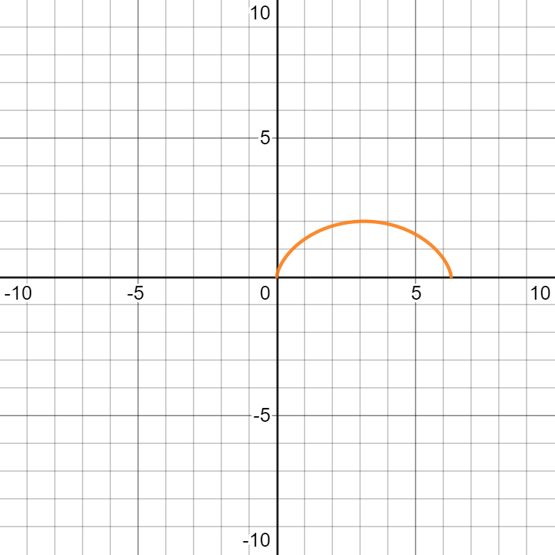

# $\S$5.4 定积分的应用
## 一、定积分的微元法
定义：
$$
\int_a^bf(x)\mathrm dx=\lim_{x\to 0}\sum_{i=1}^nf(\xi_i)\Delta x_i
$$

1. 分割
2. 代替
3. 求和
4. 取极限
$$
\begin{align*}
A&=\int_a^bf(x)\mathrm dx\\
A(x)&=\int_a^xf(t)\mathrm dt\\
\mathrm dA(x)&=f(x)\mathrm dx\\
\mathrm dA&=f(x)\mathrm dx
\end{align*}
$$

$$
\underset{曲}{\Delta A_i}\approx \underset{直}{f(\xi_i)\Delta x_i}
$$
## 二、几何应用
### 1. 面积
1. 直角坐标下

$$
A=\int_a^bf(x)\mathrm dx
$$
---

$$
A=\int_a^b|f(x)|\mathrm dx
$$
---

$$
A=\int_a^b|f(x)-g(x)|\mathrm dx
$$
---

$$
A=\int_c^dg(y)\mathrm dy
$$

---
例：求 $y^2=2x$ 与 $y=x-4$ 所围面积

解：
$$
\begin{cases}
y^2=2x\\
y=x-4
\end{cases}
\Rightarrow
\begin{cases}
x=2\\
y=-2
\end{cases}
或
\begin{cases}
x=8\\
y=4
\end{cases}
$$

法1：
$$
\begin{align*}
A&=\int_0^8[f(x)-g(x)]\mathrm dx\\
&=\int_0^2[\sqrt{2x}-(-\sqrt{2x})]\mathrm dx+\int_2^8[\sqrt{2x}-(x-4)]\mathrm dx\\
&=\dfrac{4}{3}\sqrt{2}x^{\frac{3}{2}}|_0^2+(4x+\dfrac{2}{3}\sqrt{2}x^{\frac{3}{2}}-\dfrac{1}{2}x^2)|_2^8=18
\end{align*}
$$

法2：
$g(x)=\begin{cases}-\sqrt{2x} \quad x\in (0,2)\\x-4\quad x\in(2,8)\end{cases}$

$$
\begin{align*}
A&=\int_{-2}^4[(y+4)-\dfrac{y^2}{2}]\mathrm dy\\
&=(\dfrac{1}{2}y^2+4y-\dfrac{1}{6}y^3)|_{-2}^4\\
&=18
\end{align*}
$$

2. 极坐标下
$$
\begin{align*}
\Delta A_i&\approx \dfrac{1}{2}\phi^2(\xi_i)\Delta \theta_i\\
\mathrm dA&=\dfrac{1}{2}\phi^2(\theta)\mathrm d\theta\\
A&=\int_\alpha^\beta \dfrac{1}{2}\phi^2(\theta)\mathrm d\theta
\end{align*}
$$
---

例：
1. 求 $r^2=a^2\cos 2\theta$ 所围面积
$$
\begin{align*}
A&=4\int_0^{\frac{\pi}{4}}\dfrac{1}{2}\phi^2(\theta)\mathrm d\theta\\
&=2\int_0^{\frac{\pi}{4}}a^2\cos 2\theta \mathrm d\theta\\
&=2a^2\times \dfrac{1}{2}\sin 2\theta|_0^{\frac{\pi}{4}}\\
&=a^2
\end{align*}
$$

2. 求 $\rho=2\cos \theta$ 所围面积
$$
\begin{align*}
A&=2\int_0^{\frac{\pi}{2}}\dfrac{1}{2}4\cos^2\theta \mathrm d\theta\\
&=2\cdot (\theta+\dfrac{1}{2}\sin 2\theta)|_0^{\frac{\pi}{2}}\\
&=\pi
\end{align*}
$$

---

3. 参数形式
$$
\begin{align*}
\begin{cases}
x=\phi(t)\\
y=\psi(t)
\end{cases}
,\alpha \le r \le \beta
\end{align*}
$$
则有
$$
A=\int_\alpha^\beta|\phi(t)\psi'(t)|\mathrm dt, x:a\to b, t:\alpha \to \beta
$$

---
例：$\dfrac{x^2}{a^2}+\dfrac{y^2}{b^2}=1(a\gt 0,b\gt 0)$ 所围面积

解：原式参数方程表示如下
$$
\begin{align*}
\begin{cases}
x=a\cos t\\
y=b\sin t
\end{cases}
, t \in [0,2\pi]
\end{align*}
$$

$$
\begin{align*}
A&=4\int_0^ab\sqrt{1-\dfrac{x^2}{a^2}}\mathrm dx\\
&=4\dfrac{b}{a}\int_0^a\sqrt{a^2-x^2}\mathrm dx\\
&=4\dfrac{b}{a}\int_{\frac{\pi}{2}}^0-a\sin t(a\sin t)\mathrm dt\quad(x=a\cos t)\\
&=4ab\int_0^{\frac{\pi}{2}}\sin^2t \mathrm dt\\
&=4ab\cdot \dfrac{1}{2}\cdot \dfrac{\pi}{2}\\
&=\pi ab
\end{align*}
$$

$A=4\int_0^{\frac{\pi}{2}}|b\sin t\cdot a\sin t|\mathrm dt=4ab\int_0^{\frac{\pi}{2}}\sin^t \mathrm dt=\pi ab$

### 2. 体积
$\Delta V_i\approx f(\xi_i)\Delta x_i \Rightarrow V=\int_a^bA(x)\mathrm dx=\pi \int_a^b[f(x)]^2 \mathrm dx$

#### 例题
1. 求 $\dfrac{x^2}{a^2}+\dfrac{y^2}{b^2}=1$ 绕x轴，y轴旋转一周所围成的体积
* $V_1=\pi \int_{-a}^a\dfrac{b^2}{a^2}(a^2-x^2)\mathrm dx=\dfrac{4}{3}\pi ab^2$
* $V_2=\pi \int_{-b}^ba^2(1-\dfrac{y^2}{b^2})\mathrm dy=\dfrac{4}{3}\pi a^2b$
2. 求 $\dfrac{x^2}{a^2}+\dfrac{y^2}{b^2}+\dfrac{z^2}{c^2}=1$ （椭球面）所围成的体积
$$
\begin{align*}
x&=x_0\\
\dfrac{y^2}{b^2}+\dfrac{z^2}{c^2}&=1-\dfrac{x_0^2}{a^2}\\
S&=\pi \sqrt{b^2(1-\dfrac{x_0^2}{a^2})}\sqrt{c^2(1-\dfrac{x_0^2}{a^2})}=\pi bc(1-\dfrac{x_0^2}{a^2})\\
V&=\int_{-a}^aS \mathrm dx=\dfrac{4}{3}\pi abc
\end{align*}
$$
3. 求 $x^2+y^2=a^2, x^2+z^2=a^2$ 所围立体体积

解：$V=8\int_0^a(a^2-x^2)\mathrm dx=\dfrac{16}{3}a^3$

### 3. 弧长

$$
\begin{align*}
y&=kx\\
l&=\sqrt{(b-a)^2+k^2(b-a)^2}\\
\Delta S_i&\approx \sqrt{(\Delta x)^2+(\Delta y)^2}\\
\mathrm dS&=\sqrt{1+f'^2(x)}\mathrm dx\\
S&=\int_a^b \mathrm dS=\begin{cases}
\int_a^b\sqrt{1+f'^2(x)}\mathrm dx\\
\int_c^d\sqrt{1+g'^2(y)}\mathrm dy
\end{cases}
\end{align*}
$$
---
参数方程
$$
\begin{align*}
\begin{cases}
x=\phi(t)\\
y=\psi(t)
\end{cases}
,\alpha \le t \le \beta, S=\int_\alpha^\beta \sqrt{\phi'^2(t)+\psi'^2(t)}\mathrm dt
\end{align*}
$$
---
极坐标方程
$$
\begin{align*}
r=\rho (\theta),\alpha\le \theta\le \beta,S=\int_\alpha^\beta\sqrt{\rho^2(\theta)+\rho'^2(\theta)} \mathrm d\theta
\end{align*}
$$

#### 例
求 $\begin{cases}x=a(t-\sin t)\\y=a(1-\cos t)\end{cases}(a\gt 0)$ 弧长

解：
$$
\begin{align*}
S&=\int_0^{2\pi}\sqrt{[a(1-\cos t)^2]+(a\sin t)^2}\mathrm dt\\
&=\int_0^{2\pi}\sqrt{a^2-2a^2\cos t+a^2}\mathrm dt\\
&=\sqrt{2}a\int_0^{2\pi}\sqrt{1-\cos t}\mathrm dt\\
&=\sqrt{2}a\cdot \sqrt{2}\int_0^{2\pi}\sin\dfrac{t}{2}\mathrm dt\\
&=2a\cdot 2[(-\cos \dfrac{t}{2})|_0^{2\pi}]=8a
\end{align*}
$$

### 4. 曲率
> 定义：平面曲线上各点的弯曲程度为曲率

$x=x(t),y=y(t),\alpha \le t \le \beta$

* 平均曲率 $\overline{k}=\dfrac{\Delta \alpha}{\Delta S}=\dfrac{\alpha'-\alpha}{\stackrel\frown{PQ}}$
* 曲率 $\displaystyle K=|\lim_{\Delta t\to 0}\dfrac{\Delta \alpha}{\Delta S}|=|\dfrac{\mathrm d\alpha}{\mathrm dS}|$
$\because \alpha(t)=\arctan \dfrac{y'(t)}{x'(t)}, \dfrac{\mathrm dS}{\mathrm dt}=\sqrt{x'^2(t)+y'^2(t)}$
$\therefore \dfrac{\mathrm d\alpha}{\mathrm dS}=\dfrac{\alpha'(t)}{S'(t)}=\dfrac{x'(t)y''(t)-x''(t)y'(t)}{[x'^2(t)+y'^2(t)]^{\frac{3}{2}}}$
$k=\dfrac{|x'y''-x''y'|}{(x'^2+y'^2)^{\frac{3}{2}}}$

* 若曲线由 $y=f(x)$ 给出，则有 $k=\dfrac{|y''|}{(1+y'^2)^{\frac{3}{2}}}$
* 若曲线由 $r=r(\theta)$ 给出，则有 $k=\dfrac{r^2+2r'^2-rr''}{(r^2+r'^2)^{\frac{3}{2}}}$
