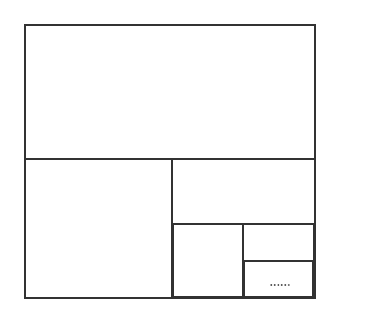

# $\S$7.1 常数项级数的概念与性质
引例：数列 $\dfrac{1}{2},\dfrac{1}{2^2},\dfrac{1}{2^3},\cdots \dfrac{1}{2^n},\cdots$，$\displaystyle \lim_{n\to \infty}\dfrac{1}{2^n}=0$

构造新数列
$$
\begin{align*}
S_1&=\dfrac{1}{2}\\
S_2&=\dfrac{1}{2}+\dfrac{1}{2^2}\\
S_3&=\dfrac{1}{2}+\dfrac{1}{2^2}+\dfrac{1}{2^3}\\
\vdots\\
S_n&=\dfrac{1}{2}+\dfrac{1}{2^2}+\dfrac{1}{2^3}+\cdots +\dfrac{1}{2^n}\\

\lim_{n\to \infty}S_n&=1(=\dfrac{1}{2}+\dfrac{1}{2^2}+\dfrac{1}{2^3}+\cdots +\dfrac{1}{2^n}{\color{Red} +}{\color{Red} \cdots})
\end{align*}
$$

## 一、常数项级数的概念
1. 定义：设有数列 $\{u_n\}$，将 $u_1+u_2+\cdots +u_n {\color{Red} +} {\color{Red} \cdots} \quad(\displaystyle \sum_{n=1}^\infty u_n)$ 称为**常数项无穷级数**，简称**级数**。
    * 其中，$u_n$ 称为级数的**一般项**或**通项**
    * 称 $s_n=u_1+u_2+\cdots +u_n$ 为级数的**部分和**
2. 构造部分和数列 $\{s_n\}$，求 $\displaystyle \lim_{u\to +\infty}s_n$：
    * $\displaystyle \lim_{u\to \infty}s_n=s$，即 $\{s_n\}$ 收敛于 $s$，则称 $\displaystyle \sum_{n=1}^{\infty} u_n$ **收敛**，且收敛于 $s$
        * 此时有 $s=\displaystyle \sum_{n=1}^\infty u_n=u_1+u_2+\cdots +u_n {\color{Red} +} {\color{Red} \cdots}$，$r_n=s-s_n\rightarrow 0(n\to \infty)$（余项）
    * $\displaystyle \lim_{u\to \infty}s_n$ 不存在，即 $\{s_n\}$ 发散，则称 $\displaystyle \sum_{n=1}^{\infty} u_n$ **发散**
### 例题
1. 求 $\displaystyle \sum_{n=1}^\infty\dfrac{1}{2^n}$

    解：
    $$
    \begin{align*}
    S_n&=\dfrac{1}{2}+\cdots +\dfrac{1}{2^n}\\
    &=\dfrac{\frac{1}{2}[1-(\frac{1}{2})^n]}{1-\frac{1}{2}}\\
    &=1-(\dfrac{1}{2})^n\to 1(n\to \infty)
    \end{align*}
    $$

    $\therefore$ 原式 $=1$
2. 判断 $\displaystyle \sum_{n=1}^\infty\dfrac{1}{n(n+1)}$ 的敛散性

    解：此级数收敛，原因如下
    $$
    \begin{align*}
    S_n&=\dfrac{1}{1\times 2}+\dfrac{2}{2\times 3}+\cdots +\dfrac{1}{n(n+1)}\\
    &=1-\dfrac{1}{2}+\dfrac{1}{2}-\dfrac{1}{3}+\cdots+\dfrac{1}{n}-\dfrac{1}{n+1}\\
    &=1-\dfrac{1}{n+1}=\dfrac{n}{n+1}\to 1(n\to \infty)
    \end{align*}
    $$

    即 $\{S_n\}$ 收敛于 1，故所求级数收敛
3. 证明 $\displaystyle \sum_{n=1}^\infty\dfrac{1}{n^2}$ 收敛

    证：$\dfrac{1}{n^2}\lt \dfrac{1}{n(n-1)}=\dfrac{1}{n-1}-\dfrac{1}{n}$

    $$
    \begin{align*}
    S_n&=1+\dfrac{1}{2^2}+\dfrac{1}{3^2}+\cdots+\dfrac{1}{n^2}\\
    & \lt 1+(1-\dfrac{1}{2})+(\dfrac{1}{2}-\dfrac{1}{3})+\cdots+(\dfrac{1}{n-1}-\dfrac{1}{n})\\
    &=2-\dfrac{1}{n}\lt 2(上界)
    \end{align*}
    $$

    $\therefore \displaystyle \sum_{n=1}^\infty \dfrac{1}{n^2}$ 收敛

4. 数列 $\{u_n\}$ 通项为 $u_n=(-1)^{n+1}$，判断 $\displaystyle \sum_{n=1}^\infty u_n$ 敛散性

    解：$S_{2n}=0$，$\displaystyle \lim_{n\to \infty}S_{2n}=0$；$S_{2n+1}=1$，$\displaystyle \lim_{n\to \infty}S_{2n+1}=1$

    $\{S_n\}$ 发散 $\Rightarrow$ 级数发散

5. 讨论等比级数
    $$
    \sum_{n=0}^\infty q^n=1+q+q^2+\cdots +q^n+\cdots
    $$
    的敛散性

    解：
    * $q=1$ 时，$S_n=n$，发散；$q=-1$ 时，为例4结果，发散
    * $|q|\ne 1$ 时，$S_n=\dfrac{1-q^n}{1-q}$
        * 当 $|q| \gt 1$ 时，$q^n \to \infty(n\to \infty)$，$S_n\to \infty(n\to \infty)$，发散
        * 当 $|q| \lt 1$ 时，$q^n \to 0(n\to \infty)$，$S_n\to \dfrac{1}{1-q}(n\to \infty)$，收敛于 $\dfrac{1}{1-q}$

    综上，原级数 $\begin{cases}发散，|q|\ge 1\\ 收敛于\dfrac{1}{1-q}，|q|\lt 1\end{cases}$

    > 推论：[等比级数求和公式]
    > $$
    > a+aq+\cdots +aq^n+\cdots =\dfrac{a}{1-q}
    > $$
    > 其中 $a$ 为首项，$q$ 为公比
    >
    > 级数知识解释 $0.\dot{9}=1$
    >
    > $$
      \begin{align*}
      0.\dot{9}&=0.9+0.09+0.009+\cdots +0.9\times 0.1^{n-1}+\cdots \quad (是首项为0.9，公比为0.1的等比数列)\\
      &=\dfrac{0.9}{1-0.1}=1
      \end{align*}
    > $$

## 二、**收敛**级数的基本性质
1. $\displaystyle \sum_{n=1}^\infty u_n$ 收敛于 $s\Rightarrow \displaystyle \sum_{n=1}^\infty ku_n$ 收敛于 $k\cdot s$（k为常数）
2. $\displaystyle \sum_{n=1}^\infty u_n$ 收敛于 $s$，$\displaystyle \sum_{n=1}^\infty v_n$ 收敛于 $\delta \Rightarrow \displaystyle \sum_{n=1}^\infty (u_n+v_n)$ 收敛于 $s+\delta$，$\displaystyle \sum_{n=1}^\infty (ku_n+lv_n)$ 收敛于 $ks+l\delta$
    * 推论1：$\displaystyle \sum_{n=1}^\infty u_n$ 收敛，$\displaystyle \sum_{n=1}^\infty v_n$ 发散 $\Rightarrow$ $\displaystyle \sum_{n=1}^\infty (u_n+v_n)$ 发散
    * 推论2：$\displaystyle \sum_{n=1}^\infty u_n$ 发散，$\displaystyle \sum_{n=1}^\infty v_n$ 发散 $\Rightarrow$ $\displaystyle \sum_{n=1}^\infty (u_n+v_n)$ 无法确定
3. 在级数中删去、添加或改变有限项不改变收敛性，但级数的和会改变
4. $\displaystyle \sum_{n=1}^\infty u_n$ 收敛，则对其中任意添加括号后产生的新级数也收敛
    * 推论：加括号后产生的新级数发散，则原级数发散。
5. 级数收敛的必要条件
    $$
    \sum_{n=1}^\infty u_n收敛\Rightarrow \lim_{n\to \infty}u_n=0
    $$

    * 推论

        $$
        \lim_{n\to \infty}u_n\ne 0\Rightarrow \sum_{n=1}^\infty u_n 发散
        $$

### 例题
证明
$$
\dfrac{1}{\sqrt{2}-1}-\dfrac{1}{\sqrt{2}+1}+\dfrac{1}{\sqrt{3}-1}-\dfrac{1}{\sqrt{3}+1}+\cdots +\dfrac{1}{\sqrt{n}-1}-\dfrac{1}{\sqrt{n}+1}+\cdots
$$
发散

证：令 $u_n=\dfrac{1}{\sqrt{n}-1}-\dfrac{1}{\sqrt{n}+1}=\dfrac{2}{n-1}$

$\displaystyle \sum_{n=2}^\infty \dfrac{2}{n-1}=\sum_{n=1}^\infty\dfrac{2}{n}\rightarrow$ 证明 $\displaystyle \sum_{n=1}\infty \dfrac{1}{n}$（调和级数）发散

反证法：设 $\displaystyle \sum_{n=1}^\infty \dfrac{1}{n}$ 收敛于 $s$，则 $\{s_n\}$ 收敛于 $s$，$\{s_{2n}\}$ 收敛于 $s$

$$
\begin{align*}
S_{2n}-S_n&=\dfrac{1}{n+1}+\dfrac{1}{n+2}+\cdots+\dfrac{1}{n+n}\\
&\ge \dfrac{1}{n+n}+\dfrac{1}{n+n}+\cdots+\dfrac{1}{n+n}(n项)=\dfrac{1}{2}
\end{align*}
$$

$\displaystyle \lim_{n\to \infty}(S_{2n}-S_n)\ge \dfrac{1}{2}$，与假设矛盾

$\therefore \displaystyle \sum_{n=1}^\infty \dfrac{1}{n}$ 发散，从而原级数发散
