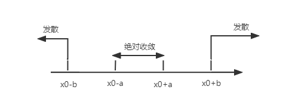

# $\S$7.3 幂级数
## 一、函数项级数
定义：$u_a(x)$ 是定义在I上的函数，称 $\displaystyle \sum_{n=1}^\infty u_n(x)$ 是定义在I上的函数项级数

对于 $x_0\in I$，若 $\displaystyle \sum_{n=1}^\infty u_n(x_0)$ 收敛，则称 $x_0$ 为 $\displaystyle \sum_{n=1}^\infty u_n(x)$ 的收敛点；否则，称 $x_0$ 为发散点。所有的收敛点构成的集合称为收敛域。在收敛域上，有 $\displaystyle s(x)=\sum_{n=1}^\infty u_n(x)$

例如：$\displaystyle \sum_{n=1}^\infty x^n$ 收敛域 $(-1,1)$，$s(x)=\displaystyle \sum_{n=1}^\infty \dfrac{x}{1-x}, x\in (-1,1)$；$\displaystyle \sum_{n=2}^\infty x^n=\dfrac{x^2}{1-x},x\in (-1,1)$，$\displaystyle \sum_{n=2}^\infty (-x)^{n-2}=\dfrac{1}{1+x},x\in (-1,1)$

## 二、幂级数的收敛半径及收敛域
### 收敛域
> 讨论敛散性

求法步骤：
1. [比值法/极值法] $\displaystyle \rho(x)=\lim_{n\to \infty}\left|\dfrac{u_{n+1}(x)}{u_n(x)}\right|$ 或 $\displaystyle \lim_{n\to \infty}\sqrt[n]{|u_n(x)|}$
2. $\rho(x)\lt 1 \Rightarrow x\in(a,b)$ 绝对收敛
3. $\rho(x)=1$，将 $x=a$、$x=b$ 代入检查 $\displaystyle \sum_{n=1}^\infty u_n(a)$、$\displaystyle \sum_{n=1}^\infty u_n(b)$ 敛散性
4. 得到收敛域：$(a,b),[a,b],[a,b),(a,b]$

#### 定义1
$\displaystyle \sum_{n=0}^\infty a_n(x-x_0)^n=a_0+a_1(x-x_0)+a_2(x-x_0)^2+\cdots$ 在 $x=x_0$ 处收敛，$s(x_0)=a_0$
#### 定理1（Abel定理）
1. 若 $\displaystyle \sum_{n=0}^\infty a_nx^n$ 在 $x=x_0\ne 0$ 处收敛，则 $\displaystyle \sum_{n=0}^\infty a_nx^n$ 在 $(-|x_0|,|x_0|)$ 绝对收敛
2. 若 $\displaystyle \sum_{n=0}^\infty a_nx^n$ 在 $x=x_1$ 处发散，则 $\displaystyle \sum_{n=0}^\infty a_nx^n$ 在 $(-\infty,-|x_1|)\cup(|x_1|,+\infty)$ 绝对收敛
#### 例题
1. 求 $\displaystyle \sum_{n=1}^\infty \dfrac{(x^2+x+1)^n}{n(n+1)}$ 的收敛域

    解：$\rho(x)=\displaystyle \sum_{n=1}^\infty \sqrt[n]{\dfrac{(x^2+x+1)^n}{n(n+1)}}=x^2+x+1\lt 1,-1\lt x\lt 0$

    $x=-1$，$\displaystyle \sum_{n=1}^\infty \dfrac{1}{n(n+1)}$ 收敛，$x=0$，$\displaystyle \sum_{n=1}^\infty \dfrac{1}{n(n+1)}$ 收敛。故收敛域为：$[-1,0]$

2. 求 $\displaystyle \sum_{n=1}^\infty \dfrac{(-1)^n}{n}\left(\dfrac{x-1}{2x+1}\right)^n$ 的收敛域

    解：
    $$
    \begin{align*}
    \rho(x)&=\lim_{n\to \infty}\left| \dfrac{(-1)^{n+1}}{n+1}\cdot \left(\dfrac{x-1}{2x+1}\right)^{n+1}\cdot \dfrac{n}{(-1)^n} \cdot \left(\dfrac{x-1}{2x+1}\right)^{-n}\right|\\
    &=\lim_{n\to \infty}\left|\dfrac{x-1}{2x+1}\cdot (-1)\cdot \dfrac{n}{n+1}\right|\\
    &=\left|\dfrac{x-1}{2x+1}\right|
    \end{align*}
    $$

    令 $\rho(x)\lt 1$，则 $-1\lt \dfrac{x-1}{2x+1}\lt 1$，$x\lt -2$ 或 $x\gt 0$。

    当 $x=-2$ 时，$\displaystyle \sum_{n=1}^\infty \dfrac{(-1)^n}{n}$ 收敛；$x=0$ 时，$\displaystyle \sum_{n=1}^\infty \dfrac{1}{n}$ 发散。故收敛域为 $(-\infty,-2]\cup(0, +\infty)$

### 收敛半径
#### 定义2
$\displaystyle \sum_{n=0}^\infty a_nx^n$ 当 $|x|\lt R$ 时绝对收敛，$|x|\gt R$ 时发散，称 $R$ 为收敛半径，$(-R,R)$ 为收敛区间

$\displaystyle \sum_{n=0}^\infty a_n(x-x_0)^n$ 的敛散分布

* 推论
    * 若在 $\displaystyle \sum_{n=0}^\infty a_nx^n$ 在 $x=x_0$ 处收敛，则 $R\ge |x_0|$
    * 若在 $\displaystyle \sum_{n=0}^\infty a_nx^n$ 在 $x=x_0$ 处发散，则 $R\le |x_0|$
    * 若在 $\displaystyle \sum_{n=0}^\infty a_nx^n$ 在 $x=x_0$ 处条件收敛，则 $R= |x_0|$
* $R=0$ 仅在 $x=0$ 处收敛，收敛域为 $\{0\}$
* $R=+\infty$ 对于任意 $x$ 都收敛，收敛域 $(-\infty,+\infty)$
* $0\lt R\lt +\infty$ 对于 $|x|\lt R$ 绝对收敛，$|x|\gt R$ 发散
#### 例题
1. $\displaystyle \sum_{n=1}^\infty a_nx^n$ 在 $x=2$ 处条件收敛，则 $R=2$
2. $\displaystyle \sum_{n=1}^\infty a_n(x-2)^n$ 在 $x=-2$ 处条件收敛，则在 $x=5$ 处<u>绝对收敛</u>， $x=7$ 处<u>无法判断</u>。
#### 定理2
$\displaystyle \sum_{n=0}^\infty a_nx^n$（不缺项），若 $\rho=\displaystyle \lim_{n\to \infty}\left|\dfrac{a_{n+1}}{a_n}\right|$ 或 $\displaystyle \lim_{x \to \infty}\sqrt[n]{|a_n|}$，则：

* $\rho\gt 0$，$R=\dfrac{1}{\rho}$，收敛区间 $(-\dfrac{1}{\rho},\dfrac{1}{\rho})$
* $\rho=0$，$R=+\infty$
* $\rho=+\infty$，$R=0$
#### 例题II
1. 求幂级数 $\displaystyle \sum_{n=1}^\infty \dfrac{(-1)^{n+1}}{n\cdot 2^n}x^n$ 的R与收敛域

    解：$\rho=\displaystyle \lim_{n\to \infty}\left|\dfrac{a_{n+1}}{a_n}\right|=\lim_{n\to \infty}\dfrac{n}{2(n+1)}=\dfrac{1}{2}$

    $R=\dfrac{1}{\rho}=2$，区间 $(-2,2)$

    $x=2$，级数为 $\displaystyle \sum_{n=1}^\infty \dfrac{(-1)^{n+1}}{n}$，收敛

    $x=-2$，级数为 $\displaystyle \sum_{n=1}^\infty -\dfrac{1}{n}$，发散

    $\therefore$ 收敛域为 $(-2,2]$

2. 求幂级数 $\displaystyle \sum_{n=0}^\infty \dfrac{2+(-1)^n}{3^n}x^n$ 的收敛域

    解：$\rho=\displaystyle \lim_{n\to \infty}\sqrt[n]{\left|\dfrac{2+(-1)^n}{3^n}\right|}=\dfrac{1}{3}$

    $R=\dfrac{1}{\rho}=3$，区间 $(-3,3)$

    $x=3$，$\displaystyle \sum_{n=0}^\infty [2+(-1)^n]$ 发散

    $x=-3$，$\displaystyle \sum_{n=0}^\infty [2\times(-1)^n+1]$ 发散

    $\therefore$ 收敛域为 $D=(-3,3)$

3. 求幂级数 $\displaystyle \sum_{n=1}^\infty \dfrac{(-1)^{n-1}}{3^n}x^{2n+1}$ 的收敛域

    解：$\rho(x)=\displaystyle \lim_{n\to \infty}\left|\dfrac{(-1)^n}{3^{n+1}}\cdot \dfrac{3^n}{(-1)^{n-1}}\cdot \dfrac{x^{2n+3}}{x^{2n+1}}\right|=\dfrac{1}{3}x^2$

    令 $\rho(x)\lt 1$，则 $-\sqrt{3}\lt x\lt \sqrt{3}$

    $x=\sqrt{3}$，$\displaystyle \sum_{n=1}^\infty \sqrt{3}\cdot(-1)^{n-1}$，发散

    $x=-\sqrt{3}$，$\displaystyle \sum_{n=1}^\infty (-\sqrt{3})(-1)^{n-1}$，发散

    $\therefore$ 收敛域 $(-\sqrt{3},\sqrt{3})$

## 三、幂级数的运算
设两级数 $\displaystyle \sum_{n=0}^\infty a_nx^n$ 与 $\displaystyle \sum_{n=0}^\infty b_nx^n$ 的收敛半径分别为 $R_1$ 和 $R_2$。
### 1. 加减法
在收敛域的公共部分，有
$$
\displaystyle \sum_{n=0}^\infty a_nx^n \pm \displaystyle \sum_{n=0}^\infty b_nx^n = \displaystyle \sum_{n=0}^\infty (a_n \pm b_n) x^n
$$
### 2. 乘法
在收敛域的公共部分 $(-R,R) \quad R=\min\{R_1,R_2\}$，有
$$
(\displaystyle \sum_{n=0}^\infty a_nx^n)(\displaystyle \sum_{n=0}^\infty b_nx^n)=\sum_{n=0}^\infty(\sum_{k=0}^na_kb_{n-k})x^n
$$
### 3. 除法
$$
\begin{align*}
\dfrac{\displaystyle \sum_{n=0}^\infty a_nx^n}{\displaystyle \sum_{n=0}^\infty b_nx^n}=\displaystyle \sum_{n=0}^\infty c_nx^n \quad (b_0\ne 0)
\end{align*}
$$
其中 $a_0=b_0c_0$，$a_1=b_1c_0+b_0c_1$，$a_2=b_2c_0+b_1c_1+b_0c_2$……

## 四、幂级数和函数的性质
### 1. 极限与求和可交换
$s(x)$ 在收敛域上（单侧）连续，即 $\displaystyle \lim_{x\to x_0}s(x)=s(x_0)=\sum_{n=0}^\infty \lim_{x\to x_0}a_nx^n$

$$
\lim_{x\to x_0}\sum_{n=0}^\infty a_nx^n=\sum_{n=0}^\infty (\lim_{x\to x_0}a_nx^n)
$$
### 2. 积分与求和可交换
$s(x)$ 在收敛域上可积，其逐项积分公式为

$$
\begin{align*}
\int_0^xs(t)\mathrm dt&=\int_0^x(\sum_{n=0}^\infty a_nt^n)\mathrm dt\\
&=\sum_{n=0}^\infty (\int_0^x a_nt^n \mathrm dt)\\
&=\sum_{n=0}^\infty \dfrac{a_n}{n+1} x^{n+1}
\end{align*}
$$
### 3. 求导与求和可交换
$s(x)$ 在收敛区间可导，其逐项求导公式为

$$
\begin{align*}
s'(x)&=(\sum_{n=0}^\infty a_nx^n)'\\
&=\sum_{n=0}^\infty (a_nx^n)'\\
&=\sum_{n=0}^\infty na_nx^{n-1}
\end{align*}
$$
### 例题
1. $\displaystyle \sum_{n=0}^\infty a_nx^n$ 在 $x=2$ 条件收敛，则 $\displaystyle \sum_{n=0}^\infty na_nx^{n-1}$ 的收敛半径为<u>2</u>。
2. 求 $\displaystyle \sum_{n=1}^\infty \dfrac{(-1)^{n-1}}{n}x^n$ 的和函数

    解：$\rho=\displaystyle \lim_{n\to \infty}\left|\dfrac{n}{n+1}\cdot(-1)\right|=1$，$R=\dfrac{1}{\rho}=1$，收敛区间 $(-1,1)$

    $x=1$，$\displaystyle \sum_{n=1}^\infty \dfrac{(-1)^{n-1}}{n}$ 收敛；$x=-1$，$\displaystyle \sum_{n=1}^\infty (-\dfrac{1}{n})$ 发散

    $\therefore$ 收敛域 $(-1,1]$

    $\displaystyle s'(x)=\sum_{n=1}^\infty (-1)^{n-1}x^{n-1}=\dfrac{1}{1-(-x)}=\dfrac{1}{1+x}$

    $\int_0^x s'(t)\mathrm dt=\int_0^x\dfrac{1}{1+t}\mathrm dt$

    $s(x)-s(0)=\ln(1+x)$

    $s(x)=\ln(1+x),x\in(-1,1)$

    $\because \displaystyle s(1)=\lim_{x\to 1^-}s(x)=\ln 2=\sum_{n=1}^\infty \dfrac{(-1)^{n-1}}{n}$

    综上所述，$s(x)=\ln(1+x),x\in(-1,1]$

3. 求 $\displaystyle \sum_{n=1}^\infty n(n+1)x^n$ 的和函数

    解：易知其收敛域为 $(-1,1)$

    $$
    \begin{align*}
    \int_0^xs(t)\mathrm dt&=\int_0^x \sum_{n=1}^\infty n(n+1)t^n \mathrm dt\\
    &=\sum_{n=1}^\infty \int_0^xn(n+1)t^n \mathrm dt\\
    &=\sum_{n=1}^\infty nx^{n+1} (x\in(-1,1))\\
    &=x^2 \sum_{n=1}^\infty nx^{n-1}
    \end{align*}
    $$

    令 $\displaystyle s_1(x)=\sum_{n=1}^\infty nx^{n-1}$，$\displaystyle \sum_{n=1}^\infty s_1(t)\mathrm dt= \sum_{n=1}^\infty \int_0^xnt^{n-1}\mathrm dt=\sum_{n=1}^\infty x^n=\dfrac{x}{1-x}$

    $s_1(x)=\left(\dfrac{x}{1-x}\right)=\dfrac{1}{(1-x)^2}$

    $\displaystyle \int_0^x s(t)\mathrm dt=x^2s_1(x)=\dfrac{x^2}{(1-x)^2}$

    $s(x)=\left[\dfrac{x^2}{(1-x)^2}\right]'=\dfrac{2x}{(1-x)^3}\quad x\in(-1,1)$

4. 求 $\displaystyle \sum_{n=1}^\infty \dfrac{1}{n(n+1)}x^n$ 的和函数

    解：其收敛域为 $[-1,1]$

    $\displaystyle s(x)=\dfrac{1}{x}\sum_{n=1}^\infty \dfrac{1}{n(n+1)}x^{n+1}\quad(x\ne 0)$

    $\displaystyle s_1(x)=\sum_{n=1}^\infty \dfrac{1}{n(n+1)}x^{n+1}\quad x\in(-1,0)\cup(0,1)$

    $\displaystyle s_1'(x)=\sum_{n=1}^\infty \dfrac{1}{n}x^n$，$\displaystyle s_1''(x)=\sum_{n=1}^\infty x^{n-1}=\dfrac{1}{1-x}$

    $\displaystyle \int_0^xs_1''(t)\mathrm dt=\int_0^x\dfrac{1}{1-t}\mathrm dt$

    $s_1'(x)-s_1'(0)=-\ln|1-t|_0^x$

    $\displaystyle \int_0^xs_1'(t)\mathrm dt=-\int_0^x\ln(1-t)\mathrm dt$

    $s_1(x)-s_1(0)=-\left[\ln(1-t)t|_0^x+\int_0^xt\cdot \dfrac{1}{1-t}\mathrm dt\right]=-x\ln(1-x)+x+\ln(1-x)$

    $s(x)=-\ln(1-x)+1+\dfrac{\ln(1-x)}{x}\quad x\in[-1,0)\cup(0,1)$

    $s(0)=0$，$\displaystyle s(1)=\lim_{x\to 1^-}s(x)=1+\lim_{x\to 1^-}\dfrac{\ln(1-x)(1-x)}{x}=1$

    综上，$s(x)=\begin{cases}1-\ln(1-x)+\dfrac{\ln(1-x)}{x}\quad x\in[-1,0)\cup(0,1)\\0\quad x=0\\1\quad x=1\end{cases}$

5. 求 $\displaystyle \sum_{n=0}^\infty \dfrac{x^n}{n!}$ 的和函数

    解：$\displaystyle \rho=\lim_{n\to \infty}\dfrac{x^{n+1}}{(n+1)!}\cdot \dfrac{n!}{x^n}=0$，$R=+\infty$，收敛域为 $(-\infty,+\infty)$

    $s(x)=\sum_{n=0}^\infty \left(\dfrac{x^n}{n!}\right)'=\sum_{n=1}^\infty \dfrac{x^{n-1}}{(n-1)!}=\sum_{n=0}^\infty \dfrac{x^n}{n!}$

    $s'(x)=s(x)$

    $s(x)=c\cdot e^x$

    $\because s(0)=1$

    $\therefore C=1$，$s(x)=e^x$
