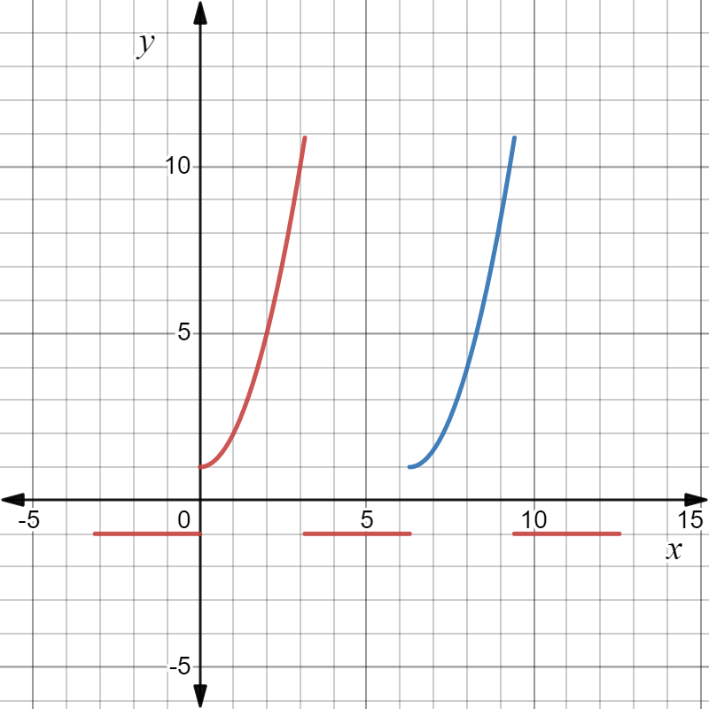
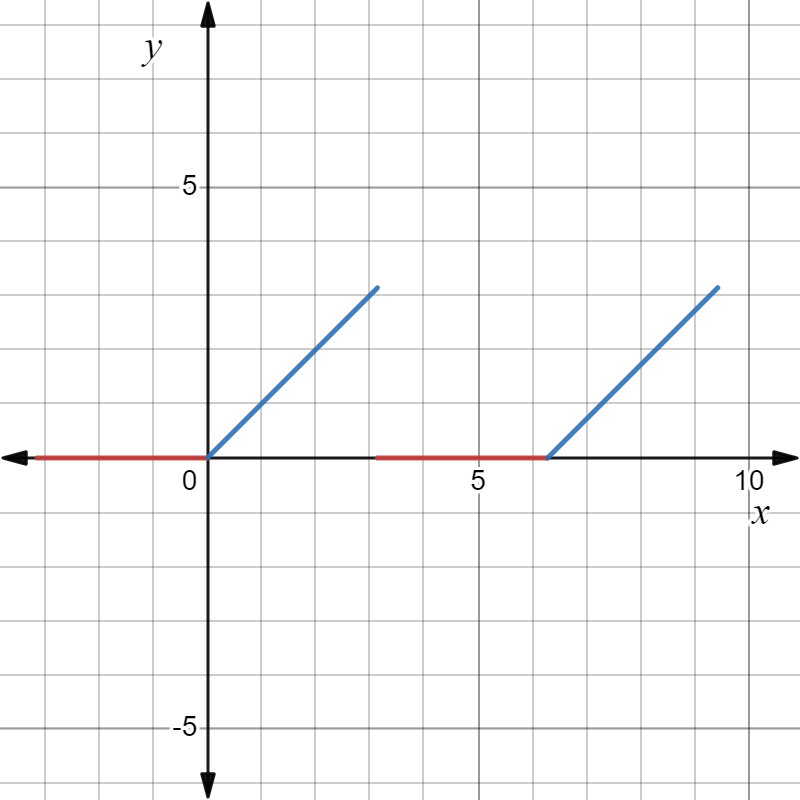
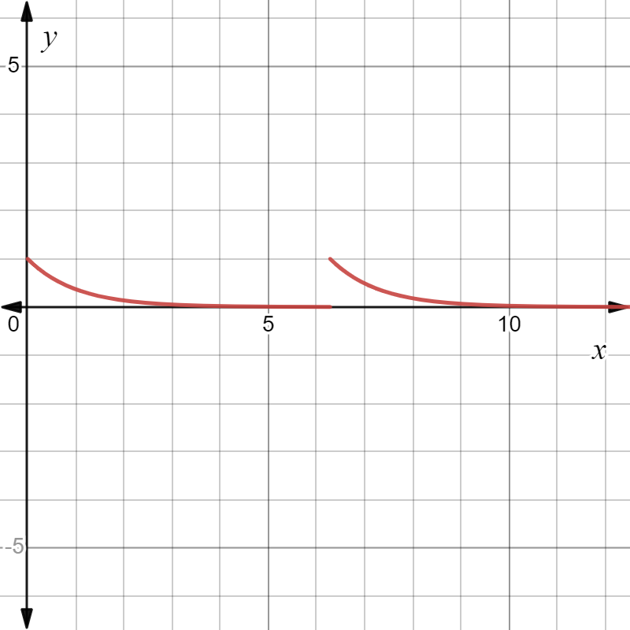
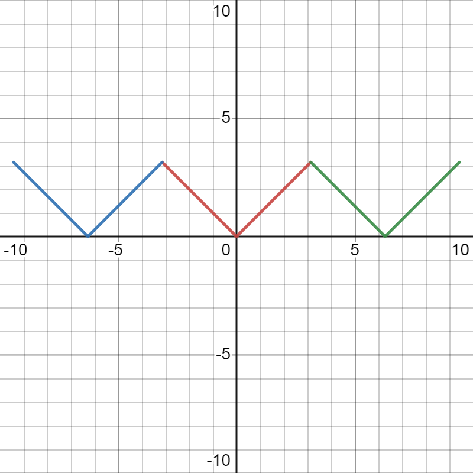
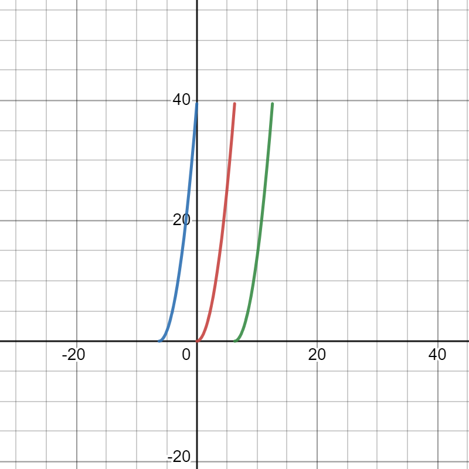
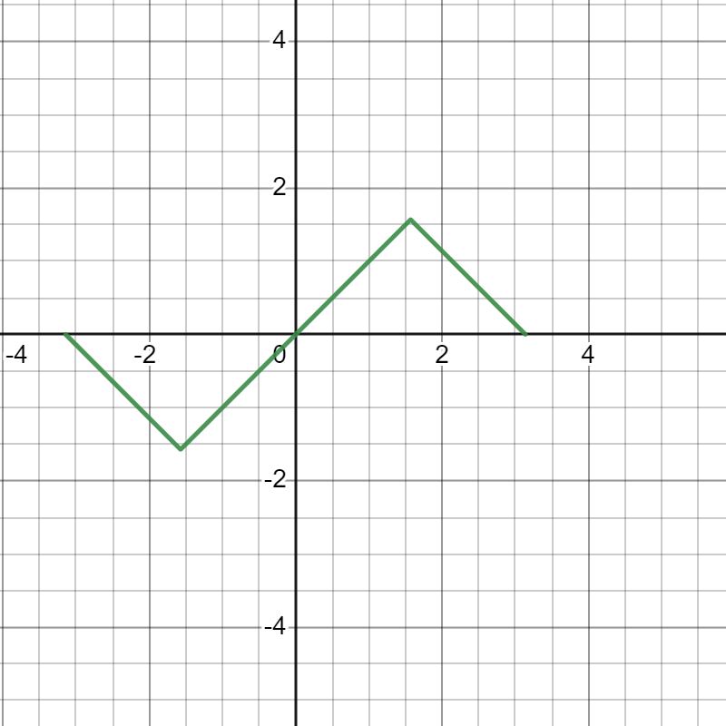

# $\S$7.5 傅里叶级数
## 一、三角级数及三角函数系的正交性
### 三角级数的定义
$$
\begin{align*}
f(t)=\dfrac{a_0}{2}+\sum_{n=1}^\infty (a_n\cos \dfrac{n\pi}{l}x+b_n\sin \dfrac{n\pi}{l}x)
\end{align*}
$$

其中 $a_0$、$b_0$、$b_n$ 都是常数
### 三角级数的正交性
$1$、$\cos \dfrac{\pi}{l}x$、$\sin \dfrac{\pi}{l}x$、$\cos \dfrac{2\pi}{l}x$、$\cos \dfrac{2\pi}{l}x$、$\cdots$、$\cos \dfrac{n\pi}{l}x$、$\cos \dfrac{n\pi}{l}x$ 的线性组合构成了三角级数

三角级数系在 $[-l,l]$ 上正交 $\displaystyle \Leftrightarrow \int_{-l}^lf(x)\cdot g(x)=0$，$f(x)$、$g(x)$ 属于三角函数系
## 二、函数展开为傅里叶级数
$$
\begin{align*}
f(x)\sim \dfrac{a_0}{2}+\sum_{n=1}^\infty (a_n\cos \dfrac{n\pi}{l}x+b_n\sin \dfrac{n\pi}{l}x),T=2l
\end{align*}
$$

其中 $\displaystyle a_0=\dfrac{1}{l}\int_{-l}^lf(x)\mathrm dx$

$\displaystyle a_n=\dfrac{1}{l}\int_{-l}^lf(x)\cos \dfrac{n\pi x}{l}\mathrm dx$，$n=0,1,\cdots$

$\displaystyle b_n=\dfrac{1}{l}\int_{-l}^lf(x)\sin \dfrac{n\pi x}{l}\mathrm dx$，$n=1,2,\cdots$
### Dirichlet 收敛定理
若 $f(x)=f(x+2l)$ 在 $[-l,l]$ 满足
1. 连续或只有一个第一类间断点
2. 至多只有有限个极值点

则 $f(x)$ 的傅里叶级数收敛，并且当
* $x$ 是 $f(x)$ 连续点时，级数收敛于 $f(x)$
* $x$ 是 $f(x)$ 间断点时，级数收敛于 $\dfrac{f(x^-)+f(x^+)}{2}$
### 周期延拓
若 $f(x)$ 定义在 $[-l,l]$ 上，定义
$$
\begin{align*}
\begin{cases}
F(x)=f(x)\\
F(x+2l)=F(x)
\end{cases}
\end{align*}
$$
这样定义的 $F(x)$ 就是周期为 $2l$ 的周期函数
### 例题
1. $f(x)=f(x+2\pi)$，$f(x)=\begin{cases}-1,-\pi \lt x\le 0\\1+x^2,0\lt x\le \pi\end{cases}$，则 $f(x)$ 的傅里叶级数在 $x=\pi$ 和 $x=4\pi$ 分别收敛于 $\dfrac{\pi^2}{2}$ 和 0

    
    利用图像确定连续点和间断点

    $S(\pi)=\dfrac{f(\pi^+)+f(\pi^-)}{2}=\dfrac{\pi^2}{2}$

    $S(4\pi)=0$

2. $f(x)=f(x+2\pi)$，$f(x)=\begin{cases}0,-\pi \le x\lt 0\\x,0\le x\lt \pi\end{cases}$，将 $f(x)$ 展开为傅里叶级数，并求 $\displaystyle \sum_{n=1}^\infty \dfrac{1}{(2n-1)^2}$

    解：
    

    间断点：$x=(2k+1)\pi,k\in Z$

    $a_0=\dfrac{1}{\pi}\int_{-\pi}^{\pi}x \mathrm dx=\dfrac{\pi}{2}$

    $$
    \begin{align*}
    a_n&=\dfrac{1}{\pi}\int_{-\pi}^{\pi}f(x)\cos nx \mathrm dx\\
    &=\dfrac{1}{\pi}\int_{0}^{\pi}x\cos nx \mathrm dx\\
    &=\dfrac{1}{\pi}\cdot \dfrac{1}{n} \int_0^\pi x \mathrm d(\sin nx)\\
    &=\dfrac{1}{n\pi}(x\sin nx|_0^\pi-\int_0^\pi \sin nx \mathrm dx)\\
    &=\dfrac{1}{n\pi}\cdot \dfrac{1}{n}\int_0^\pi \mathrm d\cos nx\\
    &=\dfrac{\cos n\pi-1}{n^2\pi}
    \end{align*}
    $$

    $$
    \begin{align*}
    b_n&=\dfrac{1}{\pi}\int_0^\pi x\sin nx \mathrm dx\\
    &=\dfrac{1}{\pi}(-\dfrac{1}{n})\int_0^\pi x \mathrm d\cos nx\\
    &=-\dfrac{1}{n\pi}(x\cos nx|_0^\pi -\int_0^\pi \cos nx \mathrm dx)\\
    &=-\dfrac{\cos n\pi}{n}\\
    &=\dfrac{(-1)^{n+1}}{n}
    \end{align*}
    $$

    $\displaystyle f(x)=\dfrac{\pi}{4}+\sum_{n=1}^\infty [\dfrac{\cos n\pi -1}{n^2\pi}\cos nx+\dfrac{(-1)^{n+1}}{n}\sin nx],x\ne (2k+1)\pi,k\in Z$

    $a_1=-\dfrac{2}{\pi}\cdot \dfrac{1}{1^2}$，$a_2=0$，$a_3=-\dfrac{2}{\pi}\cdot \dfrac{1}{3^2}$，$a_4=0$……

    $x=0$ 是 $f(x)$ 的连续点，$\displaystyle f(0)=\dfrac{\pi}{4}+\sum_{n=1}^\infty \dfrac{1}{\pi n^2}(\cos n\pi-1)\cdot 1$

    $0=\dfrac{\pi}{4}-\dfrac{2}{\pi}(1+\dfrac{1}{3^2}+\dfrac{1}{5^2}+\cdots)$

    $S=\dfrac{\pi^2}{8}$

3. $f(x)=f(x+2\pi)$，$f(x)=e^{-x}$（$x\in [0,2\pi)$），将 $f(x)$ 展开为傅里叶级数

    解：
    

    间断点：$x=2k\pi,k\in Z$

    $$
    \begin{align*}
    a_n&=\dfrac{1}{\pi}\int_0^{2\pi}e^{-x}\cos nx \mathrm dx\\
    &=\dfrac{1}{n^2\pi}(1-e^{-2\pi})-\dfrac{1}{n^2}a_n
    \end{align*}
    $$

    $a_n=\dfrac{1}{(n^2+1)\pi}(1-e^{-2\pi})\quad(n=0,1,2,\cdots)$

    $b_n=\dfrac{1}{\pi}\int_0^{2\pi}e^{-x}\sin nx \mathrm dx=\dfrac{n}{(n^2+1)\pi}(1-e^{-2\pi})\quad(n=1,2,3,\cdots)$

    $a_0=\dfrac{1}{\pi}\int_0^{2\pi}e^{-x}\mathrm dx=\dfrac{1}{\pi}(1-e^{-2\pi})$

    $\displaystyle f(x)=\dfrac{1-e^{-2\pi}}{2\pi}+\sum_{n=1}^\infty \left[\dfrac{1-e^{-2\pi}}{(1+n^2)\pi}\cos nx+\dfrac{n(1-e^{-2\pi})}{(n^2+1)\pi}\sin nx\right]\quad(x\ne 2k\pi,k\in Z)$

4. $f(x)=|x|$（$x\in [-\pi, \pi]$），将 $f(x)$ 展开为傅里叶级数

    解：

    

    $F(x)=|x|=F(x+2\pi),x\in[-\pi,\pi)$，无间断点

    $\displaystyle f(x)=\dfrac{a_0}{2}+\sum_{n=1}^\infty (a_n\cos nx+b_n\sin nx)$

    $$
    \begin{align*}
    a_n&=\dfrac{1}{\pi}\int_{-\pi}^{\pi}|x|\cos nx \mathrm dx\\
    &=\dfrac{2}{\pi}\int_0^x x\cos nx \mathrm dx\\
    &=\dfrac{2}{n^2\pi}[(-1)^n-1]
    \end{align*}
    $$

    $$
    \begin{align*}
    b_n&=\dfrac{1}{\pi}\int_{-\pi}^\pi|x| \sin nx \mathrm dx=0
    \end{align*}
    $$

    $$
    a_0=\dfrac{2}{\pi}\int_0^\pi x\cdot 1 \mathrm dx=\pi
    $$

    $\displaystyle f(x)=\dfrac{\pi}{2}+\sum_{n=1}^\infty \dfrac{2}{n^2\pi}[(-1)^n-1]\cos nx,x\in [-\pi,\pi]$

5. $f(x)=x^2$（$x\in [0,2\pi]$），将 $f(x)$ 展开为傅里叶级数

    解：

    

    $f(x)\rightarrow F(x)=F(x+2\pi)$，间断点 $x=2k\pi,k\in Z$

    $a_0=\dfrac{1}{\pi}\int_0^{2\pi}x^2 \mathrm dx=\dfrac{8}{3}\pi ^2$

    $a_n=\dfrac{1}{\pi}\int_0^{2\pi}x^2 \cos nx \mathrm dx=\dfrac{4}{n^2}$

    $b_n=\dfrac{1}{\pi}\int_0^{2\pi}x^2\sin nx \mathrm dx=-\dfrac{4\pi}{n}$

    $\displaystyle f(x)=\dfrac{4}{3}\pi^2+\sum_{n=1}^\infty (\dfrac{4}{n^2}\cos nx-\dfrac{4\pi}{n}\sin nx),x\in(0,2\pi)$

## 三、正弦级数和余弦级数
### 正弦级数
只含有正弦函数项
$$
\begin{align*}
f(x)\sim \sum_{n=1}^\infty b_n\sin \dfrac{n\pi x}{l}
\end{align*}
$$
奇函数的傅里叶级数为正弦级数
### 奇延拓
若 $f(x)$ 定义在 $(0,l]$ 上，定义
$$
\begin{align*}
F(x)=
\begin{cases}
f(x) &x\in(0,l]\\
0 &x=0\\
-f(-x) &x\in(-l,0)
\end{cases}
\end{align*}
$$
然后再令 $F(x+2l)=F(x)$，这样定义的 $F(x)$ 就是周期为 $2l$ 的奇函数，它的傅里叶级数是一个正弦级数
### 余弦级数
只含有余弦函数项
$$
\begin{align*}
f(x)\sim \dfrac{a_0}{2}+\sum_{n=1}^\infty a_n \cos \dfrac{n\pi x}{l}
\end{align*}
$$
偶函数的傅里叶级数为余弦级数
### 偶延拓
若 $f(x)$ 定义在 $(0,l]$ 上，定义
$$
\begin{align*}
F(x)=
\begin{cases}
f(x) &x\in(0,l]\\
0 &x=0\\
f(-x) &x\in(-l,0)
\end{cases}
\end{align*}
$$
然后再令 $F(x+2l)=F(x)$，这样定义的 $F(x)$ 就是周期为 $2l$ 的偶函数，它的傅里叶级数是一个余弦级数
### 例题
1. 将 $f(x)=\arcsin(\sin x)$ 在 $[-\pi,\pi]$ 上展开为傅里叶级数

    解：

    $f(x)=\begin{cases}-\pi-x,x\in[-\pi,-\dfrac{\pi}{2})\\x,x\in[-\dfrac{\pi}{2},\dfrac{\pi}{2}]\\\pi-x,x\in(\dfrac{\pi}{2},\pi]\end{cases}$

    $\because F(x)=-F(x)$

    $\therefore a_n=0$

    $b_n=\dfrac{2}{\pi}\int_0^\pi f(x)\sin nx \mathrm dx=\dfrac{4}{n^2\pi}\sin \dfrac{n\pi}{2}$

    $\displaystyle f(x)=\dfrac{4}{\pi}\sum_{n=1}^\infty \dfrac{1}{n^2}\sin \dfrac{n\pi}{2} \sin nx=\dfrac{4}{\pi} \sum_{n=1}^\infty \dfrac{(-1)^{k-1}}{(2k-1)^2}\sin (2k-1)x,x\in[-\pi,\pi]$

2. 将 $f(x)=x$，$x\in[0,1]$ 展开为
    * 傅里叶级数

        解：周期延拓 $F(x)=F(x+1)$，间断点 $x=k,k\in Z$

        $a_n=2\int_0^1 x\cos 2n\pi x \mathrm dx=0(n=1,2,3,\cdots)$

        $a_0=2\int_0^1x \mathrm dx=1$

        $b_n=2\int_0^1 x \sin 2nx \mathrm dx=-\dfrac{1}{n\pi}$

        $\displaystyle x=\dfrac{1}{2}+\sum_{n=1}^\infty (-\dfrac{1}{n\pi})\sin 2n\pi x,x\in(0,1)$

    * 正弦级数

        解：奇延拓 $F(x)=F(x+2)$，间断点 $x=2k+1,k\in Z$

        $a_n=0$

        $b_n=2\int_0^1 x\sin n\pi x \mathrm dx=\dfrac{2}{n\pi}(-1)^{n+1}$

        $\displaystyle x=\dfrac{2}{\pi}\sum_{n=1}^\infty \dfrac{(-1)^{n+1}}{n}\sin n\pi x,x\in[0,1)$

    * 余弦级数

        解：偶延拓，无间断点，$b_n=0$

        $a_0=2\int_0^1 x \mathrm dx=1$

        $a_n=2\int_0^1 x\cos n\pi x \mathrm dx=\dfrac{2}{n^2\pi^2}[(-1)^n-1]$

        $\displaystyle x=\dfrac{1}{2}-\dfrac{4}{\pi^2}\sum_{k=1}^\infty \dfrac{1}{(2k-1)^2}\cos (2k-1)\pi x,x\in[0,1]$
