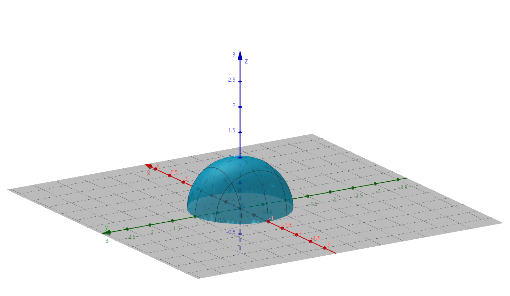

# $\S$8.1 多元函数的基本概念
## 一、平面点集
$$
\begin{align*}
R^2&=\{(x,y)|x\in R 且 y\in R\}\\
E&=\{(x,y)|x与y具有性质/关系Q\}
\end{align*}
$$

### 邻域
$P_0(x_0,y_0)$

* $U(P_0,\delta)=\{P||P_0P|\lt \delta\}$
* $U(P_0)=\{(x,y)|\sqrt{(x-x_0)^2+(y-y_0)^2}\lt \delta\}$
* $\overset{\circ}{U}(P_0,\delta)$【$\overset{\circ}{U}(P_0)$】$=\{P|0\lt|PP_0|\lt\delta\}=\{(x,y)|0\lt \sqrt{(x-x_0)^2+(y-y_0)^2}\lt \delta\}$

### 内点、外点和边界点
$\forall P_0\in R^2,E\subseteq R^2$，$P_0$ 和 $E$ 具有
* 内点：$\exists U(P_0,\delta), U(P_0,\delta)\subset E$
* 外点：$\exists U(P_0,\delta), U(P_0,\delta)\cap E=\emptyset$
* 边界点：$\forall U(P_0,\delta)$，既有E的点又有不属于E的点，其全体为 $\partial E$

> E的内点一定属于E，E的外点一定不属于E，E的边界点可能属于E。

#### 例子
$E=\{(x,y)|1\le x^2+y^2\lt 2\}$

* 内点集合 $E_1=\{(x,y)|1\lt x^2+y^2\lt 2\}$
* 外点集合 $E_2=\{(x,y)|x^2+y^2\lt 1或x^2+y^2\gt 2\}$
* 边界点集合 $\partial E=\{(x,y)|x^2+y^2=1或x^2+y^2=2\}$
### 聚点和孤立点
* 聚点：$\forall \delta \gt 0$，$\overset{\circ}{U}(P_0,\delta)$ 内总有E的点
    * 内点和非孤立的边界点
* 孤立点：$\exists \delta \gt 0$，$U(P_0,\delta)\cap E=\{P_0\}$
#### 例子
$E=\{(x,y)|x^2+y^2\le 1\}\cup\{(2,2)\}$

内点集合 $E_1=\{(x,y)|x^2+y^2\lt 1\}$

$\partial E=\{(x,y)|x^2+y^2=1\}\cup\{(2,2)\}$

聚点集合 $E'=\{(x,y)|x^2+y^2\le 1\}$，孤立点是E的边界点
### 开集和闭集
* 开集：E的点都是E的内点
* 闭集：E的余集为开集
#### 例子
* $E=\{(x,y)|x^2+y^2\lt 1\}$ 是开集
* $E=\{(x,y)|x^2+y^2\le 1\}$ 不是开集
* $R^2=\{(x,y)|x\in R且y\in R\}$ 是开集*也是闭集*
### 有界集和无界集
* 有界集：$\exists \delta \gt 0, E\subset U(O,\delta)$，O为原点
* 无界集：非有界集

> “有界、无界”和”开集、闭集”无必然联系
### 连通集和非联通集
* 联通集：点集E内任何两点都可以用属于E的折线连接起来
* 非联通集
### 开区域和闭区域
* 开区域：联通的开集
    * $\{(x,y)|x\gt 1\}$，开区域
    * $\{(x,y)||x|\gt 1\}$，开集，非开区域
* 闭区域：开区域连同其边界
    * 如 $\{(x,y)|x\ge 1\}$
## 二、多元函数的定义
定义：非空点集 $D\subseteq R^n$，映射 $f:D\rightarrow R$ 称为定义在 $D$ 上的n元函数，$u=f(x_1,x_2,\cdots,x_n)$，$D$ 称为定义域

* 二元函数：$u=f(x,y)$ 或 $z=f(x,y)$，空间曲面 $f(x,y,z)=0$

### 例
$z=\sqrt{1-x^2-y^2}$，$D:\{(x,y)|x^2+y^2\le 1\}$

## 三、多元函数的极限
二元函数 $f(x,y)$ 在 $\overset{\circ}{U}(P_0)$ 有定义（$P_0$ 为聚点），$\forall \epsilon \gt 0$，$\exists \delta$，当 $0\lt \sqrt{(x-x_0)^2+(y-y_0)^2}\lt \delta$ 时，恒有 $|f(x,y)-A|\lt \epsilon$ 成立。记 $\displaystyle A=\lim_{(x,y)\to (x_0,y_0)}f(x,y)=\lim_{x\to x_0,y\to y_0}f(x,y)=\lim_{P\to P_0}f(P)$

> 注：$\displaystyle \lim_{(x,y)\to(x_0,y_0)}f(x,y)\ne \lim_{y\to y_0}\lim_{x\to x_0}f(x,y)\ne \lim_{x\to x_0}\lim_{y\to y_0}f(x,y)$

若 $\displaystyle \lim_{(x,y)\to(x_0,y_0)}f(x,y)【\phi_1 趋向】\ne \lim_{(x,y)\to(x_0,y_0)}f(x,y)【\phi_2 趋向】$，则 $f(x,y)$ 在 $P_0(x_0,y_0)$ 极限不存在

### 例题
1. 求 $\displaystyle \lim_{(x,y) \to (0,0)}(x^2+y^2)\sin\dfrac{1}{x^2+y^2}$

    解：
    法一：令 $t=x^2+y^2$，$\displaystyle \lim_{t\to 0^+}\underset{0}{t}\underset{有界}{\sin \dfrac{1}{t}}=0$

    法二：$\epsilon-\delta$ 定义。$\forall \epsilon \gt 0,\exists \delta$，当 $\sqrt{(x-0)^2+(y-0)^2}\lt \delta$ 时，$|(x^2+y^2)\sin \dfrac{1}{x^2+y^2}|\le x^2+y^2\lt \delta^2 =\epsilon$

    取 $\delta =\sqrt{\epsilon}$ 可使原式成立

2. 求 $\displaystyle \lim_{(x,y) \to (0,0)}(x\sin\dfrac{1}{y}+y\sin\dfrac{1}{x})$

    解：原式 $=\displaystyle \lim_{(x,y) \to (0,0)}x\sin \dfrac{1}{y}+\lim_{(x,y) \to (0,0)}y\sin \dfrac{1}{x}=0+0=0$

    证明：$\forall \epsilon \gt 0, \exists \delta,0\lt \sqrt{(x-0)^2+(y-0)^2}\lt \delta$

    有

    $$
    \begin{align*}
    |x\sin \dfrac{1}{y}+y\sin \dfrac{1}{x}-0|&\le |x\sin \dfrac{1}{y}|+|y\sin \dfrac{1}{x}|\\
    &\le |x|+|y|\\
    &\le 2\sqrt{x^2+y^2}\\
    &\lt 2\delta = \epsilon
    \end{align*}
    $$

    取 $\delta=\dfrac{\epsilon}{2}$ 可使原式成立

3. 求 $\displaystyle \lim_{(x,y) \to (0,0)}\dfrac{2xy}{x^2+y^2}$

    解：
    $$
    \begin{align*}
    \lim_{\overset{(x,y) \to (0,0)}{y=kx}}\dfrac{2xy}{x^2+y^2}&=\lim_{x\to 0}\dfrac{2xkx}{x^2+k^2x^2}\\
    &=\dfrac{2k}{k^2+1}
    \end{align*}
    $$

    与k有关，故极限不存在

4. 求 $\displaystyle \lim_{(x,y) \to (0,0)}\dfrac{2x^2y}{x^2+y^2}$

    解：由夹逼定理得知

    $$
    \begin{align*}
    0\le \left|\dfrac{2x^2y}{x^2+y^2}\right| \le \dfrac{2|x|^2|y|}{2|x||y|}=|x|
    \end{align*}
    $$

    $\therefore \displaystyle \lim_{(x,y) \to (0,0)}f(x,y)=0$

5. 求 $\displaystyle \lim_{(x,y) \to (0,0)} (x^2+y^2)^{xy}$

    解：夹逼定理

    $$
    \begin{align*}
    0\le |xy\ln(x^2+y^2)|\le \left |\dfrac{x^2+y^2}{2}\ln(x^2+y^2)\right|
    \end{align*}
    $$

    原式 $\displaystyle =\lim_{(x,y)\to (0,0)}e^{xy\ln(x^2+y^2)}=1$

6. 求 $\displaystyle \lim_{(x,y) \to (0,0)} \dfrac{x^2y}{x^4+y^2}$

    解：$\displaystyle \lim_{\overset{(x,y) \to (0,0)}{y=kx^2}}f(x,y)=\dfrac{k}{1+k^2}$，与k有关，所以极限不存在

7. 求 $\displaystyle \lim_{(x,y) \to (0,0)} \dfrac{(|x|+|y|)^3}{x^2+y^2}$

    解：
    法一：夹逼定理

    $$
    \begin{align*}
    0\le \dfrac{(|x|+|y|)^3}{x^2+y^2}\le\dfrac{(2\sqrt{x^2+y^2})^3}{x^2+y^2}\le 8\sqrt{x^2+y^2}
    \end{align*}
    $$

    原式=0

    法二：$x=\rho \cos\theta$，$y=\rho \sin \theta$

    原式 $\displaystyle =\lim_{\rho\to 0^+}\dfrac{\rho^3(|\cos \theta|+|\sin \theta|)^3}{\rho^2}=\lim_{\rho \to 0^+}\underset{无穷小}{\rho} \underset{有界}{(|\cos \theta|+|\sin \theta|)^3}=0$

## 四、多元函数连续性
二元函数连续性：若 $\displaystyle \lim_{(x,y) \to (0,0)}f(x,y)=f(x_0,y_0)$，则称 $z=f(x,y)$ 在 $P_0(x_0,y_0)$ 连续，否则间断

$\displaystyle \lim_{(x,y) \to (x_0,y_0)}=[f(x,y)-f(x_0,y_0)]=0$

$f(x,y)-f(x_0,y_0)=f(x_0+\Delta x,y_0+\Delta y)-f(x_0,y_0)$

全增量 $z=f(x,y)$，$\displaystyle \lim_{(\Delta x,\Delta y) \to (0,0)}\Delta z=0$

### 例题
1. $f(x,y)=\dfrac{2xy}{x^2+y^2}$ 在 $(0,0)$ 连续性如何？

    解：定义域D：$\{(x,y)|x^2+y^2\ne 0\}$

    $$
    \begin{align*}
    f(x,y)=\begin{cases}
    \dfrac{2xy}{x^2+y^2}\quad &(x,y)\ne(0,0)\\
    不存在\quad &(x,y)=(0,0)
    \end{cases}
    \end{align*}
    $$

    $\therefore$ 在 $(0,0)$ 间断

2. $f(x,y)=\dfrac{2x^2y}{x^2+y^2}$ 在 $(0,0)$ 连续性如何？

    解：D：$\{(x,y)|x^2+y^2\ne 0\}$

    $$
    \begin{align*}
    f(x,y)=\begin{cases}
    \dfrac{2x^2y}{x^2+y^2} \quad &(x,y)\ne(0,0)\\
    0 \quad &(x,y)=(0,0)
    \end{cases}
    \end{align*}
    $$

    $\therefore$ 在 $(0,0)$ 连续

3. $f(x,y)=\begin{cases}\dfrac xy\cos \dfrac{1}{x},x\ne 0\\0, x=0\end{cases}$ 在 $(0,1)$ 的连续性如何？

    解：$f(0,1)=0$

    当 $x=0$ 时，$\displaystyle \lim_{(x,y)\to (0,1)}f(x,y)=0$

    $x\ne 0$ 时，$\displaystyle \lim_{(x,y)\to (0,1)}\underset{0}{x}y\underset{有界}{\cos \dfrac{1}{x}}=0$

    $\therefore \displaystyle \lim_{(x,y)\to (0,1)}f(x,y)=f(0,1)$，连续

4. $\displaystyle \lim_{x\to 0,y\to 0}\sqrt{x^2+y^2}=\sqrt{0^2+0^2}=0$

### 连续函数性质
对于有界闭区域上的二元连续函数，有如下性质
1. 【有界性和最值性定理】$f(P)$ 在有界闭区域 $D$ 上连续 $\Rightarrow \exists M\gt 0,\forall P\in D,|f(P)|\le M$，$\exists P_1,P_2\in D,f(P_1)=\max\{f(P)|P\in D\}$ ，$f(P_2)=\min\{f(P)|P\in D\}$
2. 【介值定理】$\forall \mu\in[m,M],\exists P\subseteq D$ 使得 $f(P)=\mu$（m为最小值，M为最大值）
3. 【一致连续】$\forall \epsilon \gt 0,\exists \delta \gt 0, \forall P_1,P_2\in D$，只要 $|P_1P_2|\lt \delta$，就有 $|f(P_1)-f(P_2)|\lt \epsilon$
