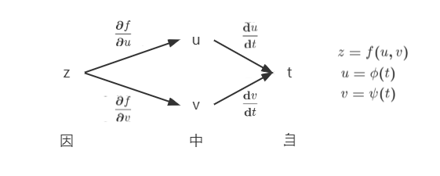
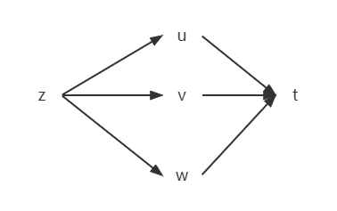
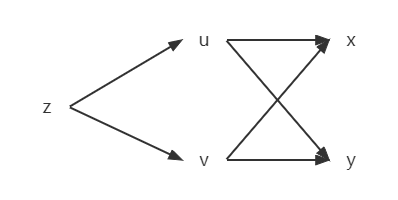
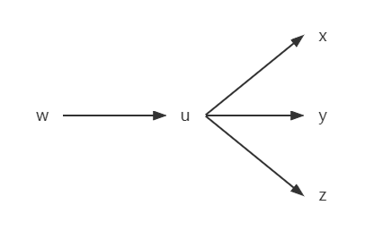
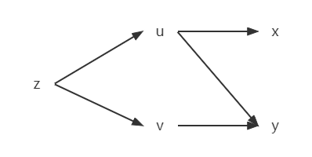
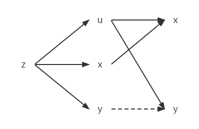

# $\S$8.4 复合函数求导
## 一、多元函数的链式求导法则
### 1. 中间变量为一元函数

定理：
若 $u=\phi(t)$、$v=\psi(t)$ 在 $t$ 处可导，且 $z=f(u,v)$ 在 $(u,v)$ 处偏导连续，则 $z=f[\phi(t),\psi(t)]$ 在 $t$ 可导，且
$$
\begin{align*}
\dfrac{\mathrm dz}{\mathrm dt}=\dfrac{\partial f}{\partial u}\cdot \dfrac{\mathrm du}{\mathrm dt}+\dfrac{\partial f}{\partial v}\cdot \dfrac{\mathrm dv}{\mathrm dt}
\end{align*}
$$

$z=f(u,v,w)$，$u=u(t)$，$v=v(t)$，$w=w(t)$ 在 $t$ 处可导，偏导连续，有
$$
\begin{align*}
\dfrac{\mathrm dz}{\mathrm dt}=\dfrac{\partial f}{\partial u}\cdot \dfrac{\mathrm du}{\mathrm dt}+\dfrac{\partial f}{\partial v}\cdot \dfrac{\mathrm dv}{\mathrm dt}+\dfrac{\partial f}{\partial w}\cdot \dfrac{\mathrm dw}{\mathrm dt}
\end{align*}
$$

### 2. 中间变量为多元函数

若 $z=f(u,v)$ 在 $(u,v)$ 处偏导连续，且 $u=\phi(x,y)$、$v=\psi(x,y)$ 在 $(x,y)$ 偏导存在，则 $z=f[\phi(x,y),\psi(x,y)]$ 在 $(x,y)$ 偏导存在，且
$$
\begin{align*}
\dfrac{\partial z}{\partial x}=\dfrac{\partial f}{\partial u}\cdot \dfrac{\partial u}{\partial x}+\dfrac{\partial f}{\partial v}\cdot \dfrac{\partial v}{\partial x}\\
\dfrac{\partial z}{\partial y}=\dfrac{\partial f}{\partial u}\cdot \dfrac{\partial u}{\partial y}+\dfrac{\partial f}{\partial v}\cdot \dfrac{\partial v}{\partial y}
\end{align*}
$$

$w=f(u)$，$u=u(x,y,z)$，有
$$
\begin{align*}
\dfrac{\partial w}{\partial x}=\dfrac{\mathrm df}{\mathrm du}\cdot \dfrac{\partial u}{\partial x}\\
\dfrac{\partial w}{\partial y}=\dfrac{\mathrm df}{\mathrm du}\cdot \dfrac{\partial u}{\partial y}\\
\dfrac{\partial w}{\partial z}=\dfrac{\mathrm df}{\mathrm du}\cdot \dfrac{\partial u}{\partial z}
\end{align*}
$$
### 3. 中间变量既有一元函数，又有二元函数

$z=f[\phi(x,y),\psi(y)]$ 在 $(x,y)$ 偏导存在，有
$$
\begin{align*}
\dfrac{\partial z}{\partial x}&=\dfrac{\partial f}{\partial u}\cdot \dfrac{\partial u}{\partial x}\\
\dfrac{\partial z}{\partial y}&=\dfrac{\partial f}{\partial u}\cdot \dfrac{\partial u}{\partial y}+\dfrac{\partial f}{\partial v}\cdot \dfrac{\mathrm dv}{\mathrm dy}
\end{align*}
$$

### 4. 中间变量也是自变量

若 $u=\phi(x,y)$ 在 $(x,y)$ 偏导存在，且 $z=f(u,x,y)$ 在 $(u,x,y)$ 偏导连续，则 $z=f[\phi(x,y),x,y]$ 在 $(x,y)$ 偏导存在
$$
\begin{align*}
\dfrac{\partial z}{\partial x}&=\dfrac{\partial f}{\partial u}\cdot \dfrac{\partial y}{\partial x}+\dfrac{\partial f}{\partial x}\cdot \dfrac{\mathrm dx}{\mathrm dx}\\
\dfrac{\partial z}{\partial y}&=\dfrac{\partial f}{\partial u}\cdot \dfrac{\partial u}{\partial y}+\dfrac{\partial f}{\partial y}\cdot 1
\end{align*}
$$
### 例题
1. $z=x^2e^y$，$x=2\cos t$，$y=t+\sin t$，求 $\dfrac{\mathrm dz}{\mathrm dt}$

    解:

    * 法一：

        $z=(2\cos t)^2e^{t+\sin t}=4\cos^2te^{t+\sin t}$

        $$
        \begin{align*}
        \dfrac{\mathrm dz}{\mathrm dt}&=4\cdot[(-2\sin t\cos t)e^{t+\sin t}+\cos ^2t(1+\cos t)e^{t+\sin t}]\\
        &=-4\sin 2te^{t+\sin t}+4\cos^2t(1+\cos t)e^{t+\sin t}
        \end{align*}
        $$

    * 法二：

        $$
        \begin{align*}
        \dfrac{\mathrm dz}{\mathrm dt}&=\dfrac{\partial f}{\partial x}\cdot \dfrac{\mathrm dx}{\mathrm dt}+\dfrac{\partial f}{\partial y}\cdot \dfrac{\mathrm dy}{\mathrm dt}\\
        &=2xe^y\cdot(-2\sin t)+x^2e^y(1+\cos t)\\
        &=2\cdot 2\cos te^{t+\sin t}(-2\sin t)+4\cos^2te^{t+\sin t}(1+\cos t)\\
        &=-4\sin 2te^{t+\sin t}+(4\cos^2t+4\cos^3t)e^{t+\sin t}
        \end{align*}
        $$

2. $y=x^x$（$x\gt 0$），求 $\dfrac{\mathrm dy}{\mathrm dx}$

    解:

    * 法一：

        $y=e^{x\ln x}$，$\dfrac{\mathrm dy}{\mathrm dx}=e^{x\ln x}(1+\ln x)=x^x(\ln x+1)$

    * 法二：

        $y=u^v$，$u=x$，$v=x$

        $$
        \begin{align*}
        \dfrac{\mathrm dy}{\mathrm dx}&=\dfrac{\partial y}{\partial u}\cdot \dfrac{\mathrm du}{\mathrm dx}+\dfrac{\partial y}{\partial v}\cdot \dfrac{\mathrm dv}{\mathrm dx}\\
        &=vu^{v-1}\cdot 1+u^v\ln u\cdot 1\\
        &=x^x(\ln x+1)
        \end{align*}
        $$

3. $z=f(u,v)=\begin{cases}\dfrac{u^2v}{u^2+v^2}&(u,v)\ne(0,0)\\0&(u,v)=(0,0)\end{cases}$，$u=t$，$v=t$，求 $\dfrac{\mathrm dz}{\mathrm dx}|_{t=0}$

    解：【本题不可使用链式法则，因为 $f(u,v)$ 在 $(0,0)$ 偏导不连续】
    $$
    \begin{align*}
    z=\begin{cases}
    \dfrac{t^3}{t^2+t^2}=\dfrac{t}{2} & t\ne 0\\
    0 & t=0
    \end{cases}
    \end{align*}
    $$

    $\therefore z=\dfrac{t}{2},t\in R$

    $\dfrac{\mathrm dz}{\mathrm dx}|_{t=0}=\dfrac{1}{2}$

4. $z=e^u\cos v$，$u=2x-y$，$v=xy$，求 $\dfrac{\partial z}{\partial x}$、$\dfrac{\partial z}{\partial y}$

解：
* 法1：$z=e^{2x-y}\cos(xy)$，$\dfrac{\partial z}{\partial x}=2e^{2x-y}\cos(xy)+e^{2x-y}[-\sin(xy)]\cdot y$，$\dfrac{\partial z}{\partial y}=-e^{2x-y}\cos(xy)+e^{2x-y}[-\sin(xy)]\cdot x$
* 法2：
    $$
    \begin{align*}
    \dfrac{\partial z}{\partial x}&=\dfrac{\partial f}{\partial u}\cdot \dfrac{\partial u}{\partial x}+\dfrac{\partial f}{\partial x}\cdot \dfrac{\partial v}{\partial x}\\
    &=e^u\cos v\cdot 2+(-\sin v)e^uy\\
    &=2e^{2x-y}\cos(xy)+[-\sin(xy)]e^{2x-y}y
    \end{align*}
    $$

    $$
    \begin{align*}
    \dfrac{\partial z}{\partial y}&=\dfrac{\partial f}{\partial u}\cdot \dfrac{\partial u}{\partial y}+\dfrac{\partial f}{\partial v}\cdot \dfrac{\partial v}{\partial y}\\
    &=e^u\cos v\cdot(-1)+e^u(-\sin v)x\\
    &=-e^{2x-y}\cos(xy)-e^{2x-y}\sin(xy)\cdot x
    \end{align*}
    $$

5. $z=f(x,u)=x^2+u$，$u=\cos (xy)$，求 $\dfrac{\partial z}{\partial x}$、$\dfrac{\partial f}{\partial x}$

    解：$\dfrac{\partial z}{\partial x}=\dfrac{\partial f}{\partial u}\cdot \dfrac{\partial u}{\partial x}+\dfrac{\partial f}{\partial x}\cdot 1=1\cdot(-\sin xy)\cdot y+2x$，$\dfrac{\partial f}{\partial x}=2x$

6. $z=f(u,v)$ 在 $(u,v)$ 偏导连续，求 $\dfrac{\partial z}{\partial x}$、$\dfrac{\partial z}{\partial y}$，其中 $u=3x+2y$，$v=x^2+y^2$

    解：$\dfrac{\partial z}{\partial x}=\dfrac{\partial f}{\partial u}\cdot 3+\dfrac{\partial f}{\partial v}\cdot 2x=3f_1'+2xf_2'$，$\dfrac{\partial z}{\partial y}=\dfrac{\partial f}{\partial u}\cdot 2+\dfrac{\partial f}{\partial v}\cdot 2y=2f_1'+2yf_2'$

    6-1 $z=f(u,v)$ 在 $(u,v)$ 二阶偏导也连续，求 $\dfrac{\partial ^2z}{\partial x^2}$、$\dfrac{\partial ^2z}{\partial y^2}$、$\dfrac{\partial ^2z}{\partial x \partial y}$，其他同上

    解：
    $$
    \begin{align*}
    \dfrac{\partial ^2z}{\partial x^2}&=\dfrac{\partial }{\partial x}(\dfrac{\partial z}{\partial x})\\
    &=\dfrac{\partial }{\partial x}(3f_1'+2xf_2')\\
    &=3\dfrac{\partial }{\partial x}f_1'+2(f_2'+xf_{21}'')\\
    &=3f_{11}''+2xf_{21}''
    \end{align*}
    $$

    $$
    \begin{align*}
    \dfrac{\partial ^2z}{\partial y^2}&=\dfrac{\partial }{\partial y}(\dfrac{\partial z}{\partial y})\\
    &=\dfrac{\partial }{\partial y}(2f_1'+2yf_2')\\
    &=2f_{12}''+2(f_2'+yf_{22}'')\\
    &=2f_{12}''+2yf_{22}''
    \end{align*}
    $$

    $$
    \begin{align*}
    \dfrac{\partial ^2z}{\partial x \partial y}&=\dfrac{\partial }{\partial y}(\dfrac{\partial z}{\partial x})\\
    &=\dfrac{\partial }{\partial y}(3f_1'+2xf_2')\\
    &=3f_{12}''+2xf_{22}''
    \end{align*}
    $$

7. $z=f(e^x\sin y)$，求 $\dfrac{\partial ^2z}{\partial x^2}$、$\dfrac{\partial ^2z}{\partial x \partial y}$

    解：
    $\dfrac{\partial z}{\partial x}=\dfrac{\mathrm df}{\mathrm du}\cdot \dfrac{\partial u}{\partial x}=f'e^x\sin y$

    $\dfrac{\partial z}{\partial y}=\dfrac{\mathrm df}{\mathrm du}\cdot \dfrac{\partial u}{\partial y}=f'e^x\cos y$

    $$
    \begin{align*}
    \dfrac{\partial ^2z}{\partial x^2}&=\dfrac{\partial }{\partial x}(f'e^x\sin y)\\
    &=\sin y[(\dfrac{\partial }{\partial x}f)'e^x+f'e^x]\\
    &=\sin y(f''e^x\sin y\cdot e^2+f'e^x)\\
    &=\sin y(f''e^{2x}\sin y+f'e^x)
    \end{align*}
    $$

    $$
    \begin{align*}
    \dfrac{\partial ^2z}{\partial x \partial y}&=\dfrac{\partial }{\partial y}(f'e^x\sin y)\\
    &=e^x[(\dfrac{\partial }{\partial y}f)'\sin y+f'\cos y]\\
    &=e^x(f''\cos y\sin y+f'\cos y)
    \end{align*}
    $$

8. $u=f(x,y)$ 二阶偏导连续，证明经过 $x=\rho \cos\theta$、$y=\rho \sin \theta$ 变换后的方程满足如下关系：
    * $(\dfrac{\partial u}{\partial x})^2+(\dfrac{\partial u}{\partial y})^2=(\dfrac{\partial u}{\partial \rho})^2+\dfrac{1}{\rho^2}(\dfrac{\partial u}{\partial \theta})^2$
    * $\dfrac{\partial ^2u}{\partial x^2}+\dfrac{\partial ^2y}{\partial y^2}=\dfrac{\partial ^2u}{\partial \rho^2}+\dfrac{1}{\rho}\cdot \dfrac{\partial u}{\partial \rho}+\dfrac{1}{\rho^2}(\dfrac{\partial ^2u}{\partial \theta^2})$

    解：
    $\dfrac{\partial u}{\partial \rho}=\dfrac{\partial }{\partial \rho}f(\rho \cos\theta, \rho \sin\theta)=f_1'\cos\theta+f_2'\sin\theta$

    $\dfrac{\partial u}{\partial \theta}=\dfrac{\partial }{\partial \theta}f(\rho \cos\theta, \rho \sin\theta)=-\rho f_1'\sin \theta+\rho f_2'\cos \theta$

    右边 $=(f_1'\cos\theta+f_2'\sin\theta)^2+\dfrac{1}{\rho^2}(-\rho f_1'\sin\theta+\rho f_2'\cos\theta)=f_1'^2+f_2'^2=$ 左边，1式得证

    $$
    \begin{align*}
    \dfrac{\partial ^2u}{\partial \rho^2}&=\dfrac{\partial }{\partial \rho}(\dfrac{\partial u}{\partial \rho})\\
    &=\cos\theta \dfrac{\partial }{\partial \rho}f_1'+\sin\theta\dfrac{\partial }{\partial \rho}f_2'\\
    &=\cos\theta(f_{11}''\cos\theta+f_{12}''\sin\theta)+\sin\theta(f_{21}''\cos\theta+f_{22}''\sin\theta)\\
    &=\cos^2\theta f_{11}''+\sin^2\theta f_{12}''+\sin 2\theta f_{12}''
    \end{align*}
    $$

    $$
    \begin{align*}
    \dfrac{\partial ^2u}{\partial \theta^2}&=\dfrac{\partial }{\partial \theta}(\dfrac{\partial u}{\partial \theta})\\
    &=\dfrac{\partial }{\partial \theta}(-\rho f_1'\sin\theta+\rho f_2'\cos\theta)\\
    &=-\rho [\dfrac{\partial }{\partial \theta}(f_1'\sin\theta)-\dfrac{\partial }{\partial \theta}(f_2'\cos \theta)]\\
    &=-\rho\{\dfrac{\partial }{\partial \theta}f_1'\sin\theta+f_1'\cos\theta-[\dfrac{\partial }{\partial \theta}f_2'\cos\theta+f_2'(-\sin\theta)]\}\\
    &=-\rho[\sin\theta(-\rho f_{11}''\sin\theta+\rho f_{12}''\cos\theta)-\cos\theta(-\rho f_{21}''\sin\theta+\rho f_{22}''\cos\theta)]-\rho\cdot \dfrac{\partial u}{\partial \rho}\\
    &=\rho^2 \sin^2\theta f_{11}''+\rho^2 \cos^2\theta f_{22}''-\rho^2 \sin 2\theta f_{12}''-\rho\cdot \dfrac{\partial u}{\partial \rho}
    \end{align*}
    $$

    右边 $=\cos^2\theta f_{11}''+\sin^2\theta f_{22}''+\sin 2\theta f_{12}''+\dfrac{1}{\rho}(f_1'\cos\theta+f_2'\sin\theta)+\dfrac{1}{\rho^2}(\rho^2\sin^2\theta f_{11}''+\rho^2\cos^2\theta f_{22}''-\rho^2\sin 2\theta f_{12}''-\rho\cdot \dfrac{\partial u}{\partial \rho})=f_{11}''+f_{12}''=$ 左边，2式得证

## 二、一阶全微分的形式不变性
$z=f(x,y)$（$x,y$ 为自变量），$\mathrm dz=\dfrac{\partial f}{\partial x}\mathrm dx+\dfrac{\partial f}{\partial y}\mathrm dy$

$x=\phi(x,t)$，$y=\psi(s,t)$（$x,y$ 为中间变量），
$$
\begin{align*}
\mathrm dz&=\dfrac{\partial z}{\partial s}\mathrm ds+\dfrac{\partial z}{\partial t}\mathrm dt\\
&=(\dfrac{\partial f}{\partial x}\cdot \dfrac{\partial \phi}{\partial s}+\dfrac{\partial f}{\partial y}\cdot \dfrac{\partial \psi}{\partial s})\mathrm ds（或 (\dfrac{\partial f}{\partial x}\cdot \dfrac{\partial \phi}{\partial t}+\dfrac{\partial f}{\partial y}\cdot \dfrac{\partial \psi}{\partial s})\mathrm dt）\\
&=\dfrac{\partial f}{\partial x}\underset{\mathrm dx}{(\dfrac{\partial \phi}{\partial s}\mathrm ds+\dfrac{\partial \psi}{\partial t}\mathrm dt)}+\dfrac{\partial f}{\partial y}\underset{\mathrm dy}{(\dfrac{\partial \phi}{\partial s}\mathrm ds+\dfrac{\partial \psi}{\partial t}\mathrm dt)}
\end{align*}
$$
### 例题
1. $z=e^{\sin(xy)}$，求 $\dfrac{\partial z}{\partial x}$、$\dfrac{\partial z}{\partial y}$

    解：
    $$
    \begin{align*}
    \mathrm dz&=\mathrm d[e^{\sin(xy)}]\\
    &=e^{\sin (xy)}\mathrm d\sin(xy)\\
    &=e^{\sin (xy)}\cos (xy)\mathrm d(xy)\\
    &=e^{\sin (xy)}\cos (xy)(y \mathrm dx+ x \mathrm dy)
    \end{align*}
    $$

    $\dfrac{\partial z}{\partial x}=y\cdot e^{\sin (xy)}\cos (xy)$

    $\dfrac{\partial z}{\partial y}=x\cdot e^{\sin (xy)}\cos (xy)$

2. $u=f(x,y,z)$，$y=\phi(x,t)$，$t=\psi(x,z)$，求 $\dfrac{\partial u}{\partial x}$、$\dfrac{\partial u}{\partial z}$

    解：
    $$
    \begin{align*}
    \mathrm du&=\mathrm df(x,y,z)\\
    &=f_1'\mathrm dx+f_2'\mathrm dy+f_3'\mathrm dz\\
    &=f_1'\mathrm dx+f_2'\mathrm d\phi(x,t)+f_3'\mathrm dz\\
    &=f_1'\mathrm dx+f_2'\mathrm d(\phi_1'\mathrm dx+\phi_2'\mathrm dt)+f_3'\mathrm dz\\
    &=f_1'\mathrm dx+f_2'[\phi_1'\mathrm dx+\phi_2'(\psi_1' \mathrm dx+\psi_2' \mathrm dz)]+f_3'\mathrm dz\\
    &=(f_1'+f_2'\phi_1'+f_2'\phi_2'\psi_1')\mathrm dx+(f_3'+f_2'\phi_2'\psi_2')\mathrm dz
    \end{align*}
    $$

    $\dfrac{\partial u}{\partial x}=f_1'+f_2'\phi_1'+f_2'\phi_2'\psi_1'$

    $\dfrac{\partial u}{\partial z}=f_3'+f_2'\phi_2'\psi_2'$
