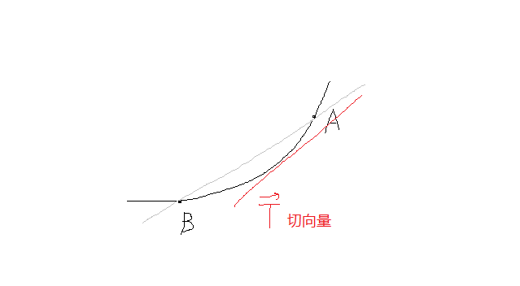

# $\S$8.6 多元函数微分学的几何应用
* 直线 $\vec {s}=(l,m,n)$，经过 $(x_0,y_0,z_0)$，方程为
    $$
    \dfrac{x-x_0}{l}=\dfrac{y-y_0}{m}=\dfrac{z-z_0}{n}
    $$
* 平面 $\vec {n}=(A,B,C)$，经过 $(x_0,y_0,z_0)$，方程为
    $$
    A(x-x_0)+B(y-y_0)+C(z-z_0)=0
    $$
* 空间曲面具有切平面和法线；空间曲线具有切线与法平面
    - 法平面：与切线垂直，且过 $(x_0,y_0,z_0)$
    - 法向量：与平面垂直，且过 $(x_0,y_0,z_0)$
## 一、空间曲线的切线和法平面

1. 参数形式 $\begin{cases}x=\varphi (t)\\ y=\psi (t)\\ z=\omega (t)\end{cases} t\in [\alpha,\beta]$
    * $\displaystyle \vec{T}=\lim_{t_1\to t_0}\vec{S割}(\varphi'(t_0),\phi'(t_0),\omega'(t_0))$
    * 切线方程：$\dfrac{x-x_0}{\varphi'(t_0)}=\dfrac{y-y_0}{\psi'(t_0)}=\dfrac{z-z_0}{\omega'(t_0)}$
    * 法平面：$\varphi'(t_0)(x-x_0)+\psi'(t_0)(y-y_0)+\omega'(t_0)(z-z_0)=0$
2. 一般形式 $\begin{cases}F(x,y,z)=0\\ G(x,y,z)=0\end{cases}$（曲面→交线，F、G偏导连续且 $\left | \begin{matrix}F_y & F_z \\G_y & G_z \\ \end{matrix} \right |\ne 0$）
    * $\vec{T}=\begin{vmatrix}\vec{i}&\vec{j}&\vec{k}\\F_x&F_y&F_z\\G_x&G_y&G_z\end{vmatrix}$
    * 切线方程：$\dfrac{x-x_0}{\begin{vmatrix}F_y&F_z\\ G_y&G_z\end{vmatrix}}=\dfrac{y-y_0}{-\begin{vmatrix}F_x&F_z\\ G_x&G_z\end{vmatrix}}=\dfrac{z-z_0}{\begin{vmatrix}F_x&F_y\\ G_x&G_y\end{vmatrix}}$
    * 法平面：$\left | \begin{matrix}x-x_0&y-y_0&z-z_0\\ F_x&F_y&F_z\\ G_x&G_y&G_z\end{matrix}\right |=0$
    * $\begin{cases}y=\varphi(x)\\z=\psi(x)\end{cases}$，$\vec{T}=(1,\varphi'(x),\psi'(x))|_{x=x_0}$
    * $\begin{cases}x=\varphi(y)\\z=\psi(y)\end{cases}$，$\vec{T}=(\dfrac{\mathrm d\varphi}{\mathrm dy},1,\dfrac{\mathrm d\psi}{\mathrm dy})|_{y=y_0}$
### 例题
1. 求 $\begin{cases}y=\sqrt{2x}\\ z=1-x\end{cases}$ 在 $(2,2,-1)$ 处的切线方程

    解：$2\vec{T}=(1,\dfrac{\sqrt{2}}{2\sqrt{x}},-1)|_{x=2}=2(1,\dfrac{1}{2},-1)=(2,1,-2)$

    $$
    \dfrac{x-2}{2}=\dfrac{y-2}{1}=\dfrac{z+1}{-2}
    $$

2. 求 $\begin{cases}x^2+y^2+z^2=6\\ x+y+z=0\end{cases}$ 在 $P(1,1,-2)$ 处的切线和法平面

    解：
    $\vec{\alpha}=(F_x,F_y,F_z)|_P=(2,2,-4)$
    $\vec{\beta}=(G_x,G_y,G_z)|_P=(1,1,1)$

    $\vec{\alpha} \times \vec{\beta}=\begin{vmatrix}\vec{i}&\vec{j}&\vec{k}\\2&2&-4\\1&1&1\end{vmatrix}=6\vec{i}-6\vec{j}$

    取 $(1,-1,0)$，切线方程为 $\begin{cases}\dfrac{x-1}{1}=\dfrac{y-1}{-1}\\ z=-2\end{cases}$

## 二、空间曲面的切平面和法线
1. $F(x,y,z)=0$
    * 法向量 $\vec{n}=(F_x,F_y,F_z)$
    * 切平面方程：$F_x(x-x_0)+F_y(y-y_0)+F_z(z-z_0)=0$
    * 法线方程：$\dfrac{x-x_0}{F_x}=\dfrac{y-y_0}{F_y}=\dfrac{z-z_0}{F_z}$
2. $z=f(x,y)\rightarrow F(x,y,z)=f(x,y)-z=0$
    * 法向量 $\vec{n}=(f_x,f_y,-1)$
    * 切平面方程：$f_x(x-x_0)+f_y(y-y_0)+(-1)(z-z_0)=0$
    * $z=f(x_0,y_0)+f_x(x_0,y_0)(x-x_0)+f_y(x_0,y_0)(y-y_0)$（以直代曲）
### 例题
求 $z=4-x^2-y^2$ 平行于平面 $2x+2y+z-1=0$ 的切平面方程

解：$\vec{n}=(2,2,1)$

设切点 $(x_0,y_0,4-x_0^2-y_0^2)$

$\vec{n}=(F_x,F_y,F_z)=(-2x,-2y,-1)|_{P_0}=(-2x_0,-2y_0,-1)$

$\dfrac{-2x_0}{2}=\dfrac{-2y_0}{2}=\dfrac{-1}{1}=k$

$x_0=y_0=1$，$z_0=2$

切平面 $2(x-1)+2(y-1)+1\cdot (z-2)=0$

法线 $\dfrac{x-1}{2}=\dfrac{y-1}{2}=\dfrac{z-2}{1}$
