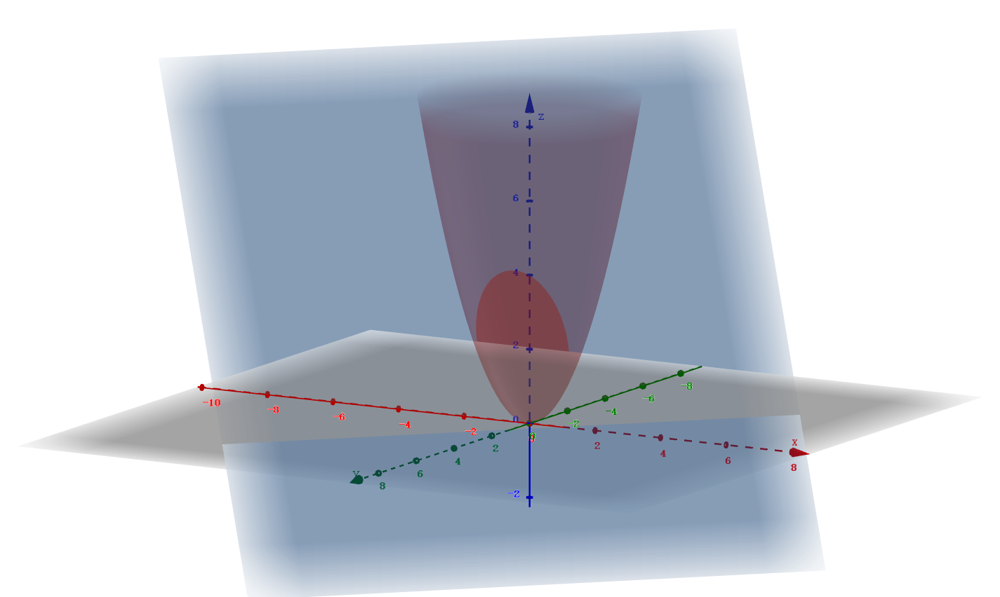

# $\S$8.8 极值及其求法
## 一、多元函数的（无条件）极值与最值
### 1. 极值
* 定义：$z=f(x,y)$ 其定义域为 D，$P_0\in D$ 且是内点，$U(P_0)\subset D$。
    - 若对 $\forall (x,y)\in U(P_0)$ 都有 $f(x,y)\le f(x_0,y_0)$，则称 $(x_0,y_0)$ 为极大值点，$z$ 在 $(x_0,y_0)$ 取得极大值。
    - 若对 $\forall (x,y)\in U(P_0)$ 都有 $f(x,y)\ge f(x_0,y_0)$，则称 $(x_0,y_0)$ 为极小值点，$z$ 在 $(x_0,y_0)$ 取得极小值。
    - 如：$z=\sqrt{x^2+y^2}$ 在 $(0,0)$ 取得极小值；$z=\sqrt{1-x^2-y^2}$ 在 $(0,0)$ 取得极大值；$z=xy$ 在 $(0,0)$ 不取得极值
* 必要条件：$z=f(x,y)$ 在 $(x_0,y_0)$ 具有偏导且在 $(x_0,y_0)$ 取得极值，则 $f_x(x_0,y_0)=f_y(x_0,y_0)=0$
    - 几何意义：$z=f(x,y)$ 在 $(x_0,y_0)$ 取得极值且偏导存在，则在 $(x_0,y_0,f(x_0,y_0))$ 有水平切面，且 $\vec{n}=(f_x,f_y,-1)|_{P_0}=(0,0,-1)$，切平面方程 $z=f(x_0,y_0)$
    - 方法：求 $f_x(x,y)=f_y(x,y)=0$，$\bigtriangledown f=(f_x,f_y)=\vec{0}$（驻点）
        * 推广：$u=f(x_1,x_2,\cdots,x_n)$ 求极值点，先求 $\bigtriangledown u=\vec{0}$
* 充分条件：$z=f(x,y)$ 在 $U(P_0)$ 具有一阶及二阶连续偏导，$f_x(x_0,y_0)=f_y(x_0,y_0)=0$。令 $f_{xx}(x_0,y_0)=A$，$f_{xy}(x_0,y_0)=B$，$f_{yy}(x_0,y_0)=C$
    - $AC-B^2\gt 0$，具有极值，其中 $A\gt 0$ 极小，$A\lt 0$ 极大
    - $AC-B^2\lt 0$，无法取得极值
    - $AC-B^2=0$，无法确定
### 2. 最值
若 $f(x,y)$ 在有界闭区域 $D$ 上连续，可讨论最值问题

* 极值点
    - 驻点
    - 偏导不存在
* 边界点
### 例题
1. 讨论 $z=xy$ 在 $(0,0)$ 的极值情况

    解：$A=f_{xx}(0,0)=0$，$B=f_{xy}(0,0)=1$，$C=f_{yy}(0,0)=0$，$AC-B^2=-1\lt 0$

    $\therefore$ 在该点不取得极值

2. 讨论 $z=(y-x^2)(y-2x^2)$ 在 $(0,0)$ 的极值情况

    解：$f_x(0,0)=f_y(0,0)=0$

    $A=C=f_{xx}(0,0)=0$，$B=f_{xy}(0,0)=0$，$AC-B^2=0$，无法确定

    $\because$ 在 $U(0,0)$ 内总存在 $f(x_0,y_0)\gt 0$，$f(x_1,y_1)\lt 0$

    $\therefore z=f(x,y)$ 在 $(0,0)$ 不取得极值

3. 求 $f(x,y)=2y^2-x(x-1)^2$ 的极值

    解：$f_x=f_y=0$，驻点 $(\dfrac{1}{3},0)$ 和 $(1,0)$

    $f_{xx}=-6x+4$，$f_{xy}=0$，$f_{yy}=4$

    $A_1=2$，$A_2=-2$，$B_1=B_2=0$，$C_1=C_2=4$

    $A_1C_1-B_1^2=8\gt 0$，$A_1=2\gt 0$，取得极小值

    $A_2C_2-B_2^2=-8\lt 0$，不取得极值

    $\therefore$ 极值点 $(\dfrac{1}{3},0)$，极值 $f(\dfrac{1}{3},0)=-\dfrac{4}{27}$

4. 求 $z=x^2y(4-x-y)$ 在 $x+y=6$、x轴、y轴所围成区域中最大值、最小值

    解：驻点
    $$
    \begin{align*}
    \begin{cases}
    f_x&=2xy(4-x-y)-x^2y=0\\
    f_y&=x^2(4-x-2y)=0
    \end{cases}
    \Rightarrow
    \begin{cases}
    8-3x-2y&=0\\
    4-x-2y&=0
    \end{cases}
    \Rightarrow
    \begin{cases}
    x=2\\
    y=1
    \end{cases}
    \end{align*}
    $$

    $f(2,1)=4$

    边界点：
    * x轴：$y=0$，$f(x,y)=0$
    * y轴：$x=0$，$f(x,y)=0$
    * 直线 $x+y=6$：$f(x,y_0)=2x^2(x-6)$，$f'(x,y)=4x(x-6)+2x^2=0$，$x=0 或 4$，$f(0,6)=0$，$f(4,2)=-64$，$f(6,0)=0$

    $\therefore$ 最大值 $f(2,1)=4$，最小值 $f(4,2)=-64$

5. 证明周长为2p的三角形中，等边三角形面积最大

    证：设三角形三边长为 x、y、z

    $z=2p-x-y$

    根据海伦公式有 $s^2=p(p-x)(p-y)(p-z)=p(p-x)(p-y)(x+y-p)=f(x,y)$

    $$
    \begin{align*}
    \begin{cases}
    x+y\gt 2p-x-y\\
    x-y\lt 2p-x-y\\
    y-x\lt 2p-x-y
    \end{cases}\Rightarrow
    D:\begin{cases}
    x+y\gt p\\
    0\lt x\lt p\\
    0\lt y\lt p
    \end{cases}
    \end{align*}
    $$

    求驻点，$\begin{cases}f_x=p(x+y-p)+p-x=0\\f_y=p(x+y-p)+p-y=0\end{cases}$，$x=y=\dfrac{2}{3}p$，$z=2p-x-y=\dfrac{2}{3}p\in D$

    $\therefore (\dfrac{2}{3}p,\dfrac{2}{3}p,\dfrac{2}{3}p)$ 为唯一驻点，它是最大值点

## 二、条件极值
定义：
$$
\begin{align*}
\begin{cases}
u=f(x_1,x_2,\cdots,x_n) \quad &目标函数\\
g_i(x_1,x_2,\cdots,x_n)=0 \quad (i\lt n) &约束方程
\end{cases}
\end{align*}
$$
称为条件极值问题

求 $L$ 驻点→条件极值点：$L(x,y,\lambda)=\underset{目标}{f(x,y)}+\lambda\underset{约束}{\varphi(x,y)}$
### 例题
1. 求 $\begin{cases}z=xy\\x+y=1\end{cases}$ 的极值

    解：
    1. [代入法]
        * $z(x)=x(1-x)$，$z'(x)=1-2x$
        * 令 $z'(x)=0$，$x=\dfrac{1}{2}$，此时 $y=\dfrac{1}{2}$
        * 极大值 $f(\dfrac{1}{2},\dfrac{1}{2})=\dfrac{1}{4}$
    2. [乘数法]
        * 令 $L(x,y,\lambda)=xy+\lambda(x+y-1)$

        $$
        \begin{align*}
        \begin{cases}
        L_x=y+\lambda=0\\
        L_y=x+\lambda=0\\
        L_\lambda=x+y-1=0
        \end{cases}
        \end{align*}
        $$

        * 解得 $\begin{cases}x=\dfrac{1}{2}\\y=\dfrac{1}{2}\end{cases}$
        * $z=f(\dfrac{1}{2},\dfrac{1}{2})$，它是极大值
2. $x^2+y^2=z$ 被 $x+y+z=1$ 截成椭圆，求椭圆到原点的最长、最短距离

    

    解：
    $$
    \begin{align*}
    \begin{cases}
    f(x,y,z)=x^2+y^2+z^2\\
    \varphi_1(x,y,z)=x^2+y^2-z\\
    \varphi_2(x,y,z)=x+y+z-1
    \end{cases}
    \end{align*}
    $$

    设 $L(x,y,z,\lambda,\mu)=x^2+y^2+z^2+\lambda(x^2+y^2-z)+\mu(x+y+z-1)$，则有

    $$
    \begin{align*}
    \begin{cases}
    2x+2\lambda x+\mu=0\\
    2y+2\lambda y+\mu=0\\
    2z-\lambda+\mu=0\\
    x^2+y^2-z=0\\
    x+y+z-1=0
    \end{cases}
    \end{align*}
    $$

    解得 $x=y=\dfrac{-1\pm\sqrt{3}}{2}$，$z=2\pm\sqrt{3}$

    $\therefore$ 最小值为 $f(\dfrac{\sqrt{3}-1}{2},\dfrac{\sqrt{3}-1}{2},2-\sqrt{3})=9-5\sqrt{3}$，最大值为 $f(\dfrac{-1-\sqrt{3}}{2},\dfrac{-1-\sqrt{3}}{2},2+\sqrt{3})=9+5\sqrt{3}$

    $\therefore$ 所求距离的最大值为 $\sqrt{9+5\sqrt{3}}$，最小值为 $\sqrt{9-5\sqrt{3}}$
