# $\S$9.1 二重积分
## 一、引例
求曲顶柱体的体积
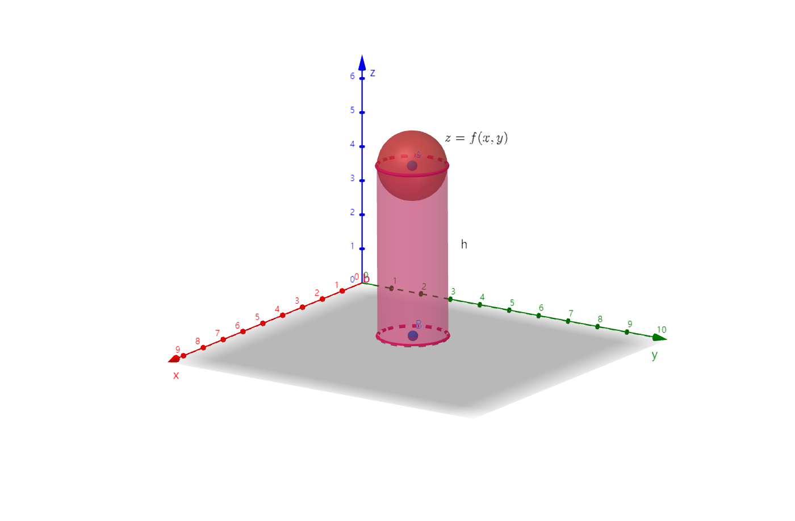
1. 分割
    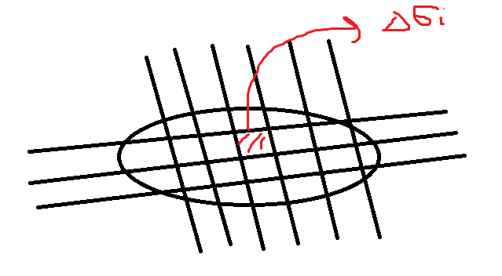
2. 代替 $V_{小曲顶}\approx V_{小柱}=f(\xi_i, \eta_i)\Delta \sigma_i$
3. 求和 $\displaystyle \sum_{i=1}^n f(\xi_i, \eta_i)\Delta \sigma_i \approx V_{曲顶}$
4. 取极限 $\displaystyle \lim_{\lambda \to 0}\sum_{i=1}^nf(\xi_i, \eta_i)\Delta \sigma_i=V_{曲顶}$（$\lambda = \max \{\Delta \sigma_i\}$）
## 二、定义
$f(x,y)$ 在有界闭区域D上：
* 任意划分D：$\Delta \sigma_1$、$\Delta \sigma_2$、……、$\Delta \sigma_n$
* 任意取点 $(\xi_i,\eta_i) \in \Delta \sigma_i$

若 $\displaystyle \sum_{i=1}^n f(\xi_i, \eta_i)\Delta \sigma_i$ 存在，则称该极限为 $f(x,y)$ 在 D 上的二重积分【其中 $\lambda =\max\{d_1,d_2,\cdots,d_n\}$】。记为

$$
\iint_D f(x,y) \mathrm d\sigma = \iint_D f(x,y) \mathrm dx \mathrm dy
$$

其中
* D 为积分区域
* $f(x,y)$ 为被积函数
* $\mathrm d\sigma$ 为面积元素/面元

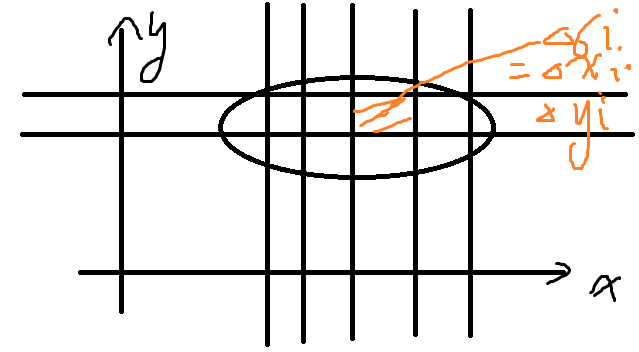

* $f(x,y)\ge 0$ 时，其几何意义为圆顶柱体体积
* $f(x,y)=1$ 时，$\displaystyle \iint_D 1\cdot \mathrm d\sigma = \sigma$，为积分区域面积
    * 其物理意义为平面薄片的质量

> $f(x,y)$ 存在 $\Rightarrow$ 二重积分存在

## 三、二重积分的性质
* 线性性质
    $$
    \begin{align*}
    \iint_D [\alpha f(x,y)+\beta g(x,y)] \mathrm d\sigma = \alpha \iint_D f(x,y)\mathrm d\sigma + \beta \iint_D g(x,y)\mathrm d\sigma
    \end{align*}
    $$
* 区域可加性
    $$
    \begin{align*}
    \iint_D f(x,y)\mathrm d\sigma = \iint_{D_1}f(x,y)\mathrm d\sigma + \iint_{D_2}f(x,y)\mathrm d\sigma，其中 D=D_1+D_2
    \end{align*}
    $$
* 保序性
    - $\displaystyle f(x,y)\ge 0 \Rightarrow \iint_Df(x,y)\mathrm d\sigma$
    - $\displaystyle f(x,y)\ge g(x,y) \Rightarrow \iint_Df(x,y)\mathrm d\sigma \ge \iint_Dg(x,y)\mathrm d\sigma$
    - $\displaystyle -|f(x,y)|\le f(x,y)\le |f(x,y)| \Rightarrow -\iint_D|f(x,y)|\mathrm d\sigma\le \iint_Df(x,y)\mathrm d\sigma \le \iint_D|f(x,y)|\mathrm d\sigma$
    - $\displaystyle |\iint_Df(x,y)\mathrm d\sigma|\le \iint_D|f(x,y)|\mathrm d\sigma$
* 估值定理
    - $f(x,y)$ 是有界闭区域D上的连续函数，$m\le f(x,y)\le M$，则 $\displaystyle m\sigma \le \iint_Df(x,y)\mathrm d\sigma\le M\sigma$
* 中值定理
    - $\displaystyle m\le \dfrac{\iint_Df(x,y)\mathrm d\sigma}{\sigma}\le M$，存在 $(\xi, \eta)\in D$，$f(\xi, \eta)=\dfrac{\iint_Df(x,y)\mathrm d\sigma}{\sigma}$。
    - $\displaystyle \iint_Df(x,y)\mathrm d\sigma = \sigma \cdot f(\xi, \eta)$【曲顶柱体≈某柱体】
* 对称性
    - 若D关于x轴对称，令 $D_1$ 为上半部分
        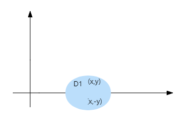
        $$
        \begin{align*}
        \iint_Df(x,y)\mathrm dx \mathrm dy=\begin{cases}
        2\iint_{D_1}f(x,y)\mathrm dx \mathrm dy & f(x,y)=f(x,-y)\\
        0 & f(x,y)=-f(x,-y)
        \end{cases}
        \end{align*}
        $$
    - 若D关于y轴对称，令 $D_1$ 为左半部分
        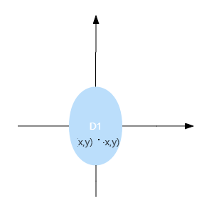
        $$
        \begin{align*}
        \iint_Df(x,y)\mathrm dx \mathrm dy=\begin{cases}
        2\iint_{D_1}f(x,y)\mathrm dx \mathrm dy & f(x,y)=f(-x,y)\\
        0 & f(x,y)=-f(-x,y)
        \end{cases}
        \end{align*}
        $$
    - 若D关于原点对称，令 $D_1$ 为第一象限部分
        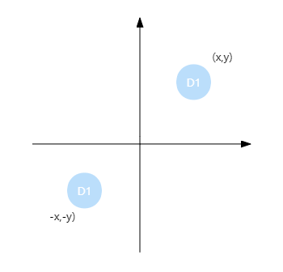
        $$
        \begin{align*}
        \iint_Df(x,y) \mathrm d\sigma=\begin{cases}
        2\iint_{D_1}f(x,y)\mathrm d\sigma & f(x,y)=f(-x,-y)\\
        0 & f(x,y)=-f(-x,-y)
        \end{cases}
        \end{align*}
        $$
    - 若D关于$y=x$对称，则 $\displaystyle \iint_Df(x,y)\mathrm d\sigma=\iint_Df(y,x)\mathrm d\sigma$
## 四、例题
### 例0. 面积定义
1. 求 $\iint_D \sqrt{R^2-x^2-y^2} \mathrm dx \mathrm dy$，其中 $D:x^2+y^2\le R^2$

    解：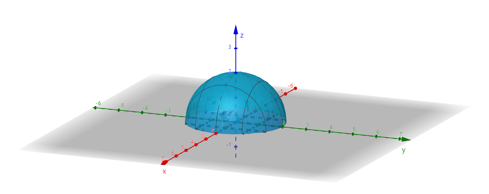

    $z=\sqrt{R^2-x^2-y^2}$，上半球面

    $\iint_D \sqrt{R^2-x^2-y^2} \mathrm dx \mathrm dy = \dfrac{1}{2} V_球=\dfrac{2}{3}\pi R^3$

2. 求 $\iint_D \sqrt{x^2+y^2} \mathrm dx \mathrm dy$，其中 $D:x^2+y^2\le 4$

    解：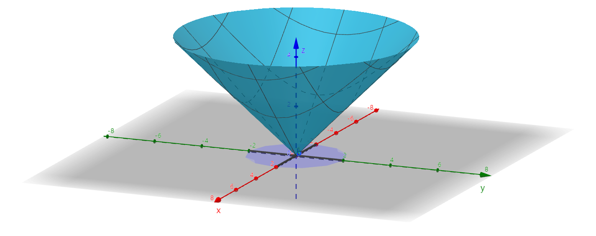

    $z=\sqrt{x^2+y^2}$，锥面

    $$
    \begin{align*}
    I&=V_柱-V_锥\\
    &=S_1h-\dfrac{1}{3}S_2h\quad(S_1=S_2\pm 4\pi)\\
    &=\dfrac{2}{3}\cdot 4\pi \cdot 2 = \dfrac{16}{3}\pi
    \end{align*}
    $$

### 例1. 对称性
1. $D:x^2+y^2\le 1$

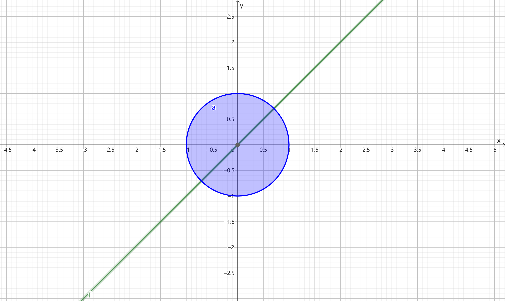

$$
\begin{align*}
\iint_D x^2 \mathrm dx \mathrm dy &= \iint_D y^2 \mathrm dx \mathrm dy \\
&=\dfrac{1}{2}(\iint_D x^2 \mathrm dx \mathrm dy+\iint_D y^2 \mathrm dx \mathrm dy)\\
&=\dfrac{1}{2}\iint_D (x^2+y^2) \mathrm dx \mathrm dy
\end{align*}
$$

2. 证明 $\iint_D (x^2+x^3y^4) \mathrm d\sigma = 4\iint_{D_1}x^2 \mathrm d\sigma$，其中 $D:|x|+|y|\le 1$，$D_1$ 为 $D$ 在第一象限的部分

    证：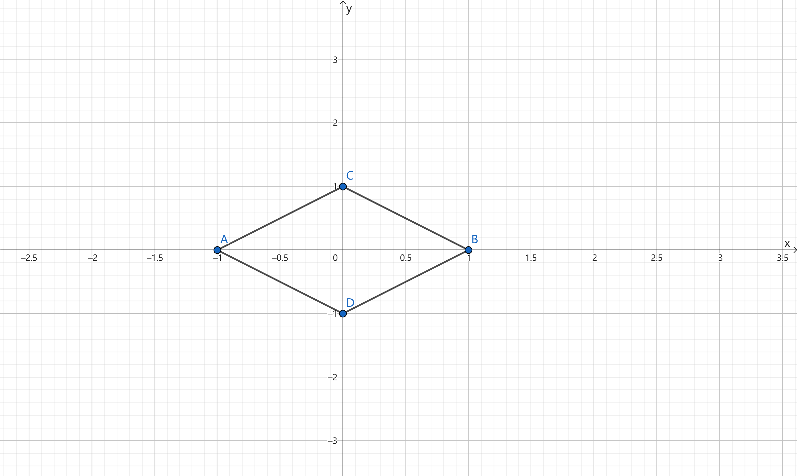

    D关于x轴对称，D=D上+D下，$f(x,y)=x^2+x^3y^4$，$f(x,-y)=x^2+x^3y^4$

    $$
    \begin{align*}
    I&=2\iint_{D_上}(x^2+x^3y^4) \mathrm d\sigma \\
    &=2\iint_{D_上}x^2 \mathrm d\sigma + 2\iint_{D_上}x^3y^4 \mathrm d\sigma\\
    &=4\iint_{D_1}x^2 \mathrm d\sigma + 0 = 4\iint_{D_1}x^2 \mathrm d\sigma, 得证
    \end{align*}
    $$

3. 化简 $\iint_D(xy+\cos x\sin y)\mathrm dx \mathrm dy$，其中 $D:(-1,1),(1,1),(-1,-1)$ 围成的三角域

    解：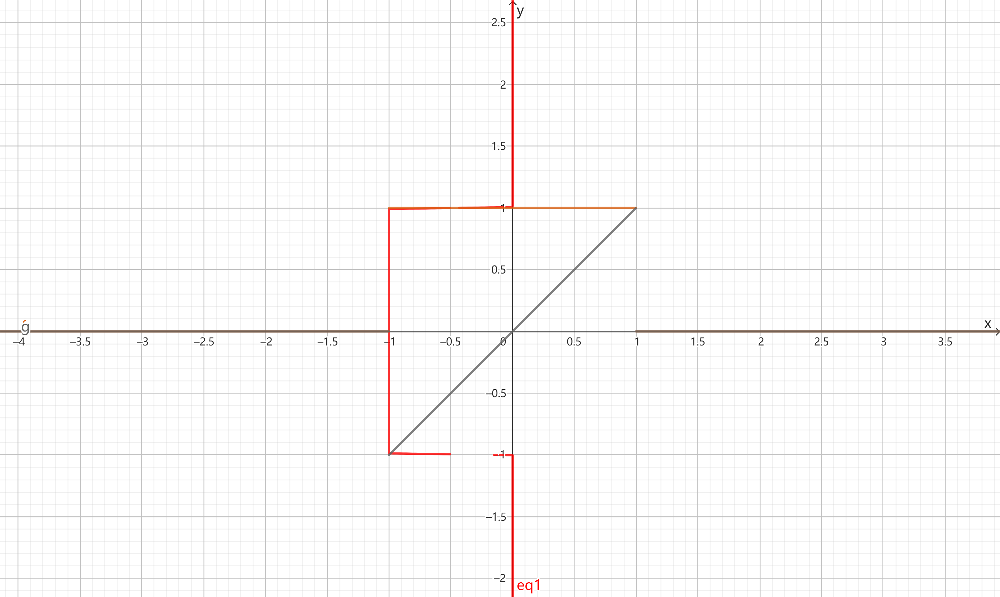

    设 $y=-x$ 将该区域从右上到左下分为四个 $D_1,D_2,D_3,D_4$ 小三角形区域

    $$
    \begin{align*}
    I&=\iint_D xy \mathrm dx \mathrm dy + \iint_D \cos x \sin y \mathrm dx \mathrm dy\\
    &= \iint_{D_1+D_2}xy \mathrm dx \mathrm dy + \iint_{D_3+D_4} \mathrm dx \mathrm dy + \iint_{D_1+D_2} \cos x \sin y \mathrm dx \mathrm dy + \iint_{D_3+D_4} \cos x \sin y \mathrm dx \mathrm dy\\
    &=2\iint_D \cos x \sin y \mathrm dx \mathrm dy
    \end{align*}
    $$

4. 证明 $\iint_D\sin(x-y)\mathrm d\sigma=0$，其中 $D:0\le x\le 1,0\le y\le 1$

    证：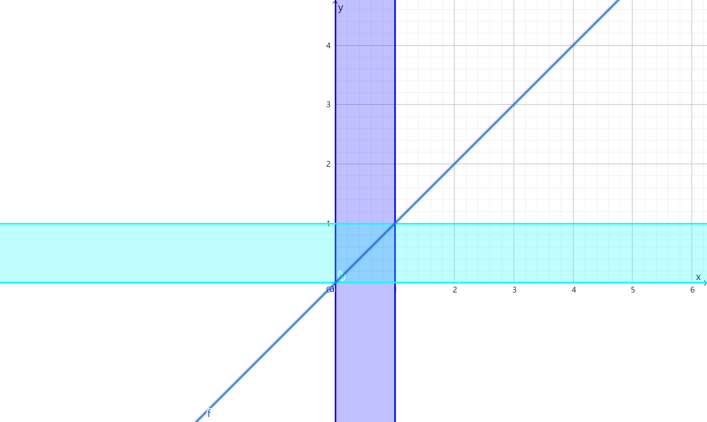

    $$
    \begin{align*}
    I&=\iint_D\sin (x-y) \mathrm d\sigma \\
    &=\iint_D\sin(y-x) \mathrm d\sigma \\
    &=-\iint_D\sin(x-y) \mathrm d\sigma = -I
    \end{align*}
    $$

    $I=0$，得证

### 例2. 估值定理
估计 $\iint_D(x^2+4y^2+9)\quad D:x^2+y^2\le 4$ 的值

解：讨论 $f(x,y)=x^2+4y^2+9$ 在 $x^2+y^2\le 4$ 的最值

设 $L(x,y,\lambda)=x^2+4y^2+9+\lambda(x^2+y^2-4)$

$$
\begin{align*}
\begin{cases}
L_x=2x+2\lambda x=0\\
L_y=8y+2y\lambda =0\\
x^2+y^2=4
\end{cases}
\end{align*}
$$

解得 $\begin{cases}x=2\\y=0\end{cases}$ 或 $\begin{cases}x=0\\y=2\end{cases}$，$f(2,0)=13$，$f(0,2)=25$

驻点：

$$
\begin{align*}
\begin{cases}
f_x=2x=0\\
f_y=8y=0
\end{cases}
\end{align*}
$$

解得 $\begin{cases}x=0\\y=0\end{cases}$，$f(0,0)=9$

$\therefore 9\le f(x,y)\le 25$，$36\pi \le I \le 100\pi$

### 例3. 积分中值定理
估计 $\displaystyle \lim_{r\to 0}\dfrac{1}{\pi r^2}\iint_D e^{x^2-y^2}\cos(x+y) \mathrm dx \mathrm dy\quad D:x^2+y^2\le r^2$ 的值

解：$I=e^{\xi^2-\eta^2}\cos(\xi+\eta)\pi r^2\quad(\xi,\eta)\in D$

原式 $\displaystyle=\lim_{r\to 0}e^{\xi^2-\eta^2}\cos(\xi+\eta)=\lim_{(\xi,\eta)\to (0,0)}e^{\xi^2-\eta^2}\cos(\xi+\eta)=1$

如果 $D':x^2+(y-1)^2\le r^2$ 呢？

原式 $\displaystyle =\lim_{r\to 0}e^{\xi^2-\eta^2}\cos(\xi+\eta)=\lim_{(\xi,\eta)\to(0,1)}e^{\xi^2-\eta^2}\cos(\xi+\eta)=\dfrac{\cos 1}{e}$
