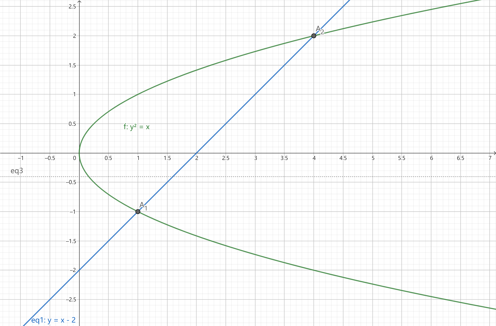

# $\S$9.2 二重积分的计算
## 一、直角坐标系下的计算
定义：

* X型区域：$a\le x \le b$，$\varphi_1(x)\le y \le \varphi_2(x)$

    

* Y型区域：$c\le y \le d$，$\psi_1(y)\le x\le \psi_2(y)$

    

$\displaystyle V_{曲顶}=\iint_Df(x,y)\mathrm dx \mathrm dy=\int_a^bA(x)\mathrm dx$

$\displaystyle A(x)=\int_{\varphi_1(x_0)}^{\varphi_2(x_0)}f(x,y)\mathrm dy$

$\displaystyle \therefore V_{曲柱}=\iint_D f(x,y)\mathrm d\sigma=\int_a^b\left[\int_{\varphi_1(x)}^{\varphi_2(x)}f(x,y)\mathrm dy\right]\mathrm dx$

定理：

* D为X型区域【先y后x】：$\displaystyle \iint_D f(x,y)\mathrm dx \mathrm dy=\int_a^b \mathrm dx \int_{\varphi_1(x)}^{\varphi_2(x)}f(x,y)\mathrm dy$
* D为Y型区域【先x后y】：$\displaystyle \iint_D f(x,y)\mathrm dx \mathrm dy=\int_c^d \mathrm dy \int_{\psi_1(y)}^{\psi_2(y)}f(x,y)\mathrm dx$

### 例题
1. 求 $\displaystyle \iint_D \mathrm d\sigma$，其中 D 为 $y=2x$、$x=2y$、$x+y=3$ 围成的区域

    * X 型区域

        
        $$
        \begin{align*}
        I&=\int_0^1 \mathrm dx \int_{\frac{x}{2}}^{2x} 1 \mathrm dy+ \int_1^2 \mathrm dx \int_{\frac{x}{2}}^{2x}\mathrm dy\\
        &=\int_0^1 (2x-\dfrac{x}{2})\mathrm dx + \int_1^2(3-x-\dfrac{x}{2})\mathrm dx\\
        &=\dfrac{3}{2}
        \end{align*}
        $$

    * Y型区域

        

        $$
        \begin{align*}
        I&=\int_0^1 \mathrm dy \int_{\frac{y}{2}}^{2y} 1 \mathrm dx + \int_1^2 \mathrm dy \int_{\frac{y}{2}}^{3-y} 1 \mathrm dx\\
        &=\dfrac{3}{2}
        \end{align*}
        $$

2. 计算 $\displaystyle \iint_D xy \mathrm d\sigma$，其中 D 为 $y^2=x$ 和 $y=x-2$ 围成的区域

    * X型区域：

        

        $$
        \begin{align*}
        I&=\int_0^1 \mathrm dx \int_{-\sqrt{x}}^{\sqrt{x}} xy \mathrm dy + \int_1^4 \mathrm dx \int_{x-2}^{\sqrt{x}} xy \mathrm dy\\
        &=\int_0^1 (x\cdot \dfrac{1}{2}y^2|_{-\sqrt{x}}^{\sqrt{x}}) \mathrm dx + \int_1^4 x\cdot \dfrac{1}{2}[x-(x-2)^2] \mathrm dx\\
        &=\dfrac{45}{8}
        \end{align*}
        $$

    * Y型区域：

        

        $$
        \begin{align*}
        I&=\int_{-1}^2 \mathrm dy \int_{y^2}^{y+2}xy \mathrm dx \\
        &=\int_{-1}^2 y\cdot \dfrac{(y+2)^2-y^4}{2} \mathrm dy\\
        &=\dfrac{45}{8}
        \end{align*}
        $$

3. 计算 $\displaystyle \iint_D \dfrac{\sin x}{x}\mathrm dx \mathrm dy$，其中 D 为 $y=x$、$y=x^2$ 所围成的区域

    

    $$
    \begin{align*}
    I&=\int_0^1 \mathrm dx \int_{x^2}^x \dfrac{\sin x}{x} \mathrm dy\\
    &=\int_0^1 \dfrac{\sin x}{x} (x-x^2) \mathrm dx\\
    &=1-\sin 1
    \end{align*}
    $$

    > 注：本题用Y型积分会卡住

4. 交换积分次序

    * $\displaystyle \int_1^2 \mathrm dy \int_{\frac{1}{y}}^y \mathrm dx$，积分区域 D：$1\le y\le 2$、$\dfrac{1}{y}\le x\le y$

        

        原式 $\displaystyle =\int_{\frac{1}{2}}^1 \mathrm dx \int_{\frac{1}{x}}^2 f(x,y)\mathrm dy+\int_1^2 \mathrm dx \int_x^2 f(x,y)\mathrm dy$

    * $\displaystyle \int_0^1 \mathrm dx \int_0^{\sqrt{2x-x^2}}f(x,y)\mathrm dy+\int_1^2 \mathrm dx\int_0^{2-x}f(x,y)\mathrm dy$

        

        区域为 $0\le x\le 2$，$(x-1)^2+y^2\le 1$，$y\le 2-x$

        原式 $\displaystyle =\int_0^1 \mathrm dy\int_{1-\sqrt{1-y^2}}^{2-y}f(x,y)\mathrm dx$

5. 证明 $\displaystyle \left[\int_a^bf(x)g(x) \mathrm dx\right]^2\le \left[\int_a^b f^2(x)\mathrm dx\right]\left[\int_a^b g^2(x)\mathrm dx\right]$

    * 法一：$\displaystyle \int_a^b [f(x)\pm tg(x)]^2 \mathrm dx\ge 0$

        $$
        \begin{align*}
        t^2 \int_a^b g^2(x)\mathrm dx + t\cdot 2\int_a^b f(x)g(x)\mathrm dx + \int_a^b f^2(x)\mathrm dx\ge 0\\
        \Delta = [2\int_a^b f(x)g(x)]^2 - 4[\int_a^b g^2(x)\mathrm dx][\int_a^b f^2(x)\mathrm dx]
        \end{align*}
        $$

        整理可得原式

    * 法二

        $$
        \begin{align*}
        左 &=[\int_a^b f(x)g(x) \mathrm dx][\int_a^b f(y)g(y) \mathrm dy]\\
        &=\iint_D f(x)g(x)f(y)g(y) \mathrm dx \mathrm dy\\
        &(D: a\le x\le b, a\le y \le b)
        \end{align*}
        $$

        $$
        \begin{align*}
        右 &=[\int_a^b f^2(x)\mathrm dx][\int_a^b g^2(y) \mathrm dy]\\
        &=\iint_D f^2(x)g^2(y) \mathrm dx \mathrm dy \\
        &=\iint_D f^2(y)g^2(x) \mathrm dx \mathrm dy
        \end{align*}
        $$

        $\displaystyle 2右-2左=\iint_D[f(x)g(y)-f(y)g(x)]^2 \mathrm dx \mathrm dy\ge 0$，得证

## 二、极坐标系下的计算

$$
\begin{align*}
\Delta \sigma_i &=\dfrac{\Delta \theta_i}{2}\left[(\rho_i+\Delta \rho_i)^2-\rho_i^2\right]\\
&=\dfrac{2\rho_i+\Delta \rho_i+\Delta \rho_i^2}{2}\Delta \theta_i\\
&=\dfrac{2\rho_i+\Delta \rho_i}{2}\Delta \rho_i\Delta \theta_i\\
&=\dfrac{\rho_i+(\rho_i+\Delta \rho_i)}{2}\Delta \rho_i\Delta \theta_i\\
&\approx \rho_i\Delta \rho_i\Delta \theta_i
\end{align*}
$$

$$
\begin{align*}
\therefore d\sigma = \rho \mathrm d\rho \mathrm d\theta
\end{align*}
$$

$$
\begin{align*}
\iint_Df(x,y)\mathrm d\sigma &= \iint_D f(\rho \cos\theta, \rho\sin \theta)\rho \mathrm d\rho \mathrm d\theta(D: \alpha\le \theta\le \beta, \phi_1(\theta)\le \rho \le \phi_2(\theta))\\
&=\int_{\alpha}^{\beta}\mathrm d\theta \int_{\phi_1(\theta)}^{\phi_2(\theta)}f(\rho\cos\theta,\rho\sin\theta) \mathrm \rho \mathrm d\rho
\end{align*}
$$

### 例题
1. 求 $\displaystyle I=\iint_D 1\cdot \mathrm d\sigma$，其中 $D:x^2+y^2\le 2Rx$

    * 法一

        

        $$
        \begin{align*}
        I&=\int_0^{2R} \mathrm dx \int_{-\sqrt{2Rx-x^2}}^{\sqrt{2Rx-x^2}} \mathrm dy\\
        &=2\int_0^{2R}\sqrt{2Rx-x^2} \mathrm dx \\
        &=\pi R^2
        \end{align*}
        $$

    * 法二

        

        $$
        \begin{align*}
        I&=\int_{\frac{\pi}{2}}^{\frac{\pi}{2}} \mathrm d\theta \int_0^{2R\cos\theta} \cdot 1 \cdot \rho \mathrm d\rho\\
        &=\int_{-\frac{\pi}{2}}^{\frac{\pi}{2}} \dfrac{(2R\cos\theta)^2}{2} \mathrm d\theta\\
        &=\pi R^2
        \end{align*}
        $$

2. 求 $\displaystyle I=\iint_D x^2 \mathrm d\sigma$，其中 $D:x^2+y^2\le 1$

    

    * 法一

        $$
        \begin{align*}
        I&=\int_0^{2\pi} \mathrm d\theta\int_0^1\rho^2 \cos^2\theta \rho \mathrm d\rho\\
        &=(\int_0^{2\pi}\cos^2\theta \mathrm d\theta)(\int_0^1 \rho^3 \mathrm d\rho)\\
        &=\dfrac{\pi}{4}
        \end{align*}
        $$

    * 法二：D关于 $y=x$ 对称

        $$
        \begin{align*}
        \iint_D x^2 \mathrm d\sigma &= \iint_D y^2 \mathrm d\sigma \\
        &= \dfrac{1}{2} \iint_D (x^2+y^2) \mathrm d\sigma \\
        &=\dfrac{1}{2} (\int_0^{2\pi} \mathrm d\theta)(\int_0^1 \rho^2 \rho \mathrm d\rho)\\
        &=\dfrac{1}{2}\times 2\pi \times \dfrac{1}{4}\\
        &=\dfrac{\pi}{4}
        \end{align*}
        $$

3. 将 $\displaystyle \iint_D f(x,y) \mathrm dx \mathrm dy$ 化为二次积分，其中 $D:0\le x\le 1, 1-x\le y\le \sqrt{1-x^2}$

    

    $$
    \begin{align*}
    原式 &= \int_0^1 \mathrm dx \int_{1-x}^{\sqrt{1-x^2}} f(x,y) \mathrm dx \mathrm dy\\
    &=\int_0^{\frac{\pi}{2}} \mathrm d\theta \int_{\frac{1}{\cos\theta + \sin\theta}}^1f(\rho\cos\theta, \rho\sin\theta)\rho \mathrm d\rho
    \end{align*}
    $$

4. 将 $\displaystyle \iint_D f(\sqrt{x^2+y^2}, 2xy) \mathrm d\sigma$ 化为二次积分，其中 $D:0\le x\le 3,-x\le y\le \sqrt{3}x$

    

    $$
    \begin{align*}
    I&=\int_0^3 \mathrm dx \int_{-x}^{\sqrt{3}x}f(\sqrt{x^2+y^2}, 2xy) \mathrm dy\\
    &=\int_{-3}^{0} \mathrm dy \int_{-y}^3 f(\sqrt{x^2+y^2}, 2xy) \mathrm dx + \int_0^{3\sqrt{3}} \mathrm dy \int_{\frac{\sqrt{3}}{3}y}^3 f(\sqrt{x^2+y^2}, 2xy) \mathrm dx\\
    &=\int_{-\frac{\pi}{4}}^{\frac{\pi}{3}} \mathrm d\theta \int_0^{\frac{3}{\cos\theta}}f(\rho, \rho^2\sin 2\theta)\rho \mathrm d\rho
    \end{align*}
    $$

5. 计算 $\displaystyle \iint_D |x^2-y| \mathrm dx \mathrm dy$，其中D为 $x=0$、$x=1$、$y=0$、$y=1$ 所围成的区域

    

    $$
    \begin{align*}
    I&=\iint_{D_1}(x^2-y) \mathrm dx \mathrm dy + \iint_{D_2}(y-x^2) \mathrm dx \mathrm dy\\
    &=\int_0^1 \mathrm dx \int_0^{x^2}(x^2-y) \mathrm dy + \int_0^1 \mathrm dx \int_{x^2}^1 (y-x^2) \mathrm dy\\
    &=\dfrac{11}{30}
    \end{align*}
    $$

6. $\displaystyle f(x,y)=xy+\iint_Df(x,y)\mathrm dx \mathrm dy$，其中D为 $y=0$、$y=x^2$、$x=1$ 所围区域，求 $f(x,y)$

    解：设 $f(x,y)=xy+C$

    $\displaystyle \iint_D f(x,y) \mathrm dx \mathrm dy = \iint_D xy \mathrm dx \mathrm dy + \iint_D C \mathrm dx \mathrm dy$

    $C=\displaystyle \iint_{D} xy \mathrm dx \mathrm dy + C\iint_{D} \mathrm dx \mathrm dy$

    $\displaystyle I_1=\iint_{D} xy \mathrm dx \mathrm dy = \int_0^1 \mathrm dx \int_0^{\pi^2} xy \mathrm dy = \dfrac{1}{12}$

    $\displaystyle I_2=\iint_{D} \mathrm dx \mathrm dy = \int_0^1 \mathrm dx \int_0^1 \mathrm 1dy=\dfrac{1}{3}$

    $\therefore C=\dfrac{1}{8}$

7. 求 $\displaystyle \iint_D f(xy,x^2+y^2) \mathrm dx \mathrm dy$，其中D为 $y=kx(k\gt 0)$ 与 $x^2+y^2-2ax=0(a\gt 0)$ 所围成的包含圆心的部分

    

    $$
    \begin{align*}
    I=\int_{-\frac{\pi}{2}}^{\arctan k} \mathrm d\theta \int_0^{2a\cos \theta}f(\rho^2 \cos\theta \sin\theta, \rho^2) \rho \mathrm d\rho
    \end{align*}
    $$

8. 将 $\displaystyle \int_0^1 \mathrm dy \int_{-y}^{\sqrt{y}}f(x,y) \mathrm dx$ 化为极坐标系下二次积分

    

    $$
    \begin{align*}
    I&=\int_0^{\frac{\pi}{4}} \mathrm d\theta \int_0^{\frac{\tan\theta}{\cos\theta}}f(x,y)\rho \mathrm d\rho + \int_{\frac{\pi}{4}}^{\frac{3\pi}{4}}\mathrm d\theta\int_0^{\frac{1}{\sin\theta}}f(x,y)\rho \mathrm d\rho
    \end{align*}
    $$

9. 计算 $\displaystyle \iint_D e^{-x^2-y^2} \mathrm d\sigma$，其中 $D:x^2+y^2\le a^2$

    解：

    $$
    \begin{align*}
    I&=\int_0^{2\pi}\mathrm d\theta \int_0^a e^{-\rho^2} \rho \mathrm d\rho \\
    &=(\int_0^{2\pi} \mathrm d\theta)(\int_0^a e^{-\rho^2} \rho \mathrm d\rho)\\
    &=2\pi(-\dfrac{1}{2})\int_0^a e^{-\rho^2}\mathrm d(-\rho^2)\\
    &=1-e^{-a^2}
    \end{align*}
    $$

    > 由此可证明 $\displaystyle \int_0^{+\infty} e^{-x^2} \mathrm dx = \dfrac{\sqrt{\pi}}{2}$
    >
    > 证：$\displaystyle \int_0^{+\infty}e^{-x^2} \mathrm dx = \lim_{u\to +\infty} \int_0^u e^{-x^2} \mathrm dx$
    >
    > 令 $\displaystyle \int_0^u e^{-x^2} \mathrm dx = I_u$
    >
    > $\displaystyle I_1=\iint_{D_1} e^{-x^2-y^2} \mathrm dx \mathrm dy = \dfrac{\pi}{4}(1-e^{-a^2})$（D1为第I象限以a为半径的四分之一圆区域）
    >
    > $$
    > \begin{align*}
    > I_u^2&=(\int_0^u e^{-x}\mathrm dx)(\int_0^ue^{-y}\mathrm dy)\\
    > &=\iint_{D_u}e^{-x^2-y^2}\mathrm dx \mathrm dy \\
    > &=\iint_{D_1}e^{-x^2-y^2}\mathrm dx \mathrm dy + \iint_{D_补}e^{-x^2-y^2}\mathrm dx \mathrm dy \ge 0
    > \end{align*}
    > $$
    >
    > $I_u^2\ge I_1$
    >
    > $\dfrac{\pi}{4}(1-e^{-u^2}) \le I_u^2 \le \dfrac{\pi}{4}(1-e^{-2u^2})$
    >
    > $\displaystyle I_2=\iint_{D_2} e^{-x^2-y^2} \mathrm dx \mathrm dy$，$D_2: x\in [0,\sqrt{2}u], y\in [0,\sqrt{2}u]$
    >
    > $\therefore\displaystyle \lim_{a\to +\infty}I_u^2 = \dfrac{\pi}{4}$，$\displaystyle \int_0^{+\infty}e^{-x^2}\mathrm dx=\lim_{u\to +\infty}I_u = \dfrac{\sqrt{\pi}}{2}$

10. 计算 $x^2+y^2=az$ 与 $z=2a-\sqrt{x^2+y^2}$ 所围成的体积

    

    两曲面交线为 $\begin{cases}x^2+y^2=a^2\\z=a\end{cases}$，投影为 $x^2+y^2=a^2$

    $$
    \begin{align*}
    V&=\iint_D(2a-\sqrt{x^2+y^2}-\dfrac{x^2+y^2}{a})\mathrm dx \mathrm dy\\
    &=\int_0^{2\pi} \mathrm d\theta \int_0^a(2a-\rho-\dfrac{\rho^2}{a})\rho \mathrm d\rho\\
    &=\dfrac{5}{6}\pi a^3
    \end{align*}
    $$

## 三、换元公式

$$
\begin{align*}
\begin{cases}
x=x(u,v)\\
y=y(u,v)
\end{cases},
\mathrm d\sigma = \mathrm dx \mathrm dy
\end{align*}
$$

$\displaystyle \iint_D f(x,y)\mathrm dx \mathrm dy = \iint_D f(x(u,v),y(u,v))|J(u,v)| \mathrm du \mathrm dv$

其中 $J(u,v)=\begin{vmatrix}\dfrac{\partial x}{\partial u} & \dfrac{\partial x}{\partial v} \\ \dfrac{\partial y}{\partial u} & \dfrac{\partial y}{\partial v} \end{vmatrix}$

当 $\begin{cases}x=\rho\cos\theta\\y=\rho\sin\theta \end{cases}$ 时，$J(\rho,\theta)=\begin{vmatrix}\dfrac{\partial x}{\partial \rho} & \dfrac{\partial x}{\partial \theta} \\ \dfrac{\partial y}{\partial \rho} & \dfrac{\partial y}{\partial \theta} \end{vmatrix}=\rho$

广义极坐标变换：$\begin{cases}x=a\rho\cos\theta\\y=b\rho\sin\theta\end{cases}(a,b,\rho \gt 0)$

$\displaystyle \iint_D f(x,y)\mathrm dx \mathrm dy = \iint_D f(a\rho\cos\theta, b\rho\sin\theta)ab\rho \mathrm d\rho \mathrm d\theta$

### 例题

求椭圆 $\dfrac{x^2}{a^2}+\dfrac{y^2}{b^2}=1$ 的面积（$a\gt 0$，$b\gt 0$）

解：

* 法一：$\displaystyle S=4\int_0^a \sqrt{b(1-\dfrac{x^2}{a^2})}\mathrm dx=\pi ab$
* 法二：$\begin{cases}x=a\rho\cos\theta\\y=b\rho\sin\theta \end{cases}$

$$
\begin{align*}
S&=\iint_D \mathrm d\sigma \\
&=\int_0^{2\pi} \mathrm d\theta \int_0^1 1\cdot ab \rho \mathrm d\rho\\
&=2\pi \cdot ab \cdot \dfrac{1}{2}\\
&=\pi ab
\end{align*}
$$

> $D:(x-a)^2+(y-b)^2\le R^2$ 求法：
>
> $\begin{cases}x=a+\rho\cos\theta\\y=b+\rho\sin\theta \end{cases}$，$|J(\rho,\theta)|=\rho$
>
> $\displaystyle I=\int_0^{2\pi}\mathrm d\theta \int_0^R f(a+\rho\cos\theta, b+\rho\sin\theta)\rho \mathrm d\rho$
