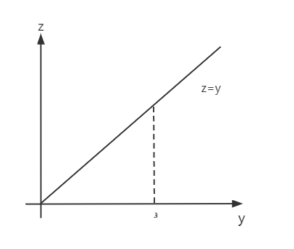

# $\S$9.3 三重积分

* $\displaystyle \int_a^b f(x)\mathrm dx$：曲边梯形面积，铜棒质量
* $\displaystyle \iint_D f(x,y)\mathrm dx \mathrm dy$：曲顶柱体体积，薄片质量
* $\displaystyle \iiint_\Omega f(x,y,z) \mathrm dx \mathrm dy \mathrm dz$：空间物体的质量

## 一、定义

$f(x,y,z)$ 为空间有界闭区域 $\Omega$ 的有界函数，任意分割 $\Delta V_1 \cdots \Delta V_n$，任意取点 $(a_i,b_i,c_i)\in \Delta V_i$，称 $\displaystyle \lim_{\lambda \to 0}\sum_{i=1}^nf(a_i,b_i,c_i)\cdot \Delta V_i$ 为 $f(x,y,z)$ 在 $\Omega$ 上的三重积分，记为

$$
\begin{align*}
\iiint_\Omega f(x,y,z)\mathrm dv=\iiint_\Omega f(x,y,z) \mathrm dx \mathrm dy \mathrm dz
\end{align*}
$$

$f(x,y,z)=1$ 时，$\displaystyle \iiint_\Omega 1\cdot \mathrm dV=\iiint_\Omega \mathrm dV = V$

## 二、性质
### 线性性质
$$
\begin{align*}
\iiint_\Omega (lf+kg) \mathrm dV = l\iiint_\Omega f \mathrm dV + k\iiint_\Omega g \mathrm dV
\end{align*}
$$
### 可加性
$$
\begin{align*}
\iiint_\Omega f \mathrm dV &= \iiint_{\Omega_1} f \mathrm dV + \iiint_{\Omega_2} f\mathrm dV\\
(\Omega &= \Omega_1 + \Omega_2)
\end{align*}
$$
### 保序性
$$
\begin{align*}
f\ge 0 \Rightarrow \iiint_\Omega f \mathrm dV\ge 0
\end{align*}
$$
### 估值定理
$f$ 在 $\Omega$ 连续，$m\le f\le M$，则 $\displaystyle mV\le \iiint_\Omega f\cdot \mathrm dV\le MV$
### 中值定理
$$
\begin{align*}
\iiint_\Omega f(x,y,z) \mathrm dV = f(a,b,c) V
\end{align*}
$$
### 对称性
* 若 $\Omega$ 关于 $xOy$ 面对称，$\Omega_上$、$\Omega_下$

    $$
    \begin{align*}
    \iiint_\Omega f \mathrm dV=
    \begin{cases}
    2\iiint_{\Omega_上} f \mathrm dV &\quad f(x,y,z)=f(x,y,-z)\\
    0 &\quad f(x,y,z)=-f(x,y,-z)
    \end{cases}
    \end{align*}
    $$

* 若 $\Omega$ 关于 $yOz$ 面对称，$\Omega_前$、$\Omega_后$

    $$
    \begin{align*}
    \iiint_\Omega f \mathrm dV=
    \begin{cases}
    2\iiint_{\Omega_前} f \mathrm dV &\quad f(x,y,z)=f(-x,y,z)\\
    0 &\quad f(x,y,z)=-f(-x,y,z)
    \end{cases}
    \end{align*}
    $$

* 若 $\Omega$ 关于 $xOz$ 面对称，$\Omega_左$、$\Omega_右$

    $$
    \begin{align*}
    \iiint_\Omega f \mathrm dV=
    \begin{cases}
    2\iiint_{\Omega_右} f \mathrm dV &\quad f(x,y,z)=f(x,-y,z)\\
    0 &\quad f(x,y,z)=-f(x,-y,z)
    \end{cases}
    \end{align*}
    $$

* 轮换对称性：假设 $x,y,z$ 交换后 $\Omega$ 不变，则 $\displaystyle \iiint_\Omega f(x,y,z)\mathrm dV=\iiint_\Omega f(y,z,x)\mathrm dV=\iiint_\Omega f(z,x,y)\mathrm dV$

例如：$\Omega: x^2+y^2+z^2\le R^2$，有 $\displaystyle \iiint_\Omega x^2 \mathrm dV=\iiint_\Omega y^2 \mathrm dV=\iiint_\Omega z^2 \mathrm dV=\dfrac{1}{3}\iiint_\Omega (x^2+y^2+z^2) \mathrm dV$
## 三、三重积分的计算方法
### 直角坐标系
1. 投影法（“先一后二”）

    * 投影到 $xOy$ 面上：$\displaystyle I=\iint_{D_{xy}} \mathrm dx \mathrm dy \int_{\phi_1(x,y)}^{\phi_2(x,y)} f(x,y,z) \mathrm dz$（$D_{xy}$ 为 $\Omega$ 在 $xOy$ 上投影区域）
    * 投影到 $yOz$ 面上：$\displaystyle I=\iint_{D_{yz}} \mathrm dy \mathrm dz \int_{\phi_1(y,z)}^{\phi_2(y,z)} f(x,y,z) \mathrm dx$（$D_{yz}$ 为 $\Omega$ 在 $yOz$ 上投影区域）
    * 投影到 $xOz$ 面上：$\displaystyle I=\iint_{D_{xz}} \mathrm dx \mathrm dz \int_{\phi_1(x,z)}^{\phi_2(x,z)} f(x,y,z) \mathrm dy$（$D_{xz}$ 为 $\Omega$ 在 $xOz$ 上投影区域）

    > 投影法中的穿线法：垂直投影面，方向与坐标轴正向同向，先穿过积分下限面，再穿过积分上限面

2. 截面法（“先二后一”）适用于被积函数为一元函数，且截面为三角形、矩形、圆的情况

    $$
    \begin{align*}
    I&=\iiint_\Omega g(x) \mathrm dV=\int_a^b \mathrm dx \iint_D g(x) \mathrm dy \mathrm dz \\
    &=\int_a^b [g(x) \iint_D \mathrm dy \mathrm dz] \mathrm dx \\
    &=\int_a^b g(x) \cdot \underset{x=常数与\Omega截面面积}{\delta(x)}  \mathrm dx
    \end{align*}
    $$

#### 例题
1. $\Omega: x^2+y^2+z^2\le R^2$

    

    $$
    \begin{align*}
    I&=\iiint_\Omega f(x,y,z) \mathrm dx \mathrm dy \mathrm dz \\
    &=\iint_{D_{xy}}\mathrm dx \mathrm dy \int_{-\sqrt{R^2-x^2-y^2}}^{\sqrt{R^2-x^2-y^2}}f(x,y,z) \mathrm dz
    \end{align*}
    $$

    $D_{xy}:x^2+y^2\le R^2$

2. 求 $I=\iiint_\Omega f\cdot \mathrm dV$，其中 $\Omega: x^2+y^2+(z-2)^2\le 4$ 和 $z=1$ 所围成的包含球心的部分

    

    将 $\Omega$ 投影到 $xOy$ 平面上，$D_{xy}:x^2+y^2\le 4$

    

    $$
    \begin{align*}
    \begin{cases}
    x^2+y^2+(z-2)^2=4\\
    z=2
    \end{cases} \overset{消z}{\Rightarrow }
    \begin{cases}
    x^2+y^2=4\\
    z=0
    \end{cases}
    \end{align*}
    $$

    $$
    \begin{align*}
    \begin{cases}
    x^2+y^2+(z-2)^2=4\\
    z=1
    \end{cases} \overset{消z}{\Rightarrow }
    \begin{cases}
    x^2+y^2=3\\
    z=0
    \end{cases}
    \end{align*}
    $$

    $\displaystyle I=\iint_{D_1}\mathrm dx \mathrm dy\int_1^{2+\sqrt{4-x^2-y^2}} f \mathrm dz+\iint_{D_2}\mathrm dx \mathrm dy \int_{2-\sqrt{4-x^2-y^2}}^{2+\sqrt{4-x^2-y^2}} f \mathrm dz$，其中 $D_1:z=1\to z=2+\sqrt{4-x^2-y^2}$，$D_2:z=2-\sqrt{4-x^2-y^2}\to z=2+\sqrt{4-x^2-y^2}$

3. 求 $\iiint_\Omega x \mathrm dx \mathrm dy \mathrm dz$，其中 $\Omega$ 为 $x+y+z=1$ 与坐标面所围成的区域

    

    * 投影法
        * $\Omega$ 投影到 $xOy$ 面上，用平行 z 轴的射线穿过积分区域。$D_{xy}:x+y\le 1(x\ge 0,y\ge 0)$

            $$
            \begin{align*}
            I&=\iint_{D_{xy}} \mathrm dx \mathrm dy \int_0^{1-x-y}x \mathrm dz\\
            &=\iint_{D_{xy}} x(1-x-y) \mathrm dx \mathrm dy\\
            &=\int_0^1 \mathrm dx \int_0^{1-x} x(1-x-y) \mathrm dy\\
            &=\dfrac{1}{24}
            \end{align*}
            $$

        * $\Omega$ 投影到 $yOz$ 面上，用平行 x 轴的射线穿过积分区域。$D_{yz}:y+z\le 1(y\ge 0,z\ge 0)$

            $$
            \begin{align*}
            I&=\iint_{D_{yz}} \mathrm dy \mathrm dz \int_0^{1-y-z} x \mathrm dz\\
            &=\iint_{D_{yz}} x(1-y-z) \mathrm dy \mathrm dz\\
            &=\int_0^1 \mathrm dy \int_0^{1-y} x(1-y-z) \mathrm dz\\
            &=\dfrac{1}{24}
            \end{align*}
            $$

    * 截面法
        * 用平行 $xOy$ 的面截 $\Omega$

            $$
            \begin{align*}
            I&=\int_0^1 \mathrm dz \iint_{D_z} x \mathrm dx \mathrm dy\\
            &=\int_0^1 \mathrm dz \int_0^{1-z} \mathrm dx \int_0^{1-x-z} x \mathrm dy\\
            &=\dfrac{1}{24}
            \end{align*}
            $$

        * 用平行 $yOz$ 的面截 $\Omega$

            $$
            \begin{align*}
            I&=\int_0^1 \mathrm dx \iint_{D_x} x \mathrm dy \mathrm dz\\
            &=\int_0^1 (x\iint_{D_x} \mathrm dy \mathrm dz)\\
            &=\int_0^1 x \delta (x)\mathrm dx\\
            &=\dfrac{1}{2}\int_0^1 x(1-x)^2 \mathrm dx\\
            &=\dfrac{1}{24}
            \end{align*}
            $$

4. 求 $I=\iiint_\Omega z^2 \mathrm dV$，$\Omega$ 为 $z=\sqrt{x^2+y^2}$ 与 $z=1$ 所围成的闭区域

    

    截面法较易，用平行 $xOy$ 的面截 $\Omega$

    $$
    \begin{align*}
    I&=\int_0^1 \mathrm dz \iint_{D_z}z^2 \mathrm dx \mathrm dy\\
    &=\int_0^1 z^2 \delta (z) \mathrm dz \\
    &=\int_0^1 z^2\pi z^2 \mathrm dz \\
    &=\dfrac{1}{5}\pi
    \end{align*}
    $$

5. 求 $I=\iiint_\Omega z^2 \mathrm dV$，$\Omega$ 为 $z=x^2+y^2$ 与 $z=1$ 所围成的闭区域

    

    $$
    \begin{align*}
    I&=\int_0^1 \mathrm dz \iint_{D_z}z^2 \mathrm dx \mathrm dy\\
    &=\int_0^1 z^2\delta^2(z) \mathrm dz\\
    &=\int_0^1 z^2 \pi z \mathrm dz\\
    &=\dfrac{\pi}{4}
    \end{align*}
    $$

6. 求 $I=\iiint_\Omega x^2 \mathrm dV$，$\Omega$ 为 $z=\sqrt{x^2+y^2}$ 与 $z=1$ 所围成的闭区域

    

    * 投影法：将 $\Omega$ 投到 $xOy$ 平面上

        $$
        \begin{align*}
        I&=\iint_{D_{xy}}\mathrm dx \mathrm dy \int_{\sqrt{x^2+y^2}}^1 x^2 \mathrm dz(D_{xy}:x^2+y^2\le 1)\\
        &=\iint_{D_{xy}}x^2(1-\sqrt{x^2+y^2})\mathrm dx \mathrm dy\\
        &=\int_0^{2\pi} \mathrm d\theta \rho^2 \cos^2\theta(1-\rho)\cdot \rho \mathrm d\rho\\
        &=\dfrac{\pi}{5}
        \end{align*}
        $$

    * 截面法：用平行于 $xOy$ 的平面去截

        $$
        \begin{align*}
        I&=\int_0^1 \mathrm dz \iint_{D_z}x^2 \mathrm dx \mathrm dy(D_z:x^2+y^2\le z^2,关于 y=x 对称)\\
        &=\int_0^1 \mathrm dz \int_0^{2\pi} \mathrm d\theta \int_0^z \rho^2 \cos^2\theta \rho \mathrm d\rho\\
        &=\dfrac{\pi}{5}
        \end{align*}
        $$

7. 求 $I=\iiint_\Omega (x+z) \mathrm dV$，$\Omega$ 为 $z=\sqrt{x^2+y^2}$ 与 $z=\sqrt{1-x^2-y^2}$ 所围成的闭区域

    

    投影到 $xOy$ 平面上：$D_{xy}: x^2+y^2\le \dfrac{1}{2}$

    $$
    \begin{align*}
    I&=\iint_{D_{xy}}\mathrm dx \mathrm dy \int_{\sqrt{x^2+y^2}}^{\sqrt{1-x^2-y^2}}(x+z)\mathrm dz\\
    &=\iint_{D_{xy}} x(\sqrt{1-x^2-y^2}-\sqrt{x^2+y^2})+\iint_{D_{xy}}\dfrac{1}{2}(1-x^2-y^2-x^2-y^2)\mathrm dx \mathrm dy\\
    &=\dfrac{\pi}{8}
    \end{align*}
    $$

8. 将 $\int_0^a \mathrm dx \int_0^x \mathrm dy \int_0^y f(z) \mathrm dz$ 化为定积分（交换积分次序为 $x\to y\to z$，$y\to x\to z$）

    

    * 法一：先确定积分区域 $\Omega$ 为 $(0\le x\le a, 0\le y\le x, 0\le z\le y)$

        

        - 截面法：$z=z_0$

            $$
            \begin{align*}
            I&=\int_0^a \mathrm dz \iint_{D_{xy}} f(z)\mathrm dx \mathrm dy\\
            &=\int_0^a f(z) \dfrac{1}{2}(a-z)^2 \mathrm dz\\
            &=\dfrac{1}{2}\int_0^a f(z)(a-z)^2 \mathrm dz
            \end{align*}
            $$

        - 投影法：$\Omega\to yOz$ 平面

            $$
            \begin{align*}
            I&=\iint_{D_{yz}}\mathrm dy \mathrm dz \int_y^a f(z)\mathrm dx\\
            &=\int_0^a \mathrm dz \int_z^a \mathrm dy \int_y^a f(z)\mathrm dx\\
            &=\dfrac{1}{2}\int_0^a f(z)(a-z)^2 \mathrm dz
            \end{align*}
            $$

    * 法二：直接交换

        

        

        $$
        \begin{align*}
        I&=\int_0^a \mathrm dx \int_0^x \mathrm dy \int_0^y f(z) \mathrm dz\\
        &=\int_0^a \mathrm dx \iint_{D_z}f(z) \mathrm dy \mathrm dz\\
        &=\int_0^a \mathrm dx\int_0^x \mathrm dz \int_z^x f(z)\mathrm dy\\
        &=\iint_{D_{xz}}\mathrm dx \mathrm dz\int_z^x f(z)\mathrm dy\\
        &=\int_0^a \mathrm dz\int_z^a \mathrm dx \int_z^x \mathrm dy\\
        &=\dfrac{1}{2}\int_0^a f(z)(a-z)^2 \mathrm dz
        \end{align*}
        $$

9. $I=\int_0^1 \mathrm dx\int_0^x \mathrm dy\int_0^{xy}f(x,y,z)\mathrm dz$，交换积分次序为 $y\to x\to z$

    原次序：$z\to y\to x$

    

    

    $$
    \begin{align*}
    原式 &=\int_0^1 \mathrm dx \int_0^{x^2}\mathrm dz \int_{\frac{z}{x}}^xf(x,y,z) \mathrm dy[交换y、z]\\
    &=\int_0^1 \mathrm dz \int_{\sqrt{z}}^1 \mathrm dx \int_{\frac{z}{x}}^xf(x,y,z) \mathrm dy[交换x、z]
    \end{align*}
    $$

### 柱坐标系（~投影法+极坐标）

适用于 $x^2+y^2$、$\dfrac{y}{x}$、$\dfrac{x}{y}$，$\Omega$ 在 $xOy$ 面上，且 $D_{xy}$ 与圆有关

$$
\begin{align*}
\begin{cases}
x=\rho\cos\theta\\
y=\rho\sin\theta\\
z=z
\end{cases}
,dV=\rho \mathrm d\rho \mathrm d\theta \mathrm dz
\end{align*}
$$

$\displaystyle I=\int_\alpha^\beta \mathrm d\theta \int_{\phi_1(\theta)}^{\phi_2(\theta)}\rho \mathrm d\rho \int_{\psi_1(\rho,\theta)}^{\psi_2(\rho,\theta)}f(\rho\cos\theta,\rho\sin\theta,z)\mathrm dz$

#### 例题
1. 求 $z=\dfrac{1}{a}(x^2+y^2)$ 和 $z=2a-\sqrt{x^2+y^2}$ 所围成的体积

    

    * 二重积分法

        $$
        \begin{align*}
        V &= V_{上曲}-V_{下曲}\\
        &=\iint_{D_{xy}}(2a-\sqrt{x^2+y^2})\mathrm dx \mathrm dy - \iint_{D_{xy}}\dfrac{1}{a}(x^2+y^2) \mathrm dx \mathrm dy\\
        &=\iint_{D_{xy}}[2a-\sqrt{x^2+y^2}-\dfrac{1}{a}(x^2+y^2)] \mathrm dx \mathrm dy(D_{xy}:x^2+y^2\le a^2)\\
        &=\iint_{D_1} \mathrm dx \mathrm dy \int_0^a \mathrm dz + \iint_{D_2} \mathrm dx \mathrm dy \int_a^{2a}\mathrm dz\\
        &=\pi a \int_0^a z \mathrm dz + \pi \int_a^{2a}(2a-z)^2 \mathrm dz \\
        &=\dfrac{5\pi}{6}a^3
        \end{align*}
        $$

    * 三重积分法：$V=\iiint_\Omega 1\cdot \mathrm dV$，$\Omega:z=\dfrac{x^2+y^2}{a} \rightarrow z=2a-\sqrt{x^2+y^2}$

        * 投影：$\Omega \to xOy$，$D_{xy}:x^2+y^2\le a^2$

            $$
            \begin{align*}
            I&=\iint_{D_{xy}}\mathrm dx \mathrm dy \int_{\frac{x^2+y^2}{a}}^{2a-\sqrt{x^2+y^2}} 1\cdot \mathrm dz\\
            &=\iint_{D_{xy}}[2a-\sqrt{x^2+y^2}-\dfrac{x^2+y^2}{a}]\mathrm dx \mathrm dy\\
            &=\int_0^{2\pi}\mathrm d\theta \int_0^a(2a-\rho-\dfrac{\rho^2}{a})\rho \mathrm d\rho\\
            &=\dfrac{5\pi}{6}a^3
            \end{align*}
            $$

        * 截面：用平行于 $xOy$ 的平面截 $\Omega$

            $$
            \begin{align*}
            I&=\int_0^a \mathrm dz \iint_{D_{z_1}}1 \mathrm dx \mathrm dy+\int_a^{2a} \mathrm dz \iint_{D_{z_2}}1 \mathrm dx \mathrm dy\\
            &=\int_0^a \pi az \mathrm dz + \int_a^{2a} \pi (2a-z)^2 \mathrm dz\\
            &=\dfrac{5}{6}\pi a^3
            \end{align*}
            $$

        * 柱坐标

            $$
            \begin{align*}
            I&=\int_0^{2\pi}\mathrm d\theta \int_0^a\rho \mathrm d\rho \int_{\frac{1}{a}\rho^2}^{2a-\rho}1\cdot \mathrm dz\\
            &=2\pi\int_0^a \rho(2a-\rho-\dfrac{1}{a}\rho^2)\mathrm d\rho\\
            &=\dfrac{5}{6}\pi a^3
            \end{align*}
            $$

2. 求 $I=\iiint_\Omega z\sqrt{x^2+y^2} \mathrm dV$，其中 $\Omega: x^2+y^2=2x$、$z=x$ 及 $xOy$ 面所围成的闭区域

    

    $D_{xy}:x^2+y^2\le 2x$

    $$
    \begin{align*}
    I&=\int_{-\frac{\pi}{2}}^{\frac{\pi}{2}}\mathrm d\theta \int_0^{2\cos\theta}\rho \mathrm d\rho \int_0^{\rho\cos\theta} z\rho \mathrm dz\\
    &=\int_{-\frac{\pi}{2}}^{\frac{\pi}{2}}\mathrm d\theta \int_0^{2\cos\theta}\rho \cdot \dfrac{\rho^2\cos^2\theta-0^2}{2} \rho \mathrm d\rho\\
    &=\int_{-\frac{\pi}{2}}^{\frac{\pi}{2}}\dfrac{1}{2}\cos^2\theta \dfrac{1}{5}(2\cos \theta)^5 \mathrm d\theta\\
    &=\int_{-\frac{\pi}{2}}^{\frac{\pi}{2}}\dfrac{16}{5}\cos^7\theta\\
    &=\dfrac{32}{5}\int_0^{\frac{\pi}{2}}\cos^7\theta \mathrm d\theta\\
    &=\dfrac{512}{175}
    \end{align*}
    $$

3. 将 $\iiint_\Omega f(x,y,z)\mathrm dV$ 化为柱坐标系下三次积分。$\Omega:z=\sqrt{4-x^2-y^2}$ 和 $z=\dfrac{1}{3}\sqrt{x^2+y^2}$ 所围成的闭区域

    $\begin{cases}z=\sqrt{4-x^2-y^2}\\z=\dfrac{1}{3}(x^2+y^2)\end{cases}\rightarrow \begin{cases}x^2+y^2\le3 \rightarrow D_{xy}\\z=0\end{cases}$

    $\theta:0\to 2\pi$，$\rho:0\to \sqrt{3}$，$z:\dfrac{1}{3}\rho^2\to \sqrt{4-\rho^2}$

    $\displaystyle I=\int_0^{2\pi}\mathrm d\theta\int_0^{\sqrt{3}}\rho \mathrm d\rho \int_{\frac{1}{3}\rho^2}^{\sqrt{4-\rho^2}}f(x,y,z) \mathrm dz$

4. 将 $\iiint_\Omega f(x,y,z)\mathrm dV$ 化为柱坐标系下三次积分。$\Omega:x^2+y^2+z^2=4$ 和 $z=-1$ 所围成的包含球心的区域

    $D_{xy}:x^2+y^2\le 4$

    $\begin{cases}x^2+y^2+z^2=4\\z=-1\end{cases}\rightarrow \begin{cases}x^2+y^2=3\\z=0\end{cases}$

    $\theta:0\to 2\pi$，$\rho:0\to 2$，$z:-1\to \sqrt{4-\rho^2}(D_{x'y}:x^2+y^2\le 3),-\sqrt{4-\rho^2}\to \sqrt{4-\rho^2}(D_{x''y}:3\le x^2+y^2\le 4)$

    $\displaystyle I=\int_0^{2\pi} \mathrm d\theta \int_0^\sqrt{3}\rho \mathrm d\rho \int_{-1}^{\sqrt{4-\rho^2}}f(x,y,z)\mathrm dz + \int_0^{2\pi}\mathrm d\theta \int_{\sqrt{3}}^2 \rho \mathrm d\rho \int_{-\sqrt{4-\rho^2}}^{\sqrt{4-\rho^2}}f(x,y,z)\mathrm dz$

### 球坐标系

适用于 $\Omega$ 与锥面或球面有关，被积函数 $x^2+y^2+z^2$

$$
\begin{align*}
(\phi=\angle zOM,\theta=\angle xOM',r=|\vec{OM}|)\\
\begin{cases}
x=r\sin\phi\cos\theta\\
y=r\sin\phi\sin\theta\\
z=r\cos\phi
\end{cases}
\end{align*}
$$

$\mathrm dV=r^2\sin\phi \mathrm d\phi \mathrm d\theta \mathrm dr$

$$
\begin{align*}
I&=\iiint_\Omega f(r\sin\phi\cos\theta, r\sin\phi\sin\theta, r\cos\phi)r^2\sin\phi \mathrm d\phi \mathrm d\theta \mathrm dr\\
&=\int_\alpha^\beta \mathrm d\theta \int_{a_1(\theta)}^{a_2(\theta)}\sin\phi \mathrm d\phi\int_{b_1(\phi,\theta)}^{b_2(\phi,\theta)}f(\phi,\theta,r)r^2 \mathrm dr
\end{align*}
$$

#### 例题
1. 求 $I=\iiint_\Omega \sqrt{x^2+y^2+z^2}\mathrm dV$，$\Omega: x^2+y^2+z^2=z$ 所围成的闭区域

    

    $\theta:0\to 2\pi$，$\varphi:0\to \dfrac{\pi}{2}$，$r:0\to \cos\varphi$

    $$
    \begin{align*}
    I&=\int_0^{2\pi} \mathrm d\theta \int_0^{\frac{\pi}{2}}\sin\varphi \mathrm d\varphi \int_0^{\cos\varphi}r\cdot r^2 \mathrm dr\\
    &=\dfrac{\pi}{10}
    \end{align*}
    $$

2. 求 $I=\iiint_\Omega (x+y+z)e^{-(x^2+y^2+z^2)}\mathrm dV$，其中 $\Omega:x^2+y^2+z^2=1$ 且 $z\ge 0$（上半球体）

    解：$\Omega$ 关于 $xOz$ 和 $yOz$ 面对称

    $$
    \begin{align*}
    I&=\iiint_\Omega ze^{-(x^2+y^2+z^2)}\mathrm dV\\
    &=\int_0^{2\pi}\mathrm d\theta \int_0^{\frac{\pi}{2}}\sin \varphi \mathrm d\varphi \int_0^1 r\cos\varphi e^{-r^2}r^2 \mathrm dr\\
    &=\pi(\dfrac{1}{2}-\dfrac{1}{e})
    \end{align*}
    $$

3. 求 $I=\iiint_\Omega x^2 \mathrm dV$，其中 $\Omega:x^2+y^2+z^2\le 1$

解：$\Omega$ 具有轮换对称性

$$
\begin{align*}
I&=\iiint_\Omega y^2 \mathrm dV\\
&=\iiint_\Omega z^2 \mathrm dV\\
&=\dfrac{1}{3}\iiint_\Omega (x^2+y^2+z^2)\mathrm dV\\
&=\dfrac{1}{3}(\int_0^{2\pi}\mathrm d\theta)(\int_0^{\pi}\sin\varphi \mathrm d\varphi)(\int_0^1 r^2\cdot r^2 \mathrm dr)\\
&=\dfrac{1}{3}\cdot 2\pi \cdot 2\cdot \dfrac{1}{5}\\
&=\dfrac{4\pi}{15}
\end{align*}
$$

## 三重积分换元公式

$$
\begin{align*}
\begin{cases}
x=x(u,v,w)\\
y=y(u,v,w)\\
z=z(u,v,w)
\end{cases}
\end{align*}
$$

$$
\begin{align*}
I&=\iiint_\Omega f(x,y,z)\mathrm dx \mathrm dy \mathrm dz\\
&=\iiint_\Omega f(x(u,v,w),y(u,v,w),z(u,v,w))|J| \mathrm du \mathrm dv \mathrm dw
\end{align*}
$$

其中 $J(u,v,w)=\dfrac{\partial (x,y,z)}{\partial (u,v,w)}=\begin{vmatrix}x_u & x_v & x_w\\y_u & y_v & y_w\\ z_u & z_v & z_w\end{vmatrix}$

* 广义柱坐标变换 $\begin{cases}x=a\rho\cos\theta\\y=b\rho\sin\theta\\z=z\end{cases}$，$\mathrm dV=ab\rho \mathrm d\rho \mathrm d\theta \mathrm dz$（$D_{xy}$ 与椭圆有关，$\Omega$ 与椭球面有关）
* 广义球坐标变换 $\begin{cases}x=ar\sin\varphi\cos\theta\\y=br\sin\varphi\sin\theta\\z=cr\cos\varphi\end{cases}$，$\mathrm dV=abcr^2\sin\varphi \mathrm d\varphi \mathrm d\theta \mathrm dr$

### 例题
求 $\dfrac{x^2}{a^2}+\dfrac{y^2}{b^2}+\dfrac{z^2}{c^2}\le 1$ 的体积

解：

$$
\begin{align*}
I&=\iiint_\Omega 1\cdot \mathrm dV\\
&=\int_0^{2\pi} \mathrm d\theta \int_0^\pi \sin\varphi \mathrm d\varphi \int_0^1 1\cdot abc\cdot r^2 \mathrm dr\\
&=\dfrac{4}{3}\pi abc
\end{align*}
$$
