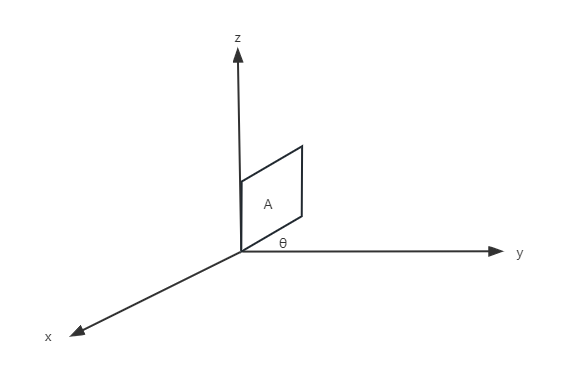
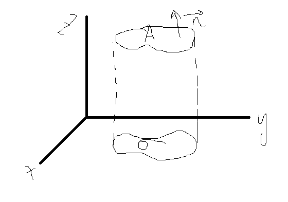
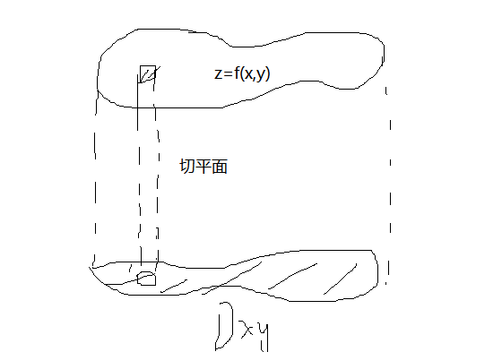
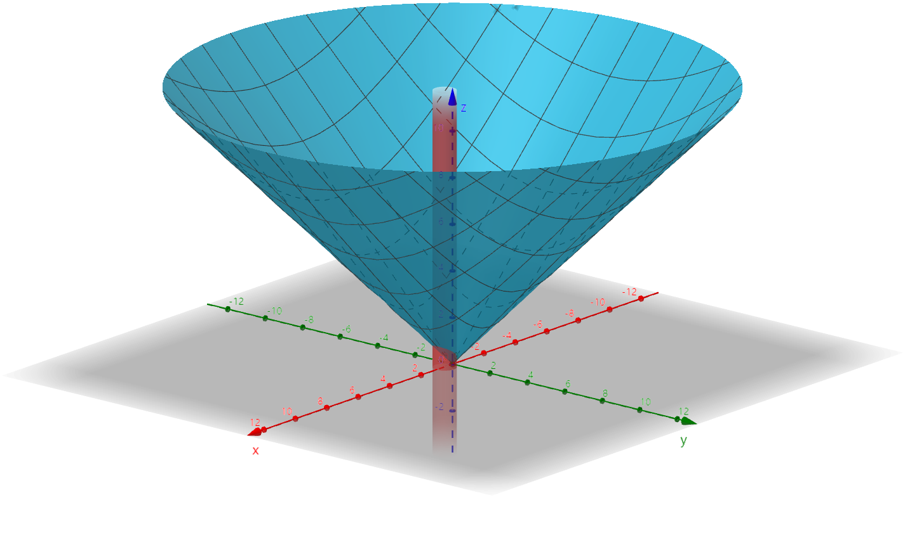
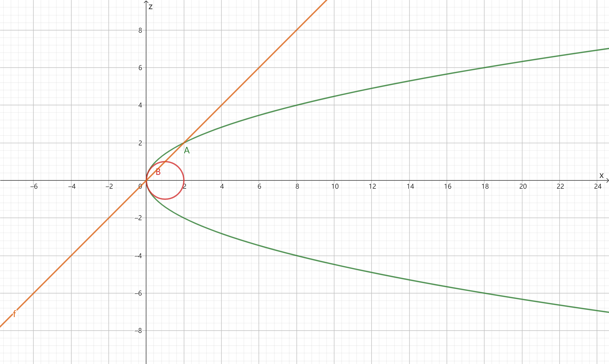

# $\S$9.4 重积分的应用
## 一、曲面的面积

$$
A=\dfrac{\sigma}{\cos \theta}
$$

$$
\begin{align*}
A=\dfrac{\sigma}{|\cos r|}
\end{align*}
$$

$\Delta A_i\approx \dfrac{\Delta \sigma_i}{|\cos r|}$（r为 $<\vec{n},z>$ 方向夹角余弦）

$\mathrm dA=\dfrac{\mathrm d\theta}{\cos \gamma}$

$\displaystyle \iint_\sum \mathrm dS=\iint_{D_{xy}}\mathrm dA=\iint_{D_{xy}}\dfrac{1}{|\cos \gamma|}\mathrm d\delta=A$

$\vec{n}=(f_x,f_y,-1)$，$\therefore \cos \gamma =\dfrac{-1}{\sqrt{f_x^2+f_y^2+1}}$

$\therefore$ 空间曲面 $z=f(x,y)$（其投影区域 $D_{xy}$）面积公式为 $\displaystyle A=\iint_{D_{xy}}\sqrt{1+f_x^2+f_y^2}\mathrm dx \mathrm dy$

### 推广

* $x=g(y,z)$，$\displaystyle A=\iint_{D_{yz}}\sqrt{1+g_y^2+g_z^2}\mathrm dy \mathrm dz$
* $y=h(x,z)$，$\displaystyle A=\iint_{D_{xz}}\sqrt{1+h^2_x+h^2_z}\mathrm dx \mathrm dz$

### 例题
1. 求 $z=\sqrt{x^2+y^2}$ 在 $x^2+y^2=x$ 内部的面积

    

    解：$z_x=\dfrac{x}{z}$，$z_y=\dfrac{y}{z}$，$D_{xy}:x^2+y^2\le x$

    $A=\iint_{D_{xy}}\sqrt{2}\mathrm dx \mathrm dy=\sqrt{2}\iint_{D_{xy}}\mathrm dx \mathrm dy = \dfrac{\sqrt{2}}{4}\pi$

2. 求 $z=\sqrt{x^2+y^2}$ 被 $z^2=2x$ 所截部分的面积

    

    解：$D_{xy}:\begin{cases}z=\sqrt{x^2+y^2}\\z^2=2x\end{cases}\Rightarrow（消z）\begin{cases}x^2+y^2=2x\\z=0\end{cases}$

    $A=\iint_{D_{xy}}\sqrt{2}\mathrm dx \mathrm dy=\sqrt{2}\pi$

## 二、质心公式

* 平面薄片 $\mu(x,y)$ 的质心 $\bar{x}=\dfrac{\iint_{D}x\mu(x,y)\mathrm d\sigma}{\mu}$，$\bar{y}=\dfrac{\iint_{D}y\mu(x,y)\mathrm d\sigma}{\mu}$
    - 若 $\mu(x,y)=C$（常数），则 $\bar{x}=\dfrac{\iint_D x \mathrm d\sigma}{\sigma}$，$\bar{y}=\dfrac{\iint_D y \mathrm d\sigma}{\sigma}$【形心公式】
* 空间物体 $\mu(x,y,z)$ 的质心 $\bar{x}=\dfrac{\iiint_{\Omega}x\mu(x,y,z)\mathrm d\sigma}{\mu}$，$\bar{y}=\dfrac{\iiint_{\Omega}y\mu(x,y,z)\mathrm d\sigma}{\mu}$，$\bar{z}=\dfrac{\iiint_{\Omega}z\mu(x,y,z)\mathrm d\sigma}{\mu}$
    - 若 $\mu(x,y,z)=C$（常数），则 $\bar{x}=\dfrac{\iiint_\Omega x \mathrm dV}{V}$，$\bar{y}=\dfrac{\iiint_\Omega y \mathrm dV}{V}$，$\bar{z}=\dfrac{\iiint_\Omega z \mathrm dV}{V}$【形心公式】
* 比如，圆 $(x-a)^2+(y-b)^2=R^2$ 的形心为 $(a,b)$，矩形 $a\le x\le b$、$c\le y\le d$ 的形心为 $(\dfrac{a+b}{2},\dfrac{c+d}{2})$
* 结论：平面图形的形心落在对称轴上（若存在），空间几何体的形心落在对称面上（若存在）

### 形心公式的应用

* $\bar{x}$ 与 $\sigma / V$ 容易计算

$$
\begin{align*}
\bar{x}=\dfrac{\iint_D x \mathrm d\sigma}{\sigma}\Rightarrow \iint_D x \mathrm d\sigma = \sigma \bar{x}\\
\iiint_\Omega x \mathrm dV=\bar{x}V
\end{align*}
$$

### 例题
1. $\Omega$ 关于 $xOy$ 面对称，$\bar{z}=0$；$\Omega$ 关于 $y=2$ 对称，$\bar{y}=2$
2. $\Omega: z=\sqrt{a^2-x^2-y^2}$ 和 $z=0$ 所围闭区域，求 $\Omega$ 的形心

    解：$\Omega$ 关于 $xOy$ 和 $yOz$ 面对称，$(\bar{x},\bar{y},\bar{z})$ 在 $z$ 轴上，$\bar{x}=0$，$\bar{y}=0$，$z^2=a^2-x^2-y^2$

    $$
    \begin{align*}
    \bar{z}&=\dfrac{\iiint_\Omega z \mathrm d\sigma}{\sigma}\\
    &=\dfrac{\int_0^a z\pi(a^2-z^2) \mathrm dz}{\frac{2}{3}\pi a^3}\\
    &=\dfrac{\frac{1}{4}\pi a^4}{\frac{2}{3}\pi a^3}\\
    &=\dfrac{3}{8}a
    \end{align*}
    $$

    $\therefore$ 所求为 $(0,0,\dfrac{3}{8}a)$

3. 求 $I=\iint_D (5x+3y) \mathrm d\sigma$，$D:x^2+y^2+2x-4y\le 4$

    解：$(x+1)^2+(y-2)^2 \le 9$，$\bar{x}=-1$，$\bar{y}=2$

    $\sigma = 9\pi$

    $$
    \begin{align*}
    I&=5\iint_D x \mathrm d\sigma + 3\iint_D y \mathrm d\sigma\\
    &=5\bar{x}\cdot \sigma+3\bar{y}\cdot \sigma\\
    &=9\pi
    \end{align*}
    $$

4. 求 $I=\iint_D y \mathrm dx \mathrm dy$，$D:x=-2,y=2,x=-\sqrt{2y-y^2}$ 所围区域

    

    解：$I=\bar{y}\cdot \sigma = 1\cdot(2\times 2-\dfrac{1}{2}\pi \times 1^2)=4-\dfrac{\pi}{2}$

5. 求 $I=\iiint_\Omega(x+y+z)\mathrm dV$，$\Omega:0\le x\le 1,0\le y\le 1,0\le z\le 1$ 所围体积

    解：$I=\bar{x}V+\bar{y}V+\bar{z}V=(\dfrac{1}{2}+\dfrac{1}{2}+\dfrac{1}{2})\times 1=\dfrac{3}{2}$
